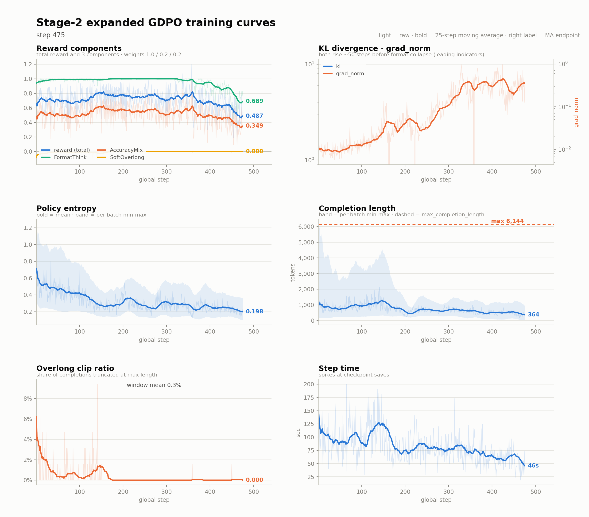
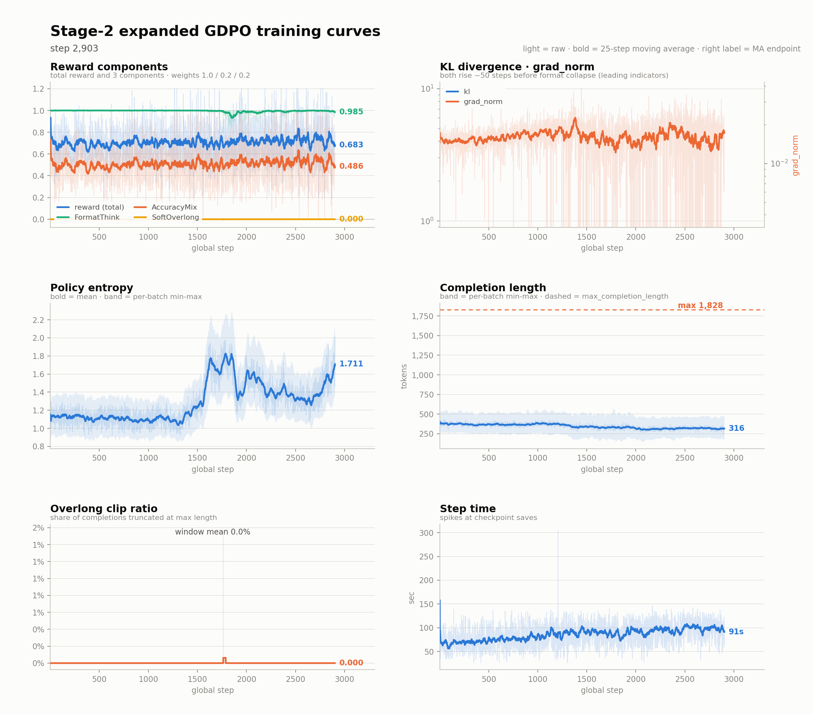

# K-BDS 의료 멀티모달 교차추론 — 학습 파이프라인

계획서(`plan.hwp`) 기반, **ms-swift**로 4단계 파이프라인을 KISTI Slurm 클러스터에 맞춰 구성:
**① 콜드스타트 SFT → ② 범용 RLVR/GRPO → ③ 의료 특화 RL(RaR) → ④ 평가**.

> 이 문서는 **현황·요약·진입점**입니다. 과거 실행·붕괴 분석 등 상세 기록은 [문서 지도](#문서-지도) 참조.
> 계정 이식·인수인계 → [`HANDOFF.md`](HANDOFF.md)

---

## 현황 (2026-08-28)

**지금 위치**: **Stage-2 도메인 전문가 3종 — deepvision 완주 · pmcvqa 진행 중 · mmk12 방치.**
deepvision 은 B200 에서 엔트로피 마스크(`top_entropy_quantile=0.2`)로 붕괴 없이 **2,203/5,715 step(38.5%)** 까지 가고
자원 회수로 중지. 같은 세팅을 KISTI 로 이식해 mmk12·pmcvqa 를 1 epoch 목표로 재제출했는데,
**mmk12 는 checkpoint-450 부근에서 세 번 연속 같은 자리(FormatThink 붕괴)로 되돌아가 watchdog 자동취소** —
8/22 19:09 이후 방치 상태로 **결정 대기**. **pmcvqa 는 붕괴 없이 정상 진행**, step **2,877/4,896(58.7%)**.
중간 홀드아웃(n=400, checkpoint-2850): init **56.5%** → **60.5%**(+4.0pp, McNemar p=0.105·아직 유의성 미확보).
→ [Stage-2 도메인 전문가 진행 현황](#stage-2-도메인-전문가-3종--진행-현황)

---

## Stage-2 도메인 전문가 3종 — 진행 현황

deepvision 은 B200 자체 클러스터, mmk12·pmcvqa 는 KISTI. 공통 세팅은 B200 붕괴 재현 실험에서
검증한 값을 그대로 이식: `top_entropy_quantile=0.2`(엔트로피 마스크) · `beta=0` · `scale_rewards=gdpo` ·
`lora_dropout=0` · `lora_rank=16/alpha=32`(계단 0 어댑터 병합 전제) · init `sft_mixed_merged` ·
watchdog(FormatThink 50-step 평균 <0.85 → 자동 취소). 도메인별 길이예산만 차등 —
deepvision/mmk12 `soft_max=8192/6144`(긴 CoT) · pmcvqa `soft_max=3072`(객관식).

| domain | 클러스터 · job(체인) | 데이터 | 목표(1 epoch) | 현재 | 상태 |
|---|---|---:|---:|---:|---|
| **deepvision** | B200 | 40,000 | 5,715 step | **2,203 (38.5%)** | ✅ 붕괴 없이 정상 종료 — 자원 회수로 중지 |
| **mmk12** | KISTI 75776→75777→75778 | 15,204 | 3,801 step | **475 (12.5%)** | 🚨 checkpoint-450 부근에서 **3연속 동일 붕괴**(FormatThink) → watchdog 자동취소, 8/22 19:09 이후 **방치·결정 대기** |
| **pmcvqa** | KISTI 75825→75826(진행중) | 19,583 | 4,896 step | **2,877 (58.7%)** | ✅ 붕괴 없이 진행 중 |





> **mmk12 붕괴는 resume 버그가 아니다.** 최초 실행(75776, 재개 아님)조차 step 450 에서 이미
> FormatThink 가 0.847 로 문턱(0.85)을 스쳤다 — checkpoint-450 자체가 붕괴 초입이라 재개할 때마다
> 같은 자리로 돌아간다. entropy mask 가 deepvision 은 지켰지만 mmk12(수학, 긴 CoT)엔 부족했다.
>
> **pmcvqa 는 붕괴는 없지만 training-batch accuracy reward 가 완전히 평평하다**(step 0~2,800 내내
> 중앙값 0.48~0.52, 드리프트 없음) — 노이즈에 학습 신호가 묻힌 것으로 보고, **중간 홀드아웃(n=400)**
> 으로 직접 확인했다: init **56.5%** → checkpoint-2850(0.58 epoch) **60.5%**(**+4.0pp**,
> McNemar exact p=0.105 — 방향은 개선이나 아직 유의성 미확보). 구 혼합 학습(0.09 epoch 노출)의
> +0.75pp(p>0.5, 완전 미검출)보다는 나아졌다. 1 epoch 완주 후 재평가로 유의성 확보 여부를 본다.

**왜 도메인 3분할인가** — 혼합 학습(구 경로)은 소스별 노출이 0.09 epoch 로 균등한데, 도메인 전용으로
돌리면 같은 step 에 1.7~4.9배 더 노출된다. Kimi K3 의 "넓은 도메인 3개" 원칙과도 맞는다. 소스별
LoRA 는 같은 rank(16)로 맞춰 나중에 어댑터 산술로 통합할 수 있게 뒀다(계단 0). 근거·대안 비교 전량 →
[DeepSeek-V4 방법론 채택](docs/deepseek_v4_pipeline_adoption.md) · [Stage-2 재설계](docs/stage2_redesign_2026.md) ·
[서베이](docs/rlvr_survey_2026.md).

**구 혼합 학습 경로(73924/73925)는 이 구조로 전환하게 된 계기다** — step 850 에서 init 대비 +8.18pp(p<0.0001)
까지 갔으나 ~900 에서 형식 붕괴, 의료(pmcvqa)만 여섯 지점 전부 미검출(+0.75pp, p>0.5). 붕괴 원인·홀드아웃
전량 분석 → [사후분석](docs/stage2_run73924_postmortem.md) · [중간 점검](docs/stage2_run73924_progress.md).

---

## 파이프라인 4단계

| 단계 | 목적 | 데이터 | 방법 |
|---|---|---|---|
| **①** 콜드스타트 SFT | `<think>/<answer>` 형식 주입 + 의료 추론 시드 | v3: OpenMedReason + VisualWebInstruct + VLAA 혼합 | LoRA SFT |
| **②** 범용 RLVR | 검증가능 정답으로 추론 강화 | **소스별 3분할** — deepvision 40,000 / mmk12 15,204 / pmcvqa 19,583 | GRPO `recipe=stable`(dr_grpo) · `num_gen=8` · init=`sft_mixed_merged` · **도메인별 전문가 → 통합** |
| **③** 의료 특화 RL | 개방형 의료 VQA 추론 | medix-rl-data 51K | GRPO + RaR 루브릭 보상 |
| **④** 평가 | base 대비 성능 정량화 | 층화 홀드아웃 / HealthBench | vLLM 추론·채점 |

**공통 제약**: NVLink 없음(KISTI) → **전 단계 LoRA-DDP** · glibc 2.17 → **컨테이너 스택**(현재 loader 우회) ·
로그인노드 vLLM 불가 → **모든 GPU 작업은 컴퓨트노드**.
→ [기술 레퍼런스](docs/tech_reference.md)

---

## 빠른 실행

```bash
# ── Stage-2 도메인 전문가 3종 (현재 경로) ──────────────────────────────────
python3 scripts/split_stage2_by_source.py            # 0단계: 소스별 3분할 (--dry / --verify)
SMOKE=1 bash scripts/launch_domain_experts.sh         # 5 step 스모크(권장 선행)
EPOCHS=1 N_JOBS=2 ARMS="mmk12 pmcvqa" bash scripts/launch_domain_experts.sh   # 1 epoch 목표, resume 체인 2잡
#   ⚠️ 노드가 정확히 3개다. 3 arm 동시 제출 = 파티션 전체 점유.
#   ⚠️ num_generations 는 계산이 아니라 **데이터 노출**을 깎는다 (배치는 32 completion 고정). 8 이 상한.

# 모니터
squeue -u $USER ; tail -f logs/grpo_adv_*.log
cat logs/verdict_<JID>.json                # watchdog 판정(붕괴 시 자동 생성)
bash scripts/watch_expert.sh <arm>          # 상대 임계값 감시 — 체인 전환을 arm 이름으로 자동 추적

# 학습 곡선 플랏 (체인 로그 자동 병합)
./bin/python scripts/plot_train_curves.py logs/grpo_adv_<잡ID들...>.log -o docs/assets/<파일명>.png

# 중간 홀드아웃 평가 (학습과 별개 파티션이라 병렬 가능)
sbatch --partition=1gpu --export=ALL,EVAL_STAGES=trained,TRAINED_TAG=<태그>,EVAL_N=all,\
EVAL_DATA=<도메인 전용 홀드아웃.jsonl>,MID_CKPT=<체크포인트 경로> scripts/eval_midtrain.slurm

# 단계별 단독 제출 (의존성 체이닝)
JID1=$(sbatch --parsable scripts/10_sft.slurm)                                   # Stage-1
JID2=$(sbatch --parsable --dependency=afterok:$JID1 scripts/20_rlvr_grpo.slurm)  # Stage-2
JID3=$(sbatch --parsable --dependency=afterok:$JID2 scripts/30_medical_rl.slurm) # Stage-3
sbatch          --dependency=afterok:$JID3 scripts/40_eval.slurm                 # 평가
```
- ⚠️ 체인 중단 시 **관련 job 전부 `scancel`** (하나만 취소하면 다음 잡이 이어받음)
- ⚠️ `MAX_STEPS` 는 **step 단위**로만 해석할 것. `EPOCHS=` 로 주면 스크립트가 도메인별 건수로 환산한다.

---

## 문서 지도

| 문서 | 내용 |
|---|---|
| [`HANDOFF.md`](HANDOFF.md) | **인수인계 단일 문서** — 계정 이식·환경 함정·실행 절차 |
| [`CLAUDE.md`](CLAUDE.md) | 실행 환경 가이드 — KISTI·B200 두 클러스터의 검증된 절차·함정 전량 |
| [`b200/README.md`](b200/README.md) | B200 실행 스크립트·deepvision 학습 결론(완료) |
| [`docs/deepseek_v4_pipeline_adoption.md`](docs/deepseek_v4_pipeline_adoption.md) | **DeepSeek-V4 방법론 채택** — 현재 도메인 3분할 구조의 근거, 통합(계단 0~2) 설계 |
| [`docs/stage2_redesign_2026.md`](docs/stage2_redesign_2026.md) | Stage-2 재설계 — 서베이 기반 설정 변경 A~G |
| [`docs/rlvr_survey_2026.md`](docs/rlvr_survey_2026.md) | 최근 중국·한국 모델 테크리포트 서베이 — 8종 학습 단계, 공통 패턴 7가지 |
| [`docs/stage1_coldstart.md`](docs/stage1_coldstart.md) | Stage-1 상세 — v3 설계·학습곡선·홀드아웃 평가, ablation |
| [`docs/stage2_run73924_postmortem.md`](docs/stage2_run73924_postmortem.md) | 🚨 구 혼합 학습 붕괴 사후분석(rev.2) — 3분할로 전환하게 된 계기 |
| [`docs/stage2_run73924_progress.md`](docs/stage2_run73924_progress.md) | 구 혼합 학습 중간 점검 — 학습 곡선·홀드아웃 추세·검정력 분석 |
| [`docs/stage2_experiments.md`](docs/stage2_experiments.md) | Stage-2 실험 — plateau 진단, GRPO 계열 5종 clean A/B |
| [`docs/stage2_overview_for_slides.md`](docs/stage2_overview_for_slides.md) | 📊 발표용 자립 요약 — 방법론 계보·데이터셋·학습 세팅·경과 한 문서 |
| [`docs/stage2_data.md`](docs/stage2_data.md) | Stage-2 데이터 — 소스 스크리닝·혼합비율·빌드 파이프라인 |
| [`docs/rlvr_hparams_external.md`](docs/rlvr_hparams_external.md) | RLVR 하이퍼파라미터 — 외부 관행 대조·에포크 정책 |
| [`docs/stage3_and_eval.md`](docs/stage3_and_eval.md) | Stage-3 의료 RL(RaR 루브릭·judge) + HealthBench 추적 |
| [`docs/medical_reward_spec.md`](docs/medical_reward_spec.md) | 의료 보상 스펙 |
| [`docs/tech_reference.md`](docs/tech_reference.md) | 환경·베이스모델·LoRA·보상 설계·논문 레퍼런스 |
| [`docs/ops_data.md`](docs/ops_data.md) | 자원·운영 정책, 데이터 소스, **홀드아웃 분리(누수 차단)** |
| [`docs/progress_log.md`](docs/progress_log.md) | 진행 이력·핵심 의사결정·날짜별 기록·TODO |
| `docs/worklog_*.md` | 일별 상세 로그 |

---

## 파일 지도 (핵심)

```
scripts/
  00_common.sh                      공통 경로/환경/run_py 래퍼 ← 이식 시 PROJ_DIR·ENV_MODE
  21_rlvr_grpo_adv.slurm            Stage-2 레시피(dapo|gspo|dr_grpo|stable) — 전 단계가 이걸 부른다
                                    RESUME_CKPT=<경로> 재개 · WATCHDOG=1 감시자 · SEED=<n>
                                    DOMAIN=<..> 도메인 프리셋 · PDTBS/ACCUM/NPROC_PER_NODE 노드크기
  split_stage2_by_source.py         확장셋 → 소스별 3분할(+sha1 manifest). --dry / --verify
  launch_domain_experts.sh          도메인 전문가 3 arm 제출. SMOKE=1 / ARMS=".." / EPOCHS=1 / N_JOBS=
  watch_expert.sh                   상대 임계값 감시 — arm 이름으로 체인 전환 자동 추적
  probe_answer_fallback.py          답 추출기 후보 측정(정밀도 × 복구율)
  plot_train_curves.py              학습 로그 → 6패널 곡선 + 구간 대조표(체인 로그 병합 지원)
  plot_holdout_paired.py            문항별 jsonl → 궤적 + 짝지음 Δ 3패널
  eval_midtrain.slurm               중간 홀드아웃 평가(EVAL_STAGES 로 대상 선택, 병렬 제출 가능)
  eval_paired.py                    두 체크포인트의 문항별 점수 조인 → McNemar + 실측 검출 하한
  30_medical_rl.slurm · launch_stage3.sh · judge_server.sh    Stage-3
  50_eval_v3.slurm · eval_v3_holdout.py                       평가
configs/   accuracy.py(Stage-2 보상) · medical_reward.py(Stage-3 RaR)
runc.sh · bin/python                apptainer 우회 런타임(ENV_MODE=loader)
b200/      Jukyung-Yadok B200 실행 스크립트 — 상세 → b200/README.md
work/      (git 제외) data · images · checkpoints · hf_cache
```

---

## 과제 종료 의무 (가이드 §7)
- 종료 후 **1주 내** 데이터 다운로드(이후 차단·삭제) · **1개월 내** 결과보고서 + 산출물 기탁(marketplace.kbds.re.kr) · **2년 내** 사사표기 논문.
- 사사: *"이 논문은 K-BDS로부터 컴퓨팅 자원과 기술지원을 받아 수행된 연구성과임"* / *"This work was supported by the Korea Bio Data Station(K-BDS) with computing resources including technical support"*
