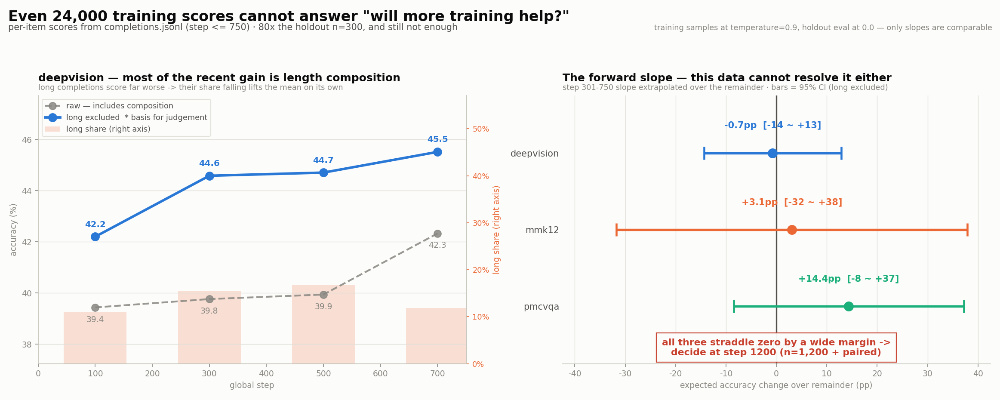
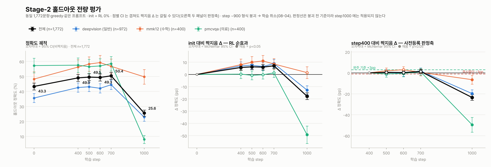

# K-BDS 의료 멀티모달 교차추론 — 학습 파이프라인

계획서(`plan.hwp`) 기반, **ms-swift**로 4단계 파이프라인을 KISTI Slurm 클러스터에 맞춰 구성:
**① 콜드스타트 SFT → ② 범용 RLVR/GRPO → ③ 의료 특화 RL(RaR) → ④ 평가**.

> 이 문서는 **현황·요약·진입점**입니다. 상세 기록은 [문서 지도](#문서-지도) 참조.
> 계정 이식·인수인계 → [`HANDOFF.md`](HANDOFF.md)

---

## 현황 (2026-08-04)

**지금 위치**: 🚨 **Stage-2 본실행 붕괴로 중단** — step ~900 에서 출력 형식이 무너져 08-04 10:14 에 체인(73925~73927)을 취소했다(step 1,046 정지).
**다음 임계경로**: **파라미터 수정 후 재시작**(근인 규명 완료, 아래) → **Stage-3 본실행**(계획서 핵심 산출물, 미시작 — 의료를 올리도록 설계된 유일한 단계).

**살릴 것과 버릴 것이 분명히 갈린다.**

- ✅ **step 850 이 최고점** — 홀드아웃 **51.52%**, init 대비 **+8.18pp(p<0.0001)**, step400 대비 **+2.48pp(p=0.020)**.
  **붕괴 직전까지 정상적으로 개선되고 있었다.** 체크포인트는 스냅샷으로 확보했다.
- ✅ **"step 400 이후 정체"는 오독이었다** — 300 step 간격(400→700)에서는 +1.35pp 로 미검출이지만
  **450 step 간격(400→850)에서는 +2.48pp, p=0.020 으로 검출된다.** 정체가 아니라 분해능 부족이었다.
- 🚨 **실패한 것은 학습이 아니라 안정성이다.** 유력한 근인은 **`overlong_filter=True`** —
  잘린 completion 을 **손실에서도 KL 에서도 제외**해, 길이가 폭주해도 참조 정책으로 끌어당기는 힘이 안 걸린다.
  절단률이 4% → 38% 로 오르며 배치의 1/3 이 앵커에서 면제됐다. → [§8-d](docs/stage2_run73924_progress.md)
- 🚨 **의료(pmcvqa)는 여섯 지점 모두 무변화** — init 대비 +0.25 / −0.75 / −0.25 / +1.25 / +0.75pp, 전부 p>0.5.
  붕괴와 무관하게 성립하는 결론이고, **Stage-3 의 존재 이유를 굳힌다.**

| 단계 | 상태 | 핵심 결과 |
|---|---|---|
| **① 콜드스타트 SFT** | ✅ 완료 | v3 가 **형식 천장 완파**: 생성 `format_think` v2 **0.185**→v3 **0.909**(5배), 홀드아웃 acc **0.295→0.348**(+18%). `sft_mixed_merged` = Stage-2 init → [상세](docs/stage1_coldstart.md) |
| **② 범용 RLVR** | 🚨 **붕괴로 중단 (step 1,046)** · ✅step 850 최고점 확보 | 확장셋 **74,787**(일반53/math20/의료26), init=v3·GDPO. 전량 1,772 짝지음: **init→850 +8.18pp(p<0.0001)**, **400→850 +2.48pp(p=0.020)**. step ~900 형식 붕괴 → **파라미터 수정 후 재시작 필요** → [붕괴 분석 §8](docs/stage2_run73924_progress.md) · [실험](docs/stage2_experiments.md) · [데이터](docs/stage2_data.md) · [실행현황](#stage-2-본실행-현황) |
| **③ 의료 RL (RaR)** | ⏳ 배선완료·대기 | 루브릭·judge(27B)·e2e 스모크 PASS(유닛 29/29) → [상세](docs/stage3_and_eval.md) |
| **④ 평가** | 🔄 기준선 확보 | HealthBench Hard(n=1000): base **0.229** / v2 콜드스타트 **0.224** — v3 미측정 → [상세](docs/stage3_and_eval.md) |

> ⚠️ **예산**: 신규 계정 5,000 노드시간 중 **Stage-2 본실행 ≈ 1,674(33%)** 집행 예정, 나머지 67%는 **Stage-3·평가용 유보**. 구 계정 k252a01 은 83% 소진 후 이관.
> (1,674 은 초기 322 s/it 기준의 보수적 상한이다. 현재 294 s/it 이 유지되면 **≈1,530(31%)** 로 내려간다.)
>
> 🚨 **2026-08-02 정정 — "1 epoch" 표기 오류**: MAX_STEPS=2,337 을 1 epoch 으로 적어 왔으나 실제로는 **0.25 epoch** 이다.
> GRPO 에서 `per_device_train_batch_size` 는 프롬프트가 아니라 completion 을 세므로 **프롬프트/step = 32 ÷ num_generations(4) = 8**,
> **1 epoch = 74,787 ÷ 8 = 9,348 step**(로그의 `epoch=0.067` 이 이를 확증). 확장셋의 **약 75%는 미노출**로 남으며,
> 진짜 1 epoch 은 ≈6,694 노드시간 = **예산의 134%** 로 실행 불가. 집행 비용 자체는 step 기준이라 계획대로다.
> → [중간 점검 보고서](docs/stage2_run73924_progress.md) §3

> 🚨 **환경 (2026-07-27~)**: 클러스터 **apptainer 파손**(`libsubid.so.3` 부재 + GLIBC_2.28 요구 vs 호스트 2.17) → `singularity exec` 불가.
> **이미지는 정상**이라 재빌드는 무의미(빌드도 불가). **우회 = `ENV_MODE=loader` 가 기본값**이라 기존 스크립트가 그대로 동작
> (검증: 8GPU GRPO 완주, job 72832). apptainer 복구 시 `ENV_MODE=container` 로 원복. → [`HANDOFF.md`](HANDOFF.md) §3 · `runc.sh` 주석

### Stage-2 본실행 현황

**2026-08-04 10:14 KST 취소 · job 73925 (`gpu-8-002`) · 로그 `logs/grpo_adv_73925.log`**

| 항목 | 값 | 판정 |
|---|---|---|
| 진행 | **1,046 / 2,337 step (44.8%) 에서 취소** = 0.112 epoch | 🚨 **붕괴** |
| 체인 | 73924(TimeLimit, step 787) → 73925 재개 → **73925·73926·73927 전부 CANCELLED** | 취소 완료 |
| 속도 | **~296 s/it** (벽시계, `train_speed`) — 73924 의 318.5 보다 개선 | ✅ |
| 안정성 | OOM · CUDA error · Traceback **0건** — 인프라는 끝까지 무결했다 | ✅ |
| **붕괴** | step ~900 형식 무너짐(Format 0.90→0.06) → step ~1000 토큰 퇴화 | 🚨 [§8](docs/stage2_run73924_progress.md) |


> 🚨 **붕괴는 두 단계였다.**
> **① step ~900 — 형식만 무너진다.** 이 시점 롤아웃은 여전히 정상 추론을 한다.
> 다만 `</think><answer>14</answer>` 대신 `Answer: 14` 로 끝낸다. 정확도 보상이 `<answer>` 태그로
> 답을 뽑으므로, 태그를 잃으면 **정확도까지 0** 이 된다(Format=0 롤아웃의 정확도 0.02~0.26 vs 0.46~0.50).
> 여기서 정방향 되먹임이 걸린다 — 형식 이탈 → 점수 0 → advantage 가 "정답이냐"가 아니라 "형식을 지켰냐"로
> 지배됨 → 업데이트 확대(grad_norm 5배·KL 3배) → 더 이탈 → 절벽. 넘어간 뒤엔 90%가 0점이라
> `reward_std` 가 0.074 로 주저앉아 **되돌아올 힘이 없다.**
>
> **② step ~1000 이후 — 토큰 퇴화.** `AAAA…` 4만 자, `<think>` 태그 1,497회 같은 출력이 나온다.
> **추론이 길어서 잘린 게 아니라 추론이 없다** — 토큰 상한을 늘려도 소용없다.
>
> 🚨 **유력한 근인: `overlong_filter=True`.** ms-swift 는 잘린 completion 을 `completion_mask` 에서
> 제외하는데, 그 마스크가 **KL 계산에도 그대로 쓰인다.** 즉 길이가 폭주해 잘리기 시작하면 그 샘플은
> **손실 그래디언트도 KL 앵커도 받지 않는다.** 절단률 4%→38% 구간에서 배치의 1/3 이 면제된 셈이다.
> (코드 판독 기반 추론 — 재시작 전 검증 필요)
>
> **기각된 가설**: `num_generations=4` 부족(→ `frac_reward_zero_std` 평균 **0.0106**, 그룹은 건강했다) ·
> 형식 보상 가중치 부족(→ 반대로 정확도가 형식에 **결합**돼 있었다) · lr 급변(→ cosine 매끄럽게 감쇠) ·
> `max_grad_norm` 미설정(→ 1.0 이나 실제 grad_norm 최대 0.17 로 **한 번도 작동 안 함**).

> ⚠️ **속도는 두 종류가 있고 섞으면 안 된다.** `step_time` 은 **147 s/it** 이지만 이건 학습 스텝만이다.
> vLLM 롤아웃 생성·sleep/wake·재샘플링·체크포인트가 그 밖에 있어 **벽시계는 294 s/it** — 약 2배다.
> 일정·예산 계산에는 반드시 **`train_speed` 쪽**을 쓸 것(§4 의 "오버헤드 50%" 가 이 차이다).
>
> ⚠️ 재개 때마다 출력 디렉터리가 새로 생긴다 — 73924 `v0-20260731-094532`, 73925 **`v1-20260803-074645`**.
> 앞으로의 체크포인트는 v1 아래다. TimeLimit 컷은 마지막 저장(750) 이후 **37 step 을 버린다**(save_steps=50 구조상 정상).

**구간 대조 (1~100 step 평균 → 최근 100 step 평균)** — `scripts/plot_train_curves.py` 출력 그대로

| 지표 | 초반 | 최근 | 변화 |
|---|---:|---:|---:|
| rewards/AccuracyMix | 0.4248 | 0.4495 | **+5.8%** |
| rewards/FormatThink | 0.9461 | 0.9583 | +1.3% |
| completions/mean_length | 1,127 | 1,176 | +4.3% (401~500 정점 1,660 에서 되돌아옴) |
| completions/clipped_ratio | 4.9% | 3.9% | **−21.8%** |
| kl | 0.0036 | 0.0313 | +765% (절대값은 작음) |
| entropy/mean | 0.5377 | 0.5227 | −2.8% (붕괴 없음) |
| frac_reward_zero_std | 0.0044 | 0.0156 | +257% (절대값은 작음) |

> ✅ **길이 인플레이션은 지나갔다.** 200~500 구간에서 길이 1,127→1,660자·클리핑 4.9→9.8%·형식준수 0.947→0.899 로 악화됐다가
> 700 step 대에 전부 되돌아왔다. **step 400/500/600 홀드아웃 평가는 하필 이 저점에서 찍힌 것**이다.
>
> 🔍 **최근 AccuracyMix 상승(+5.8%)의 대부분은 실력이 아니라 길이 구성이다.** 장문(SoftOverlong≠0) completion 은
> 정답률이 **15.1%** 로 비장문 **44.2%** 의 3분의 1이다(deepvision, −29.1pp). 그 비중이 16.8% → 11.9% 로 줄면
> 실력이 그대로여도 평균은 오른다. 장문 제외 기준으로 남는 상승은 **+0.8pp**(t=0.64, 미검출).
>
> ❌ **학습 로그로 "앞으로 오를까"를 답하려 했으나 실패했다.** `completions.jsonl` 24,000 문항(홀드아웃의 80배)으로도
> step 301~750 기울기는 deepvision **−0.05pp/100step, 95% 구간 −14.4 ~ +12.9pp** — 세 소스 모두 0 을 크게 포함한다.
> 수준을 재는 것과 기울기를 재는 것은 다른 문제다. **판정은 step 1200 홀드아웃(전량 1,772 + 짝지음)이 유일한 근거다.**
> → [보고서 §6-c](docs/stage2_run73924_progress.md) · 재현 `python3 scripts/train_source_trend.py --until 750`



**체인 소진 예측**: 73924 는 벽시계 한계(TimeLimit 2-22:00:00, 08-03 07:40 종료)에서 **787 step** 도달 후 resume 인계(실측).
잡당 70h ÷ 294 s/it ≈ **857 step** 이므로 73925 가 ~1,607, **73926 중 2,337 step 도달** 예상 → **완주 ≈ 08-08~09**, 73927 은 여유분.

**홀드아웃 전량 추세 (n=1,772)** — 확장 홀드아웃 **전량**, greedy, 전 모델 **동일 문항**

| (%) | **init** | 400 | 500 | 600 | 700 | **850** | 1000 |
|---|---:|---:|---:|---:|---:|---:|---:|
| **전체** (n=1,772) | **43.34** | 49.04 | 49.55 | 49.32 | 50.40 | **51.52** | **25.56** |
| deepvision 일반 (n=972) | 35.60 | 42.59 | 43.11 | 42.08 | 44.44 | **46.40** | 22.84 |
| mmk12 수학 (n=400) | 48.25 | 56.25 | 58.25 | 59.25 | 56.75 | 57.50 | **49.75** |
| **pmcvqa 의료** (n=400) | 57.25 | 57.50 | 56.50 | 57.00 | 58.50 | 58.00 | **8.00** |
| format | 0.947 | 0.892 | 0.887 | 0.887 | 0.903 | 0.895 | **0.180** |
| 평균 길이 | 1,812 | 2,124 | 2,103 | 2,126 | 2,031 | 2,107 | **7,893** |

**짝지음(McNemar) 판정** — 같은 문항을 두 모델이 푼 것이므로 짝지음이 맞다. 하한 ±9.8pp → **±1.8~2.3pp**

| 비교 | 전체 | deepvision | 수학 | 의료 |
|---|---:|---:|---:|---:|
| init → 400 | **+5.70pp** p<0.0001 ✅ | +7.00 ✅ | +8.00 ✅ | +0.25 ✗ |
| **init → 850** | **+8.18pp** p<0.0001 ✅ | +10.80 ✅ | +9.25 ✅ | +0.75 ✗ |
| 400 → 700 (300 step) | +1.35pp p=0.18 ✗ | +1.85 ✗ | +0.50 ✗ | +1.00 ✗ |
| **400 → 850 (450 step)** | **+2.48pp p=0.020 ✅** | +3.81 p=0.020 ✅ | +1.25 ✗ | +0.50 ✗ |
| 400 → 1000 | **−23.48pp** p<0.0001 🚨 | −19.75 | −6.50 | **−49.50** |



> ✅ **RL 은 듣는다**: init → 400 **+5.70pp**, init → 850 **+8.18pp**(둘 다 p<0.0001).
> n=300 시절 "+3.67pp, 판정불가"로 남았던 것이 전량 측정에서 확정됐다.
>
> ✅ **"step 400 이후 정체"는 오독이었다.** 300 step 간격(400→700)에서는 +1.35pp 로 미검출이지만
> **450 step 간격(400→850)에서는 +2.48pp, p=0.020 으로 검출된다.** 정체가 아니라 **분해능 부족**이었고,
> 앞서 제시한 95% 구간 [−0.6, +3.3]pp 안에 정확히 들어온다. **붕괴 직전까지 정상적으로 개선되고 있었다.**
>
> 🚨 **step 1000 은 붕괴 이후다** — 400 대비 **−23.48pp**. 손상이 소스별로 극단적으로 다르다:
> 의료 −49.5pp / deepvision −19.8pp / 수학 −6.5pp. 채점 방식 때문이다 — 의료는 `<answer>A</answer>` 가
> 있어야 letter 를 뽑으므로 **letter 층이 0.5835 → 0.0798** 이 된다. 수학은 본문에서 숫자를 잡아내 덜 민감하다.
> 즉 −23pp 는 능력 상실보다 **형식 상실**에 가깝다(실사용에서는 구분이 무의미하다).
>
> 🚨 **의료(pmcvqa)는 여섯 지점 전부 미검출** — +0.25 / −0.75 / −0.25 / +1.25 / +0.75pp, 모두 p>0.5.
> n=100(±9.8pp) 시절엔 "노이즈일 수 있다"였지만 **n=400(±3.5pp)에서도 그대로**다.
> **RL 이 목표 도메인을 올리지 못한다**는 것이 붕괴와 무관하게 성립하고, Stage-3(의료 RaR)의 존재 이유를 굳힌다.
>
> ⚠️ 왼쪽 패널의 **점별 오차막대는 비짝지음**이라 서로 겹친다 — 그걸 보고 "차이 없다"고 읽으면 안 된다.
> 판정축은 가운데·오른쪽 짝지음 패널이다. base(0.2500)는 이 전량 셋에서 재측정하지 않았다(n=300 층화 기준).
> ⚠️ 과거 수치(v3 0.348 등)는 **구 홀드아웃** 기준이라 가로 비교 금지.

📊 **학습 곡선·전체 분석 → [`docs/stage2_run73924_progress.md`](docs/stage2_run73924_progress.md)**


---

## 파이프라인 4단계

| 단계 | 목적 | 데이터 | 방법 |
|---|---|---|---|
| **①** 콜드스타트 SFT | `<think>/<answer>` 형식 주입 + 의료 추론 시드 | v3: OpenMedReason + VisualWebInstruct + VLAA 혼합 | LoRA SFT |
| **②** 범용 RLVR | 검증가능 정답으로 추론 강화 | DeepVision 40K + MMK12 + PMC-VQA(의료) = **74,787** | GRPO **GDPO** · init=v3 |
| **③** 의료 특화 RL | 개방형 의료 VQA 추론 | medix-rl-data 51K | GRPO + RaR 루브릭 보상 |
| **④** 평가 | base 대비 성능 정량화 | 층화 홀드아웃 / HealthBench | vLLM 추론·채점 |

**공통 제약**: NVLink 없음 → **전 단계 LoRA-DDP** · glibc 2.17 → **컨테이너 스택**(현재 loader 우회) · 로그인노드 vLLM 불가 → **모든 GPU 작업은 컴퓨트노드**.
→ [기술 레퍼런스](docs/tech_reference.md)

---

## 빠른 실행

```bash
# Stage-2 풀확장 (현재 진행중인 경로)
SMOKE=1 bash scripts/launch_stage2_expanded.sh    # 배선 스모크(max_steps 5) — 먼저 권장
bash scripts/launch_stage2_expanded_epoch.sh      # 2,337 step(=0.25 epoch) 체인 4잡, ~209h
#   기본값(=검증값, 그대로 둘 것): RECIPE=dr_grpo · NUM_GEN=4 · TEMPERATURE=0.9 · BETA=0.04
#   A/B override 후보:            NUM_GEN=8 · TEMPERATURE=1.0 · BETA=0.01  ← 바꾸면 과거 A/B 와 clean 비교가 깨짐

# 단계별 단독 제출 (의존성 체이닝)
JID1=$(sbatch --parsable scripts/10_sft.slurm)                                   # Stage-1
JID2=$(sbatch --parsable --dependency=afterok:$JID1 scripts/20_rlvr_grpo.slurm)  # Stage-2
JID3=$(sbatch --parsable --dependency=afterok:$JID2 scripts/30_medical_rl.slurm) # Stage-3
sbatch          --dependency=afterok:$JID3 scripts/40_eval.slurm                 # 평가

# 모니터
squeue -u $USER ; tail -f logs/grpo_adv_*.log
```
- 재현 절차 상세 → [`docs/stage2_expansion_runbook.md`](docs/stage2_expansion_runbook.md)
- ⚠️ 체인 중단 시 **4개 job 전부 `scancel`** (하나만 취소하면 다음 잡이 이어받음)
- ⚠️ 학습량은 **에포크로 늘리지 말고 홀드아웃 포화로 조기중단** → [`docs/rlvr_hparams_external.md`](docs/rlvr_hparams_external.md)
- ⚠️ `MAX_STEPS` 는 **step 단위**로만 해석할 것. 1 epoch = 9,348 step 이며 예산상 도달 불가 → [정정 근거](docs/stage2_run73924_progress.md#3-epoch-커버리지--계획-전제가-4배-틀렸다)

---

## 문서 지도

| 문서 | 내용 |
|---|---|
| [`HANDOFF.md`](HANDOFF.md) | **인수인계 단일 문서** — 계정 이식·환경 함정·실행 절차 |
| [`docs/stage1_coldstart.md`](docs/stage1_coldstart.md) | Stage-1 상세 — v2 형식 천장 진단, v3 설계·학습곡선·홀드아웃 평가, ablation |
| [`docs/stage2_experiments.md`](docs/stage2_experiments.md) | Stage-2 실험 — plateau 진단, GRPO 계열 5종 clean A/B, 벤치마크 |
| [`docs/stage2_overview_for_slides.md`](docs/stage2_overview_for_slides.md) | 📊 **발표용 자립 요약** — 방법론 계보·데이터셋 선별·학습 세팅·진행 경과·홀드아웃 추세를 한 문서로 (절=슬라이드 1장) |
| [`docs/stage2_run73924_progress.md`](docs/stage2_run73924_progress.md) | **본실행 중간 점검** — 학습 곡선 6패널, 길이 인플레이션 진단, epoch 커버리지 정정, 홀드아웃 추세, **검정력 분석과 step 1200 사전 중단기준**(§6~7) |
| [`docs/stage2_data.md`](docs/stage2_data.md) | Stage-2 데이터 — 소스 스크리닝(실측)·혼합비율·빌드 파이프라인 |
| [`docs/stage2_expansion_runbook.md`](docs/stage2_expansion_runbook.md) | Stage-2 풀확장 재현 0~6단계 |
| [`docs/rlvr_hparams_external.md`](docs/rlvr_hparams_external.md) | RLVR 하이퍼파라미터 — 2026 리포트 외부 관행 대조·에포크 정책 |
| [`docs/stage3_and_eval.md`](docs/stage3_and_eval.md) | Stage-3 의료 RL(RaR 루브릭·judge) + HealthBench 추적 |
| [`docs/medical_reward_spec.md`](docs/medical_reward_spec.md) | 의료 보상 스펙 |
| [`docs/tech_reference.md`](docs/tech_reference.md) | 환경·베이스모델·LoRA·보상 설계·논문 레퍼런스 |
| [`docs/ops_data.md`](docs/ops_data.md) | 자원·운영 정책, 데이터 소스, **홀드아웃 분리(누수 차단)** |
| [`docs/progress_log.md`](docs/progress_log.md) | 진행 이력·핵심 의사결정·날짜별 기록·TODO |
| [`docs/project_status_2026-07-05.md`](docs/project_status_2026-07-05.md) | 문제정의·실험결과·해결방안·목표·기한 4축 |
| `docs/worklog_*.md` | 일별 상세 로그 |

---

## 파일 지도 (핵심)

```
scripts/
  00_common.sh                      공통 경로/환경/run_py 래퍼 ← 이식 시 PROJ_DIR·ENV_MODE
  10_sft.slurm                      Stage-1 v3 SFT
  20_rlvr_grpo.slurm                Stage-2 GRPO (기본=v3 init + 확장셋)
  21_rlvr_grpo_adv.slurm            Stage-2 검증된 레시피(dr_grpo/GDPO · dynamic_sample)
  launch_stage2_expanded.sh         Stage-2 표준 진입점(단발)
  launch_stage2_expanded_epoch.sh   Stage-2 스텝 체인(resume, MAX_STEPS=2,337 = 0.25 epoch)
  build_stage2_mix.py               확장셋 조립(bytehash dedup)
  plot_train_curves.py              학습 로그 → 6패널 곡선 + 구간 대조표(체인 로그 병합 지원)
  plot_eval_trend.py                집계 jsonl → step별 추세(구 n=300 층화 전용. 소스별 n 을 n/3 로 가정한다)
  plot_holdout_paired.py            문항별 jsonl → 궤적 + 짝지음 Δ 3패널. 전량(972/400/400)에서는 이쪽을 쓸 것
  train_source_trend.py             completions.jsonl → 소스별 정확도 추세 + 길이 구성효과 분리(--until 로 구간 고정)
  eval_midtrain.slurm               중간 홀드아웃 평가(EVAL_STAGES 로 대상 선택, 병렬 제출 가능)
  eval_paired.py                    두 체크포인트의 문항별 점수 조인 → McNemar + 실측 검출 하한
  watch_and_eval.sh                 목표 step 체크포인트 감시 → 롤오프 전 스냅샷 → 평가 자동 제출
  30_medical_rl.slurm · launch_stage3.sh · judge_server.sh    Stage-3
  50_eval_v3.slurm · eval_v3_holdout.py                       평가
configs/   accuracy.py(Stage-2 보상) · medical_reward.py(Stage-3 RaR)
runc.sh · bin/python                apptainer 우회 런타임(ENV_MODE=loader)
work/      (git 제외) data · images · checkpoints · hf_cache
```

---

## 과제 종료 의무 (가이드 §7)
- 종료 후 **1주 내** 데이터 다운로드(이후 차단·삭제) · **1개월 내** 결과보고서 + 산출물 기탁(marketplace.kbds.re.kr) · **2년 내** 사사표기 논문.
- 사사: *"이 논문은 K-BDS로부터 컴퓨팅 자원과 기술지원을 받아 수행된 연구성과임"* / *"This work was supported by the Korea Bio Data Station(K-BDS) with computing resources including technical support"*
