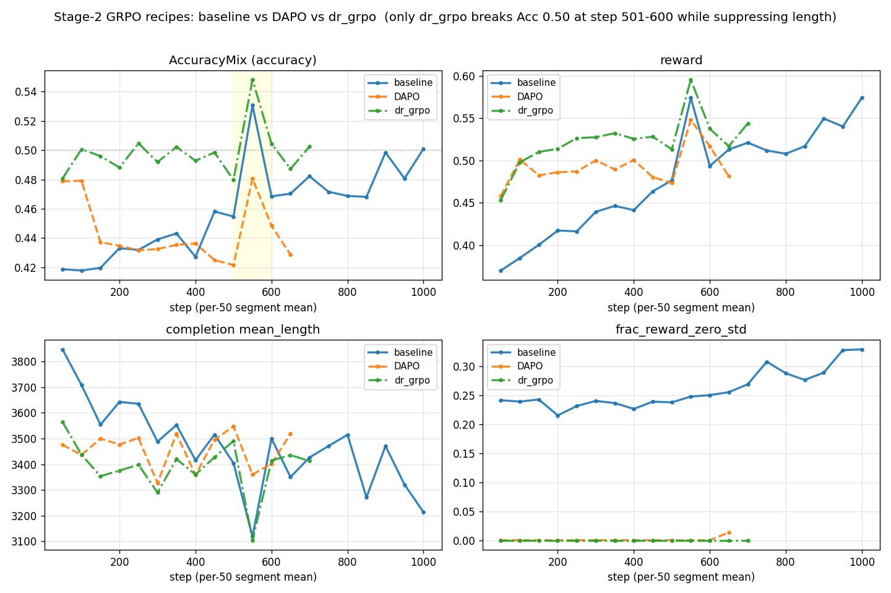

# K-BDS 의료 멀티모달 교차추론 — 학습 파이프라인

계획서(`plan.hwp`) 기반, **ms-swift**로 4단계 파이프라인을 KISTI Slurm 클러스터에 맞춰 구성:
**① (format) 콜드스타트 SFT → ② 범용 RLVR/GRPO → ③ 의료 특화 RL(RaR) → ④ 평가**.
일별 상세는 `docs/worklog_*.md`.

---

## 현황 (2026-07-02)

**지금 위치**: Stage-2(범용 RLVR/GRPO) **1 epoch 재학습 + GSPO A/B 병렬 진행 중** · Stage-3(의료 RL) **배선까지 검증 완료·대기**.

| 항목 | 상태 |
|---|---|
| **Stage-2 기법** | GRPO 파생 A/B 로 **dr_grpo 승자 확정**(baseline·DAPO plateau 미돌파). → [상세](#stage-2--범용-rlvr-grpo) |
| **Stage-2 재학습** | dr_grpo 체인 RUNNING (**step ~883/3204, ~28%**). 건전성 양호(`zero_std=0`). 완주까지 ~9일(1 epoch 전량) |
| **🎯 중간 벤치마크** | **RL 25%(step 800)에서 층화 홀드아웃 Acc: init 0.22 → trained 0.38 (+73%)** — RL이 정확도 확실히 개선 → **전량 학습 계속 확정**. base 0.15 대비 +153%. → [상세](#stage-2--범용-rlvr-grpo) |
| **최신기법 A/B** | **GSPO** ✅완료·**미채택**(판정창 동률). **GDPO**(멀티리워드 보상별 정규화) **A/B 진행중**(`job 59191`, dr_grpo+gdpo, dr_grpo(none)와 판정창 비교). 원칙: 최신이라서가 아니라 **clean A/B로 검증 후 채택** → [상세](#stage-2--범용-rlvr-grpo) |
| **Stage-3 (RaR)** | 루브릭·judge·배선 **end-to-end 검증 완료**(유닛 29/29·스모크·내부망·분포). 본실행만 남음 → [상세](#stage-3--의료-rl-rar-루브릭-보상) |

⚠️ **주의(정비 이력)**: 파일럿 dr_grpo 는 ① 데이터 **21%만** 학습(중간 중단) ② 평가가 학습 파일 stride 슬라이스라 **누수**였음.
→ **정답유형 층화 홀드아웃 분리**(math 453 + visual-logic 519) + **init 부터 fresh 1 epoch 재학습**으로 교정 중.
이전 **"+67%" 벤치마크는 무효**(오염) — 완주 후 층화 홀드아웃에서 재측정.

---

## 목차
1. [현황](#현황-2026-07-02)
2. [파이프라인 4단계](#파이프라인-4단계)
3. [Stage-1 · 콜드스타트 SFT](#stage-1--콜드스타트-sft)
4. [Stage-2 · 범용 RLVR (GRPO)](#stage-2--범용-rlvr-grpo) — baseline·A/B·기법비교(GRPO/DAPO/dr_grpo/GSPO)·벤치마크
5. [Stage-3 · 의료 RL (RaR)](#stage-3--의료-rl-rar-루브릭-보상)
6. [기술 레퍼런스](#기술-레퍼런스) — 환경·모델·LoRA·보상
7. [운영 · 데이터](#운영--데이터) — 자원·정책·데이터·디렉토리·사용순서
8. [진행 이력 & 체크리스트](#진행-이력--체크리스트)
9. [과제 종료 의무](#과제-종료-의무)

---

## 파이프라인 4단계

| 단계 | 목적 | 데이터 | 방법 | 상태 |
|---|---|---|---|---|
| **①** 콜드스타트 SFT | `<think>/<answer>` 추론 형식 주입 | VLAA clevr_math → RFT 간결본 | LoRA SFT | ✅ 완료(`sft_rft_coldstart_merged`) |
| **②** 범용 RLVR | 검증가능 정답으로 추론 강화 | DeepVision-103K | GRPO 계열(dr_grpo) | 🔄 1 epoch 재학습 중 |
| **③** 의료 특화 RL | 개방형 의료 VQA 추론 | medix-rl-data 51K | GRPO + RaR 루브릭 보상 | ⏳ 배선 검증완료·대기 |
| **④** 평가 | base 대비 성능 정량화 | 층화 홀드아웃 / 의료 벤치 | vLLM 추론·채점 | ⏳ Stage-2 완주 후 |

**공통 제약**(→ [기술 레퍼런스](#기술-레퍼런스)): NVLink 없음 → **전 단계 LoRA-DDP** · glibc 2.17 → **Singularity 컨테이너** · 로그인노드 vLLM 불가 → **모든 GPU 작업은 컴퓨트노드**.

---

## Stage-1 · 콜드스타트 SFT

- **목적**: base(Qwen3.5-9B)가 본래 장문 추론(3.5~4.6K토큰)이라 잘림=0점이 RL 정체 원인 → **간결한 `<think>/<answer>` 형식**을 먼저 주입.
- **핵심 결정**: ZeRO-3 길이확대는 no-NVLink에서 5배 느려 불채택 → **rejection-sampling 간결 콜드스타트**(`build_rft_coldstart.py`): 롤아웃 정답+간결 완성문만 SFT.
- **효과 검증**: 후속 GRPO에서 FormatThink 0.05→0.27(5배)·clip↓ (`merge_probe_rft.slurm`). 산출 `sft_rft_coldstart_merged` = Stage-2 init.

---

## Stage-2 · 범용 RLVR (GRPO)

> **요약**: baseline GRPO 에서 **Acc plateau** 진단 → GRPO 파생기법 **clean A/B** → **dr_grpo 승자**(plateau 돌파). 이후 홀드아웃 누수·과소학습을 바로잡아 **층화 홀드아웃 + fresh 1 epoch 재학습** 진행 중. 정식 벤치마크는 완주 후 교체.

### 1) baseline → Acc plateau 진단 (job 57249, step 1000 완주)

RFT 콜드스타트 init + LoRA-DDP + max_completion 6144. 100-step 구간평균:

| 구간 | reward | Acc | FormatThink | clip | mean_len | zero_std |
|------|--------|-----|-------------|------|----------|----------|
| 1–100 | 0.377 | 0.418 | 0.259 | 0.420 | 3778 | 0.240 |
| 501–600 | 0.534 | **0.500** | 0.525 | 0.307 | 3309 | 0.249 |
| 901–1000 | **0.557** | 0.491 | **0.660** | **0.279** | **3267** | **0.328** |

- ✅ 발산/붕괴 없음. FormatThink +155%·clip↓·길이↓.
- ⚠️ **[진단] Acc plateau**: Acc가 step~500서 0.50 정점 후 정체. 원인 = **`frac_reward_zero_std` 0.24→0.33 상승**(그룹 rollout이 전부정답/전부오답 → 정확도 gradient 소실). 후반 reward 상승은 형식·길이 주도.

### 2) A/B: GRPO 파생기법 → dr_grpo 승자

`scripts/21_rlvr_grpo_adv.slurm` — baseline과 **기법 외 전 조건 동일**(clean A/B). 공통 코어 = `dynamic_sample`(zero_std 그룹 폐기·재샘플, 진단 직격) + `overlong_filter`.

| 지표 | baseline(57249) | DAPO(57527) | **dr_grpo(57624)** |
|------|-----------------|-------------|--------------------|
| **step 501~600 Acc** (돌파판정) | 0.500 | 0.465 ❌ | **0.526 ✅** |
| `frac_reward_zero_std` | 0.24→0.33 (↑=plateau) | **0.00** | **0.00** |
| mean_len (후반) | 3267 | ~3600 (↑재폭주) | **3259 (억제)** |
| 누적 Acc (동일구간) | ~0.45 | 0.444 | **0.498** |
| 판정 | plateau 정체 | 안정하나 **미돌파** | **✅ 돌파 (승자)** |



*(50-step 구간평균. baseline(실선)·DAPO(파선)·dr_grpo(점선). **dr_grpo만 step 501~600(노란 띠)서 Acc 0.50 돌파**하며 mean_length 억제. zero_std 는 DAPO·dr_grpo 둘 다 0 평탄, baseline만 상승(=plateau 원인). 재생성: `singularity exec work/images/ms-swift-413-sandbox python scripts/plot_grpo_all.py logs/grpo_stage2_57249.log logs/grpo_adv_57527.log logs/grpo_adv_57624.log docs/assets/grpo_stage2_all.png`)*

### 3) 기법 이해: GRPO / DAPO / dr.GRPO / GSPO

#### 쉬운 설명 (비유)

> **비유**: 한 문제에 모델이 **답안 4장(그룹)**을 낸다 → 정답 여부만 채점 → **그룹 평균보다 잘 쓴 답은 "더 그렇게", 못 쓴 답은 "덜 그렇게"** 확률을 민다.
> PPO와 달리 **별도 채점관(가치망)이 불필요** — *그룹 평균*이 기준선 역할(=GRPO의 핵심 절약).

세 기법은 이 골격을 공유하고 "채점을 점수로 환산하는 규칙"에서만 갈린다:

- **GRPO** (DeepSeekMath, 2024) = **기본형**. 그룹 평균 빼고 **그룹 std로 나눠** 점수화. 약점: ① 그룹이 전부정답/전부오답이면 std=0 → 못 배움(**Acc 정체**) ② **긴 답·쉬운 문제** 과대평가 편향.
- **DAPO** (ByteDance, 2025) = GRPO에 **탐색·효율 4종 보강**(dynamic sampling·clip-higher·token-level loss·overlong). → 우리 결과: 안정성↑이나 **답이 길어지며** 정확도는 baseline 미달.
- **dr.GRPO** (2025, "R1-Zero 비판적 분석") = GRPO의 **편향을 수술**: ① 손실을 시퀀스 길이 아닌 **상수로 정규화** ② **std 나눗셈 삭제**. → DAPO의 "답 길어짐"을 정면 겨냥. **우리 승자**.
- **GSPO** (Alibaba/Qwen, 2025) = importance sampling을 **토큰→시퀀스 단위**로 교체. → [아래 상세](#최신-확장-gspo).

한 줄: **GRPO=기본 · DAPO=탐색 더함(＋4기법) · dr.GRPO=편향 뺌(－2정규화) · GSPO=IS 단위를 시퀀스로 교체**.

#### 메커니즘 비교표

advantage = 그룹상대(group-relative) 골격 공유, 아래 축에서만 갈림 (소스: ms-swift `grpo_trainer.py` 손실 분기 직접 확인):

| 차원 | **GRPO** (baseline) | **DAPO** | **dr_grpo** (승자) |
|------|---------------------|----------|-------------|
| 논문 | DeepSeekMath [2402.03300](https://arxiv.org/abs/2402.03300) | DAPO [2503.14476](https://arxiv.org/abs/2503.14476) | Dr.GRPO [2503.20783](https://arxiv.org/abs/2503.20783) |
| 한 줄 | 그룹상대 PG 기본형 | 비대칭클립 + 동적샘플 | 두 정규화 **편향 제거** |
| **손실 정규화** | ÷ **시퀀스 길이** → 길이 편향 | ÷ **배치 총토큰**(token-level) | ÷ **(B×max_len) 상수** → 편향 제거 |
| **advantage 정규화** | ÷ 그룹 std → 난이도 편향 | ÷ 그룹 std (유지) | **안 함**(`scale_rewards=none`) |
| **클리핑** | 대칭 ε=0.2 | **clip-higher** 비대칭 0.2/0.28 | 대칭 ε=0.2 |
| **zero-std 그룹** | 방치 → plateau 원인 | `dynamic_sample` 재샘플 | `dynamic_sample` 재샘플 |
| **잘린 롤아웃** | loss 포함(오염) | `overlong_filter` 제외 | `overlong_filter` 제외 |
| IS 레벨 | token | token | token |
| **원논문 성과** | 수학추론 SOTA(7B) | AIME24 **50**(32B), 47을 50% 적은 step | AIME24 **43.3%**(7B), 토큰효율↑ |
| ms-swift 인자 | `--loss_type grpo --scale_rewards group` | `--loss_type dapo --epsilon_high 0.28 --dynamic_sample --overlong_filter` | `--loss_type dr_grpo --scale_rewards none --dynamic_sample --overlong_filter` |
| 우리 결과 | plateau(zero_std 0.24→0.33) | 안정하나 **미돌파**(Acc 0.465<0.500) | ✅ **돌파**(Acc **0.526**·길이 억제) — **승자** |

<details><summary>DAPO 4대 기법 상세 (ms-swift 인자·plateau 관련성)</summary>

| 기법 | ms-swift 인자 | 효과 | plateau 관련성 |
|------|--------------|------|---------------|
| **Dynamic Sampling** | `--dynamic_sample true --max_resample_times 3` | reward_std=0 그룹 폐기·재샘플 → 유효 gradient 비율↑ | ⭐ **직격**(zero_std 급등이 진단 원인) |
| **Clip-Higher** | `--epsilon 0.2 --epsilon_high 0.28` | 상단 클립 완화 → 저확률 토큰 탐색 보존, 엔트로피 붕괴 억제 | 조기 수렴/다양성 소실 방지 |
| **Token-level Loss** | `--loss_type dapo` | 토큰 단위 정규화 → 길이 정규화 편향 제거 | 형식·길이 주도 reward 보정 |
| **Overlong handling** | `--overlong_filter true` (+`soft_overlong` 보상) | 잘린 롤아웃 loss 제외 → 길이초과 노이즈 차단 | 잘림=0점 신호 오염 제거 |

- 비용: DAPO 본실행(57527) 실측 **~369s/it (baseline 202의 ~1.8배)** — `dynamic_sample` 재샘플이 step당 생성량↑. 신호효율의 대가.
</details>

#### 최신 확장: GSPO

**GSPO**(Group Sequence Policy Optimization, Alibaba/Qwen, [arXiv:2507.18071](https://arxiv.org/abs/2507.18071), 2025-07): 위 3기법이 모두 **토큰 단위** importance sampling(IS)하는 것을 **시퀀스(답안) 단위**로 바꿈.

- **왜**: 토큰 IS는 응답이 길수록 **분산 노이즈 누적** + 클리핑이 증폭 → 붕괴(특히 MoE·장문·LoRA). GSPO는 **시퀀스 우도 비율(길이 정규화)**로 억제 → MoE RL 안정화가 대표 성과.
- **축 대응**: IS 레벨 = **sequence**(GSPO만) · advantage = 그룹상대 유지 · 클리핑 = **훨씬 작은 ε**(우리 `3e-4/4e-4`).
- dr_grpo와 **직교**(편향제거 vs IS granularity) → 결합 가능.
- **검증 방식**: "최신이라서"가 아니라 dr_grpo가 자리를 얻은 것과 **동일 clean A/B**(`job 59004`, dr_grpo와 병렬, 동일 init·trainonly, step501~600 동일창). 런처 `scripts/launch_gspo_ab.sh`.
- **✅ A/B 결론(2026-07-04, 판정창 501~600 전 구간, dr_grpo n=100 vs GSPO n=99)**: **사실상 동률** — Acc는 GSPO 근소 우위(0.500 vs 0.487), reward는 dr_grpo 근소 우위(0.519 vs 0.506). 차이 ±0.013는 노이즈 범위, 명확한 승자 없음. GSPO는 클리핑 훨씬 큼(0.185 vs ~0.001, 작은 ε 설계상).
- **→ dr_grpo 유지 (GSPO 미채택)**: 동률이면 전환 이유 없음 + dr_grpo는 이미 33% 진행·**홀드아웃 +73% 검증**됐고 GSPO는 on-policy 동률일 뿐 홀드아웃 미검증. 명확한 이득 없이 갈아타면 손해. (전량 학습·과제 성격상 시퀀스 IS가 필요한 MoE·초장문 상황이 아님도 배경.)

#### 최신 실험: GDPO (멀티리워드 정규화)

**GDPO**(Group reward-Decoupled Normalization, NVIDIA, [arXiv:2601.05242](https://arxiv.org/abs/2601.05242), 2026-01): GRPO가 여러 보상을 **가중합→통짜 정규화**해 서로 다른 조합이 같은 advantage로 **뭉개지는(collapse)** 문제를, **보상 함수별로 그룹 내 개별 정규화(z-score) 후 결합**해 해결. (AIME서 GRPO 대비 +2.3~6.3%)

- **왜 우리에게**: 우리는 **다중 보상**(Stage-2 accuracy_mix/format_think/soft_overlong, Stage-3 clinical_judge/format_think)이라 스케일이 제각각 → GDPO의 타깃과 정확히 일치. GSPO(시퀀스 IS)보다 우리 특성에 직접적.
- **dr_grpo와의 관계**: `scale_rewards`는 하나만 고르는 knob → **`none`(dr_grpo) ↔ `gdpo` 배타적**. 나머지 dr_grpo 처리(`loss_type=dr_grpo`·dynamic_sample·overlong·token IS)는 **전부 유지 가능**. 즉 **현 dr_grpo 레시피에서 `scale_rewards`만 `none→gdpo`로 바꾼 1변수 A/B**.
  - ⚠️ 트레이드: dr_grpo가 없앤 ÷std가 **보상함수별로** 되살아남(목적은 난이도편향 회피가 아니라 멀티리워드 균형). swift 제약: `kl_in_reward=True` 비호환(우리는 KL을 loss에 넣어 무관).
- **우리 검증(진행 중)**: `RECIPE=dr_grpo SCALE_REWARDS=gdpo`(`job 59191`, dr_grpo 본선과 병렬), 600 step → dr_grpo(none)와 판정창 501~600 비교. 가장 유망한 적용처는 스케일차 큰 **Stage-3(judge 1.0 + format 0.2)**.

#### 우리가 시도한 RLVR 방법론 종합

| 방법 | 핵심 변경(vs GRPO) | 겨냥 문제 | 우리 결과·상태 |
|------|------|------|------|
| **GRPO** (baseline) | — (그룹상대 PG 기본형) | (기준선) | Acc plateau (zero_std 0.24→0.33) |
| **DAPO** | clip-higher+동적샘플+토큰손실+overlong | plateau·탐색·엔트로피붕괴 | 안정하나 **미돌파**(Acc 0.465<0.500) |
| **dr_grpo** ✅ | 길이·난이도 정규화 **편향 제거** | 길이폭주→clip→0점 | **돌파·승자**(Acc 0.526), **홀드아웃 +73% 검증** |
| **GSPO** | 토큰→**시퀀스** IS | IS 분산누적·MoE 붕괴 | **동률 → 미채택**(2026-07-04) |
| **GDPO** | 보상함수별 **개별 정규화** | 멀티리워드 조합 붕괴 | **A/B 진행중**(59191, dr_grpo+gdpo) |

> 원칙: **"최신 기법이라서" 채택하지 않고, dr_grpo가 자리를 얻은 것과 동일한 clean A/B(동일 init·trainonly, 판정창 501~600)로 검증 후 결정.** dr_grpo·GSPO·GDPO 모두 우리 `21_rlvr_grpo_adv.slurm` 한 스크립트에서 RECIPE/env 토글로 실행. 논문 출처는 위 각 소절 링크.

### 4) base vs 학습모델 벤치마크 (층화 홀드아웃, 정식)

**중간 벤치마크(2026-07-03, RL 25%=step 800)** — 층화 홀드아웃 N=100, math/vl 층별(`eval_midtrain.slurm`). 조기 판단용으로 base / init(RL 0%) / trained(중간) 3개 동일조건 채점:

| 모델 | **전체 Acc** | math | visual-logic | 형식(`<answer>`) | 평균길이 |
|------|------|------|------|------|------|
| **base** (Qwen3.5-9B) | 0.15 | 0.192 | 0.113 | 0.12 | 5907자 |
| **init** (SFT 콜드스타트, RL 0%) | 0.22 | 0.234 | 0.208 | 0.32 | 5188자 |
| **trained** (dr_grpo step 800, **RL 25%**) | **0.38** | 0.340 | **0.415** | 0.45 | 4752자 |

- 🎯 **init → trained: 0.22 → 0.38 (+0.16, 상대 +73%)** — **Stage-2 RL 이 홀드아웃 정확도를 확실히 개선**(25%만 학습했는데도). → **전량 학습 계속**(조기종료 불필요) 근거.
- base → trained **+153%**(전체 파이프라인 SFT+RL). visual-logic 개선 최대(0.21→0.42, +100%), 형식 0.12→0.45, 길이 5907→4752자(간결화).
- ⚠️ **"학습 롤아웃 Acc ~0.50 정체"는 오해였음**: on-policy(탐색 포함) 지표라 평탄했을 뿐, 정작 중요한 **홀드아웃에선 뚜렷이 상승**. → 조기 확인 결과 "계속".
- 1 epoch 완주 후 최종 checkpoint 로 **재측정하여 이 표 갱신** 예정.

<details><summary>이전 파일럿 수치(무효, 참고용) — DeepVision stride 100건, 오염·21%학습</summary>

| 지표 | base | 구 dr_grpo_merged | 변화 |
|------|------|------|------|
| 정확도 | 0.21 | 0.35 | +0.14 (누수·21%) |
| 형식 | 0.23 | 0.46 | — |
| 평균 길이 | 5618 | 4414 | — |

*평가셋이 학습 파일 stride 슬라이스라 진짜 홀드아웃 아니었음(누수) → 위 층화 홀드아웃 수치로 대체.*
</details>

---

## Stage-3 · 의료 RL (RaR 루브릭 보상)

개방형 의료 VQA(medix)는 단일정답 규칙검증 불가 → **Rubric-as-a-Reward**([arXiv:2507.17746](https://arxiv.org/abs/2507.17746)): judge가 가중 다기준 체크리스트를 항목별 0/1 채점, explicit 집계 `r = Σwⱼcⱼ / Σwⱼ ∈ [0,1]`(부분점수 dense). 상세 `docs/medical_reward_spec.md`.

### 루브릭 구성 (`configs/medical_reward.py` `build_rubric`)

**의도**: medix는 **단답 + 멀티모달**이라 "정답 하나 맞히면 끝"이 아니라 **"이미지를 실제로 보고 근거를 대며 맞혔는가"**를 나눠 채점 → 부분점수(dense) 보상. judge LLM이 아래 항목을 0/1 판정.

| 키 | 항목 | 유형(가중) | 판정 기준(요지) |
|---|---|---|---|
| **c1** | Answer correctness | Essential **5** | `<answer>`가 **참조답과 의미 일치**(동의어·단위환산·paraphrase 허용). 참조답을 기준 문장에 **직접 주입** |
| **c2** | Visual grounding | Important **3** | `<think>`가 **이미지와 모순 없는 관찰**을 언급·답 뒷받침. 없는 구조·풍경을 지어내면 실패 |
| **c3** | Numeric precision & unit | Important **3** | 수치+단위가 참조답의 **±15% 이내** (측정형 문제만 자동 추가) |
| **c4** | No hallucination / overclaim | Pitfall **4** | 이미지에 없는 소견·질문 범위 밖 주장 안 함 (긍정형) |

**집계**: `r = Σwⱼ·cⱼ / Σwⱼ ∈ [0,1]`. 실제 비중 — **비측정형**(분모 12): c1 **42%**·c2 25%·c4 33% / **측정형**(분모 15): c1 33%·c2 20%·c3 20%·c4 27%. → 정답성(c1) 최대, 환각억제(c4) 차순.

**설계 결정**:
- **정적 통일 루브릭**(문제마다 생성 X) — 인스턴스식(논문 방식)과 실증 비교(medix 40)에서 정적이 오답기각(0.000 vs 0.118)·**환각변별(+0.338 vs +0.021)** 우세. 인스턴스는 이미지 없이 텍스트로 생성돼 **시각근거 항목을 못 만듦** → **정적 채택**.
- **참조답 템플릿 주입**: 단답이라 핵심사실=참조답 1개 → c1 기준에 참조답을 박아넣어 **오프라인 LLM 루브릭 생성 불필요**(비용 0·결정적).
- **측정형 자동 분기**(`is_measurement`): 정답에 의료 단위(mm/cm/HU/° 등) 있으면 c3 자동 편입.
- **형식 게이트**(`format_ok`): `<think>`에 실질 추론(≥15자)+`<answer>` 있어야 judge 호출, 위반 시 **judge 생략하고 0.0**(비용↓·reward-hacking 방지).
- **c2 완화 이력**: 초기 "실제 소견 인용"은 너무 엄격해 항상 0 → **"이미지와 모순 없는 관찰"**로 완화(분포 프로브 good0.94 vs halluc0.00).
- **데이터**: medix = 단답 VQA(정답 중앙값 46자, 예 "28×27mm"). RaR-Medicine-20k(텍스트전용·장문)는 **스키마만 차용**.

상세 스펙은 `docs/medical_reward_spec.md` §4.2.

### 구현 & judge
- `configs/medical_reward.py` `ClinicalJudgeReward(AsyncORM)`: 형식게이트→멀티모달 judge(env `JUDGE_BASE_URL/MODEL/API_KEY`)→JSON 0/1 파싱→집계. 타임아웃·파싱실패→0.0. 사용 `--reward_funcs format_think clinical_judge --external_plugins configs/accuracy.py configs/medical_reward.py --reward_weights 0.2 1.0`.
- **judge = `Qwen/Qwen3.6-27B-FP8`**(멀티모달, 같은 `qwen3_5` arch → 컨테이너 vLLM 그대로 서빙). `scripts/judge_server.sh`.
  - 🚨 **로그인노드 불가**(드라이버 470 → vLLM 로드 실패). judge·학습 모두 **컴퓨트노드**(내부망 통신, 외부 egress 불필요).

### 검증 (전부 완료)
- ✅ 유닛테스트 **29/29** · judge 스모크(FP8 단일40GB 적합·정답1.0>오답0.0) · 내부망 도달성 · 분포 프로브(good0.96/wrong0.00, c2변별Δ0.94)
- ✅ **GRPO 배선 end-to-end 스모크**(`35_stage3_smoke.slurm`): 플러그인 로드·`clinical_judge` 해석·kwargs 도달·보상 통합 실증.
  - 🐛 **실버그 발견·수정**: swift가 `images`를 str 경로 아닌 **dict `{bytes,path}`**로 넘김 → `_image_to_data_url` str/dict/PIL 지원으로 수정(안 하면 시각근거 c2 blind). 재검증 PASS(data_url_ok=True, ClinicalJudge 0.58→1.0, reward=0.2·Format+1.0·Clinical 정확 통합).
- **RL 알고리즘**: RaR는 보상 설계일 뿐 → 최적화는 GRPO 계열. 조밀 보상이라 zero-std 붕괴가 약해 **`scale_rewards=none`(dr_grpo 코어) 권장**, dynamic_sample은 경량 보험.

### 남은 것
⏳ Stage-2 완주·재병합 후 **`bash scripts/launch_stage3.sh`**(judge ready → 학습 자동 제출). 망각 방지용 DeepVision 혼합은 옵션.

---

## 기술 레퍼런스

### 환경: Singularity 컨테이너 (확정·검증 완료)
- 노드 OS **CentOS 7.9 / glibc 2.17** → 최신 ML 패키지(특히 vLLM·xformers) pip/conda 설치 불가 → **공식 ms-swift 컨테이너**.
- 이미지: `...modelscope:ubuntu22.04-cuda12.9.1-py312-torch2.10.0-vllm0.19.1-modelscope1.35.4-swift4.1.3` (Gemma4 지원=swift≥4.0.4).
- **계산노드 검증**(드라이버 550=CUDA12.4): swift4.1.3 / torch2.10+cu129 / vllm0.19.1(`vllm._C` OK) / transformers5.6.2. CUDA **마이너 호환**(12.9 빌드를 12.4 드라이버) 정상.
- SIF는 실행마다 추출이 느려 **sandbox(디렉토리)** 변환 사용(`work/images/ms-swift-413-sandbox`). `00_common.sh` `ENV_MODE=container`.
- 최신 swift 4.2.3은 CUDA 13 요구라 이 드라이버서 불가. 대안 이미지: swift3.8.3/cuda12.6.3, swift3.6.4/cuda12.4.0.

### 베이스 모델 & ms-swift 4.x 주의
- **`Qwen/Qwen3.5-9B`**(멀티모달, `MODEL_TYPE=qwen3_5`). config `qwen3_5`/processor `Qwen3VLProcessor`. 게이트 없음, `work/hf_cache` 캐시(`HF_HUB_OFFLINE=1` 오프라인).
- ❌ **Gemma 4 12B 불가**: 실제 `model_type=gemma4_unified` + transformers 5.10.dev + CUDA 13 이미지 필요 → 드라이버 550서 구동 불가(다운로드본 정리).
- ⚠️ **swift 3.x→4.x 인자 변경**: `--train_type`→**`--tuner_type`**, `--reward_funcs_plugin X` 폐지→**`--reward_funcs ... X`** 직접 나열. 보상 plugin은 `swift.rewards`(`ORM`/`AsyncORM`/`orms`) API.

### 학습 방식: LoRA (하드웨어 제약 대응)
- **NVLink 없음**(실측): 8gpu = A100 80GB **PCIe**, `nvidia-smi topo -m` 전부 PHB → GPU P2P 차단 → NCCL **SHM(호스트 RAM) 폴백**.
- 결과: **full-FT 멀티GPU는 18GB gradient all-reduce 병목** → 9B·짧은 시퀀스인데도 **375~660초/step**(하이퍼바이저 ACS라 수정 불가).
- **대응 = 전 단계 LoRA**: adapter grad(수십 MB)만 통신 → **~128s/step(GRPO)·~5s/step(SFT)** = ~5~75배↑. base 동결이라 **DeepSpeed 없이 DDP** 충분.
  - cold-start LoRA → `swift export --merge_lora`로 병합 → 다음 단계 `INIT_MODEL`.
  - LR 기본: SFT lora `1e-4`/full `1e-5`, GRPO lora `1e-5`/full `1e-6`. `LR=` override.

### 보상 설계 (Stage-2)
- **출력 형식**: `<think>간결 추론</think><answer>최종답</answer>` (`\boxed{}` 미사용).
- **`accuracy_mix`**(`configs/accuracy.py`): 내장 `accuracy`는 객관식 letter("B")·기호 미파싱 → DeepVision ~48%가 letter라 보상 절반 소실 → 커스텀 **수식=math_verify / letter·문자열=정규화일치** 분기. 가중치 `accuracy_mix 1.0 : format_think 0.2 : soft_overlong 0.2`.
- **vLLM colocate**: `--vllm_mode colocate`·`--vllm_mm_processor_cache_gb 0`(mm_hash AssertionError 회피)·`--sleep_level 1`.

---

## 운영 · 데이터

### 자원 & 운영 정책 (가이드)
- 계획서 **8×A100-80GB 노드** = `8gpu` 파티션(4gpu·8gpu=80GB, 1gpu·2gpu=40GB). `bdata_user` 바로 사용, diba 불필요. **80GB 실측 확인**(파일럿 59.6GiB).
- **wall-clock 5일(120h)**: 70h 단일 OK(`--resume_from_checkpoint` 권장). **배타적 노드**(1노드=1작업). **동시 제출 8gpu 최대 6개**(노드 3×2). **노드시간** 8gpu=8/h(`cat /scratch/account/kbds0754`). `#SBATCH --comment=pytorch` 필수.

<details><summary>노드시간 예산 (계획서 4,960 / Track III 한도 5,000)</summary>

| 단계 | 스크립트 | 1회 | 반복 | 노드시간 |
|------|----------|-----|------|----------|
| SFT | 10_sft | 24h×8 | ×5 | 960 |
| 범용 RLVR/GRPO | 20_rlvr_grpo | 70h×8 | ×6 | 3,360 |
| 평가 | 40_eval | 10h×8 | ×8 | 640 |
| **합계** | | | | **4,960** |
</details>

### 데이터 (소스 확정 + 변환 검증)
- **Stage-2**: `skylenage-ai/DeepVision-103K`(수학 77K + 시각논리 26K = 103K, 검증가능 정답). `DeepMath-103K`(텍스트) 혼동 주의.
- **Stage-3**: `MBZUAI/medix-rl-data`(51K, 개방형 의료 멀티모달). 둘 다 `work/hf_cache` 다운로드 완료·게이트 없음.
- K-BDS 공개데이터 경로: `/kobic/ICECAP/DataStation/` · 매핑표 `/scratch/database/KBDSMAP/` · 업로드 `kbds-dm.kisti.re.kr`.
- 출력 포맷: `{"messages":[{"role":"user","content":"<image>...질문"}], "images":["/abs.png"], "solution":"정답"}`.

<details><summary>다운로드 → 변환 워크플로 (컨테이너 내, 로그인노드)</summary>

```bash
SB=work/images/ms-swift-413-sandbox
DV=$(ls -d work/hf_cache/hub/datasets--skylenage-ai--DeepVision-103K/snapshots/*/)
singularity exec --bind $PWD/work --env HF_HUB_OFFLINE=1 $SB python scripts/convert_to_swift.py \
  skylenage-ai/DeepVision-103K --parquet "${DV}math-77k.parquet" "${DV}visual_logic-26k.parquet" \
  --out work/data/deepvision103k_train.jsonl --images-dir work/data/images/deepvision
MX=$(ls -d work/hf_cache/hub/datasets--MBZUAI--medix-rl-data/snapshots/*/)
singularity exec --bind $PWD/work --env HF_HUB_OFFLINE=1 $SB python scripts/convert_to_swift.py \
  MBZUAI/medix-rl-data --parquet "${MX}data/train-*.parquet" \
  --out work/data/medix_rl_train.jsonl --images-dir work/data/images/medix
```
- ⚠️ parquet `List` feature가 datasets 구버전과 충돌 → 변환기는 **pyarrow 스트리밍**. 전체 변환은 이미지 ~154K개 추출(디스크·inode 큼).
</details>

### 홀드아웃 분리 (Stage-2 평가 누수 차단)
`scripts/make_holdout.py`: DeepVision엔 카테고리 라벨 없음 → **정답유형 프록시**(math=수치/수식, visual-logic=객관식 MC) 각 **1%** 층화 → `deepvision_holdout.jsonl`(972) / `deepvision103k_trainonly.jsonl`(102,531). 학습은 trainonly, 평가는 holdout(누수 0). 평가 `eval_compare.py`(math/vl 층별 분리 보고).

<details><summary>디렉토리 트리</summary>

```
kbds_project/
├── README.md · HANDOFF.md · plan.hwp
├── configs/
│   ├── accuracy.py          # Stage-2 보상 accuracy_mix + format_think
│   ├── medical_reward.py    # Stage-3 RaR 루브릭 보상 clinical_judge(AsyncORM)
│   └── ds_zero{2,3,3_offload}.json
├── scripts/
│   ├── 00_common.sh                     # 공통 경로/환경/실행 래퍼
│   ├── 10_sft.slurm / 20_rlvr_grpo.slurm / 30_medical_rl.slurm / 40_eval.slurm  # 단계별
│   ├── 21_rlvr_grpo_adv.slurm           # Stage-2 A/B(dapo/gspo/dr_grpo, RESUME/MAX_STEPS)
│   ├── build_rft_coldstart.py           # 간결 콜드스타트
│   ├── make_holdout.py                  # 층화 홀드아웃 분리
│   ├── plot_grpo_all.py                 # 3기법 통합 plot
│   ├── judge_server.sh / 31_judge_smoke.slurm / 33_judge_probe.slurm  # judge 서빙·검증
│   ├── 35_stage3_smoke.slurm            # Stage-3 배선 end-to-end 스모크
│   ├── merge_drgrpo.slurm / launch_stage3.sh / launch_gspo_ab.sh      # 오케스트레이터
│   ├── 40_eval_compare.slurm / eval_compare.py                        # base vs 학습 벤치
│   ├── test_medical_reward.py           # Stage-3 보상 유닛테스트(29)
│   └── convert_to_swift.py / download_{model,dataset}.py
├── docs/ (medical_reward_spec.md · worklog_*.md) · logs/
```
</details>

### 사용 순서
```bash
# 0) 환경(1회, 로그인노드): bash env/build_image.sh  → work/images/ms-swift-413-sandbox
# 1) 경로/모델 확인: scripts/00_common.sh 상단 변수
# 2) 단계별 제출 (의존성 체이닝)
JID1=$(sbatch --parsable scripts/10_sft.slurm)
JID2=$(sbatch --parsable --dependency=afterok:$JID1 scripts/20_rlvr_grpo.slurm)
JID3=$(sbatch --parsable --dependency=afterok:$JID2 scripts/30_medical_rl.slurm)
sbatch          --dependency=afterok:$JID3 scripts/40_eval.slurm
```

---

## 진행 이력 & 체크리스트

### 핵심 의사결정 (요약)
- **NVLink 없음 → 전 단계 LoRA** (full-FT 375~660s/step → LoRA ~5배↑).
- **추론 길이 폭주 → rejection-sampling 간결 콜드스타트** (ZeRO-3 길이확대는 5배 느려 불채택).
- **plateau 돌파 → dr_grpo** (두 정규화 편향 제거로 zero-std plateau 통과).
- **평가 누수 차단 → 층화 홀드아웃 + fresh 1 epoch 재학습** (기존 stride 슬라이스는 학습 파일과 겹침).
- **Stage-3 → 정적 RaR 루브릭** (인스턴스식 대비 시각근거 변별 우세).

### 날짜별 이력 (상세 `docs/worklog_*.md`)
- **06-15~17** — 환경·모델·데이터 확정. NVLink 부재 발견→LoRA 전환. format 콜드스타트, `accuracy_mix`, GRPO 파일럿. Stage-2 착수(57249).
- **06-19** — Stage-2 baseline 완주(step1000). **Acc plateau 진단**(zero_std 0.24→0.33).
- **06-22~24** — plateau 돌파 A/B config(`21_..adv`). **DAPO 착수**(57527) → 안정성↑(grad 무spike·zero_std 0.00)이나 Acc 적신호. step600 돌파판정 자동화.
- **06-25** — **DAPO 종결**(미돌파). **dr_grpo 착수**(57624).
- **06-28** — **dr_grpo 돌파 확인**(step501~600 Acc 0.526>0.500). 승자 = `checkpoint-600`.
- **06-29** — **Stage-3 착수**: RaR 루브릭·`medical_reward.py`·judge(Qwen3.6-27B-FP8) 확정. **정적 vs 인스턴스 비교→정적 채택**.
- **06-30** — **홀드아웃 정비 + 1 epoch 재학습 착수**(층화 972, trainonly 102,531, fresh, MAX_STEPS 3204). +67% 무효화. 속도 병목 진단(~365s/step 구조적).
- **07-01** — **Stage-3 배선 end-to-end 스모크**: images dict 실버그 발견·수정, 유닛 29/29, 재검증 PASS. GRPO/DAPO/dr_grpo/GSPO 논문 정리. **GSPO A/B 착수**(59004, dr_grpo 병렬).
- **07-02** — 병렬 진행: dr_grpo step~656/3204, GSPO step~198/600. dr_grpo 판정창 501~600 완성(Acc 0.487, on-policy). **예비 비교(동일 step 100~200)**: GSPO ≈ dr_grpo **동률**(Acc 0.516 vs 0.510), GSPO 클리핑↑ → 아직 우위 신호 없음. README 전면 재구조화(427→331줄).
- **07-03** — **중간 홀드아웃 벤치마크**(`eval_midtrain.slurm`, RL 25%=step 800, 층화 N=100): **init 0.22 → trained 0.38(+73%)**, base 0.15 대비 +153% → **RL 홀드아웃 개선 확인, 전량 학습 계속 확정**(첫 유효 홀드아웃 수치, 무효 +67% 대체). dr_grpo step~883, GSPO step~466.
- **07-04** — **GSPO A/B 완료·미채택**(판정창 동률 → dr_grpo 유지). **GDPO A/B 착수**(`job 59191`, `RECIPE=dr_grpo SCALE_REWARDS=gdpo` = dr_grpo 처리 유지 + advantage만 보상별 개별정규화). RLVR 방법론 종합비교(GRPO/DAPO/dr_grpo/GSPO/GDPO) README 추가. dr_grpo 본선 step~1061(33%) 계속.

### TODO
- [x] 환경·모델·데이터 확정 + 전체 변환 (DeepVision 103K / medix 51K)
- [x] LoRA 전환(NVLink 없음) · 간결 콜드스타트 · `accuracy_mix`
- [x] Stage-2 baseline 완주 + **A/B 종결(dr_grpo 승자)**
- [x] Stage-3 RaR 보상·judge·**배선 end-to-end 스모크**(유닛 29/29)
- [x] **홀드아웃 정비 + 1 epoch 재학습 착수** (진행 중)
- [x] **중간 홀드아웃 벤치마크**(RL 25%): init 0.22→trained 0.38(+73%) → **전량 학습 계속 확정**
- [ ] **Stage-2 완주** → 최종 ckpt 재병합 → **층화 홀드아웃 벤치마크 재측정**(정식 최종 수치)
- [x] **GSPO A/B 판정** → 판정창 동률 → **dr_grpo 유지**(미채택)
- [ ] **Stage-3 본실행**(`launch_stage3.sh`) → Stage-3 init 교체
- [ ] 평가 벤치마크를 실제 의료 멀티모달 벤치로 교체 · 하이퍼파라미터 튜닝

---

## 과제 종료 의무 (가이드 §7)
- 종료 후 **1주 내** 데이터 다운로드(이후 차단·삭제) · **1개월 내** 결과보고서 + 산출물 기탁(marketplace.kbds.re.kr) · **2년 내** 사사표기 논문.
- 사사: *"이 논문은 K-BDS로부터 컴퓨팅 자원과 기술지원을 받아 수행된 연구성과임"* / *"This work was supported by the Korea Bio Data Station(K-BDS) with computing resources including technical support"*
