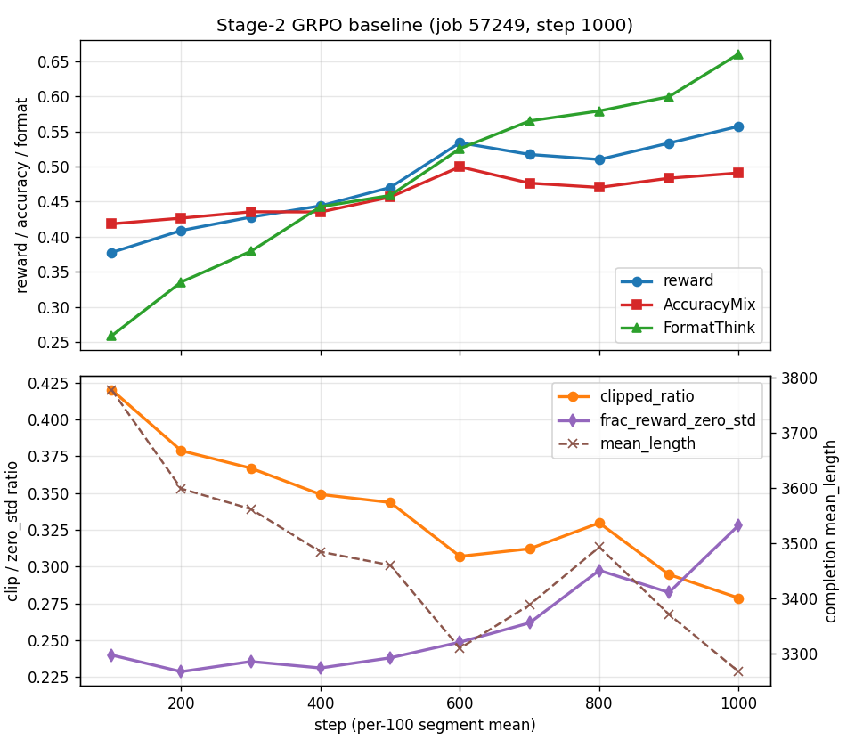
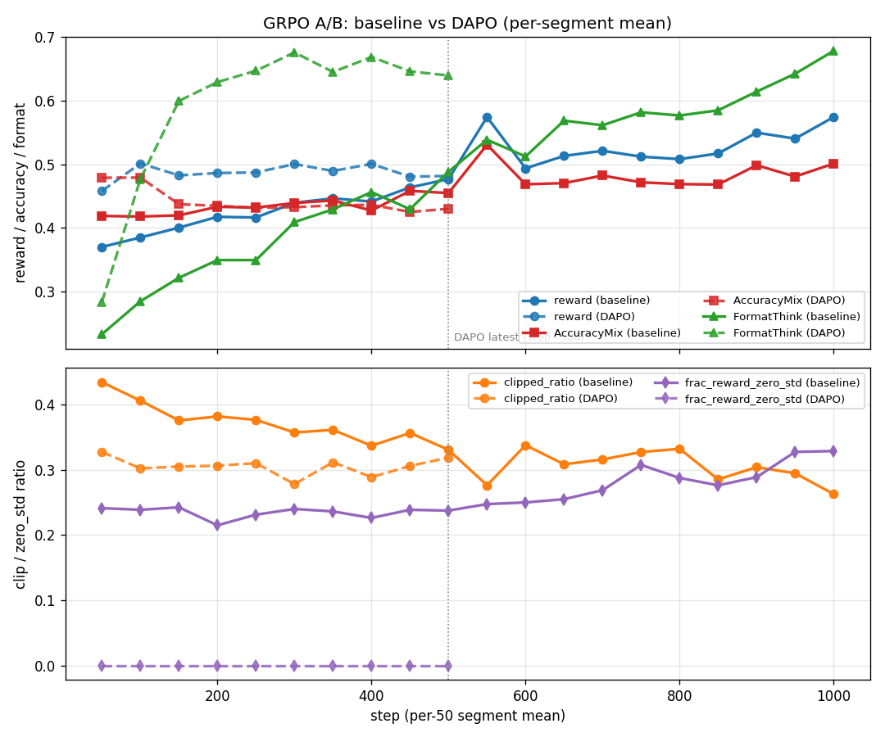
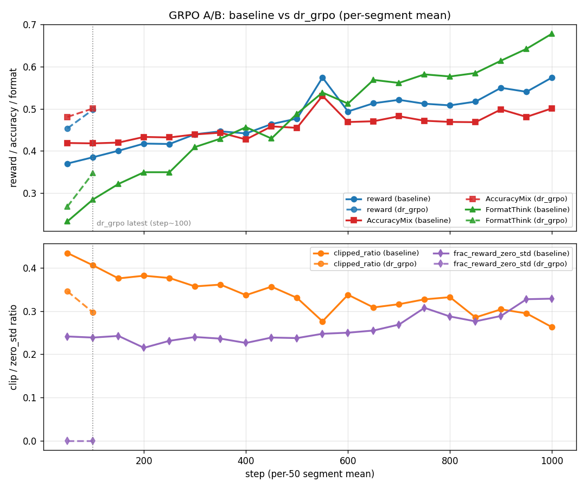

# K-BDS 의료 멀티모달 교차추론 — 학습 파이프라인

계획서(`plan.hwp`) 기반, **ms-swift**로 (format cold-start) SFT → 범용 RLVR/GRPO → 의료 특화 RL → 평가
4단계를 KISTI Slurm 클러스터 환경에 맞춰 구성. 일별 진행 기록은 `docs/worklog_*.md` 참고.

## 현황 (2026-06-29 기준)

<!-- AUTO:status START (scripts/grpo_ab_update.py 자동 갱신 — 수동 편집 금지) -->
**파이프라인 위치**: Stage-2(범용 RLVR/GRPO) — baseline 완주 → Acc plateau 진단 → **DAPO 종결**(step 623, `checkpoint-600` 확정, step 501~600 Acc 0.465<baseline 0.500 → **돌파 미확인**) → **dr_grpo ✅ 돌파 확인·종결**(job 57624, step 689 TIMEOUT): **step 501~600 Acc 0.526 > baseline 0.500**(DAPO 0.465 실패) — 길이 억제(mean_len 3259<baseline)와 함께 정확도 우위 전환. 후반 꼬리(601~689) Acc 0.494로 소폭 냉각(길이 3426 반등) → **최적 = `checkpoint-600`**(= Stage-2 승자).
→ **Stage-3(의료 RL) 진행 중**: **RaR 루브릭 보상 + judge 검증 완료**. `medical_reward.py`(clinical_judge, 유닛테스트 24/24) + **judge=Qwen3.6-27B-FP8 멀티모달**을 **컴퓨트노드 vLLM 단일 40GB에서 검증**(스모크: 정답1.0>오답0.0 단조성·이미지 채점 OK). 남은 것: 학습↔judge **내부망 도달성 테스트** → 분포 프로브 → `30_medical_rl.slurm` 배선.
<!-- AUTO:status END -->
일별 상세 기록은 `docs/worklog_*.md`.

### Stage-2 GRPO baseline (job 57249 · step 1000 완주)
RFT 간결 콜드스타트 init + LoRA-DDP + max_completion 6144. step 1000에서 autostop(`checkpoint-1000` 저장 후
자동 scancel). 산출: `work/checkpoints/grpo_general/v11-20260616-165537/checkpoint-1000`. 100-step 구간평균 추세:

| 구간 | reward | Acc | FormatThink | clip | mean_len | zero_std |
|------|--------|-----|-------------|------|----------|----------|
| 1–100 | 0.377 | 0.418 | 0.259 | 0.420 | 3778 | 0.240 |
| 501–600 | 0.534 | **0.500** | 0.525 | 0.307 | 3309 | 0.249 |
| 901–1000 | **0.557** | 0.491 | **0.660** | **0.279** | **3267** | **0.328** |



*(100-step 구간평균. 상단: reward·AccuracyMix·FormatThink / 하단: clip·zero_std·mean_length.
재생성: `singularity exec work/images/ms-swift-413-sandbox python scripts/plot_grpo_trend.py logs/<log> docs/assets/<png>`)*

- ✅ 발산/붕괴 없음. FormatThink +155%·clip↓·길이↓ → RFT 콜드스타트 효과 지속 강화.
- ⚠️ **[진단] Acc plateau**: Acc는 step~500서 0.50 정점 후 정체. 원인 = **`frac_reward_zero_std` 0.24→0.33 상승**
  (그룹 rollout이 전부정답/전부오답화 → 정확도 gradient 소실). 후반 reward 상승은 형식·길이 주도.

### Stage-2 A/B: GRPO 파생기법 (plateau 돌파 · ✅ 종결)
`scripts/21_rlvr_grpo_adv.slurm` — baseline과 **기법 외 전 조건 동일**. 공통 코어 = `dynamic_sample`(zero_std 그룹
폐기·재샘플, 진단 직격) + `overlong_filter`. 레시피 3종: `dapo`(clip-higher+`loss_type=dapo`) / `gspo`(sequence-level IS) /
`dr_grpo`(길이·난이도 편향 제거).
- ✅ **dapo 본실행 종결**(job 57527, step 623서 scancel·`checkpoint-600` 확정). 결과: 안정성 압도(grad_norm 무폭주·zero_std 0.00)
  하나 **돌파 미확인**(step 501~600 Acc DAPO 0.465 < baseline 0.500). 길이↑→clip↑ 재폭주가 정확도 미전환 원인 추정.
- ✅ **dr_grpo 본실행 종결·돌파 확인**(job 57624, step 689 TIMEOUT). DAPO 진단 직격: `loss_type=dr_grpo`(길이정규화 편향 제거)
  + `scale_rewards=none`(그룹 std 난이도 편향 제거). **step 501~600 Acc 0.526 > baseline 0.500**(DAPO 0.465 실패)하며
  길이 억제(mean_len 3259)까지 동반 → **가설 검증**. 후반 꼬리(601~689) Acc 0.494 소폭 냉각 → **최적 산출물 `checkpoint-600`**.

#### 쉬운 설명 (한 문장 직관)
공통 아이디어: **한 문제에 답을 여러 개(그룹) 뽑아, 그룹 평균보다 잘한 답은 강화·못한 답은 억제**한다(정답 채점만 있으면 됨).
- **GRPO** = 기본형. 단순하지만 두 약점: ① 그룹 답이 *전부 정답/전부 오답*이면 배울 게 없어 낭비(→ Acc 정체) ② *긴 답·쉬운 문제*가 과대평가되는 편향.
- **DAPO** = GRPO에 **"탐색·효율"을 보강**. 무신호 그룹은 버리고 다시 뽑고(dynamic sampling), 확률 올릴 여지를 키워(clip-higher) 다양성 유지. → 우리 결과: 안정성은 크게 좋아졌으나 *답이 길어지며* 정확도는 baseline 못 넘음.
- **dr.GRPO** = GRPO의 **"편향 자체를 제거"**. 길이 보정·난이도 보정을 빼서 *긴 답에 유리하던 쏠림*을 없앰. → DAPO가 겪은 "답 길어짐" 문제를 정면으로 겨냥.

#### 기법 메커니즘 비교 (GRPO / DAPO / dr_grpo)
세 기법은 **advantage = 그룹상대(group-relative)** 라는 골격을 공유하며, 아래 축에서만 갈린다. (소스: `grpo_trainer.py` 손실 분기 직접 확인)

| 차원 | **GRPO** (baseline) | **DAPO** | **dr_grpo** |
|------|---------------------|----------|-------------|
| 논문 | DeepSeekMath (2402.03300) | DAPO (2503.14476) | Dr.GRPO (2503.20783) |
| 한 줄 요약 | 그룹상대 PG 기본형 | 비대칭클립 + 동적샘플 | 두 정규화 **편향 제거** |
| **손실 정규화** | ÷ **시퀀스 길이**(per-seq) → 길이 편향 | ÷ **배치 총토큰**(token-level) | ÷ **(B×max_len) 상수** → 편향 제거 |
| **advantage 정규화** | ÷ 그룹 std → 난이도 편향 | ÷ 그룹 std (유지) | **안 함**(`scale_rewards=none`) → 난이도 편향 제거 |
| **클리핑** | 대칭 ε=0.2 | **clip-higher** 비대칭 ε=0.2/0.28(탐색↑·엔트로피붕괴 억제) | 대칭 ε=0.2 |
| **zero-std 그룹** | 방치 → 정확도 gradient 소실(plateau 원인) | `dynamic_sample` 재샘플 | `dynamic_sample` 재샘플 |
| **잘린 롤아웃** | loss 포함(신호 오염) | `overlong_filter` 제외 | `overlong_filter` 제외 |
| IS 레벨 | token | token | token |
| 주 타깃 문제 | (기준선) | zero_std plateau | **길이 폭주→clip→0점** |
| ms-swift 인자 | `--loss_type grpo --scale_rewards group` | `--loss_type dapo --epsilon_high 0.28 --dynamic_sample --overlong_filter` | `--loss_type dr_grpo --scale_rewards none --dynamic_sample --overlong_filter` |
| 우리 결과 | Acc plateau(~0.50 정점, zero_std 0.24→0.33) | 안정성 압도(grad 무폭주·zero_std 0.00) **but 돌파 미확인**(step501~600 Acc 0.465<0.500) | ✅ **돌파 확인**(57624): step501~600 Acc **0.526>0.500**·mean_len 3259(길이↓)·clip↓ — DAPO 실패지점 통과. **Stage-2 승자** |

> 요지: **DAPO 는 "탐색·신호 효율"**(clip-higher + 동적샘플)을, **dr_grpo 는 "정규화 편향 제거"**(길이·난이도)를 노린다.
> 둘 다 공통 코어(`dynamic_sample`+`overlong_filter`)는 켠 채, baseline 과 그 외 조건은 동일(clean A/B). GSPO 등 추가 레시피는 "GRPO 파생기법" 절 참고.

<!-- AUTO:ab START (scripts/grpo_ab_update.py 자동 갱신 — 100-step마다 watcher 가 재생성. 수동 편집 금지) -->
  **baseline(57249) vs DAPO(57527) — 동일 구간 step 1~623 비교:**

  | 지표 | baseline | DAPO | 차이 |
  |------|----------|------|------|
  | **frac_zero_std**(무신호 그룹) | 0.238 | **0.001** | ↓0.237 ★ |
  | FormatThink | 0.405 | 0.608 | ↑0.203 |
  | reward | 0.445 | 0.493 | ↑0.048 |
  | clip(잘림) | 0.360 | 0.303 | ↓0.058 |
  | Acc | 0.446 | 0.444 | ↓0.001 |
  | mean_len | 3531 | 3452 | ↓79 |

  - ✅ **dynamic_sample 가설 검증**: `frac_reward_zero_std` 0.24→**0.00**. baseline 이 매 step ~24% 낭비하던 무신호 그룹을 재샘플로 제거(plateau 직격).
  - ✅ **형식 수렴**: 동일구간 FormatThink baseline 0.41 → DAPO **0.61**.
  - ⚠️ **속도 ~1.8배**: DAPO ~368s/it vs baseline 202.
  - 📏 **길이·clip**: mean_len 3452(Δ-79) / clip 0.303(Δ-0.058) vs baseline.
  - ⚠️ **돌파 미확인**: step 501~600 구간 Acc DAPO 0.465 < baseline **0.500** (Δ-0.035) — 안정성 이득이 아직 정확도로 미전환.
  - 누적 참고: DAPO 0.444 vs baseline 0.446 (누적) — step 623까지 평균.
<!-- AUTO:ab END -->

  

  *(50-step 구간평균. 실선=baseline(57249, step 1000) / 점선=DAPO(57527, **종결 step 623·`checkpoint-600` 확정**). 상단 reward·Acc·FormatThink, 하단 clip·zero_std.
  DAPO FormatThink 급상승·zero_std 0.00 평탄선이 핵심이나 step 501~600 Acc 0.465<baseline 0.500 → **돌파 미확인**. 재생성:
  `singularity exec work/images/ms-swift-413-sandbox python scripts/plot_grpo_compare.py logs/grpo_stage2_57249.log baseline logs/grpo_adv_57527.log DAPO docs/assets/grpo_dapo_vs_baseline.png`)*

### dr_grpo A/B (DAPO 길이폭주 진단 직격 · ✅ 돌파 확인·종결)
DAPO 종결 결론(안정성 OK·**돌파 미확인**, 길이↑→clip↑ 재폭주 추정)을 직격하기 위해 **Dr.GRPO**(arXiv:2503.20783):
`loss_type=dr_grpo`(길이정규화 편향 제거) + `scale_rewards=none`(그룹 std 난이도 편향 제거). 공통 코어(dynamic_sample
+overlong_filter) 유지, clip-higher 미적용(대칭 ε 0.2). baseline·DAPO 와 동일 init 으로 clean A/B. (job 57624)

<!-- AUTO:ab:dr_grpo START (scripts/grpo_ab_update.py 자동 갱신 — 100-step마다 watcher 가 재생성. 수동 편집 금지) -->
  **baseline(57249) vs dr_grpo(57624) — 동일 구간 step 1~689 비교:**

  | 지표 | baseline | dr_grpo | 차이 |
  |------|----------|------|------|
  | **frac_zero_std**(무신호 그룹) | 0.242 | **0.000** | ↓0.242 ★ |
  | FormatThink | 0.421 | 0.464 | ↑0.043 |
  | reward | 0.453 | 0.523 | ↑0.069 |
  | clip(잘림) | 0.355 | 0.279 | ↓0.076 |
  | Acc | 0.449 | 0.498 | ↑0.049 |
  | mean_len | 3510 | 3391 | ↓119 |

  - ✅ **dynamic_sample 가설 검증**: `frac_reward_zero_std` 0.24→**0.00**. baseline 이 매 step ~24% 낭비하던 무신호 그룹을 재샘플로 제거(plateau 직격).
  - ✅ **형식 수렴**: 동일구간 FormatThink baseline 0.42 → dr_grpo **0.46**.
  - ⚠️ **속도 ~1.8배**: dr_grpo ~369s/it vs baseline 202.
  - 📏 **길이·clip**: mean_len 3391(Δ-119) / clip 0.279(Δ-0.076) vs baseline.
  - ✅ **돌파 확인**: step 501~600 구간 Acc dr_grpo **0.526** vs baseline 0.500 (Δ+0.027) — 안정성이 정확도 우위로 전환됨.
  - 누적 참고: dr_grpo 0.498 vs baseline 0.449 (누적) — step 689까지 평균.
<!-- AUTO:ab:dr_grpo END -->

  

  *(50-step 구간평균. 실선=baseline(57249) / 점선=dr_grpo(57624, **종결 step 689·`checkpoint-600` 확정**). 재생성:
  `singularity exec work/images/ms-swift-413-sandbox python scripts/plot_grpo_compare.py logs/grpo_stage2_57249.log baseline logs/grpo_adv_57624.log dr_grpo docs/assets/grpo_dr_grpo_vs_baseline.png`)*

### 핵심 의사결정 이력 (상세: 해당 섹션 / worklog)
- **NVLink 없음 → 전 단계 LoRA**: PCIe A100·SHM 폴백으로 full-FT 375~660s/step → LoRA ~5배↑. ☞ "학습 방식" 절.
- **추론 길이 폭주 → rejection-sampling 간결 콜드스타트**: base가 본래 3.5~4.6K토큰 장문, 잘림=0점이 정체 원인.
  ZeRO-3 길이확대는 5배 느려 불채택. ☞ `worklog_2026-06-16`.
- **보상 = accuracy_mix + format_think + soft_overlong**: 내장 accuracy의 letter 미파싱 보완. ☞ "보상 설계" 절.

### 다음 (예정)
- ✅ Stage-2 A/B 완료 → **dr_grpo plateau 돌파**(승자 `grpo_general_adv_dr_grpo/.../checkpoint-600`).
- ✅ **Stage-3 RaR 루브릭 보상 설계·구현**(`medical_reward.py`, spec §4.2, 유닛테스트 24/24).
- ✅ **judge 확정·검증** — `Qwen3.6-27B-FP8`(멀티모달), 컴퓨트노드 vLLM 단일 40GB 적합·단조성 PASS(`31_judge_smoke.slurm`).
- ✅ **학습↔judge 내부망 도달성 테스트** 통과(컴퓨트노드 간 hostname·IP 200 OK, `32_net_test.slurm`).
- ✅ **분포 프로브 통과** — good0.96/wrong0.00/halluc0.64, 단조성99%, c2변별Δ0.94(spec §8-결과). 보상 사용준비 완료.
- ✅ **`30_medical_rl.slurm` 배선 완료** — LoRA + dr_grpo init + format_think/clinical_judge 보상 + judge 오케스트레이터(`launch_stage3.sh`).
- ⏳ **Stage-3 본실행** — `bash scripts/launch_stage3.sh`(judge 잡 ready 후 학습 잡 자동 제출).

## 진행 이력 (날짜별 · 상세는 `docs/worklog_*.md`)
- **2026-06-15** — 환경(컨테이너 swift4.1.3)·모델(Qwen3.5-9B)·데이터 확정·검증. **NVLink 부재 발견→전 단계 LoRA 전환**.
  format 콜드스타트 SFT, 커스텀 `accuracy_mix` 보상, GRPO LoRA 파일럿 검증. ☞ `worklog_2026-06-15`
- **2026-06-16** — 추론모드 강제(`enable_thinking`+`format_think`), flash_attn, soft_overlong. **길이폭주 진단**,
  ZeRO-3 길이확대 불채택, **rejection-sampling 간결 콜드스타트**로 해결. Stage-2 GRPO 본실행 시작(57249). ☞ `worklog_2026-06-16`
- **2026-06-17** — Stage-2 추세 우상향 확인(step~300), step 1000 자동정지(autostop) 설정, 디스크 ~42G 정리. ☞ `worklog_2026-06-17`
- **2026-06-19** — **Stage-2 baseline 완주**(step 1000, `checkpoint-1000`). 1000-step 추세 정리, **Acc plateau 진단**
  (`frac_reward_zero_std` 0.24→0.33). ☞ `worklog_2026-06-19`
- **2026-06-22** — ms-swift GRPO 파생기법 인벤토리 조사. **plateau 돌파 A/B config**(`scripts/21_rlvr_grpo_adv.slurm`,
  dynamic_sample+overlong_filter / dapo·gspo 레시피), 스모크 테스트(57526), **dapo 본실행 착수(57527)**. ☞ `worklog_2026-06-22`
- **2026-06-23** — **DAPO 본실행 중간 비교**(57527 step~176 vs baseline 동일구간): `frac_reward_zero_std` 0.24→**0.00**
  (dynamic_sample 가설 검증), FormatThink 수렴 ~2배 가속. 단 ~1.8배 느림·Acc 이득 미확정. ☞ `worklog_2026-06-22`
- **2026-06-24** — **DAPO 진행 모니터링**(step 408→475). **안정성 정량 검증**: grad_norm DAPO 0.012 무spike vs
  baseline 최대 67만·spike 107회 → 안정성 우위 확정. ⚠️ **Acc 약한 적신호**(0.48→0.43 완만 하락, KL↑·형식포화).
  **step 600 돌파 판정 자동화**(`grpo_ab_update.py` 구간 501~600 Acc 직접비교). step 475 README·plot 갱신. ☞ `worklog_2026-06-24`
- **2026-06-25** — **DAPO 종결**(돌파 미확인: step501~600 Acc 0.465<0.500, step 623 scancel·`checkpoint-600`).
  ms-swift GRPO 파생기법 인벤토리(소스검증: `dr_grpo`·`cispo`·`bnpo`·`rloo`·`reinforce++`·`top_entropy_quantile` 등),
  **dr_grpo 착수**(57624), watcher/updater 레시피 일반화. ☞ `worklog_2026-06-25`
- **2026-06-28** — **Stage-2 종결: dr_grpo 돌파 확인**(step501~600 Acc 0.526>baseline 0.500, DAPO 0.465 실패지점 통과·길이 억제 동반).
  step 689 TIMEOUT 종료. **승자 = dr_grpo `checkpoint-600`** → Stage-3 init. ☞ `worklog_2026-06-28`
- **2026-06-29** — **Stage-3 착수: RaR(Rubric-as-a-Reward) 루브릭 보상 설계·구현**. medix=단답 VQA 실측 → 정적 4차원
  루브릭(정확성5/시각근거3/정밀도3/환각4, 참조답 템플릿 주입 → LLM생성 불필요). `medical_reward.py` 멀티모달
  judge(AsyncORM) 구현 + 유닛테스트 24/24 통과. judge 엔드포인트(snuhub/self-host) 확정 대기. ☞ `worklog_2026-06-29`

## 환경: Singularity 컨테이너 (확정·검증 완료)
- 노드 OS가 **CentOS 7.9 / glibc 2.17**이라 최신 ML 패키지(특히 **vLLM·xformers**)는
  pip wheel(manylinux_2_28)이 안 맞아 **conda/pip 설치 불가**. → 공식 ms-swift 컨테이너 사용.
- **기본 이미지(Gemma 4 지원 = swift≥4.0.4)**:
  `modelscope-registry.us-west-1.cr.aliyuncs.com/modelscope-repo/modelscope:`
  `ubuntu22.04-cuda12.9.1-py312-torch2.10.0-vllm0.19.1-modelscope1.35.4-swift4.1.3`
- **계산노드 검증 완료**(드라이버 550.54.14=CUDA12.4): swift 4.1.3 / torch 2.10.0+cu129 /
  vllm 0.19.1 (`vllm._C` OK) / transformers 5.6.2 / 실제 CUDA matmul 커널 OK.
  CUDA **마이너 버전 호환**(12.9 빌드를 12.4 드라이버에서)이 정상 동작.
  Gemma4 지원 확인: swift `MLLMModelType.gemma4`+`Gemma4Template`, transformers `gemma4`,
  **vllm `gemma4_mm`(멀티모달 rollout 가능)**.
- 대안 이미지: swift3.8.3/cuda12.6.3(`ms-swift-383.sif`, Qwen용) / swift3.6.4/cuda12.4.0
  (`ms-swift.sif`, 정확일치 콜드폴백). 최신 4.2.3 은 CUDA 13 요구라 이 드라이버에선 불가.
- SIF 는 squashfuse·setuid 제약으로 실행마다 추출이 느려 **sandbox(디렉토리)** 로 변환해 사용
  (`work/images/ms-swift-413-sandbox`). `00_common.sh` `ENV_MODE=container`+`CONTAINER_IMG` 기본.

## 베이스 모델 & ms-swift 4.x 주의
- **`Qwen/Qwen3.5-9B`** (멀티모달, `MODEL_TYPE=qwen3_5`). **다운로드+검증 완료**:
  config `qwen3_5`/`Qwen3_5ForConditionalGeneration`, processor `Qwen3VLProcessor`(image+video),
  컨테이너 풀스택 지원(swift4.1.3·transformers5.6.2·vllm0.19.1). 9B라 8×A100-80GB GRPO 여유, 게이트 없음.
  `work/hf_cache` 에 캐시됨(`HF_HOME`), `00_common.sh` `USE_HF=1`+`HF_HUB_OFFLINE=1` 로 컨테이너가 오프라인 사용.
- ❌ **Gemma 4 12B 는 이 클러스터에서 불가**(검증으로 확인): 실제 모델은 `model_type=gemma4_unified`
  + `transformers 5.10.dev` + gemma4_unified 지원 vLLM 필요 → 그 스택은 CUDA 13 이미지에만 있어
  드라이버 550(CUDA 12.4)로 구동 불가. (다운로드한 23GB 는 사용 불가라 정리.)
- 모델 사전 다운로드: `scripts/download_model.py`(컨테이너 내 실행, 로그인노드). 게이트 모델이면
  `export HF_TOKEN=...`(토큰은 `~/model_download.py` 에 보유). Qwen 은 게이트 없어 토큰 불필요.
- ⚠️ **ms-swift 3.x→4.x 인자 변경 반영됨**: `--train_type` → **`--tuner_type`**(full),
  `--reward_funcs_plugin X` 폐지 → **`--reward_funcs ... X`** 에 직접 나열. 보상 plugin은
  `swift.rewards`(`ORM`/`AsyncORM`/`orms`) API 사용(configs/medical_reward.py 갱신됨).
  첫 실전 작업 전 `singularity exec --nv $CONTAINER_IMG swift sft --help` 로 인자 최종 확인 권장.

## 학습 방식: LoRA (하드웨어 제약 대응)
- **GPU 인터커넥트에 NVLink가 없음**(실측 2026-06-15): 8gpu 노드 = **A100 80GB PCIe**, OpenStack 가상화
  (`gpu-8-00x.novalocal`). `nvidia-smi topo -m` 전부 **PHB**(단일 CPU 호스트브리지 경유), PCIe passthrough라
  **GPU P2P 차단** → NCCL이 **SHM(호스트 RAM 경유)** 로 폴백(`Channel 00 : 0[0]->1[1] via SHM`).
- 결과: **full-FT 멀티GPU는 18GB gradient all-reduce가 통신병목** → 9B·짧은 시퀀스인데도 **375~660초/step**.
  하이퍼바이저 ACS 영역이라 사용자가 못 고침.
- **대응 = 전 단계 LoRA**: adapter grad(수십 MB)만 통신 → SHM에서도 **~128초/step(GRPO), ~5초/step(SFT)** 로
  ~5~75배 빠름. base 동결이라 LoRA SFT는 **DeepSpeed 없이 DDP**로 충분.
  - `10_sft.slurm` / `20_rlvr_grpo.slurm` 모두 **`TUNER_TYPE` 분기**: `lora`(기본, DDP) / `full`(느림, ZeRO-2 or ZeRO-3+offload).
  - cold-start LoRA → `swift export --merge_lora`로 base 병합(`sft_coldstart_merged`) → GRPO의 `INIT_MODEL`로 사용.
  - **LR 기본값(LoRA가 더 높음)**: SFT lora `1e-4`/full `1e-5`, GRPO lora `1e-5`/full `1e-6`. `LR=` 환경변수로 override.

## 보상 설계 (stage 2)
- **출력 형식**: `<think>간결한 추론</think><answer>최종답</answer>` (`\boxed{}` 미사용 — math_verify가 평문 검증).
- **`accuracy_mix`**(`configs/accuracy.py`): 내장 `accuracy`는 객관식 letter("B")·기호를 파싱못해 정답이어도 0점
  (DeepVision의 ~48%가 letter라 보상 절반이 죽음) → 커스텀 보상으로 **수식=math_verify / letter=정규화일치 /
  문자열=정규화일치** 분기. `--external_plugins configs/accuracy.py --reward_funcs accuracy_mix format`.
- **format**(내장): 위 구조 정규식 매치. 가중치 `accuracy_mix 1.0 : format 0.2`.
- **vLLM colocate** 디버깅: `--vllm_mode colocate`(단일노드), `--vllm_mm_processor_cache_gb 0`(멀티모달 mm_hash
  AssertionError 회피), `--sleep_level 1`(2는 ZeRO-3와 비호환). full-FT OOM 시 `ds_zero3_offload.json`(옵티마이저 CPU).

## GRPO 파생기법: DAPO 레시피 (Stage-2 A/B)
baseline(57249) 진단 결과 **Acc plateau**의 원인이 `frac_reward_zero_std` 0.24→0.33 상승(그룹 rollout이
전부정답/전부오답화 → 정확도 gradient 소실)으로 규명됨. 이를 직격하기 위해 **DAPO**(Decoupled clip and
dynamic sAmpling Policy Optimization, [arXiv:2503.14476](https://arxiv.org/abs/2503.14476)) 레시피를 적용.
`scripts/21_rlvr_grpo_adv.slurm RECIPE=dapo` — baseline과 **기법 외 전 조건 동일**(clean A/B).

DAPO 4대 기법과 본 프로젝트 적용:

| 기법 | ms-swift 인자 | 효과 | plateau 관련성 |
|------|--------------|------|---------------|
| **Dynamic Sampling** | `--dynamic_sample true --max_resample_times 3` | reward_std=0 그룹을 폐기하고 재샘플 → 매 step 유효 gradient 비율↑ | ⭐ **직격** — zero_std 급등이 진단된 원인 |
| **Clip-Higher** | `--epsilon 0.2 --epsilon_high 0.28` | 상·하단 클립 분리(상단 완화) → 저확률 토큰 탐색 보존, 엔트로피 붕괴 억제 | 조기 수렴/다양성 소실 방지 |
| **Token-level Loss** | `--loss_type dapo` | 토큰 단위 정규화 → 긴 시퀀스의 토큰 기여 희석(길이 정규화 편향) 제거 | 형식·길이 주도 reward 상승 보정 |
| **Overlong handling** | `--overlong_filter true` (+ 기존 `soft_overlong` 보상) | 잘린(=무답) 롤아웃을 loss에서 제외 → 길이 초과 노이즈 차단 | 잘림=0점의 신호 오염 제거 |

- 진단 모니터링: `--log_entropy true`(클립-하이어 효과 추적), 판정 = `frac_reward_zero_std`↓ + `AccuracyMix`↑(0.49 돌파) + entropy 비붕괴.
- 비용: 본실행(57527) 실측 **~369s/it (baseline 202의 ~1.8배)**. 스모크(5 step)의 ~177s는 재샘플 부하가 거의 없는 초기값이라 과소추정 — 실제로는 `dynamic_sample` 재샘플(최대 3회)이 step당 생성량을 늘려 느려짐. 신호효율 향상의 대가.
- 대안 레시피 `RECIPE=gspo`(sequence-level importance sampling, [arXiv:2507.18071](https://arxiv.org/abs/2507.18071))도 동일 스크립트에서 토글 가능.

## Stage-3: 의료 RL — RaR 루브릭 보상 (설계 확정·judge 검증 완료 · 상세 `docs/medical_reward_spec.md`)
개방형 의료 VQA(medix)는 단일정답 규칙검증이 불가 → **Rubric-as-a-Reward**([arXiv:2507.17746](https://arxiv.org/abs/2507.17746)):
judge 가 가중 다기준 체크리스트를 항목별 0/1 채점, explicit 집계 `r = Σwⱼcⱼ / Σwⱼ ∈ [0,1]`(부분점수 dense).
- **데이터 실측**: medix = 단답 VQA(정답 중앙값 46자, 예 "28×27mm"). RaR-Medicine-20k(텍스트전용·장문)는 **스키마만 차용**, 비채택.
- **정적 4차원 루브릭**(가중 = RaR 정수): 정답정확성(5) / **시각근거(3, `<think>`·교차추론)** / 정밀도·단위(3, 측정형 자동분기) / 환각Pitfall(4).
  단답이라 핵심사실=참조답 1개 → **참조답을 Essential 기준에 템플릿 주입**(오프라인 LLM 루브릭 생성 불필요).
- **구현** `configs/medical_reward.py` `ClinicalJudgeReward(AsyncORM)`: 형식게이트→멀티모달 judge(env `JUDGE_BASE_URL/MODEL/API_KEY`)
  →JSON 0/1 파싱→집계. 타임아웃·파싱실패→0.0. Qwen3 추론모델 대응(thinking off). 유닛테스트 `scripts/test_medical_reward.py` **24/24**.
- **judge = `Qwen/Qwen3.6-27B-FP8`**(멀티모달, 같은 `qwen3_5` arch → 컨테이너 vLLM 0.19.1 그대로 서빙). `scripts/judge_server.sh`(40GB 보수설정: maxlen8K·enforce-eager·util0.92, TP).
  - 🚨 **로그인노드 불가**: 드라이버 470(CUDA11.4) → vLLM 로드 실패(`cuTensorMapEncodeTiled` 없음). **judge는 컴퓨트노드(드라이버550)**. 학습↔judge 모두 컴퓨트노드라 **내부망 통신**(외부 egress 불필요).
  - ✅ **스모크 검증**(`31_judge_smoke.slurm`, 1gpu): FP8 30GB **단일 40GB 적합**(36.6GB), 멀티모달 채점·JSON 파싱 OK, **정답1.0>오답0.0 단조성 PASS**.
- **남은 선행과제**: 학습↔judge **내부망 도달성 테스트** → spec §8 분포 프로브(c2 캘리브레이션) → `30_medical_rl.slurm` 배선.

## 자원 정합성 (가이드 확인 완료)
- 계획서의 **8×A100-80GB·896GB·128core 노드** = 일반 **`8gpu` 파티션**(가이드 공식표상
  4gpu·8gpu는 A100 **80GB**, 1gpu·2gpu만 40GB). `bdata_user`로 **바로 사용 가능**,
  diba 계정 불필요. 노드시간 ×8 차감 계수도 8gpu 기준으로 계획서 산정과 일치.
- ⚠️ 가이드 상세스펙 페이지엔 "40GB" 표기 모순이 있으니, **첫 8gpu 작업에서
  `nvidia-smi`로 80GB를 실측 확인**할 것 (40GB로 판명되면 batch/length 하향 필요).
- GRPO는 **colocate 모드**(vLLM이 학습 GPU 공유, sleep_level로 교대) 사용 — server 모드는 외부 vLLM 서버 필요.
  LoRA라 full 옵티마이저가 없어 메모리 여유(파일럿 59.6GiB). 80GB 실측 확인 완료.

## 운영 정책 (가이드 §4)
- **wall-clock 5일(120h)**: 70h 단일 작업 OK. 단 `--resume_from_checkpoint` 권장.
- **배타적 노드**: 1노드=1작업(8gpu 제출 시 8 GPU 전체 독점).
- **동시 제출 제한**: 8gpu는 PENDING+RUNNING **최대 6개**(노드수 3 ×2). ablation 6사이클
  일괄 제출 시 한도에 정확히 도달 → 초과분은 앞 작업 종료 후 재제출.
- **노드시간 차감**: 8gpu=8/h. 사용량 확인 `cat /scratch/account/kbds0754` 또는 포털.
- **`#SBATCH --comment=pytorch`** 로 사용 앱 명시(가이드 권장, 스크립트에 포함됨).

## 데이터 경로 (가이드 §6)
- K-BDS 공개데이터: `/kobic/ICECAP/DataStation/`
- 데이터 매핑표: `/scratch/database/KBDSMAP/KBDS_Mapping.{txt,xlsx}`
- 바이오 DB: `/scratch/database`  ·  공용 분석툴: `/scratch/tools`
- 외부 데이터 업로드: `kbds-dm.kisti.re.kr` (FTP 21 / Aspera SSH·UDP 33001)
- 계획서 데이터(DeepVision-103K, medix-rl-data)는 K-BDS 등록번호 보유
  (10.23220/KBDSC_...) → 위 경로/매핑표에서 확인 후 `$DATA_DIR`로 연결.

## 디렉토리
```
kbds_project/
├── README.md
├── plan.hwp / plan_clean.txt / plan_html/   # 원본 계획서 + 추출본
├── env/
│   ├── build_image.sh      # ★ Singularity 이미지 pull + sandbox 변환 (권장, 로그인 노드 1회)
│   ├── setup_conda.sh      # (폴백) conda env — SFT만 가능, vLLM 불가
│   └── constraints.txt     # conda 폴백용 glibc 2.17 호환 버전 핀
├── configs/
│   ├── accuracy.py         # ★ stage-2 커스텀 보상 accuracy_mix(math+letter+문자열) + format_think(빈 think=0)
│   ├── ds_zero2.json       # ZeRO-2 (full-FT SFT용)
│   ├── ds_zero3.json       # DeepSpeed ZeRO-3
│   ├── ds_zero3_offload.json # ZeRO-3 + 옵티마이저 CPU 오프로드 (full-FT GRPO OOM 대비)
│   └── medical_reward.py   # ★ 3단계 RaR 루브릭 보상 clinical_judge(AsyncORM, 멀티모달 judge·env 주입)
├── scripts/
│   ├── 00_common.sh        # 공통 경로/환경/실행 래퍼 (모든 단계가 source)
│   ├── 10_sft.slurm        # 1단계 (format cold-start) SFT — TUNER_TYPE 분기
│   ├── 20_rlvr_grpo.slurm  # 2단계 범용 RLVR/GRPO (DeepVision-103K) — TUNER_TYPE 분기
│   ├── 30_medical_rl.slurm # 3단계 의료 특화 RL (medix-rl-data)
│   ├── 40_eval.slurm       # 4단계 벤치마크 평가
│   ├── build_coldstart_sft.py # VLAA clevr_math → (format) cold-start SFT jsonl
│   ├── build_rft_coldstart.py # ★ rejection-sampling 간결 콜드스타트: 롤아웃 정답+간결 완성문 → SFT
│   ├── probe_coldstart_infer.slurm # ★ 콜드스타트 격리 인퍼런스 진단(enable_thinking on/off 길이)
│   ├── merge_probe_rft.slurm  # ★ RFT 콜드스타트 LoRA 병합 + 길이검증 인퍼런스
│   ├── grpo_watch.sh / grpo_ab_update.py / plot_grpo_compare.py # ★ A/B 자동추적(레시피 일반화): watcher→README·plot 갱신
│   ├── test_medical_reward.py # ★ 3단계 보상 유닛테스트(swift 스텁+mock judge, 24 검증)
│   ├── watch_train.sh      # 학습 라이브 모니터(tmux)
│   ├── build_sft.py        # (구) RL jsonl → SFT jsonl
│   ├── convert_to_swift.py # parquet → ms-swift GRPO jsonl
│   └── download_{model,dataset}.py
├── docs/
│   ├── medical_reward_spec.md  # 3단계 judge 보상 스펙
│   └── worklog_*.md            # 일별 작업 일지
└── logs/                   # Slurm 출력
```

## 사용 순서
```bash
# 0) 환경 — 컨테이너 빌드 (로그인 노드, 인터넷 O). 이미 빌드됨: work/images/ms-swift-sandbox
bash env/build_image.sh                # SIF pull + sandbox 변환 (1회, ~30분)
#   GPU 검증은 계산노드에서:
#   srun -p debug-1gpu --nodes=1 --tasks-per-node=1 --time=00:05:00 --comment=etc \
#     singularity exec --nv work/images/ms-swift-sandbox python -c "import swift,vllm,torch; print(torch.cuda.is_available())"

# 1) 경로/모델 확인 — scripts/00_common.sh 상단 변수 (WORK_DIR, BASE_MODEL, CONTAINER_IMG 등)
#    데이터셋을 $DATA_DIR 에 ms-swift 포맷(jsonl)으로 배치 (아래 데이터 포맷 참고)

# 2) 단계별 제출 (의존성 체이닝: 이전 단계 완료 후 자동 시작)
JID1=$(sbatch --parsable scripts/10_sft.slurm)
JID2=$(sbatch --parsable --dependency=afterok:$JID1 scripts/20_rlvr_grpo.slurm)
JID3=$(sbatch --parsable --dependency=afterok:$JID2 scripts/30_medical_rl.slurm)
sbatch          --dependency=afterok:$JID3 scripts/40_eval.slurm

squeue -u $USER
```

## 노드시간 예산 (계획서 = 4,960 / Track III 한도 5,000)
| 단계 | 스크립트 | 1회 | 반복 | 노드시간 |
|------|----------|-----|------|----------|
| SFT | 10_sft | 24h×8 | ×5 사이클 | 960 |
| 범용 RLVR/GRPO | 20_rlvr_grpo | 70h×8 | ×6 ablation | 3,360 |
| 평가 | 40_eval | 10h×8 | ×8 회 | 640 |
| **합계** | | | | **4,960** |

> 반복(사이클/ablation)은 변수만 바꿔 `sbatch` 재제출. 5일(120h) 시간한도 내라
> 70h 단일 작업도 가능하나, 체크포인트 재개(`--resume_from_checkpoint`)를 권장.

## 데이터 (소스 확정 + 변환 검증 완료)
- **2단계 RLVR**: `skylenage-ai/DeepVision-103K` (수학 77K + 시각논리 26K = 103K, 검증가능 정답).
  계획서 "DeepVision-103K" 의 원본(동명 복제본 여럿 中 다운로드/likes 최다). `DeepMath-103K`(텍스트)와 혼동 주의.
- **3단계 의료**: `MBZUAI/medix-rl-data` (51K train, 개방형 의료 멀티모달, MediX-R1 데이터).
- 둘 다 다운로드 완료(`work/hf_cache`), 게이트 없음. K-BDS DataStation(`/kobic/...`)은 그룹 권한
  필요(포털 신청) — 사전 적재 멀티모달 데이터 없어 위 HF 데이터를 받아 (계획서대로) K-BDS 업로드.
- **추가 후보**(검증됨): 범용 `FanqingM/MMK12`·`lmms-lab/multimodal-open-r1-8k-verified`·`UCSC-VLAA/VLAA-Thinking`,
  의료 `xmcmic/PMC-VQA`·`flaviagiammarino/vqa-rad`·`UCSC-VLAA/MedReason`.

### 다운로드 → 변환 워크플로 (컨테이너 내, 로그인 노드)
```bash
SB=work/images/ms-swift-413-sandbox
# 데이터셋 다운로드(이미 완료): python scripts/download_dataset.py <id>
# parquet → ms-swift GRPO jsonl (이미지는 로컬 PNG 추출). 컨테이너 안에서:
DV=$(ls -d work/hf_cache/hub/datasets--skylenage-ai--DeepVision-103K/snapshots/*/)
singularity exec --bind $PWD/work --env HF_HUB_OFFLINE=1 $SB python scripts/convert_to_swift.py \
  skylenage-ai/DeepVision-103K --parquet "${DV}math-77k.parquet" "${DV}visual_logic-26k.parquet" \
  --out work/data/deepvision103k_train.jsonl --images-dir work/data/images/deepvision
MX=$(ls -d work/hf_cache/hub/datasets--MBZUAI--medix-rl-data/snapshots/*/)
singularity exec --bind $PWD/work --env HF_HUB_OFFLINE=1 $SB python scripts/convert_to_swift.py \
  MBZUAI/medix-rl-data --parquet "${MX}data/train-*.parquet" \
  --out work/data/medix_rl_train.jsonl --images-dir work/data/images/medix
```
- 출력 포맷(검증 완료): `{"messages":[{"role":"user","content":"<image>...질문"}], "images":["/abs.png"], "solution":"정답"}`
  - 2단계 `accuracy` 보상이 `solution`(=DeepVision ground_truth) 비교. 3단계는 `clinical_judge`(medix solution=참조답).
- ⚠️ parquet 의 `List` feature 가 컨테이너 datasets 구버전과 충돌 → 변환기는 **pyarrow 스트리밍** 사용(저메모리).
- ⚠️ 전체 변환은 이미지 ~154K개 추출(디스크·inode 큼) → 배치/백그라운드 권장. 샘플 50건씩은 검증 완료.

## TODO / 진행 상태
- [x] 환경 구축 — 컨테이너(swift4.1.3) 빌드 + 계산노드 검증 완료
- [x] `BASE_MODEL` = `Qwen/Qwen3.5-9B` (멀티모달, 다운로드+로드 검증 완료)
- [x] 데이터 소스 확정 + 전체 변환: `deepvision103k_train.jsonl`(103K) / `medix_rl_train.jsonl`(51K)
- [x] 8gpu VRAM **80GB 실측 확인** (+ NVLink 없음·SHM 폴백 발견 → LoRA 전환)
- [x] **format cold-start SFT(LoRA)**: VLAA clevr_math → `sft_coldstart_{train,val}.jsonl`(2913/60),
      학습 loss 0.89→0.46, 병합본 `sft_coldstart_merged` 생성
- [x] **`accuracy_mix` 보상**(`configs/accuracy.py`) — 객관식 letter 정답 점수화(9/9 검증)
- [x] **GRPO LoRA 파일럿 검증** — 128초/step, Format 0→0.156, OOM無
- [x] **추론모드 강제 + 보상 정비**: `enable_thinking=true`, `format_think`(빈 think=0점), `soft_overlong`(길이),
      `flash_attn`. GRPO 여러 사이클 시행(57221~57241)하며 설정 수렴.
- [x] **[핵심 진단] 추론 길이 폭주** 규명: base가 본래 장문 추론(3.5~4.6K토큰) → budget·RL·enable_thinking로
      못 잡음(`probe_coldstart_infer.slurm`로 검증). 잘림=0점이 학습 정체 원인.
- [x] **ZeRO-3 실험·불채택**: 길이 확대엔 효과(clip 0.5→0.25)나 no-NVLink param all-gather로 5배 느림(s/it 1111).
- [x] **rejection-sampling 간결 콜드스타트**(`build_rft_coldstart.py`→`sft_rft_coldstart_merged`):
      GRPO에서 FormatThink 0.05→0.27(5배)·clip↓ **검증 완료**(`merge_probe_rft.slurm`).
- [x] **Stage-2 GRPO baseline**(job 57249): LoRA-DDP + 6144 + RFT 콜드스타트 init. step 1000 완주(autostop) →
      `checkpoint-1000`. 추세 우상향(reward+48%·FormatThink+155%)이나 **Acc plateau 진단**(zero_std 0.24→0.33).
- [x] **GRPO 파생기법 A/B 종결**(`scripts/21_rlvr_grpo_adv.slurm`): `dynamic_sample`+`overlong_filter` 코어 + dapo/gspo/dr_grpo.
      **DAPO 돌파 미확인**(57527) / **dr_grpo 돌파 확인**(57624, step501~600 Acc 0.526>0.500) → **승자 dr_grpo `checkpoint-600`**.
- [x] **[운영] 디스크 정리 ~42G**: 미사용 .sif 2개 + 대체된 콜드스타트 체크포인트 삭제, 스크립트 스테일 참조 정정.
- [x] **`medical_reward.py` RaR 루브릭 보상 구현**(clinical_judge AsyncORM, 정적 4차원, 유닛테스트 24/24) — spec §4.2
- [x] **judge 확정·검증**: `Qwen3.6-27B-FP8`(멀티모달) 컴퓨트노드 vLLM 단일40GB 적합·단조성 PASS(`judge_server.sh`/`31_judge_smoke.slurm`). 로그인노드는 드라이버470이라 불가.
- [x] **학습↔judge 내부망 도달성 테스트** 통과(`32_net_test.slurm`)
- [x] spec §8 분포 프로브 통과(단조성99%·c2변별Δ0.94, c2 완화)
- [x] **Stage-3 배선 완료**: `30_medical_rl.slurm`(LoRA+judge보상)·`judge_server.slurm`·`merge_drgrpo.slurm`·`launch_stage3.sh`(오케스트레이터)
- [ ] **Stage 3 본실행**: medix + DeepVision 일부 혼합 LoRA RL (judge 보상, 망각 방지)
- [ ] 평가 벤치마크(`EVAL_DATASETS`)를 실제 의료 멀티모달 벤치마크로 교체
- [ ] 하이퍼파라미터 튜닝(num_generations·lora_rank 등 — 메모리 여유 있음)

## 과제 종료 의무 (가이드 §7)
- 종료 후 **1주 내** 데이터 다운로드(이후 접속 차단·삭제) · **1개월 내** 결과보고서 +
  산출물 기탁(marketplace.kbds.re.kr) · **2년 내** 사사표기 논문 제출.
- 사사 문구: *"이 논문은 K-BDS로부터 컴퓨팅 자원과 기술지원을 받아 수행된 연구성과임"*
  / *"This work was supported by the Korea Bio Data Station(K-BDS) with computing
  resources including technical support"*
```
