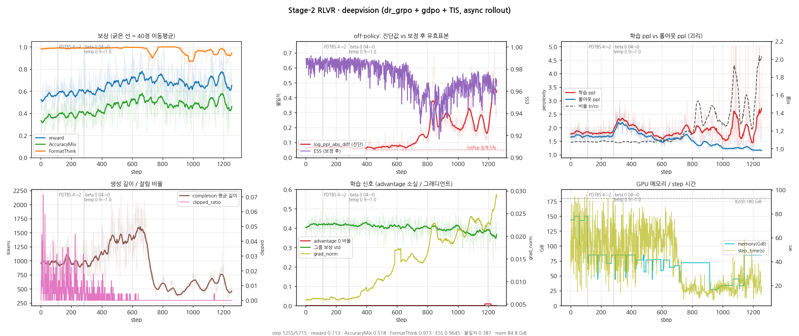
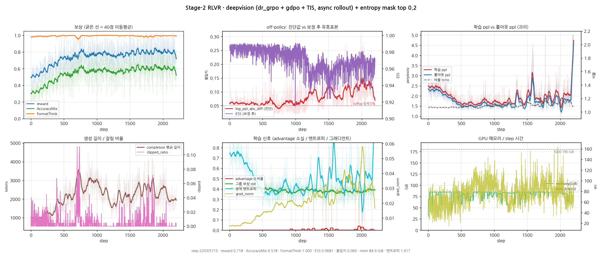

# K-BDS 의료 멀티모달 교차추론 — 학습 파이프라인

계획서(`plan.hwp`) 기반, **ms-swift**로 4단계 파이프라인을 KISTI Slurm 클러스터에 맞춰 구성:
**① 콜드스타트 SFT → ② 범용 RLVR/GRPO → ③ 의료 특화 RL(RaR) → ④ 평가**.

> 이 문서는 **현황·요약·진입점**입니다. 상세 기록은 [문서 지도](#문서-지도) 참조.
> 계정 이식·인수인계 → [`HANDOFF.md`](HANDOFF.md)

---

## 현황 (2026-08-16)

**지금 위치**: **B200 deepvision 2차 실행 개시** — 1차가 step ~700 부터 **엔트로피 붕괴**로 무너져
(롤아웃 ppl 1.70→1.14, 길이 1344→498, `log_ppl_abs_diff` 0.067→0.380) step 1268 에서 정지하고,
**`top_entropy_quantile=0.2`(엔트로피 마스크) 하나만 켜서 step 0 부터 재시작**했다(08-16 20:11).
결정적 발견: **`clip_ratio` 가 1,280 step 전부 0 — `epsilon`·`epsilon_high` 는 `num_iterations=1` 때문에 죽은 인자다.**
DAPO Clip-Higher 는 이 설정에서 아무 일도 하지 않는다. → [B200 1 epoch 본실행](#b200-1-epoch-본실행-2026-08-15--최신-갱신-08-16-step-1255)

<details>
<summary>이전 현황 (2026-08-14, KISTI 기준)</summary>

**지금 위치**: **Stage-2 도메인 전문가 3종 본실행 제출 완료** — job **75394**(deepvision) / **75395**(mmk12) / **75396**(pmcvqa), 각 1,500 step · 118h.
붕괴 재현은 **포기**했다(28/28 동일 조건 재현 실패 = 상태 의존 저확률 사건). 대신 **붕괴가 증폭된 경로를 끊는 쪽**으로 방향을 틀었고,
DeepSeek-V4 구조를 따라 **혼합 학습 → 도메인별 전문가 3분할**로 재설계했다.
**다음 임계경로**: 전문가 3종 완주 → 어댑터 통합 → **Stage-3 본실행**(계획서 핵심 산출물, 미시작).

> ✅ **2026-08-13 스모크 PASS (job 75327, deepvision 5 step)** — 네 항목 전부 통과, 오류 0. → [상세](#8-gpu-스모크-2026-08-13--job-75327)
> 배선은 그 전에 유휴 `debug-1gpu`(A100-40GB)에서 먼저 봤다(job 75334). → [상세](#1-gpu-배선-검증-2026-08-13--job-75334)

**살릴 것과 버릴 것이 분명히 갈린다.**

- ✅ **step 850 이 최고점** — 홀드아웃 **51.52%**, init 대비 **+8.18pp(p<0.0001)**, step400 대비 **+2.48pp(p=0.020)**.
  **붕괴 직전까지 정상적으로 개선되고 있었다.** 체크포인트는 스냅샷으로 확보했다.
- ✅ **"step 400 이후 정체"는 오독이었다** — 300 step 간격(400→700)에서는 +1.35pp 로 미검출이지만
  **450 step 간격(400→850)에서는 +2.48pp, p=0.020 으로 검출된다.** 정체가 아니라 분해능 부족이었다.
- 🚨 **실패한 것은 학습이 아니라 안정성이다.** 3단계 사슬 — **① 형식 붕괴(step 899~904) → ② 길이 폭주(905~) → ③ 회복 실패**.
  ①의 **개시 원인은 아직 미규명**이고, 이것이 유일하게 남은 미해결 항목이다.
- ✅ **감시 장치 구현·검증 완료** — [`scripts/watch_format_collapse.py`](scripts/watch_format_collapse.py).
  과거 로그 재생 결과 **step 901 발화 · 1,047 step 전 구간 오경보 0회 · 실제 발견보다 146 step(13.5h) 빠름.**
  73924 는 붕괴 후 13h35m(**109 GPU-h**)을 더 돌았다 — 볼 장치가 없었기 때문이다.
- 🚨 **의료(pmcvqa)는 여섯 지점 모두 무변화** — init 대비 +0.25 / −0.75 / −0.25 / +1.25 / +0.75pp, 전부 p>0.5.
  붕괴와 무관하게 성립하는 결론이고, **Stage-3 의 존재 이유를 굳힌다.**

> 🚨 **2026-08-06 — 이 문서에 있던 붕괴 원인 서술 3건을 정정했다.** ms-swift 소스를 직접 판독한 결과다.
> ① ~~"유력한 근인 = `overlong_filter`"~~ → **인과가 반대**였다. 형식이 먼저 무너지고 길이는 **10 step 뒤**에 따라온다.
>   `overlong_filter` 는 붕괴를 **일으킨** 것이 아니라 **회복을 막은** 3단계 요인이다.
> ② ~~"GDPO 가 형식 복원력을 2.3배 증폭"~~ → **철회.** 실제 재가중은 **±15%** 로 무시할 수준. GDPO 는 대체로 무죄다.
> ③ ~~"`max_grad_norm` 은 grad_norm 최대 0.17 이라 한 번도 작동 안 함"~~ → **전 구간 최대는 10.02(step 938)**,
>   클리핑은 **3회 발동**했다(붕괴 이후). 개시 인과는 바뀌지 않는다.
> → 근거·계산 전량 = [사후분석 rev.2](docs/stage2_run73924_postmortem.md)

| 단계 | 상태 | 핵심 결과 |
|---|---|---|
| **① 콜드스타트 SFT** | ✅ 완료 | v3 가 **형식 천장 완파**: 생성 `format_think` v2 **0.185**→v3 **0.909**(5배), 홀드아웃 acc **0.295→0.348**(+18%). `sft_mixed_merged` = Stage-2 init → [상세](docs/stage1_coldstart.md) |
| **② 범용 RLVR** | 🔄 **재설계 완료 · 전문가 3종 큐 대기** · ✅step 850 최고점 확보 | 구 혼합 74,787 로 step 850 에서 **init 대비 +8.18pp(p<0.0001)** 까지 갔으나 ~900 형식 붕괴. 재현 실패(28/28) → **도메인 3분할 재설계**로 전환, 배선 검증 PASS(job 75334) → [🆕재설계](docs/stage2_redesign_2026.md) · [🆕V4채택](docs/deepseek_v4_pipeline_adoption.md) · [🆕서베이](docs/rlvr_survey_2026.md) · [🚨사후분석](docs/stage2_run73924_postmortem.md) · [실행현황](#stage-2-본실행-현황) |
| **③ 의료 RL (RaR)** | ⏳ 배선완료·대기 | 루브릭·judge(27B)·e2e 스모크 PASS(유닛 29/29) → [상세](docs/stage3_and_eval.md) |
| **④ 평가** | 🔄 기준선 확보 | HealthBench Hard(n=1000): base **0.229** / v2 콜드스타트 **0.224** — v3 미측정 → [상세](docs/stage3_and_eval.md) |

> ⚠️ **예산 (2026-08-14 갱신)**: 5,000 노드시간 중 **874 집행 · 잔여 4,126**.
> 전문가 3종(1,500 step × 3)이 **2,130 = 잔여의 52%**, **Stage-3·평가 유보 1,996**. 구 계정 k252a01 은 83% 소진 후 이관.
> (2,130 은 스모크 실측 **213 s/it** 기준이다. 구 가정 330 s/it 은 혼합·`num_gen=4` 때 값이라 35% 과대추정이었다 →
> [8 GPU 스모크](#8-gpu-스모크-2026-08-13--job-75327))
>
> 🚨 **2026-08-02 정정 — "1 epoch" 표기 오류**: MAX_STEPS=2,337 을 1 epoch 으로 적어 왔으나 실제로는 **0.25 epoch** 이다.
> GRPO 에서 `per_device_train_batch_size` 는 프롬프트가 아니라 completion 을 세므로 **프롬프트/step = 32 ÷ num_generations(4) = 8**,
> **1 epoch = 74,787 ÷ 8 = 9,348 step**(로그의 `epoch=0.067` 이 이를 확증). 확장셋의 **약 75%는 미노출**로 남으며,
> 진짜 1 epoch 은 ≈6,694 노드시간 = **예산의 134%** 로 실행 불가. 집행 비용 자체는 step 기준이라 계획대로다.
> → [중간 점검 보고서](docs/stage2_run73924_progress.md) §3

> 🚨 **환경 (2026-07-27~)**: 클러스터 **apptainer 파손**(`libsubid.so.3` 부재 + GLIBC_2.28 요구 vs 호스트 2.17) → `singularity exec` 불가.
> **이미지는 정상**이라 재빌드는 무의미(빌드도 불가). **우회 = `ENV_MODE=loader` 가 기본값**이라 기존 스크립트가 그대로 동작
> (검증: 8GPU GRPO 완주, job 72832). apptainer 복구 시 `ENV_MODE=container` 로 원복. → [`HANDOFF.md`](HANDOFF.md) §3 · `runc.sh` 주석

</details>

### B200 1 epoch 본실행 (2026-08-15 ~, 최신 갱신 08-16 step 1255)

KISTI 큐 대기가 길어져 **Jukyung-Yadok B200 8장**으로 옮겼다. 실행 절차·함정은 [`CLAUDE.md`](CLAUDE.md) §1 · [`b200/`](b200/).



> 곡선 갱신 (3 명령, 학습 중에도 가능):
> ```
> bash b200/pull_file.sh train_deepvision_ep1_gdpo_async_tis.log /tmp/train.log
> python3 b200/parse_log.py /tmp/train.log b200/metrics_deepvision.csv
> python3 b200/plot_progress.py
> ```

**설정** (이전 실행에서 바꾼 것을 굵게)

| | 값 | 근거 |
|---|---|---|
| loss / advantage | `dr_grpo` + `scale_rewards=gdpo` | 상수 정규화로 길이 편향 제거 + 보상별 z-score |
| **off-policy 보정** | **`rollout_importance_sampling_mode=token_truncate`, threshold 2.0** | async 롤아웃의 1-라운드 정책 지연을 IS 로 되돌린다 |
| 롤아웃 | `vllm_mode=server`(GPU 7) + `async_generate=true` | 순차 롤아웃은 GPU 절반이 절반 시간 유휴(실측) |
| 배치 | PDTBS 2 × ACCUM 8 × world 7 = **112**, num_gen 16 | PDTBS 4 는 이득 없음(아래 ③) |
| **KL / 온도** | **`beta=0`**(0.04 에서) · **`temperature=1.0`**(0.9 에서) | step 284 에서 변경 |
| 총 step | 40,000 ÷ 7 = **5,715** (1 epoch) | 완료 예상 08-22 |

**관측 (step 1255 / 5,715 = 22%, 200 step 구간 평균)**

| 구간 | reward | AccuracyMix | FormatThink | 길이 | `ppl_abs_diff` | ESS | 학습/롤아웃 ppl |
|---|---|---|---|---|---|---|---|
| 1~199 | 0.565 | 0.371 | 0.986 | 988 | 0.067 | 0.985 | 1.80 / 1.67 |
| 400~599 | 0.666 | 0.468 | **0.992** | **1344** | 0.069 | 0.980 | 1.84 / 1.70 |
| 600~799 | **0.723** | **0.528** | 0.975 | 1076 | 0.101 | 0.965 | 1.76 / 1.59 |
| 800~999 | 0.666 | 0.474 | 0.961 | 498 | 0.257 | 0.952 | 1.85 / 1.37 |
| 1100~1199 | 0.719 | 0.527 | 0.961 | 681 | 0.209 | 0.967 | 1.55 / 1.23 |
| 1200~1255 | 0.652 | 0.465 | 0.936 | 498 | **0.380** | 0.965 | 1.81 / **1.14** |

극값: `FormatThink` 최저 **0.556**(step 989) · `ESS` 최저 **0.917**(877) · `ppl_abs_diff` 최대 **0.742**(1241).

> **`frac_reward_zero_std` 는 여기서 근거로 쓸 수 없다.** 최대 0.357 이 찍히긴 하지만 그건 단일 step 이고,
> 0 이 아닌 step 은 **1197 에서 처음** 나타나 최근 100 step 중 **1%**(평균 0.0036)에 그친다.
> 게다가 `dynamic_sample=true`·`max_resample_times=3`(DAPO Dynamic Sampling)이 켜져 있어
> **보상 std 가 0 인 그룹은 이미 걸러지고 재샘플링된다** — 이 지표가 낮은 건 필터가 일하고 있다는 뜻이지
> advantage 가 살아 있다는 뜻이 아니다. 어느 방향으로도 증거가 되지 않는다.

**🚨 step ~700 부터 학습·추론 분포가 벌어지고 있다 — 진행 중이고, 회복되지 않았다.**

- **롤아웃 ppl 이 단조 하락**한다: 1.67 → **1.14**. 생성 분포가 뾰족해지는 것(엔트로피 붕괴)이고,
  `beta=0`(참조 모델 KL 제약 없음)이라 이를 되당길 항이 손실에 없다.
- **학습 ppl 은 1.8 근처를 유지**한다 → 둘의 비율이 1.08 → **1.59**. 같은 가중치에서 출발한 두 모델이
  서로 다른 분포로 굳어가고 있다는 뜻이다. `ppl_abs_diff` 0.067 → 0.380 = **IcePop 임계 5%의 7.6배**.
- **길이가 1344 → 498 로 무너진 뒤 돌아오지 않는다.** `SoftOverlong` 페널티는 전 구간 0 이므로
  길이 제약 때문이 아니라 **짧은 답변이 보상에서 유리해서** 정책이 그쪽으로 이동한 것이다
  (step 760~800 구간: 길이 422~567 인데 reward 0.78~0.83).
- **AccuracyMix 는 step 600~799 의 0.528 이후 450 step 동안 더 오르지 않았다**(0.465~0.527 등락).
  구 KISTI run 73924 가 step 850 을 최고점으로 무너진 것과 **같은 자리**다.
- TIS 는 아직 붙들고 있다(`ESS` 0.96, `clipped_frac` 0.9%). 다만 ESS 는 보정 **후** 값이라
  "보정이 감당 중"이지 "괴리가 없다"가 아니다. 판단은 `ppl_abs_diff` 쪽으로 해야 한다.

> ⚠️ **정정 2건.** ① 노드 stdout 8KB 제한 때문에 80 행으로 솎아낸 CSV 만 보고 판단했고, 솎인 사이에
> 최저점이 들어 있었다 — `FormatThink` 최저를 0.674 로 적었으나 실제는 **0.556**(step 989)이다.
> 전 step 파싱(아래 ⑥)으로 바로잡았다.
> ② `frac_reward_zero_std` 를 "전 구간 0 → 실제 최대 0.357" 로 정정하면서 **advantage 소실이 있었다고
> 강조한 것은 과했다.** 위에 적은 대로 이 지표는 어느 쪽 근거도 되지 못한다.

**확정한 것**

1. **TIS 가 실제로 걸린다** — `is_weight_mean` 0.996 · `clipped_frac` 0.2% · `ess` 0.985.
   rollout logprob 은 원래도 수집되고 있었으므로(off-policy 지표가 찍히는 게 증거) 추가 비용이 없다.
2. **ms-swift 4.5.0 업그레이드는 이득이 없다** — mismatch 관련 인자가 4.1.3 과 **동일**하다(인자 diff 로 확인).
   4.5.0 에만 있는 17개는 전부 다른 축이다(`fipo_*`=Future-KL loss, `rlsd_*`·`sdar_*`=distillation, `min_p`, `gym_env`).
3. **PDTBS 4 는 무익하다** — `step_time` 은 48→38 s 로 줄지만 wall clock 은 119 vs **122** s/step 로 같고
   메모리만 85→150 GiB 를 쓴다. 병목이 step 밖(롤아웃 대기·통신)에 있다는 뜻이다 → 2×8 로 되돌렸다.
4. **job 교체마다 10~30분씩 잃고 있었다** — 앞 job 이 killed 되면 그 rollout 의 소켓이 **TIME_WAIT** 로 남고,
   그 상태에서 vLLM 은 실패하지 않고 **조용히 8001 로 올라간다.** health check 는 8000 만 보므로 서버가
   53초 만에 멀쩡히 떠 있는데도 타임아웃으로 죽는다. 실측 대조: 실패 job #10 = 8001, 성공 job #11 = 8000.
   **TIME_WAIT 는 "연결이 되는가"로 감지할 수 없다**(연결은 실패하고 bind 만 실패) — 포트를 비우려는
   접근이 세 번 다 빗나간 이유다. 로그의 `Uvicorn running on ...:<포트>` 를 읽어 **그 포트를 따라가는** 것으로 해결했다.
   job #12 가 8001 에 뜬 채로 학습에 붙는 것을 확인했다.
5. **실패 시 rollout 로그 경로가 틀려 있었다** — `rollout_${ARM}.log` 로 찍고 실제 파일은 `rollout_${RUNTAG}.log` 였다.
   ④의 진단이 세 번 빗나간 직접 원인이다. 로그가 제때 보였으면 `Uvicorn running on ...:8001` 한 줄로 끝났을 문제다.
6. **`/me/data/file` 로 GPU 세션 없이 `$ORCH_HOME` 파일을 읽을 수 있다** (2026-08-16) — 학습이 8장을 다 잡고 있으면
   세션이 `session create failed` 로 막혀 진행 확인을 job 교체 틈에서만 할 수 있었는데, 이 API 는 세션과 무관하다.
   exec stdout 8KB 절단도 없어서 **4.7 MB 로그를 통째로 받아 전 step 을 파싱**한다(80 행 → 1,255 행).
   위 정정 두 건이 이것으로 드러났다. `/me/data?path=<dir>` 는 목록, `/me/data/file?path=<file>` 이 내용
   (`download`·`cat` 는 404). → [`b200/pull_file.sh`](b200/pull_file.sh) · [`b200/parse_log.py`](b200/parse_log.py)
7. **🚨 clip 은 1,280 step 전부 미발동이었다 — `epsilon`·`epsilon_high` 는 이 설정에서 죽은 인자다.**
   `clip_ratio/{low,high,region}_mean` 합계가 정확히 **0**이다. 원인은 `num_iterations=1`:
   rollout 배치당 업데이트가 1번이면 π_θ = π_old 이고, `grpo_trainer.py:1150` 이 그 최적화를 명시한다
   (`# old_per_token_logps == per_token_logps, so we can skip it's computation`) → `ratio ≡ 1` → clip 범위 한복판.
   **DAPO Clip-Higher 를 적용해도 아무 일도 일어나지 않는다.** 죽은 인자를 바꾸면 개입했다고 착각하게 되는 것이
   더 큰 문제다. (살리려면 `num_iterations>1` 이 필요한데 그건 off-policy 를 일부러 키우는 것이라 방향이 반대다.)
8. **ms-swift 4.1.3 에서 엔트로피 붕괴에 쓸 수 있는 레버는 둘뿐이다** — `top_entropy_quantile` 과 `beta`.
   entropy bonus 는 인자 자체가 없고, clip 계열은 ⑦ 때문에 무효다.
   최근 문헌도 여기 맞는다: [clip-low/clip-high 분석](https://arxiv.org/html/2509.26114v1)은 clip-high 완화가
   **감소력을 약화시킬 뿐**이라 하고(능동적 상승은 ε_low↓), [OPEFO(ACL 2026 Findings)](https://arxiv.org/abs/2605.11491)는
   entropy regularization·clipping heuristic **둘 다 부족**하다며 gradient rescaling 을 제안하는데 ms-swift 에 없다.
   [SFT 과훈련 논문](https://arxiv.org/html/2606.18487)은 SFT 깊이가 붕괴를 예측한다고 하지만 우리 SFT 는
   **2 epoch·298 step**(val 이 epoch1 이후 평탄해 4→2 로 줄인 값)이라 얕은 쪽이다.

9. **🚨 `clipped_frac` 은 붕괴 경보로 쓸 수 없다 — 발산이 깊어질 때 오히려 내려간다** (2026-08-18 재분석).
   1차 로그를 100 step bin 으로 다시 보니 TIS 절단 비율이 붕괴와 **비단조**다:
   0.0057(600) → 0.0123(700) → **0.0148(800, 최대)** → 0.0111(900) → 0.0091(1200).
   같은 구간에서 `tr_ppl/ro_ppl` 은 1.098 → 1.162 → 1.348 → **208.5** → 97.2 로 발산했다(`tr_ppl` 이 280 까지 튄다).
   원인: 롤아웃 정책도 같이 뾰족해져(`ro_ppl` 1.43→1.17) 두 분포가 *둘 다 좁아진 채 서로 다른* 상태가 되면
   토큰별 비율이 임계 2.0 을 넘는 경우가 줄어든다 — **괴리는 커졌는데 지표는 완화된 것처럼 보인다.**
   붕괴를 단조로 따라가는 건 `tr_ppl/ro_ppl` · `log_ppl_abs_diff`(0.076→0.127→0.264→0.380) · `ess`(0.974→0.946) 셋이다.
   → 경보는 이 셋으로 건다: [`b200/watch_mismatch.sh`](b200/watch_mismatch.sh) (임계 1.15 / 0.12 / 0.965, 전부 1차 bin 700 = 붕괴 시작점에서 뽑음 — 단 `ess` 임계는 ⑪ 에서 보조지표로 강등했다).
10. **TIS 는 1차에도 켜져 있었고 붕괴를 막지 못했다.** RUNTAG 가 `_tis` 였다
   (`rollout_importance_sampling_mode=token_truncate`, threshold 2.0). 즉 TIS 는 괴리를 **줄이는** 장치가 아니라
   괴리가 생겼을 때 업데이트 분산을 **자르는** 장치다 — 엔트로피 마스크가 "엔트로피를 더하는 게 아니라 빼는 힘을
   약화시키는" 것과 같은 구도이고, 둘 다 **원인을 못 고친다.** 2차에서 괴리가 작은 이유는 TIS 가 잘 들어서가 아니라
   마스크가 정책을 안 뾰족하게 만들어 **애초에 멀어지지 않기 때문**이다(step 870 기준 `clipped_frac` 0.0051,
   `is_weight` 0.990 — 안전망에 걸리는 게 거의 없다).

11. **🚨 `ess` 도 단독 경보로 쓸 수 없다 — 건강한 2차가 붕괴한 1차보다 낮게 찍혔다** (2026-08-19).
   2차 step 1201 에서 `ess` 가 0.9604 로 임계 0.965 를 깨 경보가 울렸으나, 같은 시점의 나머지는 전부 정상이었다:
   `tr_ppl/ro_ppl` **1.114**(1차 붕괴 시 208.5) · `fmt` **1.000**(1차 0.957 → 0.936) ·
   `reward` 0.783 · `acc` 0.583 **평탄** · `zero_std` 0.
   결정적으로 1차의 `ess` 는 붕괴가 다 진행된 bin 1000/1100/1200 에서 0.9646/0.9665/0.9645 였다 —
   **붕괴해도 0.965 근처에 머문다.** 즉 이 지표는 두 상태를 구분하지 못한다(⑨ 의 `clipped_frac` 과 같은 부류).
   같이 나타난 `len` 하락(3070 → 1906)도 정확도가 그대로라 "같은 정답을 더 짧게" 쪽이다 —
   1차의 길이 붕괴는 `fmt` 와 보상이 **함께** 무너졌다는 점에서 다르다.
   → 단독 트리거는 1차에서 단조였던 `tr/ro`(>1.15) · `fmt`(<0.98) · `len`(<1200) 셋으로 좁히고,
   `ess`·`ppl_abs_diff`·`clipped_frac` 은 **2개 이상 겹칠 때만** 건다: [`b200/watch_mismatch.sh`](b200/watch_mismatch.sh)

12. **🚨 지표는 평균이 아니라 중앙값으로 봐야 한다 — 한 step 이 200 step 평균을 망친다** (2026-08-21).
   2차 bin 1600 의 `tr_ppl/ro_ppl` **평균**은 321.5 로 1차 붕괴처럼 보였다. 실제로는 2,141 step 중
   1.5 를 넘은 게 **단 2개**였고, 그중 `step 1775`(`tr_ppl`=119,300) 하나가 평균을 통째로 오염시킨 것이다.
   같은 구간 **중앙값은 1.079** 로 평탄하다. 경보에 평균을 쓰면 이런 일시적 수치 이탈마다 오탐이 난다.
   1차·2차의 100 step **중앙값** 궤적을 겹쳐 보면 실제로 분리되는 지표는 둘뿐이다:
   `tr/ro`(1차 1.152~1.545 vs 2차 1.046~1.121) · `len`(1차 482~687 vs 2차 940~2974).
   `fmt`(0.946~1.000 vs 0.987~1.000) · `ess`(0.947~0.968 vs 0.953~0.986) ·
   `clipped_frac`(0.0084~0.0148 vs 0.0022~0.0137) 은 **구간이 겹쳐 단독 판별이 불가능**하다.
   → 단독 트리거는 `tr/ro`>1.30 · `len`<900 · `fmt`<0.97, 나머지는 2개 이상 겹칠 때만.
   1차 로그로 역검증하면 붕괴 시작(step 700) 후 **step 740 에 발화**한다(지연 40 step ≈ 2.2 시간).

#### 2차 실행 — 엔트로피 마스크 (2026-08-16 20:11 시작, step 0 부터)

1차의 붕괴 원인이 "엔트로피를 붙드는 장치가 하나도 없었던 것"으로 좁혀져, 유일하게 동작하는 레버 하나만 켜고 다시 시작했다.
1268 에서 이어받지 않고 **처음부터** 간다 — 이미 벌어진 상태에서 출발하면 개입이 먼저 손상을 되돌려야 해서,
안 들었을 때 "레버가 무효인지 출발점이 나빴는지"를 구분할 수 없다.

| | 1차 (`…_tis`) | 2차 (`…_tis_entmask`) |
|---|---|---|
| `top_entropy_quantile` | 1.0 (마스크 없음) | **0.2** — 상위 20% 고엔트로피 토큰에만 손실 |
| `log_entropy` | false | **true** — 엔트로피 직접 측정 |
| `epsilon_high` / `beta` | None / 0 | **그대로** (⑦ 때문에 무효 / 다음 카드) |
| init | `sft_mixed_merged` | 동일 |

베이스 모델부터 RL 하는 안은 **이미 절제실험으로 반증**됐다(job 59946/59970): `base→RL` 200 step 이 +0.03 인 반면
콜드스타트 경로는 +0.16 이고, 베이스에서는 `FormatThink` 가 100 step 내내 ~0 에 정체한다 →
[Stage-1 콜드스타트](docs/stage1_coldstart.md) §절제. SFT `checkpoint-149`(1 epoch)를 init 으로 쓰는 안은
살아 있지만 그 지점의 **생성 기반 지표를 측정한 적이 없어** 보류한다(형식이 epoch 2 에서 완성됐을 수 있다).

> ⚠️ **부작용을 지켜봐야 한다**: `dr_grpo` 의 분모는 `batch_size × max_completion_length` 라 **상수**이고
> (`grpo_trainer.py:1252`) 마스크는 분자만 줄이므로(`:1223`) **실효 그래디언트가 작아진다.**
> 배수는 토큰별 손실 기여가 균등하지 않아 미지수 → 추측으로 lr 을 올리지 않고 `grad_norm` 을 보고 정한다.
> 기준선은 1차 초반의 **0.0062**(step 1~199 평균). 필요하면 `LR` 환경변수로 조정한다.

step 1 확인: `entropy/threshold` **1.618** 이 새로 찍힌다(마스크 동작 증거) · `ppl_ratio` 1.052 · `ess` 0.9869.

**부작용 실측 (step 1~4)** — 우려했던 그래디언트 손실은 오지 않았다.

| | 1차(마스크 없음) step 1~8 | 2차(q=0.2) step 1~4 |
|---|---|---|
| `grad_norm` 평균 | 0.00655 | **0.0043** (≈0.66×) |
| `rollout_ppl` | 1.588 → 1.510 (내려감) | 2.148 → **2.804** (올라감) |

분모가 상수라 마스크가 80% 토큰을 죽이면 그래디언트도 0.2배로 줄 줄 알았는데 **0.66배에 그쳤다.**
이건 "고엔트로피 소수 토큰이 그래디언트의 대부분을 진다"는 주장의 직접 증거다 —
버린 80% 는 애초에 기여가 거의 없었다. **`LR` 은 1e-5 유지.**
`rollout_ppl` 이 초반부터 오르는 것도 1차와 반대 방향이라 일단 의도대로다(수백 step 은 봐야 판정).

> **32비트 학습은 이 환경에서 닫혀 있다.** 최근 레포트들이 말하는 fp32 는 logits/logprob 계산만 올리는 것인데
> ms-swift 는 4.1.3·4.5.0 모두 그 스위치가 없다(fp32 는 reward 텐서에만 쓴다). `torch_dtype=float32` 로
> 통째 올리는 건 메모리 2배라 180 GiB 에 안 들어간다. 이 축 대신 **IS 보정**으로 간다.

**최종 곡선 (step 2,203 에서 중지, 2026-08-21) — 1 epoch 5,715 의 38.5%**

1차가 붕괴했던 step 700~1255 구간을 **지표가 꺾이지 않은 채 통과**했다. 같은 bin 중앙값 비교:
`tr_ppl/ro_ppl` 1.10 (1차 1.15→1.55) · `fmt` 0.999 (1차 0.946) · `len` 1,918 (1차 500) ·
`reward` 0.78→0.81 (1차 0.65). 실효 처리율은 **214.5 s/step**(14400 초 job 기준).

**중지 이유는 자원 종료이지 붕괴가 아니다.** 2026-08-21 09:29 에 체인을 끊고 마지막 job 을 완주시켰다 — 16 job · 2일 16시간 · 최종 저장 `checkpoint-2192`(도달 2,203, 마지막 저장 이후 11 step 은 버려짐).



> 갱신 (3 명령, 학습 중에도 가능 — 세션 불필요):
> ```
> bash b200/pull_file.sh train_deepvision_ep1_gdpo_async_tis_entmask.log /tmp/t2.log
> python3 b200/parse_log.py /tmp/t2.log b200/metrics_deepvision_entmask.csv
> python3 b200/plot_progress.py b200/metrics_deepvision_entmask.csv b200/progress_deepvision_entmask.png
> ```

### Stage-2 본실행 현황

**현재 실행 — 도메인 전문가 3종 (2026-08-14 제출, 대기 중)**

| job | arm | 데이터 | 노출 | 출력 |
|---|---|---|---|---|
| **75394** | deepvision | 40,000 | 6,000 프롬프트 = **0.15 ep** | `expert_deepvision_0814-0812` |
| **75395** | mmk12 | 15,204 | 6,000 = **0.40 ep** | `expert_mmk12_0814-0812` |
| **75396** | pmcvqa | 19,583 | 6,000 = **0.31 ep** | `expert_pmcvqa_0814-0812` |

공통: `RECIPE=stable` · `NUM_GEN=8` · `MAX_STEPS=1500` · `LORA_DROPOUT=0` · `WATCHDOG=1` · init `sft_mixed_merged` · walltime 118h.
89 벽시계h/arm(213 s/it 실측) = **2,130 GPU-h · 잔여 예산의 52%**.
큐 우선순위 974(경쟁 잡 666) — 예상 시작 **08-17**, 노드가 하루 간격으로 열려 **순차 시작** 가능성이 크다.
설계 근거 → [Stage-2 재설계](#stage-2-재설계-2026-08-13--도메인-전문가-3분할) · 실측 → [8 GPU 스모크](#8-gpu-스모크-2026-08-13--job-75327)

---

**구 실행(참고) — 2026-08-04 10:14 KST 취소 · job 73925 (`gpu-8-002`) · 로그 `logs/grpo_adv_73925.log`**

| 항목 | 값 | 판정 |
|---|---|---|
| 진행 | **1,047 / 2,337 step (44.8%) 에서 취소** = 0.112 epoch | 🚨 **붕괴** |
| 체인 | 73924(TimeLimit, step 787) → 73925 재개 → **73925·73926·73927 전부 CANCELLED** | 취소 완료 |
| 속도 | **~296 s/it** (벽시계, `train_speed`) — 73924 의 318.5 보다 개선 | ✅ |
| 안정성 | OOM · CUDA error · Traceback **0건** — 인프라는 끝까지 무결했다 | ✅ |
| **붕괴** | step ~900 형식 무너짐(Format 0.90→0.06) → step ~1000 토큰 퇴화 | 🚨 [§8](docs/stage2_run73924_progress.md) |


> 🚨 **붕괴는 세 단계였다.** (2026-08-06 정정 — 초판은 2단계로 적었고 ②③의 인과가 반대였다)
> **① step ~900 — 형식만 무너진다.** 이 시점 롤아웃은 여전히 정상 추론을 한다.
> 다만 `</think><answer>14</answer>` 대신 `Answer: 14` 로 끝낸다. 정확도 보상이 `<answer>` 태그로
> 답을 뽑으므로, 태그를 잃으면 **정확도까지 0** 이 된다(Format=0 롤아웃의 정확도 0.02~0.26 vs 0.46~0.50).
> 여기서 정방향 되먹임이 걸린다 — 형식 이탈 → 점수 0 → advantage 가 "정답이냐"가 아니라 "형식을 지켰냐"로
> 지배됨 → 업데이트 확대(grad_norm 5배·KL 3배) → 더 이탈 → 절벽. 넘어간 뒤엔 90%가 0점이라
> `reward_std` 가 0.074 로 주저앉아 **되돌아올 힘이 없다.**
>
> **② step 905~ — 길이 폭주.** `<answer>` 종료 태그를 잃자 생성이 **stop 조건을 잃고** 상한까지 달린다.
> 길이 1,376 → 3,010 토큰, 절단률 8% → 35%.
> ⚠️ **길이는 원인이 아니라 결과다.** 형식 붕괴(899~904) 시점의 길이·절단률은 완전히 정상이었고
> (629~1,465 토큰, clip 0.016~0.078), 폭주는 **10 step 뒤**에 시작한다. 초판은 이 순서를 반대로 적었다.
>
> **③ step ~1000 이후 — 회복 실패·토큰 퇴화.** `AAAA…` 4만 자, `<think>` 태그 1,497회 같은 출력이 나온다.
> **추론이 길어서 잘린 게 아니라 추론이 없다** — 토큰 상한을 늘려도 소용없다.
> 여기서 **`overlong_filter=True`** 가 작동한다 — ms-swift 는 잘린 completion 을 `completion_mask` 에서
> 빼는데 그 마스크가 **KL 계산에도 그대로 쓰인다**(`grpo_trainer.py:1132`, KL 은 1140행).
> 절단이 늘수록 손실·KL 앵커 양쪽에서 면제되는 샘플이 늘어 **되돌아올 힘이 사라진다.**
> 부작용으로 **KL 계측 자체가 둔해진다** — step 910~949 의 KL 하락(0.081→0.068)은 개선이 아니라 계측 실패다.
>
> **기각된 가설**: `num_generations=4` 부족(→ `frac_reward_zero_std` 평균 **0.0106**, 그룹은 건강했다) ·
> 형식 보상 가중치 부족(→ 반대로 정확도가 형식에 **결합**돼 있었다) · lr 급변(→ cosine 매끄럽게 감쇠) ·
> 그래디언트 폭발(→ 개시 구간 step 899~904 의 grad_norm 0.027~0.175 로 정상. 단 **전 구간 최대는 10.02 @ step 938**
> 이라 클리핑은 붕괴 **이후** 3회 발동했다 — 초판의 "최대 0.17, 한 번도 작동 안 함"은 **틀렸다**) ·
> **`scale_rewards=gdpo`**(→ 소스 판독 결과 형식 재가중이 **±15%** 뿐. `none` 이어도 같은 병리가 나온다).

> ⚠️ **속도는 두 종류가 있고 섞으면 안 된다.** `step_time` 은 **147 s/it** 이지만 이건 학습 스텝만이다.
> vLLM 롤아웃 생성·sleep/wake·재샘플링·체크포인트가 그 밖에 있어 **벽시계는 294 s/it** — 약 2배다.
> 일정·예산 계산에는 반드시 **`train_speed` 쪽**을 쓸 것(§4 의 "오버헤드 50%" 가 이 차이다).
>
> ⚠️ 재개 때마다 출력 디렉터리가 새로 생긴다 — 73924 `v0-20260731-094532`, 73925 **`v1-20260803-074645`**.
> 앞으로의 체크포인트는 v1 아래다. TimeLimit 컷은 마지막 저장(750) 이후 **37 step 을 버린다**(save_steps=50 구조상 정상).

**구간 대조 (1~100 step 평균 → 최근 100 step 평균)** — `scripts/plot_train_curves.py` 출력 그대로

⚠️ **"최근 100 step"은 붕괴 구간(948~1,047)이다.** 정상 구간과의 대조가 아니라 **붕괴의 크기**를 보는 표다.

| 지표 | 초반 | 최근(붕괴 후) | 변화 |
|---|---:|---:|---:|
| reward | 0.6019 | 0.3924 | **−34.8%** |
| rewards/AccuracyMix | 0.4248 | 0.3370 | **−20.7%** |
| **rewards/FormatThink** | 0.9461 | **0.4562** | 🚨 **−51.8%** |
| rewards/SoftOverlong | −0.0606 | −0.1794 | −196% |
| **kl** | 0.0036 | **0.2392** | 🚨 **+6,512%** |
| entropy/mean | 0.5377 | 0.4425 | −17.7% (최저 0.09) |
| completions/mean_length | 1,127 | 1,936 | **+71.8%** |
| completions/clipped_ratio | 4.9% | 16.3% | **+230%** |
| reward_std | 0.4951 | 0.3791 | −23.4% (최저 0.074) |
| frac_reward_zero_std | 0.0044 | 0.0000 | 그룹은 끝까지 건강했다 |

> ✅ **step 850 까지는 정상이었다.** 200~500 구간의 길이 인플레이션(길이 1,127→1,660·클리핑 4.9→9.8%)은
> 700 step 대에 되돌아왔고, 850~874 구간의 퇴화율은 **0.0%** 였다.
>
> 🔍 **중간 AccuracyMix 상승의 상당 부분은 실력이 아니라 길이 구성이었다.** 장문(SoftOverlong≠0) completion 은
> 정답률이 **15.1%** 로 비장문 **44.2%** 의 3분의 1이다(deepvision, −29.1pp). 그 비중이 줄면 실력이 그대로여도 평균은 오른다.
> → [보고서 §6-c](docs/stage2_run73924_progress.md) · 재현 `python3 scripts/train_source_trend.py --until 750`
>
> ⚠️ **다만 이 길이 문제가 붕괴의 **방아쇠**는 아니었다** (2026-08-06 정정).
> 초판은 "절단률이 오르자 앵커가 빠져 정책이 무너졌다"고 적었으나, 실측 순서는 반대다 —
> 형식이 먼저 무너지고 길이가 따라 폭주했다. `overlong_filter` 는 그 뒤 **회복을 막는** 쪽으로 작동했다.


**홀드아웃 전량 추세 (n=1,772)** — 확장 홀드아웃 **전량**, greedy, 전 모델 **동일 문항**

| (%) | **init** | 400 | 500 | 600 | 700 | **850** | **900** | 1000 |
|---|---:|---:|---:|---:|---:|---:|---:|---:|
| **전체** (n=1,772) | **43.34** | 49.04 | 49.55 | 49.32 | 50.40 | **51.52** | **22.63** | 25.56 |
| deepvision 일반 (n=972) | 35.60 | 42.59 | 43.11 | 42.08 | 44.44 | **46.40** | 16.36 | 22.84 |
| mmk12 수학 (n=400) | 48.25 | 56.25 | 58.25 | 59.25 | 56.75 | 57.50 | **50.00** | 49.75 |
| **pmcvqa 의료** (n=400) | 57.25 | 57.50 | 56.50 | 57.00 | 58.50 | 58.00 | **10.50** | 8.00 |
| format | 0.947 | 0.892 | 0.887 | 0.887 | 0.903 | 0.895 | **0.056** | 0.180 |
| 평균 길이 | 1,812 | 2,124 | 2,103 | 2,126 | 2,031 | 2,107 | **2,264** | **7,893** |

**짝지음(McNemar) 판정** — 같은 문항을 두 모델이 푼 것이므로 짝지음이 맞다. 하한 ±9.8pp → **±1.8~2.3pp**

| 비교 | 전체 | deepvision | 수학 | 의료 |
|---|---:|---:|---:|---:|
| init → 400 | **+5.70pp** p<0.0001 ✅ | +7.00 ✅ | +8.00 ✅ | +0.25 ✗ |
| **init → 850** | **+8.18pp** p<0.0001 ✅ | +10.80 ✅ | +9.25 ✅ | +0.75 ✗ |
| 400 → 700 (300 step) | +1.35pp p=0.18 ✗ | +1.85 ✗ | +0.50 ✗ | +1.00 ✗ |
| **400 → 850 (450 step)** | **+2.48pp p=0.020 ✅** | +3.81 p=0.020 ✅ | +1.25 ✗ | +0.50 ✗ |
| **850 → 900 (50 step)** | **−28.89pp** p<0.0001 🚨 | −30.04 | −7.50 | **−47.50** |
| 400 → 1000 | **−23.48pp** p<0.0001 🚨 | −19.75 | −6.50 | **−49.50** |


> ✅ **RL 은 듣는다**: init → 400 **+5.70pp**, init → 850 **+8.18pp**(둘 다 p<0.0001).
> n=300 시절 "+3.67pp, 판정불가"로 남았던 것이 전량 측정에서 확정됐다.
>
> ✅ **"step 400 이후 정체"는 오독이었다.** 300 step 간격(400→700)에서는 +1.35pp 로 미검출이지만
> **450 step 간격(400→850)에서는 +2.48pp, p=0.020 으로 검출된다.** 정체가 아니라 **분해능 부족**이었고,
> 앞서 제시한 95% 구간 [−0.6, +3.3]pp 안에 정확히 들어온다. **붕괴 직전까지 정상적으로 개선되고 있었다.**
>
> 🚨 **step 1000 은 붕괴 이후다** — 400 대비 **−23.48pp**. 손상이 소스별로 극단적으로 다르다:
> 의료 −49.5pp / deepvision −19.8pp / 수학 −6.5pp. 채점 방식 때문이다 — 의료는 `<answer>A</answer>` 가
> 있어야 letter 를 뽑으므로 **letter 층이 0.5835 → 0.0798** 이 된다. 수학은 본문에서 숫자를 잡아내 덜 민감하다.
> 즉 −23pp 는 능력 상실보다 **형식 상실**에 가깝다(실사용에서는 구분이 무의미하다).
>
> 🚨 **의료(pmcvqa)는 여섯 지점 전부 미검출** — +0.25 / −0.75 / −0.25 / +1.25 / +0.75pp, 모두 p>0.5.
> n=100(±9.8pp) 시절엔 "노이즈일 수 있다"였지만 **n=400(±3.5pp)에서도 그대로**다.
> **RL 이 목표 도메인을 올리지 못한다**는 것이 붕괴와 무관하게 성립하고, Stage-3(의료 RaR)의 존재 이유를 굳힌다.
>
> ⚠️ 왼쪽 패널의 **점별 오차막대는 비짝지음**이라 서로 겹친다 — 그걸 보고 "차이 없다"고 읽으면 안 된다.
> 판정축은 가운데·오른쪽 짝지음 패널이다. base(0.2500)는 이 전량 셋에서 재측정하지 않았다(n=300 층화 기준).
> ⚠️ 과거 수치(v3 0.348 등)는 **구 홀드아웃** 기준이라 가로 비교 금지.

📊 **학습 곡선·전체 분석 → [`docs/stage2_run73924_progress.md`](docs/stage2_run73924_progress.md)**
🚨 **붕괴 원인·정정 이력 → [`docs/stage2_run73924_postmortem.md`](docs/stage2_run73924_postmortem.md)** (학습 곡선은 위 §Stage-2 본실행 현황에 있다)

### Stage-2 재설계 (2026-08-13) — 도메인 전문가 3분할

혼합 학습을 접고 **소스별로 전문가를 따로 키운 뒤 통합**한다. 근거·설계 전량 →
[서베이](docs/rlvr_survey_2026.md) · [재설계](docs/stage2_redesign_2026.md) · [DeepSeek-V4 채택](docs/deepseek_v4_pipeline_adoption.md)

```
sft_mixed_merged ─┬→ [E1] deepvision 40,000    시각논리   soft_max 6144
                  ├→ [E2] mmk12      15,204    수학       soft_max 6144
                  └→ [E3] pmcvqa     19,583    의료       soft_max 3072  →(뒤에) medix RaR
```

| 바꾼 것 | 내용 | 왜 |
|---|---|---|
| **도메인 3분할** | `split_stage2_by_source.py` — 이미지 경로 기준, 미분류 시 즉시 실패 | 혼합에서는 도메인별 길이·그룹 예산을 다르게 줄 수 없었다 |
| **정확도/형식 분리** | `<answer>` 태그 없을 때 추론 꼬리에서 letter 복구 | 정확도가 형식에 물려 있어 붕괴가 자기증폭했다 |
| **단계형 FormatThink** | 이진 → `</think>` 까지 냈으면 **0.5** 부분점수 | 붕괴 개시 절벽 **−0.324 → −0.204 (37.1% 완화)**, 정상 구간은 +0.0041 만 이동 |
| **recipe=stable** | `dr_grpo` + `overlong_filter=false` + `scale_rewards=none` + **불일치 계측 on** | `overlong_filter` 는 붕괴를 막지 못하고 **회복을 막았다** |
| **num_generations 4→8** | 전 도메인 8 | 붕괴 개시 시점 정확도 균일률 13.8%→54.2%. **단, 8 이 상한** — 배치가 completion 고정이라 그 이상은 데이터 노출을 깎는다 |
| **lora_dropout=0** | 명시 | RL 로그확률 계산 중에도 dropout 이 살아 있어 π_rollout ≠ π_train 을 스스로 만들고 있었다 |

⚠️ **붕괴 재현은 중단했다.** 28/28 동일 조건에서 재현되지 않았고 선행 KL 램프도 없다 → 결정론적 원인이 아니다.
원인 규명 대신 **증폭 경로 차단**에 예산을 쓴다.

#### 8 GPU 스모크 (2026-08-13 · job 75327)

deepvision 5 step, 33분, **오류 0**. `gpu-8-001` 에 backfill 로 들어갔다.

| 검사 | 결과 |
|---|---|
| **① step time** | **213 s/it** (증분 실측 204/170/240/166/283) — 기존 가정 **330 s/it 대비 35% 빠르다** |
| **② `rollout_correction/*`** | ✅ `chi2_token` **1.6~4.7%** · `ppl_ratio` 1.043~1.084 — IcePop 5% 임계 **아래** |
| **③ `FormatThink`** | ✅ mean 0.953~1.0. 192건 분포 **1.0 95.8% / 0.5 1.0% / 0.0 3.1%** — 부분점수가 실제로 발동한다 |
| **④ `mean_length`** | ✅ 997~1,287 (예산 6144) · `clipped_ratio` 0~4.7% |
| `SoftOverlong` 벌점 | ✅ −0.021~−0.052 — 1 GPU 검증에서 못 봤던 경로가 여기서 밟혔다 |
| 감시자 | ✅ 기동 확인 (`[watch] fmt<0.85`) · 발화 없음 |

🎯 **예상 못 한 수확 — `frac_reward_zero_std` 가 5 step 내내 0.**
혼합 학습에서 0.24→0.33 으로 올라가며 plateau 를 만들던 그 지표가 `num_gen=8` + `dynamic_sample` 로 **소거됐다.**

⚠️ **감시 항목 — `memory(GiB)` 52.7 → 65.2 → 74.1** (80GB 의 93%). 과거 1,047 step 완주 이력이 있어 allocator 평탄화가
예상되지만 본실행 초반에 확인할 것.

**왜 213 s/it 인가**: 배치가 32 completion 고정이라 `num_gen` 을 4→8 로 올리면 **프롬프트가 8→4 로 준다.**
이미지가 절반이라 비전 인코더 작업이 줄고, 같은 프롬프트 8개라 prefix caching 이 듣는다. 계산량이 준 게 아니라 **중복이 는 것**이다.

**본실행 예산 (213 s/it · STEPS=1500)**

| | arm당 벽시계 | 3 arm 합계 | 잔여예산 4,126 대비 | walltime 118h 여유 |
|---|---|---|---|---|
| **채택 (1500)** | **89h** | **2,130 GPU-h** | **52%** | 33% |
| 1200 (구 계획) | 71h | 1,704 | 41% | 66% |
| 1800 | 106h | 2,556 | 62% | 11% ⚠️ |

노출(프롬프트 6,000): deepvision **0.15** / mmk12 **0.40** / pmcvqa **0.31** epoch (혼합 0.09 의 1.7·4.4·3.4배).

#### 1 GPU 배선 검증 (2026-08-13 · job 75334)

`debug-1gpu` A100-**40GB** 유휴 노드에서 pmcvqa 3 step. 9B + vLLM colocate 는 40GB 에 그냥 안 들어가므로
`OFFLOAD=1`(롤아웃 중 학습가중치·옵티마 CPU) + `SLEEP_LEVEL=2`(학습 중 vLLM 가중치까지 해제)로 두 사본이 동시에 안 올라가게 했다.

| 검증 항목 | 결과 |
|---|---|
| `DOMAIN=pmcvqa` 프리셋 | ✅ `soft_max=3072 soft_cache=1024` · 데이터 19,583건 로딩 |
| `recipe=stable` 인자 | ✅ 전부 통과 (`--log_rollout_offpolicy_metrics true` 포함) |
| **`rollout_correction/*` 계측** | ✅ **13개 지표가 실제로 찍힌다** — 이 프로젝트에서 학습–추론 불일치를 잰 것은 처음이다 |
| 단계형 `FormatThink` | ✅ 3 step 내내 **1.0** — 정상 롤아웃은 부분점수로 깎이지 않는다 |
| `AccuracyMix` | ✅ 1.0 → 0.875 → 0.5625 (값을 내고 변동한다) |
| LoRA + `--lora_dropout 0` | ✅ 9,453.1M 중 **43.3M 학습(0.458%)** |
| 완주 | ✅ **3/3 step · OOM·Traceback 0 · GPU 21.6/40.9GB** |

**측정된 학습–추론 불일치** (이 프로젝트 최초 계측):

| 지표 | step1 | step2 | step3 |
|---|---|---|---|
| `rollout_correction/ppl_ratio` | 1.108 | 1.151 | 1.116 |
| `rollout_correction/chi2_token` | 0.0073 | 0.0346 | 0.0089 |
| `rollout_correction/k3_kl` | 0.0342 | 0.0450 | 0.0359 |

🚨 **이 수치를 본실행 판정에 그대로 쓰면 안 된다.** 조건이 셋 다르다 — `SLEEP_LEVEL=2`(매 step 가중치 전체 재동기),
`MAX_PIXELS` 1/4 축소, `world=1`(DDP 없음). **8 GPU 에서 다시 재야 한다.**
IcePop 이 보고한 "5% 초과 시 학습 실패"는 토큰별 확률 차이 기준이라 `chi2_token`(0.7~3.5%)이 대응축이고, 임계 아래다.

**읽지 않기로 한 것**: step time(offload 때문에 8 GPU 로 환산 불가) · 보상 값의 크기(1 프롬프트/step 이라 통계가 아니다).
**검증 못 한 것**: `SoftOverlong` 의 벌점 경로 — 속도용으로 `MAX_COMPLETION=1024` 로 줄였는데 벌점 시작점이 2048 이라 **항상 0** 이었다.

부수 발견 — `completions/mean_length` **331~368 토큰, clipped_ratio 0**. pmcvqa 는 추정 p95(875)보다도 훨씬 짧다.
다만 `MAX_PIXELS` 축소가 응답 길이에 영향을 줬을 수 있고 프롬프트가 3개뿐이라, **예산 재조정 근거로는 아직 약하다.**

### 재시작 전 체크리스트 — 처리 결과 (2026-08-14 마감)

**이 체크리스트는 "구 실행을 재개한다"는 전제로 08-06 에 쓴 것이다. 재현 실패로 전제가 바뀌어
재개가 아니라 [3분할 재설계](#stage-2-재설계-2026-08-13--도메인-전문가-3분할)로 갔다.** 각 항목의 최종 처리는 아래와 같다.

| 조치 | 처리 | 어디로 |
|---|---|---|
| `MAX_STEPS` 2337 → 1200 | ✅ 반영 후 **1500 으로 상향** | 스모크 실측 213 s/it 로 예산 여유가 생겼다 |
| `WATCHDOG=1` 형식 감시 | ✅ 3 arm 전부 적용 · 스모크에서 기동 확인 | `launch_domain_experts.sh` |
| `scale_rewards` gdpo → none | ✅ 반영 | `RECIPE=stable` |
| 최고점 체크포인트 즉시 스냅샷 | ✅ ck-850 확보 완료 | — |
| `_strip_answer` 태그 없으면 빈 문자열 | ⚠️ **더 나은 방식으로 대체** — 빈 문자열이 아니라 **추론 꼬리에서 letter 복구**. 측정으로 골랐다 | `configs/accuracy.py` · `scripts/probe_answer_fallback.py` |
| — (신규) | 단계형 `FormatThink`, `overlong_filter=false`, `lora_dropout=0`, `num_gen=8`, 불일치 계측 | [재설계 표](#stage-2-재설계-2026-08-13--도메인-전문가-3분할) |

⚠️ **"재시작점 step 700 권고"는 폐기됐다.** 재개가 아니라 `sft_mixed_merged` 에서 새로 시작한다 —
LoRA 어댑터는 베이스 모델에 종속적이고, 도메인별 전문가는 혼합 학습 이력을 물려받지 않는 편이 깨끗하다.
당시 근거 원문 → [사후분석 §6](docs/stage2_run73924_postmortem.md)

---

## 파이프라인 4단계

| 단계 | 목적 | 데이터 | 방법 |
|---|---|---|---|
| **①** 콜드스타트 SFT | `<think>/<answer>` 형식 주입 + 의료 추론 시드 | v3: OpenMedReason + VisualWebInstruct + VLAA 혼합 | LoRA SFT |
| **②** 범용 RLVR | 검증가능 정답으로 추론 강화 | **소스별 3분할** — deepvision 40,000 / mmk12 15,204 / pmcvqa 19,583 | GRPO `recipe=stable`(dr_grpo) · `num_gen=8` · init=`sft_mixed_merged` · **도메인별 전문가 → 통합** |
| **③** 의료 특화 RL | 개방형 의료 VQA 추론 | medix-rl-data 51K | GRPO + RaR 루브릭 보상 |
| **④** 평가 | base 대비 성능 정량화 | 층화 홀드아웃 / HealthBench | vLLM 추론·채점 |

**공통 제약**: NVLink 없음 → **전 단계 LoRA-DDP** · glibc 2.17 → **컨테이너 스택**(현재 loader 우회) · 로그인노드 vLLM 불가 → **모든 GPU 작업은 컴퓨트노드**.
→ [기술 레퍼런스](docs/tech_reference.md)

---

## 빠른 실행

```bash
# ── Stage-2 도메인 전문가 3종 (2026-08-13 재설계 · 현재 경로) ────────────────
python3 scripts/split_stage2_by_source.py         # 0단계: 소스별 3분할 (--dry / --verify)
bash scripts/probe_1gpu.sh                        # 배선 검증: 유휴 debug-1gpu 에서 3 step (8gpu 안 기다림)
SMOKE=1 bash scripts/launch_domain_experts.sh     # 5 step 스모크 — 8gpu 노드 3개 점유
STEPS=1500 bash scripts/launch_domain_experts.sh  # 본실행 3 arm · NUM_GEN=8 · 118h (= 실제 제출 형태)
ARMS="mmk12 pmcvqa" bash scripts/launch_domain_experts.sh   # E1 을 빼고 ck-850 을 일반 교사로 쓰는 선택
#   ⚠️ 노드가 정확히 3개다. 3 arm 동시 제출 = 파티션 전체 점유.
#   ⚠️ num_generations 는 계산이 아니라 **데이터 노출**을 깎는다 (배치는 32 completion 고정). 8 이 상한.

# Stage-2 풀확장 (구 혼합 경로 — 붕괴로 중단, 재현용으로만 남긴다)
SMOKE=1 bash scripts/launch_stage2_expanded.sh    # 배선 스모크(max_steps 5)
bash scripts/launch_stage2_expanded_epoch.sh      # 2,337 step(=0.25 epoch) 체인 4잡, ~209h

# 단계별 단독 제출 (의존성 체이닝)
JID1=$(sbatch --parsable scripts/10_sft.slurm)                                   # Stage-1
JID2=$(sbatch --parsable --dependency=afterok:$JID1 scripts/20_rlvr_grpo.slurm)  # Stage-2
JID3=$(sbatch --parsable --dependency=afterok:$JID2 scripts/30_medical_rl.slurm) # Stage-3
sbatch          --dependency=afterok:$JID3 scripts/40_eval.slurm                 # 평가

# 붕괴 개시 원인 재현 실험 (checkpoint-800 에서 재개, arm 당 ≈7.6 노드시간)
DRY=1 bash scripts/launch_replay_ckpt800.sh        # 제출 전 확인 — 먼저 이것부터
bash scripts/launch_replay_ckpt800.sh              # arm replay 하나
ARMS="replay lr" bash scripts/launch_replay_ckpt800.sh
#   판독: COLLAPSE @ ~900 재현됨 → arm lr 로 / 딴 곳 → 상태 의존 / DONE → 저확률 사건, N=2 확인

# 형식 붕괴 감시자 — 임계값 검증(GPU 불필요, 과거 로그로 "언제 울렸을지" 계산)
python3 scripts/watch_format_collapse.py --simulate \
  --log logs/grpo_adv_73924.log logs/grpo_adv_73925.log --verdict /dev/stdout

# 모니터
squeue -u $USER ; tail -f logs/grpo_adv_*.log
cat logs/verdict_<JID>.json        # 감시자 판정(WATCHDOG=1 로 돌린 잡)
```
- 재현 절차 상세 → [`docs/stage2_expansion_runbook.md`](docs/stage2_expansion_runbook.md)
- ⚠️ 체인 중단 시 **4개 job 전부 `scancel`** (하나만 취소하면 다음 잡이 이어받음)
- ⚠️ 학습량은 **에포크로 늘리지 말고 홀드아웃 포화로 조기중단** → [`docs/rlvr_hparams_external.md`](docs/rlvr_hparams_external.md)
- ⚠️ `MAX_STEPS` 는 **step 단위**로만 해석할 것. 1 epoch = 9,348 step 이며 예산상 도달 불가 → [정정 근거](docs/stage2_run73924_progress.md#3-epoch-커버리지--계획-전제가-4배-틀렸다)

---

## 문서 지도

| 문서 | 내용 |
|---|---|
| [`HANDOFF.md`](HANDOFF.md) | **인수인계 단일 문서** — 계정 이식·환경 함정·실행 절차 |
| [`docs/stage1_coldstart.md`](docs/stage1_coldstart.md) | Stage-1 상세 — v2 형식 천장 진단, v3 설계·학습곡선·홀드아웃 평가, ablation |
| [`docs/stage2_experiments.md`](docs/stage2_experiments.md) | Stage-2 실험 — plateau 진단, GRPO 계열 5종 clean A/B, 벤치마크 |
| [`docs/stage2_overview_for_slides.md`](docs/stage2_overview_for_slides.md) | 📊 **발표용 자립 요약** — 방법론 계보·데이터셋 선별·학습 세팅·진행 경과·홀드아웃 추세를 한 문서로 (절=슬라이드 1장) |
| [`docs/stage2_run73924_progress.md`](docs/stage2_run73924_progress.md) | **본실행 중간 점검** — 학습 곡선 6패널, 길이 인플레이션 진단, epoch 커버리지 정정, 홀드아웃 추세, **검정력 분석과 step 1200 사전 중단기준**(§6~7), **붕괴 진단**(§8) |
| [`docs/stage2_run73924_postmortem.md`](docs/stage2_run73924_postmortem.md) | 🚨 **붕괴 사후분석 보고서 (rev.2)** — 발견 경위 시간선, **실제 투입 데이터·실행 파라미터 전량 점검**(로그 검증), 모델·하이퍼파라미터·데이터 3축 원인 식별, 재시작 권고.<br>**rev.2(08-06)**: ms-swift 소스 판독 → **GDPO 무죄 판정**(재가중 ±15%), **인과 순서 정정**(길이는 결과), **감시 임계값 실측 확정**, KL 은 선행지표로 못 씀 |
| [`docs/rlvr_survey_2026.md`](docs/rlvr_survey_2026.md) | 🆕 **최근 3개월 중국·한국 모델 테크리포트 서베이** — 8종 학습 단계 정리, 출처를 A/B/C 로 등급화, 공통 패턴 7가지 |
| [`docs/stage2_redesign_2026.md`](docs/stage2_redesign_2026.md) | 🆕 **Stage-2 재설계** — 서베이 기반 설정 변경 A~G, **보상 구성 재평가**(§5-2, 가중치가 아니라 advantage 분산 점유를 잰다) |
| [`docs/deepseek_v4_pipeline_adoption.md`](docs/deepseek_v4_pipeline_adoption.md) | 🆕 **DeepSeek-V4 방법론 채택 (rev.2)** — 도메인 전문가 → 통합 구조, 베이스 모델 선택(§7-2), RLVR 후 루브릭 RL 순차 배치(§7-3) |
| [`docs/stage2_data.md`](docs/stage2_data.md) | Stage-2 데이터 — 소스 스크리닝(실측)·혼합비율·빌드 파이프라인 |
| [`docs/stage2_expansion_runbook.md`](docs/stage2_expansion_runbook.md) | Stage-2 풀확장 재현 0~6단계 |
| [`docs/rlvr_hparams_external.md`](docs/rlvr_hparams_external.md) | RLVR 하이퍼파라미터 — 2026 리포트 외부 관행 대조·에포크 정책 |
| [`docs/stage3_and_eval.md`](docs/stage3_and_eval.md) | Stage-3 의료 RL(RaR 루브릭·judge) + HealthBench 추적 |
| [`docs/medical_reward_spec.md`](docs/medical_reward_spec.md) | 의료 보상 스펙 |
| [`docs/tech_reference.md`](docs/tech_reference.md) | 환경·베이스모델·LoRA·보상 설계·논문 레퍼런스 |
| [`docs/ops_data.md`](docs/ops_data.md) | 자원·운영 정책, 데이터 소스, **홀드아웃 분리(누수 차단)** |
| [`docs/progress_log.md`](docs/progress_log.md) | 진행 이력·핵심 의사결정·날짜별 기록·TODO |
| [`docs/project_status_2026-07-05.md`](docs/project_status_2026-07-05.md) | 문제정의·실험결과·해결방안·목표·기한 4축 |
| `docs/worklog_*.md` | 일별 상세 로그 |

---

## 파일 지도 (핵심)

```
scripts/
  00_common.sh                      공통 경로/환경/run_py 래퍼 ← 이식 시 PROJ_DIR·ENV_MODE
  10_sft.slurm                      Stage-1 v3 SFT
  20_rlvr_grpo.slurm                Stage-2 GRPO (기본=v3 init + 확장셋)
  21_rlvr_grpo_adv.slurm            Stage-2 레시피(dapo|gspo|dr_grpo|stable) — 전 단계가 이걸 부른다
                                    RESUME_CKPT=<경로> 재개 · WATCHDOG=1 감시자 · SEED=<n>
                                    DOMAIN=<..> 도메인 프리셋 · PDTBS/ACCUM/NPROC_PER_NODE 노드크기
                                    OFFLOAD/SLEEP_LEVEL/VLLM_MAX_LEN 소형 GPU 검증용
  split_stage2_by_source.py         🆕 확장셋 → 소스별 3분할(+sha1 manifest). --dry / --verify
  launch_domain_experts.sh          🆕 도메인 전문가 3 arm 제출. SMOKE=1 / ARMS=".." / DRY=1
  probe_1gpu.sh                     🆕 배선 검증 — 유휴 debug-1gpu(40GB)에서 3 step. 8gpu 큐를 안 기다린다
                                    ⚠️ step time·보상 크기는 여기서 읽지 않는다
  probe_answer_fallback.py          🆕 답 추출기 후보 측정(정밀도 × 복구율). 직관 대신 실측으로 고른다
  launch_stage2_expanded.sh         Stage-2 표준 진입점(단발)
  launch_stage2_expanded_epoch.sh   Stage-2 스텝 체인(resume, MAX_STEPS=2,337 = 0.25 epoch)
  watch_format_collapse.py          🚨 형식 붕괴 감시 → scancel. --simulate 로 과거 로그 재생(GPU 불필요)
  launch_replay_ckpt800.sh          🔬 붕괴 개시 원인 재현 실험 — arm replay|lr|seed|none
  build_stage2_mix.py               확장셋 조립(bytehash dedup)
  plot_train_curves.py              학습 로그 → 6패널 곡선 + 구간 대조표(체인 로그 병합 지원)
                                    KL 패널에 grad_norm 병기(양축 로그) · 붕괴 사건 마커(--no-events 로 해제)
  plot_eval_trend.py                집계 jsonl → step별 추세(구 n=300 층화 전용. 소스별 n 을 n/3 로 가정한다)
  plot_holdout_paired.py            문항별 jsonl → 궤적 + 짝지음 Δ 3패널. 전량(972/400/400)에서는 이쪽을 쓸 것
  train_source_trend.py             completions.jsonl → 소스별 정확도 추세 + 길이 구성효과 분리(--until 로 구간 고정)
  eval_midtrain.slurm               중간 홀드아웃 평가(EVAL_STAGES 로 대상 선택, 병렬 제출 가능)
  eval_paired.py                    두 체크포인트의 문항별 점수 조인 → McNemar + 실측 검출 하한
  watch_and_eval.sh                 목표 step 체크포인트 감시 → 롤오프 전 스냅샷 → 평가 자동 제출
  30_medical_rl.slurm · launch_stage3.sh · judge_server.sh    Stage-3
  50_eval_v3.slurm · eval_v3_holdout.py                       평가
configs/   accuracy.py(Stage-2 보상) · medical_reward.py(Stage-3 RaR)
runc.sh · bin/python                apptainer 우회 런타임(ENV_MODE=loader)
(루트) 사후분석 일회성 스크립트 — 레포 루트에서 실행할 것(`sys.path.insert(0,'scripts')`)
  holdout_matrix.py                 전량 홀드아웃 8지점 짝지음 행렬(init 대비 / 인접 / 핵심 쌍)
  holdout_by_source.py              소스별 추이 + 소스×층 교차
  train_side.py                     학습측 형식보상·길이 곡선을 홀드아웃 지점에 정렬(v0/v1 병합)
  classify900.py                    ck-900 greedy 출력의 형식 실패 유형 분류
  show_collapse.py                  같은 프롬프트로 ck-850 vs 900 출력 대조
work/      (git 제외) data · images · checkpoints · hf_cache
```

---

## 과제 종료 의무 (가이드 §7)
- 종료 후 **1주 내** 데이터 다운로드(이후 차단·삭제) · **1개월 내** 결과보고서 + 산출물 기탁(marketplace.kbds.re.kr) · **2년 내** 사사표기 논문.
- 사사: *"이 논문은 K-BDS로부터 컴퓨팅 자원과 기술지원을 받아 수행된 연구성과임"* / *"This work was supported by the Korea Bio Data Station(K-BDS) with computing resources including technical support"*
