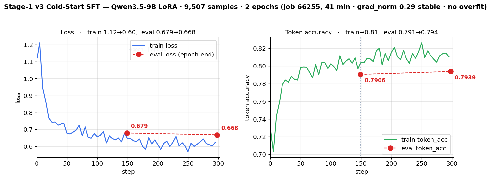
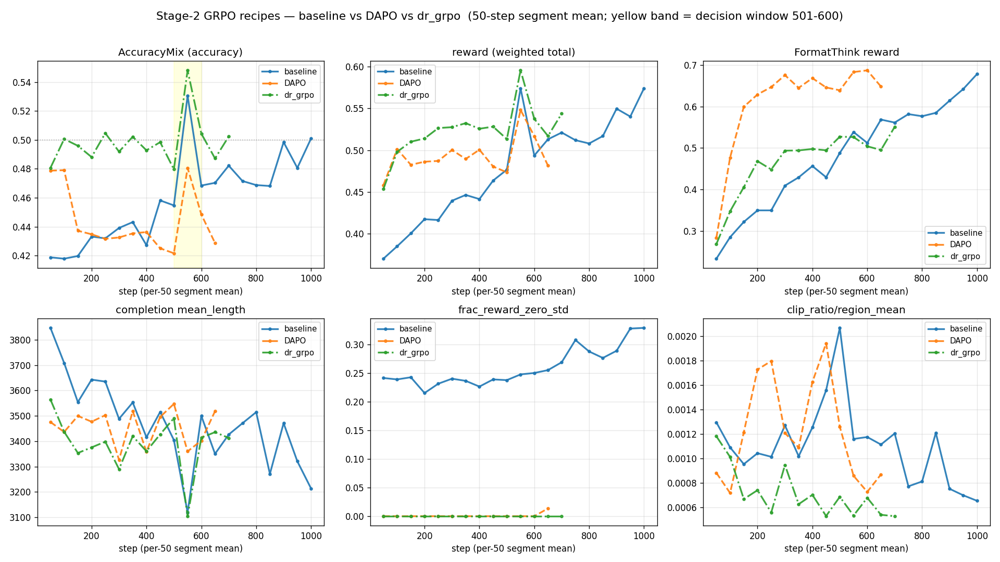
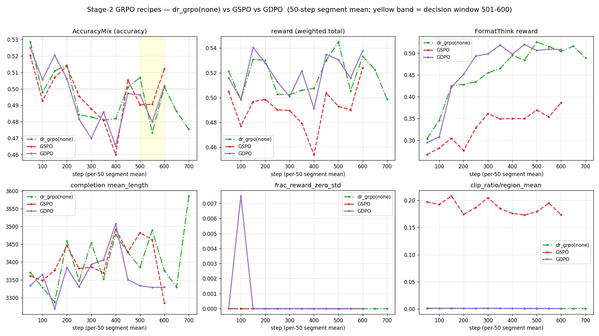

# K-BDS 의료 멀티모달 교차추론 — 학습 파이프라인

계획서(`plan.hwp`) 기반, **ms-swift**로 4단계 파이프라인을 KISTI Slurm 클러스터에 맞춰 구성:
**① (format) 콜드스타트 SFT → ② 범용 RLVR/GRPO → ③ 의료 특화 RL(RaR) → ④ 평가**.
일별 상세는 `docs/worklog_*.md`.

---

## 현황 (2026-07-20)

**지금 위치**: **Stage-1 콜드스타트 v3 평가완료 — 형식 천장 완파**(`format_think` 0.473→**0.909**, 홀드아웃 acc ~0.22→**0.348** [결과](#v3-홀드아웃-평가-결과--형식-천장-완파-job-69807-2026-07-20)) · Stage-2 방법론 전부 판정 완료 · **Stage-3(의료 RL) 본실행 대기**(배선 검증완료). → 다음: v2 동일조건 재측정 후 **Stage-2 재개 vs Stage-3 직행** 결정.

> 📋 **문제정의·실험결과·해결방안·목표·기한** 4축 → [`docs/project_status_2026-07-05.md`](docs/project_status_2026-07-05.md)

> ⚠️ **예산 주의**: 계획서 5,000 노드시간 중 **약 4,164 소진(83.3%)** — 잔여 **~836**. Stage-2 GRPO 1회 = **~500**(70h×8)이라 **재실행 여력 없음**. SFT 는 ~5로 저렴. → [자원](#자원--운영-정책-가이드)

| 단계 | 상태 | 핵심 결과 |
|---|---|---|
| **① 콜드스타트 SFT** | ✅ **v3 평가완료** | **v2 데이터가 `format_think` 0.473** = RL 형식보상의 천장이었음(RL 0.425 정체). → **v3 일반+의료 혼합·게이트 1.0** 으로 재구축 후 **SFT만으로 0.909 달성**(천장 완파), 홀드아웃 acc **0.348**(v2 ~0.22, v2-RL 0.38~0.39) ([상세](#stage-1--콜드스타트-sft)) |
| **② 범용 RLVR** | ✅ **방법론 전부 종결** | plateau 진단 → **dr_grpo 승자**(Acc 0.526 돌파). **홀드아웃 3종(step600)**: GDPO 0.390 ≈ dr_grpo 0.380 (동률) ≫ **GSPO 0.290**(on-policy 동률이나 홀드아웃 열위=일반화 실패, 미채택). GDPO는 Stage-3용 채택 권고. → [상세](#stage-2--범용-rlvr-grpo) |
| **③ 의료 RL (RaR)** | ⏳ 배선 검증완료·**본실행 대기** | 루브릭·judge·배선 end-to-end PASS(유닛 29/29·스모크). step600 ckpt(dr_grpo/GDPO)가 init 후보. → [상세](#stage-3--의료-rl-rar-루브릭-보상) |
| **④ 평가** | 🔄 기준선 확보·**v3 홀드아웃 완료** | **HealthBench Hard(n=1000)**: base 0.229 / v2 콜드스타트 0.224(동률, 오프타깃) — **v3 는 미측정**(동일 하니스로 즉시 비교 가능). **DeepVision 홀드아웃**: base 0.15 → v2 콜드스타트 0.22 → +RL 0.38–0.39, **v3 콜드스타트 0.348**(RL 無). → [상세](#타겟-벤치마크-healthbench--의료-성능-측정) |

**🎯 검증된 핵심 수치 (DeepVision 층화 홀드아웃)**
- **v2 경로(전체 파이프라인 검증)**: `base 0.15 → 콜드스타트 0.22 → +dr_grpo/GDPO(step600) 0.38–0.39` (base 대비 **+153%**). 콜드스타트 없이 base→RL 은 **0.18**(붕괴).
- **v3 콜드스타트(현행)**: **RL 을 한 번도 안 돌리고 단독 0.348** — v2 가 **풀 Stage-2 RL(~500 노드시간)** 을 태워야 도달한 0.38–0.39 에 근접. 게다가 v3 는 DeepVision 미학습이라 홀드아웃 22% 오염 이득이 **없다**(아래 ⚠️).

✅ **정비 이력(해결됨)**: 파일럿 dr_grpo 의 ① 데이터 21%만 학습 ② 평가 누수(stride 슬라이스)를 → **층화 홀드아웃 분리**(math 453 + vl 519) + **fresh 재학습**으로 교정. 무효 "+67%"는 폐기·정식 수치로 대체.

⚠️ **알려진 한계(미해결, 2026-07-16 발견)**: **홀드아웃 972건 중 214건(22.0%)이 trainonly 와 완전중복**(질문+이미지 바이트해시+정답 동일, 정답 불일치 0). DeepVision 자체에 질문 중복이 많은데(102,531행 → 고유 82,198) `make_holdout.py` 가 **이미지 경로 기준**으로 분리해 경로만 다른 동일 그림을 못 걸렀다. 위 홀드아웃 수치(0.15/0.22/0.38·0.39·0.29)는 **22% 만큼 상향편향**. 단 clean 3종이 같은 22%를 공유하므로 **상대비교·순위는 유효**. (느슨한 기준=질문+정답만 일치로 재측정 시 301건/31.0% — 22%가 검증된 하한) **⚠️ 예외: v3 `sft_mixed` 는 DeepVision 을 전혀 학습하지 않아 이 편향이 없다** → v3(0.348) vs Stage-2(0.38·0.39) 비교는 **v3 에 보수적**. → [홀드아웃 분리](#홀드아웃-분리-stage-2-평가-누수-차단) · [v3 평가](#v3-홀드아웃-평가-결과--형식-천장-완파-job-69807-2026-07-20)

---

## 목차
1. [현황](#현황-2026-07-20)
2. [파이프라인 4단계](#파이프라인-4단계)
3. [Stage-1 · 콜드스타트 SFT](#stage-1--콜드스타트-sft) — **v3 일반+의료 혼합 재설계**(형식 천장 규명) + ablation study(순가치)
4. [Stage-2 · 범용 RLVR (GRPO)](#stage-2--범용-rlvr-grpo) — baseline·기법 통합비교(GRPO/DAPO/dr_grpo/GSPO/GDPO)·벤치마크
5. [Stage-3 · 의료 RL (RaR)](#stage-3--의료-rl-rar-루브릭-보상)
6. [타겟 벤치마크 (HealthBench)](#타겟-벤치마크-healthbench--의료-성능-측정) — base 기준선 0.229
7. [기술 레퍼런스](#기술-레퍼런스) — 환경·모델·LoRA·보상·**논문 레퍼런스**
8. [운영 · 데이터](#운영--데이터) — 자원·정책·데이터·디렉토리·사용순서
9. [진행 이력 & 체크리스트](#진행-이력--체크리스트)
10. [과제 종료 의무](#과제-종료-의무-가이드-7)

---

## 파이프라인 4단계

| 단계 | 목적 | 데이터 | 방법 | 상태 |
|---|---|---|---|---|
| **①** 콜드스타트 SFT | `<think>/<answer>` 추론 형식 주입 + **의료 추론 시드** | **v3: OpenMedReason + VisualWebInstruct + VLAA 혼합**<br>(v2: 자기증류 RFT 727 → 형식 0.473) | LoRA SFT | ✅ v3 평가완료 — `format_think` **0.909**·acc **0.348**. `sft_mixed_merged` = 새 init |
| **②** 범용 RLVR | 검증가능 정답으로 추론 강화 | DeepVision-103K | GRPO 계열(dr_grpo/GDPO) | ✅ A/B 판정완료(dr_grpo·GDPO 동급) |
| **③** 의료 특화 RL | 개방형 의료 VQA 추론 | medix-rl-data 51K | GRPO + RaR 루브릭 보상 | ⏳ 배선 검증완료·대기 |
| **④** 평가 | base 대비 성능 정량화 | 층화 홀드아웃 / **HealthBench** | vLLM 추론·채점 | 🔄 base·콜드스타트 측정완료(HealthBench 0.229/0.224) |

**공통 제약**(→ [기술 레퍼런스](#기술-레퍼런스)): NVLink 없음 → **전 단계 LoRA-DDP** · glibc 2.17 → **Singularity 컨테이너** · 로그인노드 vLLM 불가 → **모든 GPU 작업은 컴퓨트노드**.

---

## Stage-1 · 콜드스타트 SFT

- **목적**: base(Qwen3.5-9B)가 본래 장문 추론(3.5~4.6K토큰)이라 잘림=0점이 RL 정체 원인 → **간결한 `<think>/<answer>` 형식**을 먼저 주입.
- **핵심 결정**: ZeRO-3 길이확대는 no-NVLink에서 5배 느려 불채택 → **간결 콜드스타트**로 해결.

**버전 이력** — 세 번의 재설계, 각각 실측으로 폐기/승계:

| | 데이터 | `format_think` | 결과 |
|---|---|---|---|
| **v1** `sft_coldstart_*` | VLAA **clevr_math 단일** 2,913 | — | ❌ 도메인 단일 → 일반화 실패, 폐기 |
| **v2** `sft_rft_coldstart_*` | 자기증류(RFT) **727** | **0.473** | ✅ 필수성 입증(ablation)·Stage-2 성공. 그러나 **형식 천장** |
| **v3** `sft_mixed_*` (현행) | 일반+의료 **혼합 9,507** | **1.000**(게이트 강제) | ✅ **생성 `format_think` 0.909 · acc 0.348** — 천장 완파 ([곡선](#v3-학습-결과--학습곡선-job-66255-2026-07-18) · [평가](#v3-홀드아웃-평가-결과--형식-천장-완파-job-69807-2026-07-20)) |

### v2 의 진짜 결함 — 데이터가 형식보상의 천장이었다 (2026-07-16 발견)

RL 이 최적화하는 `format_think`(`configs/accuracy.py`)는 **앵커 매칭**(`^<think>…</think>\s*<answer>…</answer>$`) + think 실질 16자↑ 를 요구한다. 이 함수를 **v2 학습 데이터에 그대로 돌린 결과**:

| 지표 | 값 |
|---|---|
| v2 데이터의 `format_think` | **0.473** |
| 구조 위반(`</think>` 뒤에 장문 후 `<answer>`) | 364/727 (**50.1%**) |
| `<think>` 가 사실상 빈 샘플 | 35 (4.8%, 그중 20이 객관식) |

**원인은 소스에 있다.** `build_rft_coldstart.py:78` 의 합격조건이 `AccuracyMix>=1.0 and closed(c) and len(c)<=6000` 인데, `closed()` = `'</think>' in c and <answer> 존재` 로 **앵커링도 최소 추론길이도 없다**(당시 롤아웃 로그엔 느슨한 `Format` 컬럼만 있었음). 게다가 선별이 **"가장 짧은 3개"**(`sorted(set(comps), key=len)[:3]`)라, 객관식에서 가장 짧은 정답 = `<think></think><answer>C</answer>` = **추론 없는 찍기**를 우선 선택한다(4지선다는 찍어도 25%가 AccuracyMix 통과).

→ 모델은 **절반이 틀린 형식**을 그대로 배웠고, 그래서 RL 시작 FormatThink 0.26 · 600스텝 후에도 **0.425 정체**. RL 이 못 배운 게 아니라 **초기화가 잘못 가르쳤다**.

### v3 설계 — `scripts/build_mixed_coldstart.py`

**데이터 (전부 실측 검증 후 채택 — 이름·초록만 보고 고르지 않음)**

| 소스 | 샘플링 **목표** | 추론 중앙값 | ≤6000자 | 라이선스 | 역할 |
|---|---|---|---|---|---|
| `neginb/OpenMedReason` | 5,000 | 1,927자 | 100% | CC-BY-4.0 | **의료 신규 지식**(19 taxonomy) |
| `TIGER-Lab/VisualWebInstruct-verified` | 3,000 | 933자 | 100% | MIT | 일반, **자유형 정답 52.9%** |
| `UCSC-VLAA/VLAA-Thinking` (synthesis·clevr) | 2,500 | 649~934자 | 100% | Apache-2.0 | 일반, **이미 목표 형식** |

> ⚠️ 위는 **요청한 목표치**다. 게이트(`format_think==1.0`)와 풀 부족으로 **실제 채택은 9,889건**(VWI 는 difficulty-5 풀이 57건뿐이라 3,000→**2,390** 미달) → 실측 내역은 [학습에 쓴 데이터](#v3-학습-결과--학습곡선-job-66255-2026-07-18) 표 참조.

**왜 의료를 넣나**: `medix_rl_train`(Stage-3 데이터) 51,335건은 **assistant 가 통째로 비어 있다**(prompt+solution 만) → 프로젝트에 **의료 추론 트레이스가 0건**이었다. v1·v2 는 둘 다 일반(clevr/DeepVision) 전용이라 Stage-3 전이가 미검증 한계로 남아 있었음.

**설계에 반영한 6가지 (모두 위 결함의 직접 대응)**
1. **게이트 = `format_think == 1.0`** (느슨한 `closed()` 폐기) — v2 0.473 의 원인 차단
2. **OpenMedReason 정답위치 편향 제거** — 정답이 거의 항상 A 에 배치(**4지선다 A=77%, 5지선다 A=86%**) → 이미지 안 보고 A 만 찍어도 77~86%. 보기 셔플은 추론문 **29.6%**가 `option B` 식으로 문자를 참조해 불가 → **정답 문자별 균형 샘플링**(A/B/C/D 각 1,250)
3. **정답 정규화** — VLAA 는 `\boxed` 66%·`\[..\]` 76%·앞뒤공백 100%·일부는 `<answer>` 에 산문 통째 → 정규화 + 200자 초과 배제. `\boxed` 컨벤션은 이 프로젝트에서 폐기됨
4. **간결성 상한 6,000자** — 콜드스타트 존재이유가 잘림 차단
5. **질문 단위 train/val 분할** — v2 는 질문 정렬 후 stride 라 같은 질문의 형제가 양쪽에(val loss 가 4에폭 내내 0.2136~0.2149 평탄했던 원인)
6. **난이도 층화** — VWI `difficulty` 1~5 균등. v2 의 "가장 짧은 것" 선별은 찍기를 우선 선택했음

<details><summary>후보 스크리닝에서 탈락한 것들 (간결성이 기준)</summary>

`max_completion_length` 가 2048~6144 라 긴 trace 를 가르치면 **장황→잘림→형식0** 실패 모드를 재생산한다.

| 후보 | 추론 중앙값 | 판정 |
|---|---|---|
| `OpenDataArena/MMFineReason` 1.8M | **9,059~11,178자** | ❌ Qwen3-VL-235B-**Thinking** 증류라 장황함이 생성자 속성 — 쉬운 문제(pass_rate=1.0)만 골라도 9K. **RL 단계 후보로 보류**(`pass_rate` 난이도 라벨 유용) |
| DeepVision 자기수확(Stage-2 롤아웃 21,786건, 무료·in-domain) | 4,393자 (37.5%가 6K 초과) | ❌ RL 모델이 길게 추론하도록 학습된 출력 → 장황함을 재학습 |
| `leduckhai/S-Chain` | — | ❌ 10,783건인데 **고유정답 3개**(Non/Mild/Moderate-Dementia)·**고유질문 170개**·고정 3단계 템플릿 = 3지선다 반복. 또한 우리 파이프라인에 **grounding 보상이 없어** 아무도 채점 안 하는 행동 |
| `FanqingM/MMK12` · `MM-Eureka` · `ThinkLite-VL` | — | ❌ 이름과 달리 **추론 trace 자체가 없음**(RLVR용 prompt+answer) |
| `BoKelvin/GEMeX-ThinkVG`(=논문의 GEMeX-RMCoT, 개명) | — | ⏸ 텍스트만 공개 — 이미지는 **MIMIC-CXR(PhysioNet)** 자격심사+CITI+DUA 필요(수주). CC-BY-NC |
| `Xkev/LLaVA-CoT-100k`(170GB) · `Mulberry` · `Zebra-CoT` | — | ❌ 용량·형식(interleaved 시각 CoT)·NC 라이선스 |
</details>

### v3 학습 결과 — 학습곡선 (job 66255, 2026-07-18)

**① 학습에 쓴 데이터** — `scripts/build_mixed_coldstart.py` 빌드, **전량 `format_think==1.0` 게이트 통과분만** 채택 (빌드 로그 `logs/build_coldstart_66245.log`):

| 소스 | 채택 | 비고 |
|---|---|---|
| `neginb/OpenMedReason` | **4,999** | 의료. 정답문자 균형추출 A/B/C/D 각 1,250 (원본 A편중 77~86% 제거) |
| `TIGER-Lab/VisualWebInstruct-verified` | **2,390** | 일반. `difficulty` 1~5 층화 (5는 풀이 57건뿐이라 미달) |
| `UCSC-VLAA/VLAA-Thinking` · synthesis | **1,250** | 일반. 풀 19,257 → 채택 |
| `UCSC-VLAA/VLAA-Thinking` · clevr_math | **1,250** | 일반. 풀 5,923 → 채택 |
| **합계** | **9,889** | 고유질문 7,923 → **질문 단위** 분할: train **9,507** / val **382** |

**② 학습 설정 — v2 와 LoRA 세팅 완전 동일**(대조 조건 확보). 두 체크포인트의 `args.json` 직접 대조:

| 항목 | **v3 `sft_mixed`** | v2 `sft_rft_coldstart` | |
|---|---|---|---|
| base / tuner | Qwen3.5-9B / `lora` | 동일 | ✅ |
| `lora_rank` / `lora_alpha` / `lora_dropout` | **16 / 32 / 0.05** | 동일 | ✅ |
| `target_modules` / `modules_to_save` / `lora_bias` / `use_dora` | `all-linear` / `[]` / none / False | 동일 | ✅ |
| `learning_rate` / 스케줄 / `warmup_ratio` | **1e-4** / cosine / 0.03 | 동일 | ✅ |
| `max_length` / `max_pixels` | 4096 / 1003520 | 동일 | ✅ |
| dtype / `attn_impl` / `gradient_checkpointing` | bf16 / `flash_attn` / False | 동일 | ✅ |
| `weight_decay` / `seed` | 0.1 / 42 | 동일 | ✅ |
| **유효배치** | **64** (1×16×4gpu) | **64** (1×8×8gpu) | ✅ *(`grad_accum` 16 vs 8 은 GPU 수 보정 — 결과 동일)* |
| `num_train_epochs` | **2** | 4 | ⚠️ 아래 |
| **실제 옵티마이저 스텝** | **298** | **48** | ⚠️ 데이터량 차이 |

> **epoch 수가 다른 이유**: v2 는 727건뿐이라 4 epoch 을 돌려도 **48스텝**에 그친다. v3 는 9,507건이라 2 epoch 만으로 **298스텝** — 실제 학습량은 **약 6.2배**. epoch 을 2 로 줄인 건 v2 에서 **val 이 epoch1 이후 평탄**함을 확인했기 때문(`scripts/10_sft.slurm` 주석).
>
> ⚠️ 따라서 v3 의 우위는 **"데이터 품질" + "데이터량/학습스텝(48→298)"의 합산 효과**다. LoRA 하이퍼파라미터·LR·유효배치·시드가 전부 같으므로 **"튜닝 덕분"은 배제**되지만, 품질만 단독 분리한 것은 아니다.

소요: **41분 / 298스텝**(job 66255, 4gpu).

곡선·검증·안정성 모두 초록불:



**③ 스텝별 추이** (5스텝마다 로깅 60포인트 중 발췌 — 전량은 `work/data/sft_mixed_traincurve.json`)

| step | epoch | train loss | train token_acc | | step | epoch | train loss | train token_acc |
|---|---|---|---|---|---|---|---|---|
| 1 | 0.01 | 1.1220 | 0.7247 | | 175 | 1.18 | 0.5989 | 0.8172 |
| 25 | 0.17 | 0.7434 | 0.7840 | | 200 | 1.34 | 0.6091 | 0.8153 |
| 50 | 0.34 | 0.6782 | 0.7985 | | 225 | 1.51 | 0.6252 | 0.8080 |
| 75 | 0.51 | 0.6624 | 0.8014 | | 250 | 1.68 | **0.5683** | **0.8261** |
| 100 | 0.67 | 0.6571 | 0.8025 | | 275 | 1.85 | 0.6441 | 0.8042 |
| 125 | 0.84 | 0.6472 | 0.8054 | | 295 | 1.98 | 0.6241 | 0.8104 |
| **149** | **1.00** | — | — | | **298** | **2.00** | — | — |

> **valid 는 스텝마다가 아니라 epoch 끝 2회만** 측정된다(`--save_strategy epoch`). 그래서 위 표엔 step 149/298 의 train 값이 비어 있고, 아래 eval 표가 그 2 지점이다.

| 지표 | epoch 1 | epoch 2 | 판정 |
|---|---|---|---|
| train loss | 1.12 → ~0.62 | ~0.60 (전체 평균 **0.665**) | 초반 ~50스텝에 대부분 수렴 |
| **eval_loss** | 0.6793 | **0.6681** (−1.6%) | 악화 아닌 개선 → 과적합 아님 |
| **eval_token_acc** | 0.7906 | **0.7939** | 소폭 개선(epoch1 수렴) |
| train↔eval 격차 | ~0.66 vs ~0.67 | | 격차 거의 0 = **과적합 없음** |
| grad_norm | 평균 **0.29** (max 1.23, 마지막 ~0.27) | | 스파이크·발산·NaN·OOM 전무 |

- **재현**: `singularity exec $SB python scripts/plot_sft_curve.py docs/assets/sft_mixed_traincurve.png` (데이터 `work/data/sft_mixed_traincurve.json` ← `logs/sft_66255.log` 추출)
- ⚠️ **이 지표는 "학습이 안정적이었나"까지만 말한다.** token_acc 0.79 는 teacher-forcing 다음토큰 정확도지 생성 정답률이 아니다. v3 의 핵심 질문 — 생성시 **strict `format_think`**(v2 데이터 0.473 천장 돌파 여부)와 **홀드아웃 정답률**(v2 콜드스타트 0.22 대비) — 은 병합+평가 **job 69807**(`scripts/50_eval_v3.slurm`, `scripts/eval_v3_holdout.py`)가 답한다.

### v3 홀드아웃 평가 결과 — 형식 천장 완파 (job 69807, 2026-07-20)

**평가에 쓴 데이터** — `work/data/deepvision_holdout.jsonl` = **DeepVision-103K 층화 홀드아웃 972건**(math **453** / vl **519**). `scripts/make_holdout.py` 로 분리했고 **학습에 절대 미사용**(Stage-2 도 `deepvision103k_trainonly.jsonl` 로 fresh 학습 → **누수 0**).

> ⚠️ 학습 중의 `sft_mixed_val.jsonl`(382)과는 **다른 셋**이다. val 은 학습셋과 **같은 분포**(질문 단위 분할)라 `eval_loss`/`token_acc` 측정용이고, 홀드아웃은 **학습에 안 쓴 분포**에서 **생성 정답률·형식**을 재는 용도다. 그래서 위(학습)와 아래(평가) 숫자는 서로 다른 것을 말한다.

병합(`sft_mixed_merged`) → vLLM serve → 홀드아웃 972건 **전량** 채점
(`scripts/50_eval_v3.slurm` + `scripts/eval_v3_holdout.py`, temp=0 · `max_tok` 2048 · system 동일).

| 지표 | **v3 `sft_mixed`** | v2 콜드스타트 | v2 **RL 이후**(step600) |
|---|---|---|---|
| **strict `format_think`** | **0.909** | 데이터 천장 **0.473** | RL 정체 **0.425** |
| **홀드아웃 accuracy** | **0.348** | ~0.22 | 0.380 dr_grpo / 0.390 GDPO |
| 층별 accuracy | math **0.324**(n=453) · vl **0.368**(n=519) | — | — |
| mean_chars / errors | 1,982 / **1**건 | — | — |

**v3 재설계의 두 가설이 모두 실측 입증됐다.**

1. **형식 천장은 데이터 문제였다.** 게이트 1.0 데이터로 **SFT만** 했는데 생성 출력 `format_think` 가 **0.909** — RL 을 한 번도 안 돌리고 v2 의 *RL 이후*(0.425)를 **2배 이상** 상회. "RL 이 못 배운 게 아니라 초기화가 잘못 가르쳤다"는 진단이 그대로 확인됐다.
2. **혼합 데이터가 정답률도 올렸다.** v3 **SFT 콜드스타트(0.348)** 가, v2 가 **풀 Stage-2 RL(~500 노드시간)** 을 태워야 도달한 0.380~0.390 에 근접했다. → Stage-2 의 한계효용 재검토 필요.

**⚠️ 오염 비대칭 — 이 비교는 v3 에게 보수적이다.** 홀드아웃 972건 중 **214건(22.0%)이 `trainonly` 와 완전중복**이다(질문+이미지 바이트해시+정답 동일 → [알려진 한계](#홀드아웃-분리-stage-2-평가-누수-차단)). 느슨한 기준(질문+정답만 일치)으로 재측정하면 **301건(31.0%)** — 22% 가 검증된 하한, 31% 가 질문 수준 상한이다. 그런데 이 오염의 **"이득"은 DeepVision 을 학습한 모델에만** 돌아간다:

| 모델 | DeepVision 학습 여부 | 22% 오염 이득 |
|---|---|---|
| Stage-2 GRPO (0.380 / 0.390) | ✅ `trainonly` 전량 | **있음** (상향편향) |
| v2 콜드스타트 (~0.22) | ✅ DeepVision 자기증류 727건 | 일부 있음 |
| **v3 `sft_mixed` (0.348)** | ❌ **OpenMedReason + VWI + VLAA 만 — DeepVision 0건** | **없음** (완전 미학습 분포) |

즉 **v3 는 한 번도 본 적 없는 분포에서 0.348 을 냈고, 비교 대상들은 22% 를 외운 상태의 점수다.** → 위 표의 격차는 **실제보다 축소**되어 있을 가능성이 높다. (오염분 층별: vl 167 / math 134)

- 잔여 형식위반 **9.1%(88건)** 는 주로 **2048토큰 잘림**(`</answer>` 전 절단) → `max_new_tokens` 상향 여지.
- 채점은 RL 보상과 **동일 규칙**(템플릿 `response_prefix='<think>\n'` 전제 + `configs/accuracy.py:FormatThink` 와 같은 앵커·16자 조건). 예측 덤프 `logs/eval_v3_preds_69807.jsonl` 로 표본 검증함.
- ⚠️ **v2 의 0.22 는 조건 불명의 과거값.** 동일 하니스 재측정(`scripts/52_eval_v2_baseline.slurm`)으로 A/B 를 못박는 중 — 1차(70342)는 벽시계 초과 TIMEOUT, `--time 2:30` 으로 재제출.

### 콜드스타트 Ablation Study (순가치 확정, 2026-07-09)

*(v2 데이터 기준. **결론은 v3 에도 유효** — 절제변수가 "콜드스타트 init 유무"라 데이터 버전과 무관하게 "콜드스타트 없이는 RL 이 형식을 못 배운다"를 보인다. v3 는 이 결론을 더 강화하는 방향: v2 조차 형식 0.473 이었는데도 필수였으므로.)*

계기: 콜드스타트의 HealthBench(0.224)가 base(0.229)와 동률이라 "Stage-1 제껴도 되나?" → clean ablation 으로 확정. 상세 [`docs/stage1_coldstart_assessment.md`](docs/stage1_coldstart_assessment.md).

- **가설**: H1 콜드스타트=RL 전제조건 vs H0 콜드스타트=가속일 뿐.
- **설계**: **절제변수 = 콜드스타트 init 유무**, 나머지(trainonly·dr_grpo·LoRA·보상·하이퍼) 전부 통제. `base→RL`(dr_grpo·GDPO 2-arm, step200, `59946`/`59970`) vs 기존 콜드스타트 경로.
- **결과 — DeepVision 홀드아웃 2×2 (콜드스타트 × RL)**:

  | | RL 無 | RL 有 | RL 효과 |
  |---|---|---|---|
  | **콜드스타트 無** | base 0.15 | base→RL(200step) **0.18** | +0.03 |
  | **콜드스타트 有** | 0.22 | +RL(600step) **0.38** | **+0.16** |
  | **콜드스타트 효과** | +0.07 | +0.20 | |

  *(콜드스타트 無 RL: dr_grpo 0.18 / GDPO 0.165 — GDPO도 붕괴 못 살림)*

- **결론 — H0 기각, H1 채택**: **강한 상호작용**(RL 이득은 콜드스타트에 조건부: +0.16 vs +0.03). 콜드스타트 없이는 **FormatThink 100스텝 내내 ~0 정체**(콜드스타트 0.26 시작)·잘림 40%·학습 2~3배 저속, **200step RL이 콜드스타트 SFT 한 번(0.22)에도 못 미침**. → **Stage-1 필수 확정**. HealthBench 동률은 오프타깃(텍스트 의료)일 뿐.

---

## Stage-2 · 범용 RLVR (GRPO)

> **요약 (Stage-2 방법론 실험 완료)**: baseline GRPO 에서 **Acc plateau** 진단 → GRPO 파생기법 5종 **clean A/B** → **dr_grpo 승자**(plateau 돌파, 홀드아웃 +73%). 최신기법 **GSPO·GDPO**도 검증: **GDPO 홀드아웃 동률**(0.390 vs 0.380, Stage-3용 채택 권고), **GSPO는 on-policy 동률이나 홀드아웃 열위**(0.290=일반화 실패, 미채택). step600 홀드아웃 **~0.38–0.39 포화**. **Stage-2 방법론 확정** — 남은 건 Stage-3.

### 1) baseline → Acc plateau 진단 (job 57249, step 1000 완주)

RFT 콜드스타트 init + LoRA-DDP + max_completion 6144. 100-step 구간평균:

| 구간 | reward | Acc | FormatThink | clip | mean_len | zero_std |
|------|--------|-----|-------------|------|----------|----------|
| 1–100 | 0.377 | 0.418 | 0.259 | 0.420 | 3778 | 0.240 |
| 501–600 | 0.534 | **0.500** | 0.525 | 0.307 | 3309 | 0.249 |
| 901–1000 | **0.557** | 0.491 | **0.660** | **0.279** | **3267** | **0.328** |

- ✅ 발산/붕괴 없음. FormatThink +155%·clip↓·길이↓.
- ⚠️ **[진단] Acc plateau**: Acc가 step~500서 0.50 정점 후 정체. 원인 = **`frac_reward_zero_std` 0.24→0.33 상승**(그룹 rollout이 전부정답/전부오답 → 정확도 gradient 소실). 후반 reward 상승은 형식·길이 주도.

### 2) 기법 통합 비교 — GRPO 계열 5종 clean A/B

baseline plateau를 뚫기 위해 GRPO 파생기법 5종을 **기법 외 전 조건 동일**(init `sft_rft_coldstart_merged` · trainonly 데이터 · 보상 `accuracy_mix/format_think/soft_overlong` · LoRA r16/a32)로 실증. 전부 **한 스크립트**(`scripts/21_rlvr_grpo_adv.slurm`)에서 `RECIPE`/env 토글로 실행 → 진짜 clean A/B.

#### 쉬운 설명 (비유)

> **비유**: 한 문제에 모델이 **답안 4장(그룹)**을 낸다 → 정답 여부만 채점 → **그룹 평균보다 잘 쓴 답은 "더 그렇게", 못 쓴 답은 "덜 그렇게"** 확률을 민다.
> PPO와 달리 **별도 채점관(가치망) 불필요** — *그룹 평균*이 기준선 역할(=GRPO의 핵심 절약).

5종 모두 이 **그룹상대 advantage** 골격을 공유하고, "채점을 점수로 환산하는 규칙"에서만 갈린다.

#### 핵심 관점: 5종 = ms-swift **3개 독립 손잡이(knob)**의 조합

방법을 통째로 외우지 말고, ms-swift가 노출하는 **직교하는 3개 손잡이**의 좌표로 본다 (소스: `grpo_trainer.py` 손실 분기 직접 확인). 손잡이마다 겨냥하는 편향이 다르다:

| 손잡이 (ms-swift 인자) | 무엇을 바꾸나 | 선택지와 효과 |
|------|------|------|
| **`loss_type`** | 손실 정규화 + 클리핑 | `grpo`=÷시퀀스길이(**길이 편향**) · `dapo`=÷배치토큰+clip-higher(탐색↑) · `dr_grpo`=÷상수(**길이 편향 제거**) |
| **`importance_sampling_level`** | 중요도샘플링(IS) 단위 | `token`=기본 · `sequence`=**GSPO**(장문 IS 분산·클립증폭 억제) |
| **`scale_rewards`** | advantage 정규화 | `group`=÷그룹std(**난이도 편향**) · `none`=안 함(**dr_grpo**) · `gdpo`=**보상함수별 개별** z-score(멀티리워드 균형) |

→ 세 손잡이는 **독립(자유 조합 가능)**. 승자 **dr_grpo = `(dr_grpo, token, none)`**. **GDPO**는 거기서 `scale_rewards`만 `gdpo`로 돌린 **1-knob 변형**(`dr_grpo, token, gdpo`). **GSPO**는 IS를 sequence로 바꾼 **별도 좌표**(우리 설정 `grpo, sequence, group` + 작은 clip)로, dr_grpo의 1-knob 변형이 아니라 독립 실험이다.

#### 5종 실제 설정·결과 통합표

공통 **CORE**(baseline 제외 전 recipe 공유) = `dynamic_sample`(zero_std 그룹 폐기·재샘플, plateau 직격) + `overlong_filter`(잘린 롤아웃 loss 제외).

| 방법 | 논문 | `loss_type` | IS | `scale_rewards` | 클립 ε/ε_high | CORE | **우리 결과·판정** |
|------|------|------|------|------|------|:---:|------|
| **GRPO** (baseline) | [2402.03300](https://arxiv.org/abs/2402.03300) | grpo | token | group | 0.2 | ✗ | plateau (zero_std 0.24→0.33), Acc 0.500 정점 후 정체 |
| **DAPO** | [2503.14476](https://arxiv.org/abs/2503.14476) | dapo | token | group | **0.2/0.28** | ✓ | 안정(zero_std 0)하나 **미돌파**(Acc 0.465<0.500), 길이 재폭주(~3600) |
| **dr_grpo** ✅ | [2503.20783](https://arxiv.org/abs/2503.20783) | **dr_grpo** | token | **none** | 0.2 | ✓ | ✅ **돌파·승자**(Acc **0.526**·길이 억제 3259), **홀드아웃 +73% 검증** |
| **GSPO** | [2507.18071](https://arxiv.org/abs/2507.18071) | grpo | **sequence** | group | **3e-4/4e-4** | ✓ | **미채택**: on-policy 동률(0.500)이나 **홀드아웃 열위 0.290**(dr 0.38·GDPO 0.39 대비)=일반화 실패 |
| **GDPO** | [2601.05242](https://arxiv.org/abs/2601.05242) | dr_grpo | token | **gdpo** | 0.2 | ✓ | **동률**(step600 홀드아웃 0.390 vs dr 0.380, Δ+0.01 노이즈 내) → Stage-2 무차별, **Stage-3용 채택 권고** |

**판정 핵심**: plateau의 원인은 `frac_reward_zero_std` 급등(그룹이 전부정답/전부오답→gradient 소실). dr_grpo가 **길이·난이도 두 정규화 편향을 동시에 제거**해 step 501~600서 Acc 0.50을 유일하게 돌파. GSPO·GDPO는 그 위/옆의 직교 개선을 clean A/B로 검증했고, **둘 다 dr_grpo와 동률**(GSPO 미채택, GDPO는 멀티리워드 균형이 필요한 Stage-3용으로 채택 권고 — [아래 판정](#stage-2-3종-홀드아웃-판정-step600-n200)).

기법마다 학습 데이터가 달라(구 데이터 vs trainonly) **비교 가능한 2개 코호트**로 나눠 그림(각 6패널: Acc·reward·FormatThink·mean_len·zero_std·clip, 50-step 구간평균, 노란 띠=판정창 501~600):

**코호트 A — plateau 돌파 A/B (구 데이터): baseline vs DAPO vs dr_grpo**

*(**dr_grpo(초록)만 노란 띠서 Acc 0.50 돌파**하며 mean_length 억제. baseline(파랑)은 zero_std 상승=plateau, DAPO(주황)는 길이·clip 재증가. FormatThink는 baseline이 최고지만 그건 Acc 정체를 형식이 대신 끌어올린 것.)*

**코호트 B — 최신기법 A/B (trainonly, 동일 init·데이터): dr_grpo(none) vs GSPO vs GDPO**

*(3기법 모두 step600 완주. Acc·reward는 3자 거의 겹침(**동률**). FormatThink는 GDPO(보라)가 중반 우위였으나 **판정창(노란 띠)서 dr_grpo와 수렴**. **clip에서 GSPO(빨강)만 크게 높음**(~0.18, 작은 ε 설계상). → GSPO·GDPO 둘 다 dr_grpo와 동률: GSPO 미채택, GDPO는 Stage-3용 채택 권고.)*

<details><summary>플롯 재생성 명령</summary>

```bash
SB=work/images/ms-swift-413-sandbox
# 코호트 A
singularity exec $SB python scripts/plot_grpo_multi.py docs/assets/grpo_stage2_A_plateau.png \
  "baseline:#1f77b4:-:logs/grpo_stage2_57249.log" "DAPO:#ff7f0e:--:logs/grpo_adv_57527.log" "dr_grpo:#2ca02c:-.:logs/grpo_adv_57624.log"
# 코호트 B
singularity exec $SB python scripts/plot_grpo_multi.py docs/assets/grpo_stage2_B_latest.png \
  "dr_grpo(none):#2ca02c:-.:logs/grpo_adv_58892.log" "GSPO:#d62728:--:logs/grpo_adv_59004.log" "GDPO:#9467bd:-:logs/grpo_adv_59191.log"
```
`plot_grpo_multi.py` 는 `label:color:style:logpath` 스펙을 N개 받아 일반화(기법 수 무관).
</details>

> 원칙: **"최신이라서" 채택하지 않는다.** 5종 전부 dr_grpo가 자리를 얻은 것과 **동일 clean A/B**(동일 init·trainonly, 판정창 501~600 구간평균 + 필요시 층화 홀드아웃 벤치마크)로 판정. 동률이면 이미 검증된 승자를 유지.

<details><summary>① GRPO / DAPO / dr.GRPO — 한 줄 요약 + DAPO 4대 기법</summary>

- **GRPO** (DeepSeekMath, 2024) = 기본형. 그룹 평균 빼고 **그룹 std로 나눠** 점수화. 약점: ① std=0 그룹은 못 배움(**Acc 정체**) ② 긴 답·쉬운 문제 과대평가.
- **DAPO** (ByteDance, 2025) = GRPO에 **탐색·효율 4종 보강**. 안정성↑이나 답이 길어져 정확도 baseline 미달.
- **dr.GRPO** (2025, "R1-Zero 비판적 분석") = GRPO의 **편향을 수술**(손실 상수정규화 + std나눗셈 삭제). DAPO의 "답 길어짐"을 정면 겨냥. **우리 승자**.

| DAPO 기법 | ms-swift 인자 | 효과 | plateau 관련성 |
|------|--------------|------|---------------|
| **Dynamic Sampling** | `--dynamic_sample true --max_resample_times 3` | reward_std=0 그룹 폐기·재샘플 → 유효 gradient↑ | ⭐ **직격** |
| **Clip-Higher** | `--epsilon 0.2 --epsilon_high 0.28` | 상단 클립 완화 → 저확률 토큰 탐색 보존 | 조기수렴/다양성소실 방지 |
| **Token-level Loss** | `--loss_type dapo` | 토큰 단위 정규화 → 길이 정규화 편향 제거 | 형식·길이 주도 reward 보정 |
| **Overlong handling** | `--overlong_filter true` (+`soft_overlong`) | 잘린 롤아웃 loss 제외 | 잘림=0점 신호 오염 제거 |

- 비용: DAPO 본실행(57527) 실측 **~369s/it (baseline 202의 ~1.8배)** — dynamic_sample 재샘플 대가.
- 원논문 성과: GRPO 수학추론 SOTA(7B) · DAPO AIME24 50(32B) · dr.GRPO AIME24 43.3%(7B, 토큰효율↑).
</details>

<details><summary>② GSPO (시퀀스 IS) — 배경·A/B 결론</summary>

**GSPO**(Group Sequence Policy Optimization, Alibaba/Qwen, 2025-07): 토큰 단위 IS를 **시퀀스(답안) 단위**로 교체.
- **왜**: 토큰 IS는 응답이 길수록 **분산 노이즈 누적** + 클립 증폭 → 붕괴(특히 MoE·장문·LoRA). 시퀀스 우도 비율(길이 정규화)로 억제 → MoE RL 안정화가 대표 성과.
- **A/B 결론(2026-07-04, 판정창 501~600, dr_grpo n=100 vs GSPO n=99)**: **사실상 동률**(Acc 0.500 vs 0.487, reward 0.519 vs 0.506, 차이 ±0.013 노이즈). GSPO 클립 훨씬 큼(0.185 vs ~0.001, 작은 ε 설계상).
- **→ dr_grpo 유지 (미채택)**: 동률 + dr_grpo는 이미 **홀드아웃 +73% 검증**됐고 GSPO는 on-policy 동률일 뿐. 시퀀스 IS가 필요한 MoE·초장문 상황도 아님. 런처 `scripts/launch_gspo_ab.sh`(`job 59004`).
</details>

<details><summary>③ GDPO (멀티리워드 정규화) — 배경·중간추세</summary>

**GDPO**(Group reward-Decoupled Normalization, NVIDIA, 2026-01): 여러 보상을 가중합→통짜 정규화하면 서로 다른 조합이 같은 advantage로 **뭉개지는(collapse)** 문제를, **보상 함수별 개별 정규화(z-score) 후 결합**으로 해결(AIME서 GRPO 대비 +2.3~6.3%).
- **왜 우리에게**: 우리는 **다중 보상**(Stage-2 3종, Stage-3 clinical_judge/format)이라 스케일이 제각각 → GDPO 타깃과 정확히 일치. 가장 유망한 적용처는 스케일차 큰 **Stage-3(judge 1.0 + format 0.2)**.
- **dr_grpo와 관계**: `scale_rewards`만 `none→gdpo`로 바꾼 **1변수 A/B**(나머지 dr_grpo 처리 전부 유지). ⚠️ dr_grpo가 없앤 ÷std가 **보상함수별로** 되살아남(목적은 난이도편향 회피가 아니라 멀티리워드 균형). swift 제약: `kl_in_reward=True` 비호환(우린 KL을 loss에 넣어 무관).
- **최종 판정**: step600 완주 → on-policy 판정창(501~600) Acc **0.487 vs 0.490 동률**, 층화 홀드아웃(N=200) **0.380 vs 0.390 동률**(GDPO 미세우위, 노이즈 내) → [상세 판정표](#stage-2-3종-홀드아웃-판정-step600-n200). Stage-3용 채택 권고.
- **학습 중 추세(`job 59191`, dr_grpo와 동일구간, dr/gd 순)**:

  | 구간 | reward | AccMix | FormatThink |
  |------|--------|--------|-------------|
  | 151–200 | 0.530/0.528 | 0.514/0.506 | 0.428/**0.452** |
  | 201–250 | 0.503/0.513 | 0.484/0.482 | 0.434/**0.493** |
  | 251–300 | 0.502/0.501 | 0.483/0.470 | 0.455/**0.498** |
  | 301–350 | 0.506/0.521 | 0.481/0.486 | 0.465/**0.519** |
  | 351–400 | 0.507/0.491 | 0.482/0.465 | 0.495/0.498 |
  | 401–450 | 0.530/0.535 | 0.501/0.497 | **0.520**/0.484 |

  - **AccMix·총 reward: 전 구간 dr_grpo와 동급**(Δ ±0.01~0.02) — 정답률 손해 없음. `zero_std=0` 유지.
  - **FormatThink: 150~350스텝 GDPO 우위**(+0.04~0.06)였으나 **400대에서 dr_grpo와 근접 수렴**(엎치락뒤치락) — 초반만큼 격차가 확실하진 않음. → 최종 판정이 더 중요해짐.
  - on-policy 지표라 **최종 판정은 step 501~600 + 층화 홀드아웃 벤치마크**로 확정(진입 임박).
</details>

### 3) base vs 학습모델 벤치마크 (층화 홀드아웃, 정식)

**중간 벤치마크(2026-07-03, RL 25%=step 800)** — 층화 홀드아웃 N=100, math/vl 층별(`eval_midtrain.slurm`). 조기 판단용으로 base / init(RL 0%) / trained(중간) 3개 동일조건 채점:

| 모델 | **전체 Acc** | math | visual-logic | 형식(`<answer>`) | 평균길이 |
|------|------|------|------|------|------|
| **base** (Qwen3.5-9B) | 0.15 | 0.192 | 0.113 | 0.12 | 5907자 |
| **init** (SFT 콜드스타트, RL 0%) | 0.22 | 0.234 | 0.208 | 0.32 | 5188자 |
| **trained** (dr_grpo step 800, **RL 25%**) | **0.38** | 0.340 | **0.415** | 0.45 | 4752자 |

- 🎯 **init → trained: 0.22 → 0.38 (+0.16, 상대 +73%)** — **Stage-2 RL 이 홀드아웃 정확도를 확실히 개선**(25%만 학습했는데도). *(당시엔 전량 학습 근거였으나, 이후 step600 재측정서 포화 확인 → 아래 참조)*
- base → trained **+153%**(전체 파이프라인 SFT+RL). visual-logic 개선 최대(0.21→0.42, +100%), 형식 0.12→0.45, 길이 5907→4752자(간결화).
- ⚠️ **"학습 롤아웃 Acc ~0.50 정체"는 오해였음**: on-policy(탐색 포함) 지표라 평탄했을 뿐, 정작 중요한 **홀드아웃에선 뚜렷이 상승**.
- ✅ **step600 재측정으로 확정**(아래 GDPO 판정표): dr_grpo/GDPO 둘 다 **0.38–0.39** → step800(0.38)과 동일 = **홀드아웃이 step600쯤 포화**(전량 학습해도 큰 추가이득 없음, Stage-2 조기확정 근거).

#### Stage-2 3종 홀드아웃 판정 (step600, N=200)

trainonly·콜드스타트 init·step600으로 **완전 동일 조건** 학습된 3종(dr_grpo/GDPO/GSPO)의 체크포인트를 병합해 **같은 층화 홀드아웃(N=200)**에서 대조 (`46_eval_gdpo_ab.slurm`·`48_eval_gspo_holdout.slurm`):

| 모델 (step600) | 홀드아웃 Acc | math | visual-logic | 형식 | (참고) on-policy |
|------|------|------|------|------|------|
| **GDPO**(gdpo) | **0.390** | 0.379 | 0.400 | 0.445 | 0.490 |
| **dr_grpo**(none) | 0.380 | 0.358 | 0.400 | 0.425 | 0.487 |
| **GSPO**(seq IS) | **0.290** ⚠️ | 0.305 | 0.276 | 0.355 | 0.500 |

- **dr_grpo ≈ GDPO 동률**: Δ+0.01·math+0.02·format+0.02 모두 **N=200 노이즈(±0.034) 내**. on-policy(0.487 vs 0.490)와 일치. → Stage-2 무차별, GDPO는 스케일차 큰 멀티리워드 타깃이라 **Stage-3(judge 1.0+format 0.2)엔 GDPO 채택 권고**.
- **⚠️ GSPO는 홀드아웃 열위(0.290)** — on-policy에선 최고(0.500)였으나 홀드아웃은 3종 최하위. **train-test 격차 −0.21**(dr_grpo −0.11의 2배) = **일반화 실패**. 시퀀스 IS(작은 ε)가 on-policy 분포엔 맞았으나 홀드아웃 일반화는 나쁨. → **"GSPO 미채택" 근거 강화**(단순 동률이 아니라 홀드아웃 명확 열위). **on-policy만 보면 오판했을 사례 — 홀드아웃 측정의 가치**.
- 부수 발견: dr_grpo/GDPO 둘 다 step600서 **~0.38–0.39**로 step800(0.38)과 동일 → **Stage-2 홀드아웃이 step600쯤 포화**.

<details><summary>⚠️ DAPO·baseline 홀드아웃 (오염·참고용) — 누수가 수치로 드러난 사례</summary>

DAPO(57527)·baseline(57249)은 홀드아웃 분리 前 **구 데이터**(deepvision103k_train, 홀드아웃 972건 **포함**)로 학습 → 홀드아웃 채점 = 학습셋으로 시험(**누수**). 완결성 위해 측정(`49_eval_contaminated.slurm`):

| 메소드 | 홀드아웃 Acc | (참고) on-policy | 데이터 |
|------|------|------|------|
| DAPO (step600) | 0.415 ⚠️ | 0.465 (미돌파) | 구(오염) |
| baseline (step1000) | 0.415 ⚠️ | 0.500 (plateau) | 구(오염) |

- **역설이 곧 누수 증거**: DAPO·baseline은 on-policy에서 **진 메소드**(plateau·미돌파)인데 홀드아웃은 clean 승자(dr_grpo 0.380)보다 **높다**(0.415). 더 약한 모델이 더 높게 나옴 = 홀드아웃 972건을 학습에서 암기(≈+0.03~0.04 인플레).
- → **0.415는 clean 3종과 같은 축 비교 불가**. 이 대비가 오히려 **층화 홀드아웃 분리의 정당성**을 입증(오염 모델이 부당히 높게 나옴).
</details>

<details><summary>이전 파일럿 수치(무효, 참고용) — DeepVision stride 100건, 오염·21%학습</summary>

| 지표 | base | 구 dr_grpo_merged | 변화 |
|------|------|------|------|
| 정확도 | 0.21 | 0.35 | +0.14 (누수·21%) |
| 형식 | 0.23 | 0.46 | — |
| 평균 길이 | 5618 | 4414 | — |

*평가셋이 학습 파일 stride 슬라이스라 진짜 홀드아웃 아니었음(누수) → 위 층화 홀드아웃 수치로 대체.*
</details>

---

## Stage-3 · 의료 RL (RaR 루브릭 보상)

개방형 의료 VQA(medix)는 단일정답 규칙검증 불가 → **Rubric-as-a-Reward**([arXiv:2507.17746](https://arxiv.org/abs/2507.17746)): judge가 가중 다기준 체크리스트를 항목별 0/1 채점, explicit 집계 `r = Σwⱼcⱼ / Σwⱼ ∈ [0,1]`(부분점수 dense). 상세 `docs/medical_reward_spec.md`.

### 루브릭 구성 (`configs/medical_reward.py` `build_rubric`)

**의도**: medix는 **단답 + 멀티모달**이라 "정답 하나 맞히면 끝"이 아니라 **"이미지를 실제로 보고 근거를 대며 맞혔는가"**를 나눠 채점 → 부분점수(dense) 보상. judge LLM이 아래 항목을 0/1 판정.

| 키 | 항목 | 유형(가중) | 판정 기준(요지) |
|---|---|---|---|
| **c1** | Answer correctness | Essential **5** | `<answer>`가 **참조답과 의미 일치**(동의어·단위환산·paraphrase 허용). 참조답을 기준 문장에 **직접 주입** |
| **c2** | Visual grounding | Important **3** | `<think>`가 **이미지와 모순 없는 관찰**을 언급·답 뒷받침. 없는 구조·풍경을 지어내면 실패 |
| **c3** | Numeric precision & unit | Important **3** | 수치+단위가 참조답의 **±15% 이내** (측정형 문제만 자동 추가) |
| **c4** | No hallucination / overclaim | Pitfall **4** | 이미지에 없는 소견·질문 범위 밖 주장 안 함 (긍정형) |

**집계**: `r = Σwⱼ·cⱼ / Σwⱼ ∈ [0,1]`. 실제 비중 — **비측정형**(분모 12): c1 **42%**·c2 25%·c4 33% / **측정형**(분모 15): c1 33%·c2 20%·c3 20%·c4 27%. → 정답성(c1) 최대, 환각억제(c4) 차순.

**설계 결정**:
- **정적 통일 루브릭**(문제마다 생성 X) — 인스턴스식(논문 방식)과 실증 비교(medix 40)에서 정적이 오답기각(0.000 vs 0.118)·**환각변별(+0.338 vs +0.021)** 우세. 인스턴스는 이미지 없이 텍스트로 생성돼 **시각근거 항목을 못 만듦** → **정적 채택**.
- **참조답 템플릿 주입**: 단답이라 핵심사실=참조답 1개 → c1 기준에 참조답을 박아넣어 **오프라인 LLM 루브릭 생성 불필요**(비용 0·결정적).
- **측정형 자동 분기**(`is_measurement`): 정답에 의료 단위(mm/cm/HU/° 등) 있으면 c3 자동 편입.
- **형식 게이트**(`format_ok`): `<think>`에 실질 추론(≥15자)+`<answer>` 있어야 judge 호출, 위반 시 **judge 생략하고 0.0**(비용↓·reward-hacking 방지).
- **c2 완화 이력**: 초기 "실제 소견 인용"은 너무 엄격해 항상 0 → **"이미지와 모순 없는 관찰"**로 완화(분포 프로브 good0.94 vs halluc0.00).
- **데이터**: medix = 단답 VQA(정답 중앙값 46자, 예 "28×27mm"). RaR-Medicine-20k(텍스트전용·장문)는 **스키마만 차용**.

상세 스펙은 `docs/medical_reward_spec.md` §4.2.

### 구현 & judge
- `configs/medical_reward.py` `ClinicalJudgeReward(AsyncORM)`: 형식게이트→멀티모달 judge(env `JUDGE_BASE_URL/MODEL/API_KEY`)→JSON 0/1 파싱→집계. 타임아웃·파싱실패→0.0. 사용 `--reward_funcs format_think clinical_judge --external_plugins configs/accuracy.py configs/medical_reward.py --reward_weights 0.2 1.0`.
- **judge = `Qwen/Qwen3.6-27B-FP8`**(멀티모달, 같은 `qwen3_5` arch → 컨테이너 vLLM 그대로 서빙). `scripts/judge_server.sh`.
  - 🚨 **로그인노드 불가**(드라이버 470 → vLLM 로드 실패). judge·학습 모두 **컴퓨트노드**(내부망 통신, 외부 egress 불필요).

### 검증 (전부 완료)
- ✅ 유닛테스트 **29/29** · judge 스모크(FP8 단일40GB 적합·정답1.0>오답0.0) · 내부망 도달성 · 분포 프로브(good0.96/wrong0.00, c2변별Δ0.94)
- ✅ **GRPO 배선 end-to-end 스모크**(`35_stage3_smoke.slurm`): 플러그인 로드·`clinical_judge` 해석·kwargs 도달·보상 통합 실증.
  - 🐛 **실버그 발견·수정**: swift가 `images`를 str 경로 아닌 **dict `{bytes,path}`**로 넘김 → `_image_to_data_url` str/dict/PIL 지원으로 수정(안 하면 시각근거 c2 blind). 재검증 PASS(data_url_ok=True, ClinicalJudge 0.58→1.0, reward=0.2·Format+1.0·Clinical 정확 통합).
- **RL 알고리즘**: RaR는 보상 설계일 뿐 → 최적화는 GRPO 계열. **Stage-3는 `scale_rewards=gdpo`(GDPO) 권고** — judge 1.0 + format 0.2의 **스케일차 큰 멀티리워드**가 GDPO 타깃(Stage-2 A/B서 downside 없음 확인, [판정](#stage-2-3종-홀드아웃-판정-step600-n200)). dr_grpo 코어(`loss_type=dr_grpo`·dynamic_sample) 유지.

### 남은 것 (다음 임계경로)
⏳ **Stage-2 step600 체크포인트(dr_grpo 또는 GDPO) 병합 → init 교체 → `bash scripts/launch_stage3.sh`**(judge ready → 학습 자동 제출). GDPO 레시피 적용 권고. 망각 방지용 DeepVision 혼합은 옵션.

---

## 타겟 벤치마크 (HealthBench) — 의료 성능 측정

Stage-2 홀드아웃(DeepVision)은 **검증가능 정답** 기준의 내부 지표이고, **최종 의료 능력**은 외부 의료 벤치 **HealthBench**([OpenAI, 2025-05](https://openai.com/index/healthbench/), 262명 의사·5,000 대화·루브릭 채점)로 측정한다. 파이프라인(SFT→RLVR→RaR) 각 단계 모델을 **동일 하니스**로 재면서 base 대비 개선을 추적한다.

**측정 세팅**(`scripts/45_healthbench_smoke.slurm` + `run_healthbench.py`, evalscope `health_bench`):
- **Hard 서브셋 전량 1,000건**(가장 변별력 높은 부분집합), max_tokens 8192.
- **채점자 = 자체 Qwen3.6-27B-FP8**(오프라인 클러스터라 GPT-4.1 불가, thinking off). 데이터는 로컬 캐시(오프라인).
- `HB_TARGET_MODEL` env 로 평가대상 교체 → base/콜드스타트/Stage-2·3 모델 동일 조건 비교.

### 단계별 추적 — HealthBench Hard (n=1000)

| 모델 | **종합** | comm | instr | acc | complete | context | judge실패 | 평균길이 |
|------|------|------|------|------|------|------|------|------|
| **base** (Qwen3.5-9B) | **0.229** | 0.580 | 0.489 | 0.351 | 0.235 | 0.098 | 9.9% | 10,689자 |
| **① 콜드스타트 SFT (v2)** | 0.224 | 0.551 | **0.533** | 0.342 | 0.218 | 0.091 | 5.0% | **8,850자** |
| **① 콜드스타트 SFT (v3, 현행)** | *미측정* | | | | | | | |
| ② Stage-2 (dr_grpo/GDPO) | *예정* | | | | | | | |
| ③ Stage-3 (RaR) | *예정* | | | | | | | |

*평균길이 = 답변 문자수(HealthBench Hard 1000건). base는 최대 44,521자·24K자↑ 7.8%로 폭주 → 콜드스타트가 ~17% 단축(간결화).*

<details><summary>base 주제(theme)별 점수</summary>

| 주제 | 점수 (n) | | 주제 | 점수 (n) |
|------|------|---|------|------|
| emergency_referrals | 0.249 (66) | | health_data_tasks | 0.237 (115) |
| context_seeking | 0.248 (179) | | global_health | 0.229 (280) |
| hedging | 0.246 (167) | | complex_responses | **0.139** (82) |
| communication | 0.217 (111) | | | |
</details>

- **base 프로파일**: 말은 잘함(comm 0.58)·지시 따름(0.49)이나 **맥락인지(0.10)·완결성(0.24)·복잡시나리오(0.14)가 약함** — "그럴듯하나 상황을 온전히 파악·완결 못 함" = 의료 특화 학습 전 base의 전형. (Stage-3 RaR 루브릭이 겨냥하는 바로 그 결함)
- **콜드스타트 = 종합 동률(−0.005, 노이즈 내)**: SFT는 **형식·간결성 정렬**이지 의료 지식 주입이 아니므로 텍스트 의료 QA는 불변이 정상. 단 **instr +0.044**(지시 따르기 개선)·출력 간결화(평균 8.9K자, judge실패 9.9%→5.0%)로 프로파일만 이동. 콜드스타트의 본래 목적은 **DeepVision 시각추론 RL 인에이블**(→ 의료 성능은 Stage-2/3 RL의 몫).
- ⚠️ **해석 주의**: ① 채점자 ≠ GPT-4.1 → **공식 리더보드와 직접 비교 불가**(내부 상대비교 전용) ② judge 파싱실패 보수적 처리 → **완만한 하한** ③ base 장황(최대 44K자)으로 일부 잘림.

> **추적 계획**: Stage-2(dr_grpo/GDPO step600) → Stage-3(RaR) 모델을 동일 하니스로 측정해 위 표 ②③ 행 채움 → base 0.229 대비 단계별 개선 정량화.

---

## 기술 레퍼런스

### 환경: Singularity 컨테이너 (확정·검증 완료)
- 노드 OS **CentOS 7.9 / glibc 2.17** → 최신 ML 패키지(특히 vLLM·xformers) pip/conda 설치 불가 → **공식 ms-swift 컨테이너**.
- 이미지: `...modelscope:ubuntu22.04-cuda12.9.1-py312-torch2.10.0-vllm0.19.1-modelscope1.35.4-swift4.1.3` (Gemma4 지원=swift≥4.0.4).
- **계산노드 검증**(드라이버 550=CUDA12.4): swift4.1.3 / torch2.10+cu129 / vllm0.19.1(`vllm._C` OK) / transformers5.6.2. CUDA **마이너 호환**(12.9 빌드를 12.4 드라이버) 정상.
- SIF는 실행마다 추출이 느려 **sandbox(디렉토리)** 변환 사용(`work/images/ms-swift-413-sandbox`). `00_common.sh` `ENV_MODE=container`.
- 최신 swift 4.2.3은 CUDA 13 요구라 이 드라이버서 불가. 대안 이미지: swift3.8.3/cuda12.6.3, swift3.6.4/cuda12.4.0.

### 베이스 모델 & ms-swift 4.x 주의
- **`Qwen/Qwen3.5-9B`**(멀티모달, `MODEL_TYPE=qwen3_5`). config `qwen3_5`/processor `Qwen3VLProcessor`. 게이트 없음, `work/hf_cache` 캐시(`HF_HUB_OFFLINE=1` 오프라인).
- ❌ **Gemma 4 12B 불가**: 실제 `model_type=gemma4_unified` + transformers 5.10.dev + CUDA 13 이미지 필요 → 드라이버 550서 구동 불가(다운로드본 정리).
- ⚠️ **swift 3.x→4.x 인자 변경**: `--train_type`→**`--tuner_type`**, `--reward_funcs_plugin X` 폐지→**`--reward_funcs ... X`** 직접 나열. 보상 plugin은 `swift.rewards`(`ORM`/`AsyncORM`/`orms`) API.

### 학습 방식: LoRA (하드웨어 제약 대응)
- **NVLink 없음**(실측): 8gpu = A100 80GB **PCIe**, `nvidia-smi topo -m` 전부 PHB → GPU P2P 차단 → NCCL **SHM(호스트 RAM) 폴백**.
- 결과: **full-FT 멀티GPU는 18GB gradient all-reduce 병목** → 9B·짧은 시퀀스인데도 **375~660초/step**(하이퍼바이저 ACS라 수정 불가).
- **대응 = 전 단계 LoRA**: adapter grad(수십 MB)만 통신 → **~128s/step(GRPO)·~5s/step(SFT)** = ~5~75배↑. base 동결이라 **DeepSpeed 없이 DDP** 충분.
  - cold-start LoRA → `swift export --merge_lora`로 병합 → 다음 단계 `INIT_MODEL`.
  - LR 기본: SFT lora `1e-4`/full `1e-5`, GRPO lora `1e-5`/full `1e-6`. `LR=` override.

### 보상 설계 (Stage-2)
- **출력 형식**: `<think>간결 추론</think><answer>최종답</answer>` (`\boxed{}` 미사용).
- **`accuracy_mix`**(`configs/accuracy.py`): 내장 `accuracy`는 객관식 letter("B")·기호 미파싱 → DeepVision ~48%가 letter라 보상 절반 소실 → 커스텀 **수식=math_verify / letter·문자열=정규화일치** 분기. 가중치 `accuracy_mix 1.0 : format_think 0.2 : soft_overlong 0.2`.
- **vLLM colocate**: `--vllm_mode colocate`·`--vllm_mm_processor_cache_gb 0`(mm_hash AssertionError 회피)·`--sleep_level 1`.

### 논문 레퍼런스 (전 링크 arXiv 원문 검증 완료)

| 기법 | 논문 제목 | 저자·발표 | arXiv |
|------|------|------|------|
| **GRPO** | DeepSeekMath: Pushing the Limits of Mathematical Reasoning in Open Language Models | DeepSeek, 2024-02 | [2402.03300](https://arxiv.org/abs/2402.03300) |
| **DAPO** | DAPO: An Open-Source LLM Reinforcement Learning System at Scale | ByteDance, 2025-03 | [2503.14476](https://arxiv.org/abs/2503.14476) |
| **Dr.GRPO** | Understanding R1-Zero-Like Training: A Critical Perspective | Sea AI Lab, 2025-03 | [2503.20783](https://arxiv.org/abs/2503.20783) |
| **GSPO** | Group Sequence Policy Optimization | Alibaba/Qwen, 2025-07 | [2507.18071](https://arxiv.org/abs/2507.18071) |
| **GDPO** | GDPO: Group reward-Decoupled Normalization Policy Optimization for Multi-reward RL | NVIDIA, 2026-01 | [2601.05242](https://arxiv.org/abs/2601.05242) |
| **RaR** (Stage-3) | Rubrics as Rewards: Reinforcement Learning Beyond Verifiable Domains | 2025-07 | [2507.17746](https://arxiv.org/abs/2507.17746) |

#### 각 논문: 무슨 문제를 → 어떤 방법으로 (원문 요약)

시간순 계보 **GRPO(기반) → DAPO/Dr.GRPO(GRPO 결함 보수) → GSPO/GDPO(직교 확장) → RaR(검증불가 도메인 확장)**. 각 논문이 **직전 방법의 어떤 한계**를 겨냥했는지가 핵심:

| 논문 | 겨냥한 문제 (직전 방법의 한계) | 도입한 방법 (해결책) |
|------|------|------|
| **GRPO** | PPO는 정책망과 맞먹는 크기의 **가치망(critic)**을 따로 학습 → 메모리·연산 부담↑, 토큰별 가치추정 불안정 | critic **제거**. 한 프롬프트에 여러 응답(그룹)을 뽑아 **그룹 내 보상 상대값**(평균 빼고 ÷std)을 advantage로 → 그룹평균이 baseline 역할, 메모리↓·안정 |
| **DAPO** | 대규모 LLM RL의 **엔트로피 붕괴**(조기수렴)·**후반 gradient 소실**·**길이 폭주/잘림 노이즈** + SOTA 레시피 비공개 | **4기법**: Clip-Higher(탐색 보존→붕괴 억제) · Dynamic Sampling(std=0 그룹 폐기·재샘플) · Token-level PG Loss(길이 정규화 편향 제거) · Overlong Shaping(초과길이 패널티/필터) |
| **Dr.GRPO** | GRPO의 **두 최적화 편향**: ① ÷시퀀스길이 → **응답 길이 편향**(오답이 길어짐) ② ÷그룹std → **난이도 편향**(문제 가중 왜곡) | 두 정규화 **삭제** — 손실은 길이 아닌 **상수 정규화**, advantage **÷std 제거** → unbiased 추정, 토큰효율↑·성능 유지 |
| **GSPO** | GRPO/PPO의 **토큰 단위 IS**는 긴 시퀀스에서 비율 **분산 누적**·클립 증폭 → 불안정(MoE·장문 붕괴) | IS를 **시퀀스(응답) 단위**로 정의(시퀀스 우도 비율·길이 정규화) + 클립·보상·최적화도 시퀀스 단위 → 분산 억제, MoE 안정(Qwen3) |
| **GDPO** | **다중 보상** 가중합 후 통짜 정규화 → 서로 다른 조합이 **같은 advantage로 붕괴(collapse)**, 보상 간 상대차 소실 | 결합 **전에 각 보상 함수를 그룹 내 개별 정규화(z-score)** 후 결합 → 각 보상 상대크기·특성 보존(멀티리워드 균형) |
| **RaR** (Stage-3) | RLVR은 수학·코딩 등 **검증 명확 도메인**엔 강하나, 의료·과학처럼 **다기준 미묘 판단**이 필요한 개방형 도메인엔 부적합 | **루브릭 체크리스트**를 구조화 보상으로 — judge가 기준별 채점 후 **가중 집계해 복합(부분점수) 보상** → 총체적 품질 최적화 (원논문=인스턴스별, 우리=**정적 통일** 채택) |

> 우리 파이프라인 대응: **Stage-2 = Dr.GRPO 채택**(길이·난이도 편향이 우리 plateau의 직접 원인) + GSPO/GDPO clean A/B 추가검증 · **Stage-3 = RaR**(의료 VQA=검증불가 도메인). 채택 근거·A/B 결과는 [Stage-2 통합 비교](#2-기법-통합-비교--grpo-계열-5종-clean-ab) · [Stage-3](#stage-3--의료-rl-rar-루브릭-보상) 참조.

---

## 운영 · 데이터

### 자원 & 운영 정책 (가이드)
- 계획서 **8×A100-80GB 노드** = `8gpu` 파티션(4gpu·8gpu=80GB, 1gpu·2gpu=40GB). `bdata_user` 바로 사용, diba 불필요. **80GB 실측 확인**(파일럿 59.6GiB).
- **wall-clock 5일(120h)**: 70h 단일 OK(`--resume_from_checkpoint` 권장). **배타적 노드**(1노드=1작업). **동시 제출 8gpu 최대 6개**(노드 3×2). **노드시간** 8gpu=8/h(`cat /scratch/account/kbds0754`). `#SBATCH --comment=pytorch` 필수.

#### 🔴 예산 실적 (2026-07-21 기준, `sacct` 실측)

**4,164.4 / 5,000 노드시간 소진 (83.3%) → 잔여 ~836.** 계획서 방식(8gpu = ×8)으로 계산.

| 실측 항목 | 노드시간 |
|---|---|
| 8gpu 잡 40개 (Stage-2 GRPO 계열 대부분) | 4,112.3 |
| 그 외(4gpu 45.8·1gpu 3.2·debug 2.6·2gpu 0.4·cpu 0.1) | 52.1 |
| **Stage-2 GRPO 1회** (70h×8) | **490~560** ← 재실행 여력 없음 |
| **SFT 1회** (12~39분) | **2~5** ← 사실상 공짜 |
| Stage-3 (미시작, 계획서 핵심 산출물) | ~500 예상 |

→ **콜드스타트 v3 재구축은 저렴(SFT+평가 ~15)하나, 그 위에 Stage-2 를 다시 돌릴 여력은 없다.** 잔여 배분은 v3 SFT+평가 수치를 보고 결정.
*(Slurm 에 하드 리밋은 없음 — `GrpTRESMins` 미설정이라 잡이 거부되진 않는다. 계획서/보고 기준.)*

<details><summary>계획서 원안 (4,960 / Track III 한도 5,000)</summary>

| 단계 | 스크립트 | 1회 | 반복 | 노드시간 |
|------|----------|-----|------|----------|
| SFT | 10_sft | 24h×8 | ×5 | 960 |
| 범용 RLVR/GRPO | 20_rlvr_grpo | 70h×8 | ×6 | 3,360 |
| 평가 | 40_eval | 10h×8 | ×8 | 640 |
| **합계** | | | | **4,960** |
</details>

### 데이터 (소스 확정 + 변환 검증)
- **Stage-1 (v3 혼합 콜드스타트)**: `neginb/OpenMedReason`(150,246·CC-BY-4.0·**게이트 auto**, 웹 동의 1회 필요) + `TIGER-Lab/VisualWebInstruct-verified`(97,295·MIT) + `UCSC-VLAA/VLAA-Thinking`(126,413·Apache-2.0). 전부 이미지 내장·다운로드 완료. 빌드 `build_mixed_coldstart.py` → [Stage-1](#stage-1--콜드스타트-sft).
  - ⚠️ VLAA 는 `vg`(38,242)·`coco`(8,727) = **46,969건의 이미지 tar 이 레포에 없음** → 해당 서브셋 제외(Visual Genome·COCO 별도 수급 시 복귀 가능). tar 보유: allava_laion·arxivqa·chartqa·clevr_math·docvqa·geoqa170k·synthesis·vizwiz(총 26.2GB).
- **Stage-2**: `skylenage-ai/DeepVision-103K`(수학 77K + 시각논리 26K = 103K, 검증가능 정답). `DeepMath-103K`(텍스트) 혼동 주의.
- **Stage-3**: `MBZUAI/medix-rl-data`(51K, 개방형 의료 멀티모달). 둘 다 `work/hf_cache` 다운로드 완료·게이트 없음.
  - ⚠️ medix 는 **assistant 가 비어 있다**(prompt+solution 만) → 의료 추론 트레이스 없음. 정답도 `<MODALITY>\n자유서술`(중앙값 47자)이라 정확매칭 불가 = Stage-3 가 RaR judge 를 쓰는 이유.
- K-BDS 공개데이터 경로: `/kobic/ICECAP/DataStation/` · 매핑표 `/scratch/database/KBDSMAP/` · 업로드 `kbds-dm.kisti.re.kr`.
- 출력 포맷: `{"messages":[{"role":"user","content":"<image>...질문"}], "images":["/abs.png"], "solution":"정답"}`.

<details><summary>다운로드 → 변환 워크플로 (컨테이너 내, 로그인노드)</summary>

```bash
SB=work/images/ms-swift-413-sandbox
DV=$(ls -d work/hf_cache/hub/datasets--skylenage-ai--DeepVision-103K/snapshots/*/)
singularity exec --bind $PWD/work --env HF_HUB_OFFLINE=1 $SB python scripts/convert_to_swift.py \
  skylenage-ai/DeepVision-103K --parquet "${DV}math-77k.parquet" "${DV}visual_logic-26k.parquet" \
  --out work/data/deepvision103k_train.jsonl --images-dir work/data/images/deepvision
MX=$(ls -d work/hf_cache/hub/datasets--MBZUAI--medix-rl-data/snapshots/*/)
singularity exec --bind $PWD/work --env HF_HUB_OFFLINE=1 $SB python scripts/convert_to_swift.py \
  MBZUAI/medix-rl-data --parquet "${MX}data/train-*.parquet" \
  --out work/data/medix_rl_train.jsonl --images-dir work/data/images/medix
```
- ⚠️ parquet `List` feature가 datasets 구버전과 충돌 → 변환기는 **pyarrow 스트리밍**. 전체 변환은 이미지 ~154K개 추출(디스크·inode 큼).
</details>

### 홀드아웃 분리 (Stage-2 평가 누수 차단)
`scripts/make_holdout.py`: DeepVision엔 카테고리 라벨 없음 → **정답유형 프록시**(math=수치/수식, visual-logic=객관식 MC) 각 **1%** 층화 → `deepvision_holdout.jsonl`(972) / `deepvision103k_trainonly.jsonl`(102,531). 학습은 trainonly, 평가는 holdout. 평가 `eval_compare.py`(math/vl 층별 분리 보고).

#### ⚠️ 미해결: 홀드아웃 22% 중복 (2026-07-16 발견, 기록만 — 재측정 보류)

| 검사 | 결과 |
|---|---|
| 홀드아웃 972건 중 (질문+**이미지 경로**) 가 trainonly 와 동일 | **0건** ← 분리 로직 자체는 정상 |
| 홀드아웃 972건 중 (질문+**이미지 바이트해시**) 가 trainonly 와 동일 | **214건 (22.0%)** |
| ↳ 그중 **정답까지 동일**(= 완전중복) | **214건** (정답 불일치 0) |

**원인**: DeepVision 은 질문 중복이 많고(102,531행 → 고유 82,198, 중복 20,333) **같은 그림이 다른 경로에 중복 저장**돼 있다. `make_holdout.py` 는 경로 기준 dedup 이라 이를 못 걸렀다.

**영향**: 보고된 모든 홀드아웃 수치(base 0.15 / 콜드스타트 0.22 / dr_grpo 0.380 / GDPO 0.390 / GSPO 0.290 / ablation 0.18·0.165)는 **22% 만큼 상향편향**. 다만 clean 3종이 **동일한 22%**를 공유하므로 **상대비교·순위·판정 결론은 유효**(GDPO≈dr_grpo 동률, GSPO 열위). "clean vs 오염(DAPO·baseline 0.415)" 대비는 서술보다 약함 — clean 쪽도 22% 는 외운 문제.

**대응(합의)**: 지금은 **기록만** 하고 재측정 보류(GPU 예산 83% 소진). 향후 홀드아웃 재구성 시 **이미지 바이트해시 기준 dedup** 필수.

<details><summary>디렉토리 트리</summary>

```
kbds_project/
├── README.md · HANDOFF.md · plan.hwp
├── configs/
│   ├── accuracy.py          # Stage-2 보상 accuracy_mix + format_think
│   ├── medical_reward.py    # Stage-3 RaR 루브릭 보상 clinical_judge(AsyncORM)
│   └── ds_zero{2,3,3_offload}.json
├── scripts/                             # (총 49개 — 아래는 주요 스크립트)
│   ├── 00_common.sh                     # 공통 경로/환경/실행 래퍼
│   ├── 10_sft.slurm / 20_rlvr_grpo.slurm / 30_medical_rl.slurm / 40_eval.slurm  # 단계별 뼈대
│   │
│   │  # ── Stage-1 콜드스타트 v3 ──
│   ├── 11_build_coldstart.slurm         # 데이터 빌드 (cpu32 잡)
│   ├── build_mixed_coldstart.py         # 일반+의료 혼합, format_think==1.0 게이트
│   ├── 12_merge_mixed.slurm             # LoRA 병합 + 형식/길이 프로브
│   ├── 50_eval_v3.slurm / eval_v3_holdout.py   # 병합+홀드아웃 채점(strict format_think·층별·pred 덤프)
│   ├── 52_eval_v2_baseline.slurm        # v2 동일조건 재측정(A/B 확정용)
│   ├── plot_sft_curve.py                # SFT 학습곡선 → docs/assets/
│   │
│   │  # ── Stage-2 RLVR ──
│   ├── 21_rlvr_grpo_adv.slurm           # A/B(dapo/gspo/dr_grpo, RESUME/MAX_STEPS)
│   ├── make_holdout.py                  # 층화 홀드아웃 분리
│   ├── 40_eval_compare.slurm / eval_compare.py            # base vs 학습 벤치
│   ├── eval_midtrain.slurm              # 중간 홀드아웃 벤치(RL 25%)
│   ├── 46_eval_gdpo_ab.slurm / 47_eval_ablation.slurm     # GDPO 판정 · 콜드스타트 ablation
│   ├── 48_eval_gspo_holdout.slurm / 49_eval_contaminated.slurm  # GSPO 홀드아웃 · 오염 참고치
│   ├── plot_grpo_multi.py / plot_grpo_compare.py / plot_grpo_trend.py  # 기법 성능 plot
│   ├── merge_drgrpo.slurm / launch_stage3.sh / launch_gspo_ab.sh       # 오케스트레이터
│   │
│   │  # ── Stage-3 의료 RL ──
│   ├── judge_server.sh / 31_judge_smoke.slurm / 33_judge_probe.slurm   # judge 서빙·검증
│   ├── 34_rubric_compare.slurm / judge_compare_rubric.py  # 정적 vs 인스턴스 루브릭 비교
│   ├── 35_stage3_smoke.slurm            # 배선 end-to-end 스모크
│   ├── test_medical_reward.py           # 보상 유닛테스트(29)
│   │
│   │  # ── HealthBench / 공통 ──
│   ├── 45_healthbench_smoke.slurm / run_healthbench.py    # HealthBench Hard 하니스(n=1000 실측)
│   ├── _archive/                        # 폐기 스크립트(v1·v2 빌더 등, 이력 보존)
│   └── convert_to_swift.py / download_{model,dataset}.py
├── docs/ (medical_reward_spec.md · worklog_*.md) · logs/
```
</details>

### 사용 순서
```bash
# 0) 환경(1회, 로그인노드): bash env/build_image.sh  → work/images/ms-swift-413-sandbox
# 1) 경로/모델 확인: scripts/00_common.sh 상단 변수
# 2) 단계별 제출 (의존성 체이닝)
JID1=$(sbatch --parsable scripts/10_sft.slurm)
JID2=$(sbatch --parsable --dependency=afterok:$JID1 scripts/20_rlvr_grpo.slurm)
JID3=$(sbatch --parsable --dependency=afterok:$JID2 scripts/30_medical_rl.slurm)
sbatch          --dependency=afterok:$JID3 scripts/40_eval.slurm
```

---

## 진행 이력 & 체크리스트

### 스테이지별 진행 사항

**⚠️ 계획 순서대로 진행되지 않았다.** ②를 돌리다 막힌 원인이 사실 ①이었음을 밝혀내고 되돌아온 것이 이 프로젝트의 핵심 서사다.

```
계획:  ① 콜드스타트 → ② RLVR → ③ 의료RL → ④ 평가
실제:  ② 먼저(06-16~07-13) → ③ 배선 선행(06-28~07-01) → ① 로 회귀(07-08~07-20) → ④
```

| 스테이지 | 기간 | 상태 | 핵심 결과 |
|---|---|---|---|
| **기반** | 06-15 | ✅ | NVLink 부재 발견 → **전 단계 LoRA** 강제 (full-FT 375~660s/step) |
| **① 콜드스타트 SFT** | 06-15~16, 07-08~20 | ✅ **v3 평가완료** | 세 번 재설계(v1→v2→v3). **형식 천장 0.473 → 0.909 완파**, acc 0.348 |
| **② 범용 RLVR** | 06-16~07-13 | ✅ 종결 | 기법 토너먼트 → **dr_grpo 승자**(Acc 0.526 돌파). GDPO 동률·Stage-3용 권고 |
| **③ 의료 RL** | 06-28~07-01 | 🟡 배선완료·본실행 대기 | RaR 루브릭·judge(27B) 검증·**e2e 스모크 PASS** |
| **④ 평가** | 전 기간 산발 | 🔄 진행 | 누수·오염 발견마다 재측정. v3 홀드아웃 0.348 |

#### ① 콜드스타트 SFT — 세 번 다시 만든 단계

| 버전 | 시점 | **왜 만들었나** | 어떻게 | 결과 |
|---|---|---|---|---|
| **v1** | 06-15 | ② 착수를 위한 형식 주입이 급했음 | VLAA `clevr_math` 단일 2,913 | ❌ 도메인 단일 → 일반화 실패, 폐기 |
| **v2** | 06-16 | base 장문추론(3.5~4.6K토큰) → 잘림 → **형식0**. ZeRO-3 길이확대는 5배 느려 불채택 → **추론을 짧게** 가르쳐야 했음 | rejection sampling(STaR/ReST) 자기증류 **727** | ✅ Stage-2 성공 발판. 그러나 **RL 형식 0.425 정체** |
| *검증* | 07-08~09 | "이 단계가 순가치를 하나?" | **2×2 ablation** — 콜드스타트 없이 base→RL | 없으면 홀드아웃 **0.18/0.165**(SFT 단독 0.22에도 미달) → **필수 확정** |
| **v3** | 07-16~20 | ⭐ **0.425 정체의 진짜 원인 발견** — `format_think` 를 v2 *데이터* 에 돌리니 **0.473**. RL 실패가 아니라 **데이터가 천장**이었음 | 게이트 `==1.0` 강제 + **의료 CoT 최초 투입** + 전수 실측 스크리닝 | 🔥 **format_think 0.909 · acc 0.348** |

> **v2 결함의 근원**: `build_rft_coldstart.py` 게이트가 느슨(`</think>`·`<answer>` 존재만, 앵커링·최소길이 없음) + **"가장 짧은 3개"** 선별이 객관식 **찍기**(`<think></think><answer>C</answer>`)를 우선 채택.

#### ② 범용 RLVR — 막힐 때마다 진단→처방

| 시점 | **막힌 것 / 왜** | 처방 | 결과 |
|---|---|---|---|
| 06-16 | 추론 길이 폭주 → 잘림 → 형식0 | ZeRO-3 길이확대 | ❌ 5배 느림 → 불채택 (→ ① v2 로 우회) |
| 06-19 | **Acc plateau** — `zero_std` 0.24→0.33, 그룹 내 보상 동일 → advantage 0 → 그래디언트 소멸 | **DAPO**(동적 샘플링으로 zero-std 제거) | 안정성↑이나 **미돌파 → 종결** |
| 06-25~28 | ″ 정규화 편향 의심 | **dr_grpo**(두 정규화 편향 제거) | ✅ **돌파** Acc 0.526 → **승자** `checkpoint-600` |
| 07-01~04 | 최신기법 미검증 | **GSPO** A/B | 동률. 홀드아웃 **0.290** = 일반화 실패 → 미채택 |
| 07-04~07 | ″ | **GDPO** A/B | 동률·downside 없음 → **Stage-3용 채택 권고** |
| 07-01 | **평가 누수** — 평가셋이 학습파일 stride 슬라이스 | **층화 홀드아웃 972 분리** + fresh 재학습 | "+67%" 무효 폐기, 정식 수치로 대체 |

#### ③ 의료 RL — 배선만 선행

| 시점 | 작업 | **왜 이 시점에** | 결과 |
|---|---|---|---|
| 06-28 | RaR 루브릭 `medical_reward.py` | ② 승자 확정 직후 착수 | 유닛테스트 통과 |
| 06-29 | judge(Qwen3.6-27B-FP8) 검증 | **judge 서버가 비자명한 인프라**라 조기 검증 필요 | 단일40GB·멀티모달·단조성 OK |
| 06-29 | 내부망 도달성 · 분포 프로브 | 컴퓨트노드 오프라인 제약 | 4차원 보상 전부 활성 |
| 06-29 | 정적 vs 인스턴스 루브릭 비교 | 설계 선택 | **정적 채택**(시각근거 변별 우세) |
| 07-01 | **e2e 스모크** | 본실행 전 검증 | ✅ PASS (`images` dict 실버그 수정, 유닛 29/29) |

#### ④ 평가 — 누수·오염 발견마다 재측정

| 시점 | **계기(왜 다시 쟀나)** | 결과 |
|---|---|---|
| 07-01 | stride 슬라이스 **누수** 발견 | 층화 홀드아웃 재구축, "+67%" 폐기 |
| 07-03 | 전량 학습 계속할지 판단 필요 | init 0.22 → trained **0.38**(+73%) → 계속 확정 |
| 07-07 | 의료 기준선 필요 | HealthBench base **0.229** / 콜드스타트 **0.224** |
| 07-07 | 기법 최종 판정 | 홀드아웃 GDPO **0.390** ≈ dr_grpo **0.380** |
| 07-13 | GSPO만 홀드아웃 미측정 | **0.290** = 일반화 실패 확인 |
| 07-16 | — | 홀드아웃 **22% 오염** 발견(기록만, 재측정 보류) |
| 07-20 | v3 검증 | **0.348 / format_think 0.909**. v3 는 DeepVision 미학습이라 **오염 이득 없음** → 비교가 v3 에 보수적 |

### 핵심 의사결정 (요약)
- **NVLink 없음 → 전 단계 LoRA** (full-FT 375~660s/step → LoRA ~5배↑).
- **추론 길이 폭주 → 간결 콜드스타트** (ZeRO-3 길이확대는 5배 느려 불채택). **Ablation으로 필수성 입증**(없으면 base→RL 형식0 붕괴·홀드아웃 0.18).
- **형식보상 천장 발견 → 콜드스타트 v3 재설계**(2026-07-16). v2 데이터 자체가 `format_think` **0.473**(느슨한 `closed()` 필터 + "가장 짧은 것" 선별이 찍기를 우선) → RL 형식 0.425 정체의 진짜 원인. **게이트를 1.0 으로 강제** + 프로젝트 최초로 **의료 CoT 투입**(medix 는 추론 트레이스가 0건).
- **데이터는 반드시 받아서 실측 후 채택**(2026-07-16). 이름·초록으로 고르면 틀린다 — S-Chain("Structured Visual CoT for Medicine")은 실제로 **고유정답 3개**, MMFineReason 은 trace 중앙값 **9~11K자**, MMK12/MM-Eureka 는 **추론 trace 자체가 없음**. 전부 다운로드·파싱 후에야 드러남.
- **plateau 돌파 → dr_grpo** (두 정규화 편향 제거로 zero-std plateau 통과). GSPO·GDPO도 A/B로 검증 → 동률(GDPO만 Stage-3용 채택).
- **평가 누수 차단 → 층화 홀드아웃 + fresh 1 epoch 재학습** (기존 stride 슬라이스는 학습 파일과 겹침).
- **Stage-3 → 정적 RaR 루브릭** (인스턴스식 대비 시각근거 변별 우세).

### 날짜별 이력 (상세 `docs/worklog_*.md`)
- **06-15~17** — 환경·모델·데이터 확정. NVLink 부재 발견→LoRA 전환. format 콜드스타트, `accuracy_mix`, GRPO 파일럿. Stage-2 착수(57249).
- **06-19** — Stage-2 baseline 완주(step1000). **Acc plateau 진단**(zero_std 0.24→0.33).
- **06-22~24** — plateau 돌파 A/B config(`21_..adv`). **DAPO 착수**(57527) → 안정성↑(grad 무spike·zero_std 0.00)이나 Acc 적신호. step600 돌파판정 자동화.
- **06-25** — **DAPO 종결**(미돌파). **dr_grpo 착수**(57624).
- **06-28** — **dr_grpo 돌파 확인**(step501~600 Acc 0.526>0.500). 승자 = `checkpoint-600`.
- **06-29** — **Stage-3 착수**: RaR 루브릭·`medical_reward.py`·judge(Qwen3.6-27B-FP8) 확정. **정적 vs 인스턴스 비교→정적 채택**.
- **06-30** — **홀드아웃 정비 + 1 epoch 재학습 착수**(층화 972, trainonly 102,531, fresh, MAX_STEPS 3204). +67% 무효화. 속도 병목 진단(~365s/step 구조적).
- **07-01** — **Stage-3 배선 end-to-end 스모크**: images dict 실버그 발견·수정, 유닛 29/29, 재검증 PASS. GRPO/DAPO/dr_grpo/GSPO 논문 정리. **GSPO A/B 착수**(59004, dr_grpo 병렬).
- **07-02** — 병렬 진행: dr_grpo step~656/3204, GSPO step~198/600. dr_grpo 판정창 501~600 완성(Acc 0.487, on-policy). **예비 비교(동일 step 100~200)**: GSPO ≈ dr_grpo **동률**(Acc 0.516 vs 0.510), GSPO 클리핑↑ → 아직 우위 신호 없음. README 전면 재구조화(427→331줄).
- **07-03** — **중간 홀드아웃 벤치마크**(`eval_midtrain.slurm`, RL 25%=step 800, 층화 N=100): **init 0.22 → trained 0.38(+73%)**, base 0.15 대비 +153% → **RL 홀드아웃 개선 확인, 전량 학습 계속 확정**(첫 유효 홀드아웃 수치, 무효 +67% 대체). dr_grpo step~883, GSPO step~466.
- **07-04** — **GSPO A/B 완료·미채택**(판정창 동률 → dr_grpo 유지). **GDPO A/B 착수**(`job 59191`, `RECIPE=dr_grpo SCALE_REWARDS=gdpo` = dr_grpo 처리 유지 + advantage만 보상별 개별정규화). RLVR 방법론 종합비교(GRPO/DAPO/dr_grpo/GSPO/GDPO) README 추가. **dr_grpo 본선 중단**(checkpoint-1050, step~1066·33% → GDPO A/B에 자원 집중; ckpt는 Stage-3 init 후보로 병합 대기). GDPO는 초기 requeue로 07-04 09:01 fresh 재시작(step 1까지만 갔던 07-02 런 유실, 체크포인트 전이라 무손실).
- **07-05** — GDPO A/B **step 306/600(51%) 순항**. dr_grpo와 동일구간 비교: **AccMix·총 reward 동급 + FormatThink 우위(+0.04~0.06, 150스텝 지속)**, `zero_std=0`. 문제정의·해결방안 4축 정리 문서(`docs/project_status_2026-07-05.md`) + SFT 콜드스타트/RFT 상세(부록 A) 작성.
- **07-06** — GDPO A/B **step 450/600(75%)**. AccMix·reward 전 구간 dr_grpo 동급 유지, FormatThink는 300스텝대 우위 후 **400대에서 근접 수렴**.
- **07-07** — **GDPO 완주(step600)·최종 판정**: on-policy 판정창 Acc 0.487 vs 0.490, **층화 홀드아웃(N=200) 0.380 vs 0.390** → 둘 다 **동률**(GDPO 미세우위, 노이즈 내). Stage-2 무차별·downside 없음 → **Stage-3용 GDPO 채택 권고**(`46_eval_gdpo_ab.slurm`). 병행: **HealthBench Hard(1000) 측정** — base **0.229** vs 콜드스타트 **0.224**(동률, 콜드스타트 instr +0.044·출력간결화). 타겟 벤치마크 섹션 신설 + 단계별 추적표(②③ 예정). → [상세](#타겟-벤치마크-healthbench--의료-성능-측정)
- **07-08~09** — **콜드스타트 Ablation Study**(순가치 확정): `base→dr_grpo`·`base→GDPO`(콜드스타트 無) 병렬 step200 완주(`59946`/`59970`). **FormatThink 100스텝 ~0 정체**(콜드스타트 0.26 시작)·clip 40%·저속, 홀드아웃 checkpoint-200 **dr_grpo 0.18/GDPO 0.165**(콜드스타트 SFT 단독 0.22에도 미달, 콜드스타트+RL 0.38의 절반). 2×2 강한 상호작용(RL 이득 콜드스타트 조건부) → **Stage-1 필수 확정**([상세](#콜드스타트-ablation-study-순가치-확정-2026-07-09), `47_eval_ablation.slurm`).
- **07-13** — **GSPO 홀드아웃 갭 보완**(`48_eval_gspo_holdout.slurm`): trainonly 3종 중 GSPO만 홀드아웃 미측정이었음 → step600 측정 **0.290**. on-policy 동률(0.500)이었으나 홀드아웃 3종 최하위(train-test 격차 −0.21, dr_grpo −0.11의 2배) = **일반화 실패**. → GSPO 미채택 근거 강화(홀드아웃이 on-policy 오판을 교정). DAPO·baseline은 구 데이터(홀드아웃 포함) 학습이라 clean 측정 불가·오염 참고치만(`49_eval_contaminated.slurm`).
- **07-16** — **콜드스타트 v3 착수 (일반+의료 혼합)**. ① **v2 형식 천장 발견**: `format_think` 를 v2 학습데이터에 직접 적용 → **0.473**(구조위반 50.1%·빈 think 4.8%). 원인은 `build_rft_coldstart.py` 의 느슨한 `closed()` 게이트 + "가장 짧은 3개" 선별(객관식 찍기 우선). **RL 형식 0.425 정체는 데이터가 천장이었음**. ② **데이터 전수 스크리닝**(전부 다운로드·실측): 채택 = OpenMedReason 150K(의료·1,927자)·VisualWebInstruct-verified 97K(MIT·933자)·VLAA 79K(이미 형식 1.0). 탈락 = MMFineReason(9~11K자 장황)·S-Chain(정답 3개)·MMK12/MM-Eureka/ThinkLite-VL(trace 없음)·자기수확(4.4K자). ③ **OpenMedReason 정답위치 편향 발견**(4지선다 A=77%·5지선다 A=86% → 찍기로 77~86%) → 문자별 균형 샘플링으로 해소. ④ `build_mixed_coldstart.py` 신규 + `10_sft.slurm` 기본값 교정(폐기된 v1 을 가리키고 있었음). ⑤ **홀드아웃 22% 중복 발견**(이미지 바이트해시 동일 214/972) — 기록만, 재측정 보류. ⑥ **예산 실측: 4,155/5,000(83%)** → Stage-2 재실행 불가 확인.
- **07-17** — 폐기 콜드스타트 빌더(v1/v2 계열) `scripts/_archive/` 로 이동 + 폐기 사유 README 동봉. `10_sft.slurm` 이 폐기된 v1 을 기본값으로 가리키던 문제까지 정리해 **그냥 `sbatch` 하면 v3 가 돌도록** 교정.
- **07-18** — **v3 SFT 학습 완주**(job 66255, 4gpu·41분·298스텝). 9,507건 2 epochs, `train 1.12→0.60`·`eval_loss 0.679→0.668`·`eval_token_acc 0.794`, grad_norm 0.29 안정·**과적합 없음**. 병합+프로브 스크립트(`12_merge_mixed.slurm`) 작성. → [학습곡선](#v3-학습-결과--학습곡선-job-66255-2026-07-18)
- **07-20** — **v3 홀드아웃 평가 완주**(job 69807, 972건 전량): **strict `format_think` 0.909**(v2 데이터 천장 0.473·RL 정체 0.425 **완파**), **accuracy 0.348**(v2 ~0.22, v2-RL 0.380/0.390 에 근접) — *RL 없이 SFT 만으로* 달성. 층별 math 0.324/vl 0.368, mean 1,982자, 형식위반 9.1%는 2048토큰 잘림. 부수: `sft_mixed_merged` 생성(Stage-2 새 init). **오염 비대칭 규명** — v3 는 DeepVision 미학습이라 홀드아웃 22% 오염 이득이 없어 **비교가 v3 에 보수적**. v2 동일조건 재측정 제출(70342 TIMEOUT → 70671 재제출). → [평가결과](#v3-홀드아웃-평가-결과--형식-천장-완파-job-69807-2026-07-20)

### TODO
- [x] 환경·모델·데이터 확정 + 전체 변환 (DeepVision 103K / medix 51K)
- [x] LoRA 전환(NVLink 없음) · 간결 콜드스타트 · `accuracy_mix`
- [x] Stage-2 baseline 완주 + **A/B 종결(dr_grpo 승자)**
- [x] Stage-3 RaR 보상·judge·**배선 end-to-end 스모크**(유닛 29/29)
- [x] **홀드아웃 정비 + fresh 1 epoch 재학습** (dr_grpo 본선은 33%서 중단, GDPO A/B로 전환)
- [x] **중간 홀드아웃 벤치마크**(RL 25%): init 0.22→trained 0.38(+73%)
- [x] **Stage-2 홀드아웃 확정** → step600서 **~0.38–0.39 포화**(전량 완주 불필요, 조기확정). step600 ckpt = Stage-3 init 후보
- [x] **GSPO A/B 판정** → 판정창 동률 → **dr_grpo 유지**(미채택)
- [x] **GDPO A/B 판정** → 판정창·홀드아웃 **동률**(0.380 vs 0.390) → Stage-2 무차별, **Stage-3용 채택 권고**
- [x] **콜드스타트 Ablation Study** → base→RL(콜드스타트 無) 0.18 붕괴 → **Stage-1 필수 확정**
- [x] **HealthBench 기준선** → base 0.229 / 콜드스타트 0.224 측정(추적표 ①까지)
- [x] **콜드스타트 v2 결함 규명** → 데이터 `format_think` 0.473 = RL 형식 천장
- [x] **데이터 전수 스크리닝·수급** → OpenMedReason·VisualWebInstruct·VLAA 확보·검증(탈락 6종 근거 기록)
- [x] **`build_mixed_coldstart.py`** 신규(게이트 1.0·A편향 제거·정답정규화·질문단위 분할·난이도 층화) + `10_sft.slurm` 기본값 교정
- [x] **콜드스타트 v3 SFT 실행** → `sft_mixed_lora/checkpoint-298` (job 66255, 41분·298스텝, 과적합 없음)
- [x] **v3 DeepVision 홀드아웃 평가** → **acc 0.348 · strict `format_think` 0.909**(천장 0.473 완파). `sft_mixed_merged` 생성 (job 69807)
- [ ] **v2 동일조건 재측정** — 과거 0.22 는 조건불명 → 같은 하니스로 A/B 확정 ← **진행 중**(70342 TIMEOUT → **70671** 재제출)
- [ ] **v3 HealthBench Hard** — base **0.229** / v2 콜드스타트 **0.224**(둘 다 `n=1000` 정식 실측)와 **동일 하니스로 즉시 비교 가능**. judge 동시 서빙 때문에 `gpu:2` 필요 → [추적표 ①행 아래 채우기](#단계별-추적--healthbench-hard-n1000)
- [ ] **잔여 ~845 노드시간 배분 결정** — ⓐ Stage-3 직행 ⓑ 짧은 Stage-2 후 Stage-3. **v3 가 이미 0.348 로 Stage-2 산출물(0.38~0.39)에 근접 → Stage-2 한계효용 의문**이 핵심 논점
- [ ] **Stage-3 본실행**(`launch_stage3.sh`) → init 교체 ← **계획서 핵심 산출물, 미시작**
- [ ] Stage-2·3 모델 HealthBench 추적표 ②③ 채움
- [ ] (보류) 홀드아웃 이미지해시 기준 재구성 + clean 3종 재측정 — 예산 확보 시
- [ ] (보류) VLAA vg·coco 이미지 별도 수급(Visual Genome·COCO) → 46,969건 복귀
- [ ] (보류) MMFineReason 을 **RL 단계** 데이터로 검토(`pass_rate` 난이도 라벨)

---

## 과제 종료 의무 (가이드 §7)
- 종료 후 **1주 내** 데이터 다운로드(이후 차단·삭제) · **1개월 내** 결과보고서 + 산출물 기탁(marketplace.kbds.re.kr) · **2년 내** 사사표기 논문.
- 사사: *"이 논문은 K-BDS로부터 컴퓨팅 자원과 기술지원을 받아 수행된 연구성과임"* / *"This work was supported by the Korea Bio Data Station(K-BDS) with computing resources including technical support"*
