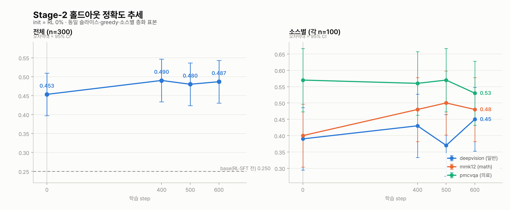
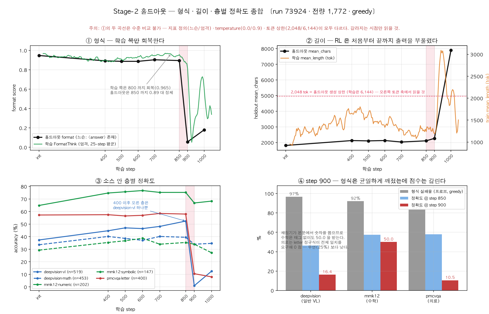

# Stage-2 확장셋 GDPO 본실행 — job 73924 중간 점검

**최초 작성 2026-08-02 20:13 (step 650) · 최종 갱신 2026-08-04 (step 1,046 · 체인 취소)**
**대상 체인 job 73924~73927(`gpu-8-002`) · 로그 `logs/grpo_adv_739*.log`**

> 재생성: 아래 [재생성](#재생성) 절 참조 — 로그를 여러 개 주면 체인이 병합된다.

이 문서는 ① 학습이 건강하게 도는지, ② 실제로 무엇이 학습되고 있는지, ③ 자원이 계획대로 쓰이는지를 실측으로 점검한다.

> 🚨 **최종 상태 (2026-08-04 10:14 KST): 학습 붕괴로 체인 취소.**
> **step ~900 에서 출력 형식이 무너지고 정책이 자유낙하**해, step 1200 게이트에 도달하지 못했다.
> 73925·73926·73927 을 취소했다(step 1,046 에서 정지). 상세 = **[§8](#8-학습-붕괴--step-900-2026-08-04)**.
>
> **살릴 것과 버릴 것이 갈린다:**
> - ✅ **step 850 이 최고점**(홀드아웃 51.52%). init 대비 **+8.18pp p<0.0001**,
>   step400 대비 **+2.48pp p=0.020** — 즉 **붕괴 직전까지 정상적으로 개선되고 있었다.**
> - ✅ §6-d 의 "step 400 이후 미검출"은 정체가 아니라 **분해능 부족**이었다(§8-g).
> - 🚨 **실패한 것은 학습이 아니라 안정성**이다. 유력한 근인은 `overlong_filter=True` 가
>   잘린 completion 을 손실·KL 양쪽에서 제외해 **앵커를 무력화**한 것(§8-d).
> - 🚨 **의료는 여섯 지점 전부 무변화** — 이것만은 붕괴와 무관하게 그대로 서 있다.

> 📄 **사후분석 보고서 = [`stage2_run73924_postmortem.md`](stage2_run73924_postmortem.md)** —
> 발견 경위 시간선, **실제 투입 데이터·실행 파라미터 전량 점검(로그 검증)**, 모델·하이퍼파라미터·데이터
> 3축 원인 식별. **이 문서의 4개 서술을 정정한다**(보고서 §5): §8-e 의 `max_grad_norm` 미발동,
> §2 의 KL NaN, §8-i ⑥ 의 소스 비율, §8-b 의 붕괴 서명 조건.

아래 §1~§7 은 붕괴를 발견하기 전(08-02~08-04 오전)의 점검 기록이며, 시간순으로 남긴다.
**§6-d 의 "400 이후 미검출" 결론은 §8-g 에서 뒤집혔고, §7 의 step 1200 판정은 실행되지 않았다.**
발표용 자립 요약은 [`stage2_overview_for_slides.md`](stage2_overview_for_slides.md).

---

## 1. 요약

| 항목 | 실측 (1~100 step → 최근 100 step) | 판정 |
|---|---|---|
| 진행 | **1,046 / 2,337 step 에서 취소** · 벽시계 ~296 s/it | 🚨 **붕괴(§8)** |
| **붕괴** | step ~900 형식 무너짐 → step ~1000 토큰 퇴화 | 🚨 **폭주 기전 규명**(§8-i ④) |
| └ 동역학 | 상시 잡음 바닥 0.1~0.5% + **배가 15 step** 지수 과정(R²=0.953) | 개시 사건 없음(§8-i ⑧) |
| └ 조기경보 | 비절단 형식실패율 50step창 1% → **49 step(4h) 여유** | ✅ 설계 확정 |
| └ 폭주 기전 | 전원 형식 위반 그룹에서 형식 z-score=0 → 복원 그래디언트 소실. 0% → **31.4%** | 🚨 쌍안정 함정 |
| **최고 체크포인트** | **step 850** 홀드아웃 51.52% (init 대비 +8.18pp) | ✅ 스냅샷 확보 |
| 안정성 | OOM · CUDA error · Traceback **0건**, mem 90.9 GiB | ✅ 무결 |
| **정확도 보상** | AccuracyMix 0.425 → 0.450 (**+5.8%**) | ⚠️ 대부분 **길이 구성효과**(§6-c) |
| 형식 보상 | FormatThink 0.946 → 0.958 (+1.3%) | 천장 부근 |
| 길이 | mean_length 1,127 → 1,176 tokens (+4.3%) | ✅ 401~500 정점 1,660 에서 회복 |
| 클리핑 | clipped_ratio 4.9% → 3.9% (−21.8%) | ✅ 정점 9.8% 에서 회복 |
| KL | 0.0036 → 0.0313 (**+765%**) | 정책 이탈 진행(절대값은 아직 작음) |
| **학습 로그 기울기 (§6-c)** | step 301~750, 장문 제외 · deepvision −0.05pp/100step | ⚠️ **판별 불가**(95% −14.4 ~ +12.9pp) |
| ~~홀드아웃 추세 (§6, n=300)~~ | ~~init 0.4533 → 400 0.4900 → 500 0.4800 → 600 0.4867~~ | 🔄 **§6-d 전량 재측정으로 대체** |
| **RL 순효과 (§6-d)** | init 43.34% → step400 **49.04%** · 짝지음 **+5.70pp** | ✅ **확정** (p<0.0001, 하한 ±2.20pp) |
| └ 400→700 (300 step) | +1.35pp · 95% [−0.6, +3.3]pp | ⚠️ 미검출 → **§8-g 에서 뒤집힘** |
| └ **400→850 (450 step)** | **+2.48pp** (deepvision +3.81) | ✅ **검출됨** p=0.020 — 정체가 아니었다 |
| └ **의료(pmcvqa)** | init 대비 +0.25 / −0.75 / −0.25 / +1.25 / **+0.75**pp | 🚨 **여섯 지점 전부 미검출**(n=400, ±3.5pp) |
| └ 형식·길이 대가 | format 0.947 → 0.887~0.903 · mean_chars 1,812 → ~2,100 | ⚠️ 길이 구성효과와 같은 방향 |
| **epoch 커버리지** | 2,337 step = **0.25 epoch** (1 epoch = 9,348) | 🚨 **계획 오류** |
| 오버헤드 | step_time 합 29.0h vs 실경과 58.2h → **50%가 step 밖** | ⚠️ 개선 여지 |

---

## 2. 학습 곡선


*옅은 선 = step별 원본(logging_steps=1) · 굵은 선 = 25-step 이동평균 · 우측 수치 = 이동평균 종점.*

### 구간 대조 (1~100 step 평균 vs 최근 100 step 평균, step 800 시점)

`scripts/plot_train_curves.py` 가 이 표를 그대로 출력한다 — 갱신 시 재실행할 것.

| 지표 | 1~100 | 최근 100 | 변화 |
|---|---:|---:|---:|
| reward (총합) | 0.6019 | 0.6309 | +4.8% |
| rewards/AccuracyMix/mean | 0.4248 | 0.4495 | **+5.8%** |
| rewards/FormatThink/mean | 0.9461 | 0.9583 | +1.3% |
| rewards/SoftOverlong/mean | −0.0606 | −0.0512 | +15.5% (페널티 완화) |
| kl | 0.0036 | 0.0313 | +765.3% |
| entropy/mean | 0.5377 | 0.5227 | −2.8% |
| completions/mean_length | 1,127 | 1,176 | +4.3% |
| completions/clipped_ratio | 0.0494 | 0.0386 | −21.8% |
| reward_std | 0.4951 | 0.4932 | −0.4% |
| frac_reward_zero_std | 0.0044 | 0.0156 | +257.1% |
| step_time | 146.1s | 147.2s | +0.8% |

### 읽기

> ⚠️ **초판(step 650 시점)은 이 표를 "정확도 정지 + 길이 인플레이션"으로 읽었다. 그 판독은 구간을 잘못 잡은 것이었다.**
> 길이 팽창은 **200~500 구간에 국한된 일시적 현상**이었고 700 step 대에 전부 되돌아왔다.
> 당시 "최근"으로 잡은 551~650 이 하필 그 회복 도중이라 팽창 상태가 정상인 것처럼 보였다.

- **길이 인플레이션은 왔다가 지나갔다.** mean_length 는 1,127 → **1,660**(401~500 정점) → 1,176 으로 돌아왔고,
  클리핑도 4.9% → **9.8%** → 3.9%, 형식준수도 0.947 → **0.899** → 0.958 로 회복했다.
  SoftOverlong 페널티가 −48.5% 에서 +15.5% 로 뒤집힌 것이 같은 사건이다.
- **AccuracyMix 는 +5.8% 올랐지만 대부분 실력이 아니다.** 장문 completion 은 정답률이 **15.1%** 로
  비장문 **44.2%** 의 3분의 1이라(deepvision), 장문 비중이 줄면 실력이 그대로여도 평균이 오른다.
  장문 제외 기준으로 남는 상승은 +0.8pp(t=0.64, 미검출) — 상세 §6-c.
- **엔트로피는 붕괴하지 않았다** (0.538 → 0.523). 다양성 붕괴 징후 없음 — `docs/rlvr_hparams_external.md` 의 경고 구간 미도달.
- **KL 은 765% 늘었지만 절대값 0.031 로 작다.** β=0.04 제약이 살아 있고 clip_ratio 도 0.0009 수준이라 폭주 상태는 아니다.
  250~400 구간의 가파른 상승이 길이 팽창 시작점과 겹친다.
- **`frac_reward_zero_std` 가 0.0044 → 0.0156 으로 3.5배** 늘었다. 그룹 내 롤아웃이 모두 같은 보상을 받아
  **advantage 가 0 이 되는 배치**가 느는 방향이다. 절대값은 아직 1.6% 로 작고 `dynamic_sample`(max_resample 3)이
  흡수하고 있으나 추세는 주시할 것.
- `All completions are overlong and truncated` 경고는 길이 정점 구간에 집중됐다(650 step 기준 203회 = 31%).
  이 경고는 **배치 전체가 잘려 `overlong_filter` 가 손실 마스크를 전부 0 으로 만든** rank·step 을 뜻하고,
  그 rank·step 은 **손실에도 KL 앵커에도 기여하지 않는다**(§8-d). 길이 회복과 함께 줄었다가
  붕괴 때 되돌아온다 — 850~899 **10건** → 900~949 **52건**(5.2배) → 950~999 38 → 1000~1049 28.

  > ⚠️ **초판의 "해당 step 은 KL 이 NaN 이라 KL 제약이 사실상 무효였다" 는 재현되지 않는다.**
  > 73924·73925 로그 전수 검사에서 `'kl': 'nan'` 은 **0건**이고 `train_metrics.csv` 1,047 행에도
  > NaN·결측이 없다. **마스킹은 실재하나 NaN 으로 나타나지 않았다** — 위 건수가 실제 정량이다.
  > → [사후분석 §3-6](stage2_run73924_postmortem.md)

---

## 3. epoch 커버리지 — 계획 전제가 4배 틀렸다

`scripts/launch_stage2_expanded_epoch.sh` 는 1 epoch 을 이렇게 산정했다.

```
1 epoch = 74,787 / 32(step당 프롬프트: 1 × accum4 × 8gpu) ≈ 2,337 step
```

**이 32 는 프롬프트 수가 아니라 completion 수다.** GRPO 에서 `per_device_train_batch_size` 는 completion 을 세며,
`generation_batch_size` 가 `None` 이므로 TRL/ms-swift 기본식이 적용된다.

```
generation_batch_size = pdtbs(1) × world_size(8) × steps_per_generation(=grad_accum 4) = 32 completions
프롬프트/step        = 32 ÷ num_generations(4)                                        =  8 prompts
1 epoch              = 74,787 ÷ 8                                                     = 9,348 step
```

**로그가 이를 확증한다**: step 627 × 8 = 5,016 행, 5,016 / 74,787 = **0.06706** — 로그의 `epoch: 0.06707` 과 일치.
(공식이 맞다면 `epoch` 이 0.268 로 찍혀야 한다.)

### 결과

| | 계획이 믿은 값 | 실제 |
|---|---|---|
| MAX_STEPS=2,337 의 의미 | 1 epoch (100%) | **0.25 epoch** |
| 현재 630 step | 0.27 epoch | **0.067 epoch** |
| 확장셋 74,787건 중 노출 | 전량 | **약 25%** |
| 진짜 1 epoch(9,348 step) 비용 | — | ≈ 837h · **6,694 노드시간 = 예산 5,000의 134%** |

**예산은 안전하다.** `max_steps=2337` 이 상한이라 `num_train_epochs=3.0` 설정과 무관하게 2,337 에서 멈추며,
2,337 step × 322 s/it × 8 GPU ≈ **1,674 노드시간**으로 계획서의 1,719(34%) 와 사실상 같다. 지금 도는 job 과 비용은 계획대로다.

**틀린 것은 라벨과 그로부터 나온 판단 근거다.**

1. 확장셋의 **75%는 한 번도 학습에 노출되지 않는다.** 이번 확장의 핵심이던 MMK12(math 20%)·PMC-VQA(의료 26%) 추가분 상당량이 미사용으로 남는다.
2. 따라서 중간 평가에서 홀드아웃이 포화로 보여도 **방법의 한계인지 데이터 미노출 탓인지 구분되지 않는다.** "포화 시 조기중단" 정책의 전제가 흔들린다.
3. "2 epoch 은 69% 라 미채택" 이라는 서술은 실제로는 "0.5 epoch" 이야기다. 진짜 1 epoch 은 예산의 134% 로 **애초에 실행 불가능한 계획**이었다.

> 다만 §2 의 실측을 보면 데이터 미노출이 정체의 주원인이라고 단정할 수 없다. 650 step 동안 본 5,200 개 프롬프트만으로도
> 정확도 보상이 전혀 안 오르는 상태라, **데이터 양보다 보상 신호·길이 예산 쪽 문제일 가능성이 높다.**

---

## 4. 자원 — 오버헤드 50%

| | 값 |
|---|---|
| step_time 합계 (650 step) | 29.0h |
| 실제 경과 | 58.2h |
| **step 밖 오버헤드** | **29.2h (50.2%)** |
| 실효 속도 | 322 s/it (step_time 161s 의 2.0배) |

`--use_vllm true --vllm_mode colocate --sleep_level 1` 구성에서 롤아웃 생성·sleep/wake 전환,
`--dynamic_sample true --max_resample_times 3` 재샘플링, `save_steps 50` 체크포인트가 여기에 들어간다.
GRPO colocate 의 구조적 비용이라 전부 제거할 수는 없으나, **절반이 학습 밖에 쓰이고 있다는 사실은 기록해 둔다.**

---

## 5. 체인 소진 예측

- 73924 는 TimeLimit `2-22:00:00`(종료 2026-08-03 07:40)에서 **787 step** 도달 후 resume 인계 — **실측**
- 잡당 70h ÷ 294 s/it ≈ **857 step** → 73925 가 ~1,607 까지, **73926 중 2,337 step 도달**,
  완주 ≈ **2026-08-08~09** (잡 간 큐 대기 별도)
- 73927 은 여유분 (MAX_STEPS 도달 시 자동 no-op)

> ⚠️ **재개 시 마지막 저장 이후 구간이 버려진다.** 73924 는 787 까지 갔지만 checkpoint-750 에서 재개했으므로
> **37 step 이 유실**됐다(`save_steps=50` 구조상 정상). 체인 4잡이면 최대 200 step 가량이 이런 식으로 사라진다.
>
> ⚠️ **재개할 때마다 출력 디렉터리가 새로 생긴다** — 73924 `v0-20260731-094532`, 73925 `v1-20260803-074645`.
> `save_total_limit=5` 는 트레이너가 **자기 디렉터리만** 관리하므로 **v0 의 550~750 은 영구 보존**된다.
> 체크포인트 확보 면에서는 유리하지만, 경로를 박아 쓴 스크립트는 재개 후 전부 깨진다.

---

## 6. 중간 홀드아웃 평가 — job 74060 (2026-08-02 완료)

> 🔄 **이 절의 수치는 [§6-d](#6-d-전량-재측정--분해능-문제가-해결됐다-2026-08-04) 의 전량 1,772 측정으로 대체됐다.**
> 여기서 "판별 불가"로 남았던 init → 400 은 전량에서 **+5.70pp, p<0.0001** 로 확정된다.
> 이 절은 그 판단이 어떤 측정 위에서 내려졌는지의 기록으로 남긴다 — 삭제하지 않는 이유는
> **"판별 불가"가 "효과 없음"이 아니었다는 사례 자체**가 이 프로젝트의 교훈이기 때문이다.

`scripts/eval_midtrain.slurm` · `debug-1gpu` · 55분 · ExitCode 0.
`stage2_expanded_holdout.jsonl`(1,772)에서 `_source` 별 **100건씩 층화 추출한 300건**을
base / init(RL 0%) / trained(step 600) 세 모델에 **동일 슬라이스·동일 조건**(greedy, `temperature=0.0`,
같은 노드·vLLM·시스템 프롬프트)으로 채점.

> ⚠️ 이 평가를 돌리려면 평가 경로를 loader 로 포팅해야 했다([a22d16c]) — 평가 스크립트 9종이 전부
> apptainer 파손(07-27) **이전** 작성이라 `singularity exec` 직접 호출로 실행 불가 상태였다.
> 본실행 2.5일째까지 중간 평가가 한 번도 못 돈 이유다. 표본 추출 버그(앞에서 N줄 자르기 → 전부
> deepvision)도 함께 고쳤다([cf3ee48]).

| 지표 | base | init (RL 0%) | trained (step 600) |
|---|---:|---:|---:|
| **accuracy (n=300)** | 0.2500 | **0.4533** | **0.4867** |
| format(`<answer>`) | 0.333 | 0.960 | 0.937 |
| mean_chars | 5,607 | 1,774 | 1,906 |
| errors | 0/300 | 0/300 | 0/300 |
| deepvision (n=100) | 0.12 | 0.39 | 0.45 |
| mmk12 · math (n=100) | 0.31 | 0.40 | 0.48 |
| **pmcvqa · 의료 (n=100)** | 0.32 | **0.57** | **0.53** |

층별(`_stratum`): numeric 0.538→0.577→**0.769** · vl 0.143→0.464→0.518 · math 0.091→0.296→0.364 ·
letter 0.320→0.570→0.530 · symbolic 0.026→0.132→**0.079** · other 0.200→0.500→0.500

### 판정 — 사전에 정한 "애매" 구간

**init → trained = +3.34pp.** 경계(±3pp)를 아슬아슬하게 넘겼으나 **통계적으로 0과 구분되지 않는다.**

| 비교 | 차이 | 95% CI | p | 판정 |
|---|---:|---|---:|---|
| **trained − init** (전체) | **+3.34pp** | [−4.64, +11.32]pp | 0.412 | 유의하지 않음 |
| deepvision | +6.00pp | [−7.66, +19.66]pp | 0.389 | 유의하지 않음 |
| mmk12 (math) | +8.00pp | [−5.71, +21.71]pp | 0.253 | 유의하지 않음 |
| pmcvqa (의료) | −4.00pp | [−17.78, +9.78]pp | 0.569 | 유의하지 않음 |
| *(참고)* init − base | +20.33pp | [+12.86, +27.80]pp | **<0.001** | **유의** |

같은 표본을 쓴 대응(paired) 비교로 보정해도 상관 r=0.7 가정에서 p=0.134 로 유의하지 않다.
반면 base→init 은 명확히 유의하다 — **이 평가 설계는 실재하는 효과를 잡아낸다.** 콜드스타트 SFT 는
확실히 작동했고, RL 600 step 은 그만한 신호를 내지 못하고 있다.

### 읽기

- **의료가 유일한 하락 방향이다.** pmcvqa 0.57 → 0.53. 유의하지 않은 변동이나 **프로젝트 목표 도메인**이
  유일하게 내려갔다는 점은 가볍게 넘길 신호가 아니다. 반대로 numeric(mmk12) 은 0.577 → 0.769 로 최대 상승.
  잠정적으로 **일반·수학은 오르고 의료는 정체~하락**이라는 그림이다.
- **길이 인플레이션이 홀드아웃에서도 재현된다.** mean_chars 1,774 → 1,906(+7.4%), format 0.960 → 0.937.
  §2 의 학습측 관측(길이 +28.1%, FormatThink −1.8%)과 같은 방향이다.
- **base 의 낮은 점수에는 형식 미준수가 섞여 있다**(format 0.333). `accuracy_mix` 가 `<answer>` 를 파싱하므로
  형식을 못 지키면 정답이어도 감점된다. 다만 판단에 쓰는 init vs trained 는 둘 다 형식이 잡혀 있어 무관하다.

### 검정력 — n=300 으로는 애초에 못 잡는다

| 잡으려는 차이 | 필요한 모델당 n (검정력 80%, 양측 5%) |
|---|---:|
| 8pp | ≈ 613 |
| 5pp | ≈ 1,566 |
| 3pp | ≈ 4,339 |

n=300 은 **8pp 이상만** 검출한다. 즉 +3.34pp 는 "효과가 없다"가 아니라 **"이 표본으로는 알 수 없다"** 이다.
홀드아웃 전량(1,772)을 쓰면 모델당 약 590 건까지 올릴 수 있어 8pp 는 확실히, 5pp 는 부분적으로 잡힌다.

<details><summary>원시 결과 (logs/ 는 gitignore 라 여기 보존)</summary>

```json
{"tag": "base", "n": 300, "accuracy": 0.25, "format": 0.333, "mean_chars": 5607.0, "errors": 0, "per_stratum": {"math": 0.0909, "vl": 0.1429, "symbolic": 0.0263, "numeric": 0.5385, "other": 0.2, "letter": 0.32}, "per_source": {"deepvision": 0.12, "mmk12": 0.31, "pmcvqa": 0.32}}
{"tag": "init", "n": 300, "accuracy": 0.4533, "format": 0.96, "mean_chars": 1774.0, "errors": 0, "per_stratum": {"math": 0.2955, "vl": 0.4643, "symbolic": 0.1316, "numeric": 0.5769, "other": 0.5, "letter": 0.57}, "per_source": {"deepvision": 0.39, "mmk12": 0.4, "pmcvqa": 0.57}}
{"tag": "trained", "n": 300, "accuracy": 0.4867, "format": 0.937, "mean_chars": 1906.0, "errors": 0, "per_stratum": {"math": 0.3636, "vl": 0.5179, "symbolic": 0.0789, "numeric": 0.7692, "other": 0.5, "letter": 0.53}, "per_source": {"deepvision": 0.45, "mmk12": 0.48, "pmcvqa": 0.53}}
```

재현: `sbatch --partition=debug-1gpu --export=ALL,MID_CKPT=$PWD/work/checkpoints/_mideval_snap_step600,EVAL_DATA=work/data/stage2_expanded_holdout.jsonl,EVAL_N=300,EVAL_CONC=16 scripts/eval_midtrain.slurm`

</details>

### 추세 재측정 — job 74062(ckpt-400) · 74063(ckpt-500), 병렬 15·24분

step 600 단독으로는 판정이 안 돼 400·500 을 같은 슬라이스(`EVAL_N=300`·`EVAL_SEED` 동일)로 추가 측정했다.



| | init (0) | step 400 | step 500 | step 600 |
|---|---:|---:|---:|---:|
| **전체** (n=300) | 0.4533 | **0.4900** | 0.4800 | 0.4867 |
| deepvision | 0.39 | 0.43 | 0.37 | 0.45 |
| mmk12 (math) | 0.40 | 0.48 | 0.50 | 0.48 |
| pmcvqa (의료) | 0.57 | 0.56 | 0.57 | 0.53 |
| format / mean_chars | 0.960 / 1,774 | 0.930 / 1,965 | 0.933 / 1,934 | 0.937 / 1,906 |

**단조 증가가 아니다.** 0.4533 → 0.4900 → 0.4800 → 0.4867 — 400 이후 세 점의 폭이 **1.0pp** 다.

- init → 400: **+3.67pp**
- **400 → 600: −0.33pp** (200 step · 143 노드시간)
- init → 400~600 평균: +3.23pp, p=0.428
- 소스별: **math(mmk12) 0.40 → 0.48~0.50 이 가장 뚜렷**, deepvision 은 노이즈,
  **의료(pmcvqa)는 0.57 → 0.56 → 0.57 → 0.53 으로 상승 구간이 없다**(단 소스별 n=100, ±9.8pp)

### 이 데이터가 말하는 것과 말하지 않는 것

**⚠️ 초판(2026-08-02 21:30)은 위 표를 "step 400 포화"로 읽고 조기중단을 권고했다. 그 판독은 과했다.**

두 체크포인트 차이의 **95% 검출 하한(MDE)** 을 계산하면 다음과 같다.

| n | 비짝지음(현재 방식) | 짝지음(McNemar, 불일치율 25% 가정) |
|---:|---:|---:|
| **300**(현재) | **8.0pp** | 5.7pp |
| 600 | 5.7pp | 4.0pp |
| **900** | 4.6pp | **3.3pp** |
| **1,200** | 4.0pp | **2.8pp** |

관측된 400~600 폭 1.0pp 가 검출 하한 8.0pp 보다 작다는 사실이 뜻하는 것은
**"차이가 없다"가 아니라 "이 표본으로는 차이를 볼 수 없다"** 이다. 검정력이 없는 검정에서 귀무가설을 채택하면 안 된다.

- ✅ **배제되는 것**: 200 step 만에 8pp 이상 뛰는 **급격한** 상승. 그런 것은 없다.
- ❌ **배제되지 않는 것**: 200 step 당 1~2pp 규모의 **완만한** 상승. 관측치와 완전히 양립한다.
  그 기울기가 실제라면 잔여 1,653 step 에서 **+8~16pp** 가 되고, 이는 0.49 대비 상대 +16~33% 로 결코 작지 않다.

즉 **"더 학습하면 늘어나나"의 답은 아직 "모른다"** 이다. 1,184 노드시간짜리 결정을
검출 하한 8pp 짜리 측정으로 내리는 것이 문제의 본질이고, 해법은 결정을 서두르는 것이 아니라
**측정의 분해능을 올리는 것**이다 — 재평가 비용은 결정 대상의 0.2% 다(§7).

> ⚠️ **과거 수치와 가로 비교 금지**: 문서에 남은 v3 0.348 · dr_grpo 0.380 · GDPO 0.390 · GSPO 0.290 은
> **구 홀드아웃**(`deepvision_holdout.jsonl`, 972)에서 잰 값이다. 위 표는 확장 홀드아웃 층화 표본이라
> 모집단이 다르다. 굳이 대응시키면 init 의 deepvision 층 0.39 가 과거 v3 0.348 과 같은 계열이다.

### 6-c. 학습 로그도 "더 학습하면 오르나"에 답하지 못한다 (2026-08-03)

`log_completions true` 가 남긴 `completions.jsonl` 에는 **문항별 정답 여부**가 다 들어 있다.
step ≤750 에서 **24,000 개 완성문** — 홀드아웃 n=300 의 **80배**다. 질문 텍스트로 학습셋과 조인해 **소스를 100% 매칭**했다.
표본이 이만큼 크면 홀드아웃이 못 보던 기울기가 보일 것으로 기대했는데, **결과는 아니었다.**


> ⚠️ **이 절의 초판(2026-08-03 09:20)은 "deepvision +0.54pp/100step 유의, 잔여 외삽 +8.3pp" 를 계속 쪽 근거로 제시했다.
> 그 판독은 틀렸고 철회한다.** 아래 ②·③ 이 이유다. 어제 §6 에서 지적한 것과 같은 종류의 오류를 —
> 검정력 없는 적합에서 결론을 읽어내는 — 반대 방향으로 되풀이한 것이다.

**① 최근 상승의 대부분은 실력이 아니라 길이 구성이다.**
장문(SoftOverlong≠0) completion 은 정답률이 훨씬 낮다(deepvision 원 계열 39.4% vs 장문 제외 44.6%).
장문 비중이 10.97% → 15.41% → 16.78% → **11.87%** 로 갔다가 돌아오면서, 평균이 저절로 오르내렸다.
원 계열의 601~750 점프 **+2.4pp** 중 장문 제외 기준으로 남는 것은 **+0.8pp** 뿐이고 그마저 t=0.64 로 미검출이다.

**② 전구간 기울기를 외삽한 것이 오류였다.** 장문 제외 계열은 **초기 상승 후 평탄**한 모양이다
(42.2% → 44.6% → 44.7% → 45.5%). 이 곡선에 직선을 맞추면 t=+2.68 이 나오지만, 그 유의성은
**이미 지나간 초기 상승**에서 온 것이지 앞으로의 기울기가 아니다.

**③ 결정에 필요한 것은 "지금부터의 기울기"인데, 그건 판별되지 않는다.**

| 소스 | step 301~750 기울기 (장문 제외) | 잔여 1,587 step 외삽 |
|---|---|---|
| deepvision | −0.047 pp/100step (t=−0.11, 미검출) | **−0.7pp** [95% **−14.4 ~ +12.9**] |
| mmk12 수학 | +0.195 (t=+0.17, 미검출) | +3.1pp [−31.7 ~ +37.9] |
| pmcvqa 의료 | +0.906 (t=+1.23, 미검출) | +14.4pp [−8.5 ~ +37.2] |

세 소스 모두 **0 을 크게 포함**한다. 표본 24,000 건으로도 이렇다 —
**정확도의 수준을 재는 것과 기울기를 재는 것은 다른 문제**이고, 결정에 필요한 것은 후자이기 때문이다.
스텝 간 분산이 커서 유효 표본은 "완성문 24,000" 이 아니라 "스텝 450 개"에 가깝다.

교란요인은 확인해서 배제했다(이 부분은 초판 그대로 유효하다):

- **데이터 순서 아님.** `stage2_expanded_train.jsonl` 은 소스순 정렬(deepvision 0~53% → mmk12 → pmcvqa)이라
  셔플이 없으면 2,337 step(1 epoch 의 25%) 내내 deepvision 만 학습될 뻔했다.
  실행 인자에 `dataset_shuffle=True` · `train_dataloader_shuffle=True` 확인 → 매 스텝 혼합 표본이다.
- **암기 아님.** 최종 epoch 가 0.25 라 어떤 문항도 두 번 나오지 않는다. 학습 정확도가 사실상 **fresh-sample** 측정이다.
- **재개 중복 제거.** 73924 는 step 787 까지 갔는데 checkpoint-750 에서 재개했으므로 **751~787 이 두 런에 모두 남는다.**
  그대로 합치면 그 구간만 표본이 2배가 된다(초판은 이걸 안 걸렀다). `plot_train_curves.py` 와 같은 규약으로 나중 런이 이긴다.
- **의료는 길이 영향 없음.** pmcvqa 는 장문 비율이 **전 구간 0.00%** 다(객관식이라 답이 짧다).
  따라서 의료의 원 계열 = 장문 제외 계열이고, 길이 인플레이션과 무관하게 읽어도 된다.

> ⚠️ **step 400/500/600 홀드아웃 평가는 하필 길이 인플레이션 저점에서 찍혔다** — 절단률 정점(9.8%)·형식준수 최저(0.899)가 정확히 401~500 구간이다.
> 현재는 회복됐다(절단 3.7% · 형식 0.960). 이 사실 자체는 유효하며, step 1200 재측정이 저점이 아닌 지점에서 이뤄진다는 뜻이다.

**결론: 학습 로그는 이 결정의 근거가 될 수 없다.** 계속 쪽으로도 중단 쪽으로도 마찬가지다.
남는 것은 §7 의 경로 그대로다 — **홀드아웃 전량(1,772) + 짝지음으로 검출 하한을 2.3pp 로 낮추고 step 1200 에서 판정한다.**
(→ 그 조치는 **§6-d 에서 실행됐고, 하한은 실측 1.7~2.3pp 로 내려갔다.** 이 절의 "판별 실패" 결론 자체는 유효하다.)
이 절의 소득은 근거가 아니라 **근거가 없다는 확인**, 그리고 부수적으로 얻은 길이-구성 메커니즘·재개 중복 버그다.

> 재현: `python3 scripts/train_source_trend.py --until 750` (수치만; 호스트 python3)
> · 그림까지: `./bin/python scripts/train_source_trend.py --until 750 -o docs/assets/stage2_source_trend.png`
> `--until` 을 안 주면 학습이 진행되는 동안 수치가 계속 바뀐다.

### 6-d. 전량 재측정 — 분해능 문제가 해결됐다 (2026-08-04)

§7-1 의 조치를 실행했다. **홀드아웃 전량 1,772**(deepvision 972 / mmk12 400 / pmcvqa 400)에서
`init·400·500·600·700` 다섯 지점을 재측정하고, 문항별 점수를 저장해 **짝지음(McNemar)** 으로 비교했다.
검출 하한이 **8.0pp → 1.7~2.3pp** 로 내려갔다.

| job | 74187 | 74137 | 74188 | 74189 | 74190 |
|---|---|---|---|---|---|
| 대상 | init(`sft_mixed_merged`) | step 400 | step 500 | step 600 | step 700 |
| 소요 | 1:00:44 | 1:16:17 | 1:10:07 | 1:11:46 | 0:55:08 |


| (%) | **init**(RL 0%) | step 400 | step 500 | step 600 | step 700 |
|---|---:|---:|---:|---:|---:|
| **전체** (n=1,772) | **43.34** | 49.04 | 49.55 | 49.32 | **50.40** |
| deepvision 일반 (n=972) | 35.60 | 42.59 | 43.11 | 42.08 | 44.44 |
| mmk12 수학 (n=400) | 48.25 | 56.25 | 58.25 | 59.25 | 56.75 |
| **pmcvqa 의료** (n=400) | 57.25 | 57.50 | 56.50 | 57.00 | 58.50 |
| format / mean_chars | 0.947 / 1,812 | 0.892 / 2,124 | 0.887 / 2,103 | 0.887 / 2,126 | 0.903 / 2,031 |

**짝지음 판정** — 같은 문항을 두 모델이 푼 것이므로 짝지음이 맞다. `p` 는 이항 정확검정, `±` 는 실측 불일치율 기반 검출 하한.

| 비교 | 전체 | deepvision | 수학 | 의료 |
|---|---|---|---|---|
| init → 400 | **+5.70pp** ±2.20 p<0.0001 ✅ | +7.00 ±3.24 ✅ | +8.00 ±4.60 ✅ | +0.25 ±3.50 ✗ |
| init → 500 | **+6.21pp** ±2.19 p<0.0001 ✅ | +7.51 ±3.19 ✅ | +10.00 ±4.60 ✅ | −0.75 ±3.57 ✗ |
| init → 600 | **+5.98pp** ±2.26 p<0.0001 ✅ | +6.48 ±3.36 p=0.0002 ✅ | +11.00 ±4.60 ✅ | −0.25 ±3.50 ✗ |
| init → 700 | **+7.05pp** ±2.23 p<0.0001 ✅ | +8.85 ±3.30 ✅ | +8.50 ±4.49 ✅ | +1.25 ±3.63 ✗ |
| 400 → 500 | +0.51pp ±1.72 p=0.61 ✗ | +0.51 ✗ | +2.00 ✗ | −1.00 ✗ |
| 400 → 600 | +0.28pp ±1.78 p=0.80 ✗ | −0.51 ✗ | +3.00 ±2.94 p=0.065 △ | −0.50 ✗ |
| **400 → 700** | **+1.35pp ±1.91 p=0.18 ✗** | +1.85 ±2.89 ✗ | +0.50 ±3.32 ✗ | +1.00 ±3.32 ✗ |

#### 세 갈래로 갈렸다

**① RL 순효과는 확정됐다.** init → 400 이 **+5.70pp, p<0.0001**. n=300 시절 이 값은 "+3.67pp, p=0.428, 판정불가"였다.
효과가 없던 게 아니라 **±9.8pp 노이즈에 묻혀 있던 것**이고, 그게 §6 의 "판별 불가"가 뜻하던 바다.
불일치 문항이 397건(A만 148 / B만 249)이라 짝지음이 비짝지음보다 훨씬 좁아진다.

**② 그러나 그 이득은 step 400 까지에 거의 다 실렸다.** 400 이후 세 구간이 모두 미검출이고,
가장 간격이 큰 400 → 700(300 step)조차 **+1.35pp(p=0.18)** 다. 다만 이제는 **"볼 수 없음"에 상한이 붙는다** —
95% 구간이 **[−0.6, +3.3]pp** 이므로 *큰* 상승은 배제되지만 **+3pp 는 배제되지 않는다.**
§7-2b 의 판정선이 정확히 +3pp 이고 **400 vs 1200 의 하한이 ±1.9pp** 이므로, 실제 Δ 가 +3pp 라면 step 1200 에서 검출된다.

> ⚠️ **여기서 외삽하지 않는다.** "300 step 에 +1.35pp 니 800 step 이면 +3.6pp" 같은 계산은 하지 않는다 —
> 기울기가 일정하다는 근거가 없고, 이는 §6-c 에서 철회한 것과 **같은 종류의 오류**다(그때는 반대 방향이었을 뿐).
> 800 step 간격의 값은 측정으로만 안다.

**③ 의료(pmcvqa)는 네 지점 전부 미검출이다.** +0.25 / −0.75 / −0.25 / +1.25pp, 모두 p>0.5.
n=100(±9.8pp) 때는 "노이즈일 수 있다"였지만 **n=400(±3.5pp)에서도 그대로**다. 네 번의 독립 측정이 같은 방향을 가리킨다.
§7-2b 의 중단선(−3pp)에는 걸리지 않으나, **RL 이 목표 도메인을 올리지 못하고 있다**는 사실 자체가
Stage-3(의료 RaR)의 존재 이유를 강화한다 — 의료를 올리도록 설계된 유일한 단계다.

#### 부수 관찰 — 형식·길이의 대가

`format` 이 **0.947 → 0.887~0.903 (−6pp)**, 동시에 `mean_chars` **1,812 → ~2,100 (+16%)** 다.
§6-c 에서 찾은 **길이 구성효과**(장문 응답 deepvision 15.1% vs 비장문 44.2%)와 방향이 같다.
전체 정확도가 오르는 와중에도 이 손실은 누적되고 있으며, §7 의 "길이 예산 재검토" 항목을 뒷받침한다.

#### 읽을 때 주의

- **그림 왼쪽 패널의 점별 오차막대는 비짝지음**이라 서로 겹친다. 그걸 보고 "차이 없다"고 읽으면 안 된다 —
  판정축은 가운데·오른쪽 **짝지음** 패널이다. `plot_eval_trend.py` 는 소스별 n 을 `n//3` 으로 가정하므로
  전량(972/400/400)에는 쓰면 안 된다. 이 그림은 `plot_holdout_paired.py` 가 문항별 파일에서 직접 그린다.
- **base 는 이 전량 셋에서 재측정하지 않았다**(§6 의 n=300 층화 기준 0.2500). 비교 대상이 init 이므로 필요 없었다.
- **전체 accuracy 를 §6 의 n=300 값과 직접 비교하지 말 것** — 층화 표본은 소스 가중 1/1/1, 전량은 55/23/23 이다.
  §6-d 표의 init 0.4334 와 §6 표의 init 0.4533 이 다른 것은 이 가중치 차이지 측정 오차가 아니다.

> 재현:
> ```bash
> python3 scripts/eval_paired.py logs/eval_items_init_74187.jsonl \
>     logs/eval_items_step700_74190.jsonl --by source        # 수치만, 호스트 python3
> ./bin/python scripts/plot_holdout_paired.py logs/eval_items_*.jsonl \
>     -o docs/assets/stage2_holdout_paired.png               # 그림
> ```

---

## 7. 권고

**원칙: 지금은 아무것도 취소하지 않는다.** 중단은 되돌릴 수 없고(체인 4개 동시 `scancel`),
그 결정을 내리기에 현재 측정은 분해능이 부족하다. 대신 **판별 가능한 재측정을 먼저 하고, 중단기준을 미리 못 박는다.**

| # | 조치 | 근거 | 우선도 |
|---|---|---|---|
| **0** | **학습 계속 — 73924~73927 유지** | §6 — "포화"는 미확인. 완만한 상승(200 step 당 1~2pp)이 배제되지 않았고, 그 크기면 잔여 구간에서 +8~16pp. 예산도 제약이 아니다(끝까지 46%) | **높음** |
| ~~**1**~~ | ✅ **완료 (2026-08-04, §6-d)** — n=300 → **홀드아웃 전량 1,772**, per-item 점수 저장 → **짝지음(McNemar)** | 검출 하한 8.0pp → **실측 1.7~2.3pp**. 5개 잡 합계 **5.6 노드시간**으로 결정 대상 1,184 의 **0.5%** | **완료** |

**검출 하한** — 계획 시점의 가정치와 §6-d 의 실측:

| 구성 | n | 소스별 | 비짝지음 | **짝지음(가정 25%)** | **실측(§6-d)** |
|---|---:|---|---:|---:|---:|
| 현행 층화 (구) | 300 | 100 / 100 / 100 | 8.0pp | 5.7pp | — |
| 층화 상한 | 1,200 | 400 / 400 / 400 | 4.0pp | 2.8pp | — |
| **전량 (채택)** | **1,772** | **972 / 400 / 400** | 3.3pp | 2.3pp | **1.72 ~ 2.26pp** |

**실측이 가정보다 좋았다.** 인접 체크포인트끼리는 불일치율이 낮아(400 vs 500 은 241/1,772 = 13.6%) 하한이 **±1.72pp** 까지 내려간다.
init 처럼 멀리 떨어진 쌍은 불일치가 커져(397건 = 22.4%) **±2.20pp** 다 — 즉 **비교 쌍마다 하한이 다르다.**
`eval_paired.py` 는 가정하지 않고 매번 실측 불일치율로 하한을 출력한다.

**1 번이 성립하는 사실들**:

- **층화로는 1,600 이 상한이다.** 확장 홀드아웃 1,772 = deepvision 972 / mmk12 400 / pmcvqa 400 이라
  균등 추출은 소스별 400 에서 막힌다(`EVAL_N=2400` 을 줘도 1,600 건). 전량을 쓰려면 층화를 우회해야 하고,
  그래서 `EVAL_N=all` 경로를 추가했다(2026-08-03).
- **소스별 n 이 100 → 972/400/400** 이 되어 **의료 판정이 ±9.8pp → 실측 ±3.5pp**, deepvision 은 ±2.7~3.4pp 로 좁혀졌다.
- **기존 측정이 무효화되지 않는다** — 시드 고정 층화 슬라이스이므로 **n=300 슬라이스 ⊂ 전량**이다(실측 확인).

> 🚨 **전량은 소스 가중치가 다르다 — 전체 accuracy 를 과거 n=300 값과 직접 비교하지 말 것.**
> 층화 n=300 에서 전체값은 세 소스의 단순 평균(각 33.3%)이지만, 전량에서는
> **deepvision 54.9% / mmk12 22.6% / pmcvqa 22.6%** 가중이다. 따라서
> **step400@전량 vs step1200@전량 비교만 유효**하고, step400@n=300(0.4900)과는 모집단이 다르다.
> 소스별 수치는 가중치와 무관하므로 언제나 비교 가능하다.

> ⚠️ 2.3pp 는 **불일치율 25% 가정**값이다. 같은 런의 인접 체크포인트는 상관이 높아 불일치율이 더 낮을 가능성이 크고(하한 더 좋아짐),
> 반대로 낮은 상관이면 비짝지음(3.3pp)에 가까워진다. `eval_paired.py` 는 **가정하지 않고 실측 불일치율로 하한을 출력**한다.
| **2** | **step 1200 에서 판정** (step 400 대비 800 step 간격) · **감시 자동화 완료** | 간격이 커야 완만한 기울기가 누적돼 검출 하한을 넘는다. §6-d 에서 400→700(300 step)이 **+1.35pp, 95% [−0.6, +3.3]pp** 였으므로 **+3pp 는 아직 배제되지 않았고**, 400 vs 1200 하한이 **±1.9pp** 라 실제 Δ 가 +3pp 면 검출된다. 도달 **2026-08-04 22:30경**(09:20 기준 step 1,038, 296 s/it). `scripts/watch_and_eval.sh` 가 감시·스냅샷·제출을 자동으로 한다 | **높음** |
| **2b** | **사전 중단기준**(사후 해석 방지 — 지금 못 박는다) | **판정축 = 전체(3 소스 합성)**. §6-c 초판은 deepvision 을 판정축으로 삼았으나 그 근거(deepvision 만 유의하게 상승)가 철회됐다. 층별 우열에 대한 사전 근거가 없으므로 **미리 한 층을 고르는 것 자체가 사후 해석의 씨앗**이다<br>ⓐ 전체 Δ(step1200−step400) ≥ **+3pp** & 짝지음 p<0.05 → **완주**<br>ⓑ **−1pp ~ +3pp** → **조기중단 → Stage-3**(잔여 1,184 노드시간 대비 이득이 정당화되지 않음)<br>ⓒ **< −1pp** → **즉시 중단**(퇴행)<br>※ 소스별 수치는 **보고만** 하고 판정에 쓰지 않는다. 단 **의료(pmcvqa)가 단독으로 −3pp 이하면 ⓐ 라도 Stage-3 설계를 재검토**한다 — 계획서상 목표 도메인이기 때문이다 | **높음** |
| 2c | Stage-3 init 체크포인트 선정 | 위 판정에서 최고점 사용. §6-d 기준 현재 최고는 **step 700(전체 50.40%)** 이나 400~700 은 서로 미검출이라 사실상 동률 → 그 경우 최신 것 | 높음 |
| 2 | **길이 예산 재검토** — `max_completion_length` 6,144 대비 클리핑 7.0%·경고 203회 | 학습(길이 +28.1%)과 홀드아웃 양쪽에서 인플레이션 재현. **§6-d 전량 측정에서 format 0.947 → 0.887~0.903(−6pp), mean_chars 1,812 → ~2,100(+16%)** 로 더 크게 확인됐다. `SoftOverlong` 가중치(0.2)·`soft_cache_length` 재조정 후보 | **높음** |
| 3 | ~~**의료 하락 추적**~~ → **의료 무반응 확인** | §6-d — n=100 시절의 "0.57 → 0.53 하락"은 **재현되지 않았다**(전량에서 init 대비 +0.25/−0.75/−0.25/**+1.25**pp). 하락이 아니라 **무변화**이고, 네 지점 독립 측정이 일치한다. 보상·혼합비 문제라기보다 **RL 로는 이 도메인이 안 움직인다**는 쪽에 무게 → Stage-3 의 근거 | **높음** |
| 4 | 나머지 **평가 스크립트 8종 loader 포팅** | §6 — 전부 `singularity exec` 직접 호출로 깨져 있다. `run_serve` 한 줄 교체면 복구 | 중 |
| 5 | 데이터 양보다 **보상 설계 재검토** | §3 말미 — 5,200 프롬프트에서도 정확도 신호가 안 잡힌다 | 중 |
| 6 | 오버헤드 50% 프로파일링 (생성 vs 재샘플 vs 체크포인트 분해) | §4 — 절반을 회수하면 동일 예산으로 2배 학습 | 중 |

*완료: 중간 홀드아웃 평가 + 추세 재측정(§6) · 문서 "1 epoch" 오류 전면 정정(§3) · 평가 경로 loader 복구 ·
**전량 1,772 짝지음 재측정 5지점(§6-d)** · **step 1200 감시 자동화**(`watch_and_eval.sh`)*

**판단: 측정은 고쳐졌고, 판정은 step 1200 에 남아 있다.**

08-03 판은 "판단할 근거가 없다"에서 멈췄다. §6-d 가 그 상태를 부분적으로 끝냈다.

**끝난 질문 — "RL 이 효과가 있는가":** 있다. init → 400 **+5.70pp, p<0.0001**.
08-03 에 나열했던 "중단 쪽 약한 신호"들 중 **홀드아웃 근거는 철회된다** — 400~600 이 안 오른 것은 사실이지만,
그것을 "RL 이 안 듣는다"로 읽을 여지는 이제 없다. 안 듣는 게 아니라 **step 400 까지에 이미 실렸다.**

**남은 질문 — "400 이후로 더 오르는가":** 여전히 모른다. 그러나 08-03 과 달리 **모르는 범위가 좁아졌다.**
400 → 700 이 +1.35pp, 95% 구간 **[−0.6, +3.3]pp** 다. "200 step 당 1~2pp → 잔여 +8~16pp" 라던
08-03 의 기대 상단은 **이 구간과 양립하지 않는다**(300 step 에 +3.3pp 가 상한). 기대 이득은 그때 적었던 것보다 작다.
그래도 판정선 +3pp 자체는 배제되지 않으며, **400 vs 1200 의 하한 ±1.9pp 가 그것을 가른다.**

**새로 확정된 제약 — 의료:** 네 지점 전부 무변화다. Stage-2 를 얼마나 더 돌리든
목표 도메인이 따라 오르리라는 기대는 **근거를 잃었다.** 이것은 완주/중단 어느 쪽 판정에서도 Stage-3 의 우선순위를 올린다.

> **따라서 계획은 그대로 간다: step 1200 에서 §7-2b 의 사전 기준으로 기계적으로 판정한다.**
> 달라진 것은 그 판정이 이제 **±1.9pp 짜리 자로 재는 판정**이라는 점이고,
> 어느 쪽으로 결론이 나든 그것은 근거 있는 결정이 된다.

> 🚨 **이 판정은 실행되지 않았다.** step 1200 에 도달하기 전 **step ~900 에서 학습이 붕괴**했고,
> 08-04 10:14 에 체인을 취소했다. → **§8**

---

## 8. 학습 붕괴 — step ~900 (2026-08-04)

**결론: 이 런은 step 1200 게이트에 도달하지 못했다.** step ~900 에서 출력 형식이 무너지고
정책이 자유낙하했다. 08-04 10:14 KST 에 체인(73925·73926·73927)을 취소했다.

발견 경위가 중요하다 — **홀드아웃 추세(§6-d)만 보고 있었으면 못 봤다.** 재시작 파라미터를
정하려고 학습 로그의 `frac_reward_zero_std` 를 확인하다가 인접 지표에서 드러났다.

### 8-a. 경과 — 25 step 구간 평균

| 구간 | Format | Acc | KL | 길이 중앙 | 길이 p90 | 절단률 | **퇴화율** |
|---|---:|---:|---:|---:|---:|---:|---:|
| 775~799 | 0.963 | 0.472 | 0.031 | 1,956 | 7,046 | 3.5% | 0.0% |
| 825~849 | 0.958 | 0.436 | 0.032 | 2,068 | 8,978 | 3.4% | 0.0% |
| **850~874** | 0.904 | 0.436 | 0.036 | 1,970 | 9,447 | 5.9% | **0.0%** |
| 875~899 | 0.835 | 0.427 | 0.059 | 1,850 | 9,797 | 4.4% | 0.0% |
| **900~924** | **0.057** | 0.241 | 0.066 | 3,032 | 18,500 | **20.5%** | 0.1% |
| 925~949 | 0.315 | 0.314 | 0.076 | 6,704 | 22,644 | **38.1%** | 1.6% |
| 950~999 | ~0.61 | ~0.39 | ~0.11 | ~3,000 | ~18,000 | ~17% | 1.0% |
| 1000~1024 | 0.294 | 0.299 | 0.237 | 3,001 | 16,494 | 12.2% | **4.8%** |
| 1025~1049 | 0.322 | 0.231 | **0.541** | 2,352 | **41,341** | 15.9% | **16.8%** |

*퇴화율 = 가장 흔한 30자 조각이 전체의 20% 이상을 덮는 롤아웃 비율.*

> ⚠️ **초판의 반복률 지표는 틀렸다.** 단어 단위(`split()`)로 n-gram 을 셌는데 이 출력에는
> **공백이 없어서** 전체가 한 덩어리로 잡혀 항상 0 이 나왔다. 문자 단위로 다시 재야 한다.

### 8-b. 붕괴는 두 단계다

**1단계 (step ~900) — 형식만 무너진다.** `Format=0` 이 17% → **94.8%** 로 급변하는데
**퇴화율은 0.1%** 다. 이 시점의 롤아웃은 여전히 정상적인 추론을 한다. 875~899 원문:

```
[step 894 · 462자 · Acc 1.0 · Format 0.0 · 정답 '14']
  "To solve the problem 8 + 6 ... Step 1: there are 8 cars. Step 2: 6 buses.
   8 + 6 = 14. So, the total number of vehicles is 14.
   Answer: 14<|im_end|>"
  태그: <think> 0 · </think> 0 · <answer> 0 · </answer> 0
```

정답을 맞혔는데 형식 보상이 0 이다. `</think><answer>14</answer>` 대신 `Answer: 14` 로 끝낸다.
같은 구간의 중간·긴 사례(3면도 큐브, 내접원 기하)도 전부 **완결된 정상 추론**이고 닫는 태그만 없다.
즉 **능력 상실이 아니라 출력 프로토콜 이탈**이다.

> ⚠️ **위 서명은 조건부다 — 학습 롤아웃 `T=0.9` · step 875~899 기준.**
> **checkpoint-900 을 greedy(`T=0.0`)로 직접 돌리면 지배적 양상이 다르다**(비절단 형식실패 171건):
>
> | 양상 | 건수 | 비율 |
> |---|---:|---:|
> | `</think>` 는 쓰고 **`<answer>` 만 탈락** | 143 | **83.6%** |
> | 태그 전무 (위 예시와 같은 유형) | 28 | 16.4% |
> | └ `Answer:` 로 종결 | 8 | 4.7% |
>
> 즉 **덧씌운 층(`<answer>`)부터 먼저 벗겨지고 네이티브 프로토콜(`</think>`)은 남는다.**
> 온도 차이인지 체크포인트 시점 차이인지는 미분리 → [사후분석 §4-1](stage2_run73924_postmortem.md)

**2단계 (step ~1000 이후) — 토큰 퇴화.** 퇴화율 0.1% → 4.8% → **16.8%**, 길이 p90 **41,341자**:

```
[step 1042 · 48,926자 · 정답 'C']
  "First, I examine the main image of a colorful mobile ... a large gray polygon
   in the upper-right is missing."          ← 정상 추론 한 문장
  </think><think><think></think>...        ← 태그 난사
  AAAAAAAAAAAAAAAAAAAA...                  ← 4만 자
  '<answer>' 등장 0회

[step 1047 · 47,644자 · 정답 '[0, 2]']
  "Step " 이후 곧바로 <think> 1,497회 / </think> 4,645회. 내용 없음.
```

**"추론이 길어서 잘렸다"도 "같은 말을 반복했다"도 아니다** — 추론이 없고, 반복 단위가 문장이
아니라 **토큰 한 개**다. 따라서 `max_completion_length` 나 평가 토큰 상한을 늘려도 소용없다.

### 8-c. 방아쇠 — 단일 사고가 아니라 25 step 미끄럼

```
step   Format  grad_norm    KL   r_std   len       lr
 858    0.922    0.0225  0.027   0.457  1343  7.03e-06   ← 정상
 877    0.688    0.0236  0.038   0.314  1686  6.91e-06   ← 흔들리기 시작
 893    0.891    0.0718  0.067   0.498   689  6.81e-06   ← grad_norm 3배
 896    0.828    0.1170  0.077   0.405  1009  6.79e-06   ← 5배
 899    0.547    0.0339  0.088   0.273   753  6.77e-06
 900    0.359    0.0337  0.107   0.414   924  6.77e-06   ← 절벽
 902    0.062    0.0269  0.100   0.242   629  6.75e-06
 903    0.016    0.1747  0.111   0.451   900  6.75e-06   ← grad_norm 8배 스파이크
 904    0.016    0.0401  0.071   0.074  1394  6.74e-06   ← r_std 0.074 로 붕괴
 912    0.000    0.0415  0.039   0.247  3284  6.69e-06   ← 길이 폭발
```

**정방향 되먹임이다.** 정확도 보상은 형식과 **결합**돼 있다 — `AccuracyMix` 는
`<answer>(.*?)</answer>` 로 답을 뽑으므로 태그가 없으면 대개 0 이다(실측: `Format=0` 롤아웃의
정확도는 0.02~0.26, `Format=1` 은 0.46~0.50). 따라서:

형식이 조금 흐트러짐 → 그 롤아웃이 정확도까지 0 → 그룹 내 advantage 가 "정답이냐"가 아니라
**"형식을 지켰냐"로 지배됨** → 강하지만 조잡한 그래디언트 → 업데이트 확대(grad_norm 5배,
clip_hi 4배, KL 3배) → 형식 더 흐트러짐 → **절벽**.

넘어간 뒤에는 90% 이상이 0 점이라 `reward_std` 가 **0.074** 로 주저앉는다. 신호가 없으니
되돌아올 힘이 없고, 그 상태에서 정책이 자유낙하하며 길이가 폭발한다.
`learning_rate` 는 6.8e-06 으로 매끄럽게 감쇠 중이었다 — 방아쇠가 아니다.

### 8-d. 유력한 근인 — `overlong_filter=True` 가 앵커를 무력화한다

ms-swift 4.1.3 `grpo_trainer.py`:

```python
# apply the completion_mask to exclude loss and metrics for overlong completions
if self.overlong_filter and any(truncated_mask):
    completion_mask = completion_mask & (~truncated_mask)

# Compute the KL divergence between the model and the reference model
if self.beta != 0.0 and not self.kl_in_reward:      # ← 위에서 마스킹된 completion_mask 를 쓴다
```

잘린 completion 은 **손실에서도 KL 에서도 제외**된다. 모델이 길게 늘어져 잘리기 시작하면
그 샘플은 **"그러지 마라"는 그래디언트도, 참조 정책으로 끌어당기는 힘도 받지 않는다.**
절단률이 4% → 38% 였으므로, 붕괴가 한창일 때 **배치의 3분의 1 이상이 앵커에서 면제**됐다.

보상(SoftOverlong −1)은 여전히 붙어 그룹 평균을 낮추지만, 그것은 형제 샘플을 **밀어올릴** 뿐
퇴화 자체를 **밀어내리지** 않는다. 좋은 행동을 강화하는 것과 나쁜 행동을 억제하는 것은 다르고,
퇴화가 흡인자(attractor)일 때 특히 다르다.

> ⚠️ **코드 판독에 근거한 추론이며 ablation 으로 확인하지 않았다.** 다만 관측된 붕괴 양상
> (절단률 급등 → 앵커 약화 → KL 폭주 → 퇴화)과 정확히 맞물린다. 재시작 전에 검증할 것.

### 8-e. 기각된 가설들

붕괴를 설명하려고 세운 것 중 **측정으로 기각된** 것들이다. 기록해 두는 이유는
같은 가설을 다시 세우는 비용을 아끼기 위해서다.

| 가설 | 기각 근거 |
|---|---|
| 그룹 붕괴로 그래디언트 소실 → `num_generations` 4 가 부족 | `frac_reward_zero_std` **평균 0.0106**, 97% 스텝에서 정확히 0. 보상 **총합**의 그룹 분산은 건강했다<br>⚠️ **단 이 기각은 이 근거에 한해서만 유효하다** — [§8-i ⑤](#8-i-데이터보상-구조-심층-분석--폭주-메커니즘-규명)에서 **보상별(형식) 분산** 축으로 되살아난다 |
| 형식 보상 가중치(0.2)가 정확도(1.0)에 비해 약해서 형식을 버려도 손해가 작다 | 반대다 — 라고 봤으나 **부분 정정**. 객관식은 결합돼 있지만 **수학은 태그 없이도 채점을 통과한다**(Acc 0.442 vs 0.599). → §8-i ② |
| 추론이 길어져 잘린 것(능력은 유지) | 잘린 출력에 추론이 없다. 토큰 한 개를 4만 자 반복한다 |
| `learning_rate` 급변 | cosine 으로 매끄럽게 감쇠(7.03e-06 → 6.74e-06). 불연속 없음 |
| `max_grad_norm` 미설정 | 1.0 으로 설정돼 있고, **개시 구간에서는 작동하지 않았다** — step 899~904 의 grad_norm 이 0.027~0.175 로 정상이라 **"한 스텝의 그래디언트 폭발" 가설이 기각된다**<br>⚠️ **초판의 "전 구간 최대 0.17 · 한 번도 작동 안 함" 은 틀렸다.** 0.17 은 **step 933 까지의** 최대(0.1747 @ 903)이고, 전 구간 최대는 **10.02 @ step 938**(이어 3.81 @ 1034, 1.09 @ 1042) 로 **붕괴 이후 최소 3회 클리핑이 발동했다.** 개시 인과는 바뀌지 않는다 → [사후분석 §3-3](stage2_run73924_postmortem.md) |

### 8-f. 홀드아웃에서의 손상

| (%) | init | 400 | 500 | 600 | 700 | **850** | **900** | 1000 |
|---|---:|---:|---:|---:|---:|---:|---:|---:|
| **전체** | 43.34 | 49.04 | 49.55 | 49.32 | 50.40 | **51.52** | **22.63** | 25.56 |
| deepvision | 35.60 | 42.59 | 43.11 | 42.08 | 44.44 | **46.40** | 16.36 | 22.84 |
| mmk12 수학 | 48.25 | 56.25 | 58.25 | 59.25 | 56.75 | 57.50 | **50.00** | 49.75 |
| pmcvqa 의료 | 57.25 | 57.50 | 56.50 | 57.00 | 58.50 | 58.00 | **10.50** | 8.00 |
| format | 0.947 | 0.892 | 0.887 | 0.887 | 0.903 | 0.895 | **0.056** | 0.180 |
| mean_chars | 1,812 | 2,124 | 2,103 | 2,126 | 2,031 | 2,107 | **2,264** | **7,893** |

**절벽은 850 → 900 사이 50 step 이다** — 짝지음 **−28.89pp**(정답→오답 581 / 반대 69, p<0.0001).
step 900 이 step 1000(25.56%)보다도 **낮다**. 이후 부분 회복이 있었으나 돌아오지 못했다.

**학습 로그의 2단계 구조가 홀드아웃에서도 독립적으로 확인된다.** step 900 은 `format` 0.056 인데
`mean_chars` 는 **2,264 로 정상**이다 — 순수한 형식 붕괴이고 길이 폭발은 아직 없다.
step 1000 에 가서야 `mean_chars` 7,893 으로 뛴다(토큰 퇴화). §8-b 와 정확히 일치한다.

**손상이 소스별로 극단적으로 다르다.** **850 → 900 짝지음**으로 의료 **−47.50pp** /
deepvision **−30.04pp** / 수학 **−7.50pp** 다(전부 p<0.001).
채점 방식 때문이다 — 의료는 `<answer>A</answer>` 가 있어야 letter 를 뽑으므로 **letter 층이 0.5810 → 0.1047**,
vl 층은 **0.0096** 까지 간다. 수학은 본문 어디서든 숫자를 잡아내 형식 붕괴에 덜 민감하고,
실제로 **step 900 의 수학은 init 과 구분되지 않는다**(0.500 vs 0.4825, p=0.51).
즉 이 −30pp 는 능력 상실보다 **형식 상실**에 가깝다. 실사용에서는 구분이 무의미하다.

> ⚠️ **초판(2026-08-04)의 "의료 −47.0 / deepvision −26.2 / 수학 −6.3" 은 틀렸다.** 어느 지점을
> 기준으로 뺀 값인지 재현되지 않는다(850·700·init 어느 것과도 안 맞는다). 위 값은 문항별 파일에서
> 850 → 900 을 직접 짝지어 다시 계산한 것이다 — 절대 낙폭과 짝지음 Δ 가 일치한다(같은 문항 집합이므로).

**형식은 세 소스에서 균일하게 깨졌다.** 취약성 프로브(greedy)의 step 900 형식 실패율은
deepvision 96.7% / mmk12 92.1% / pmcvqa 83.3% 로 **차이가 작다**. 그런데 정확도는
50.00 / 16.36 / 10.50 으로 갈린다. **손상은 균일하고, 채점기가 그걸 통과시키느냐가 소스별로 다르다.**
step 900 에서 형식이 온전한 문항은 1,772 중 **99 건**(format 0.056)뿐인데 정답은 **401 건**이다 —
최소 **302 건(17.0pp)이 `<answer>` 태그 없이 정답 처리**됐다. §8-i ② 의 보상 구멍이
홀드아웃에서 정량적으로 드러난 자리다.



> 🚨 위 그림 ①의 두 형식 곡선은 **수준 비교 불가**다. 지표 정의(느슨한 `<answer>` 존재 여부 vs
> 엄격한 `FormatThink`), temperature(0.0 vs 0.9), **토큰 상한(2,048 vs 6,144)** 이 모두 다르다.
> 갈라지는 **시점**만 읽을 것. 특히 홀드아웃 `format` 하락(0.947 → 0.89 대)은 별개 현상이 아니라
> **길이 인플레이션의 그림자**다 — RL 이 출력을 +17% 늘려놨는데 홀드아웃은 2,048 토큰에서 자른다.

### 8-g. 그래서 step 850 이 최고점이다 — 그리고 §6-d 의 "미검출"이 뒤집힌다

| 짝지음 | 전체 | deepvision | 수학 | 의료 |
|---|---|---|---|---|
| init → 850 | **+8.18pp** ±2.29 p<0.0001 ✅ | +10.80 ✅ | +9.25 ✅ | +0.75 ✗ |
| **400 → 850** | **+2.48pp ±2.05 p=0.020 ✅** | +3.81 p=0.020 ✅ | +1.25 ✗ | +0.50 ✗ |
| 700 → 850 | +1.13pp ±1.84 p=0.25 ✗ | +1.95 ✗ | +0.75 ✗ | −0.50 ✗ |
| **850 → 900 (50 step)** | **−28.89pp** ±2.82 p<0.0001 🚨 | −30.04 | −7.50 | **−47.50** |
| init → 900 | **−20.71pp** ±2.73 p<0.0001 🚨 | −19.24 | **+1.75 ✗** | −46.75 |
| 400 → 1000 | **−23.48pp** ±2.74 p<0.0001 🚨 | −19.75 | −6.50 | −49.50 |

**§6-d 의 "step 400 이후 미검출"은 정체가 아니라 분해능 부족이었다.** 간격이 300 step
(400→700, +1.35pp p=0.18)일 때는 못 봤지만 **450 step(400→850)에서는 +2.48pp, p=0.020 으로
검출된다.** §6-d 가 제시한 95% 구간 [−0.6, +3.3]pp 안에 정확히 들어온다 — 모순이 아니라
같은 사실을 더 좋은 자로 다시 잰 것이다.

**즉 이 런은 붕괴 직전까지 정상적으로 개선되고 있었고, 사전등록 게이트(800 step 간격 +3pp)를
넘길 만한 속도였다.** 실패한 것은 학습 자체가 아니라 **안정성**이다.

**의료만은 여섯 지점 전부 무변화다**(init 대비 +0.25/−0.75/−0.25/+1.25/+0.75pp, 전부 p>0.5).
이것만은 §6-d 의 결론이 그대로 서 있고, 오히려 지점이 늘어 더 굳어졌다.

### 8-h. 확보한 자산

취소 전에 붕괴 전후 체크포인트를 전부 스냅샷했다(각 ~480MB, `diff -rq` 로 원본과 동일 확인).
checkpoint-800 은 step 1050 저장 시 롤오프될 참이었다.

```
work/checkpoints/_mideval_snap_step{400,500,600,800,850,900,950,1000}
work/checkpoints/grpo_expanded_gdpo/v0-20260731-094532/checkpoint-700   (v0 동결)
```

**step 850 이 홀드아웃 최고점(51.52%)이지만, 절벽에서 50 step 거리다.**
850 → 900 이 −28.89pp 이므로 checkpoint-850 은 "안전한 최고점"이 아니라 **벼랑 끝**이다.
파라미터를 고치지 않은 채 850 에서 재개하면 같은 궤도를 탈 가능성이 높다.

재시작 지점 후보와 득실:

| 지점 | 홀드아웃 | 절벽까지 | 비고 |
|---|---:|---:|---|
| init (`sft_mixed_merged`) | 43.34 | — | 파라미터 A/B 가 깨끗하다. 850 step(≈70 노드시간)을 버린다 |
| step 400 | 49.04 | 500 step | init 대비 이득의 70% 를 이미 담고 있다 |
| step 700 (v0, 동결) | 50.40 | 200 step | 850 대비 −1.13pp(미검출) — 사실상 동률인데 여유가 4배 |
| **step 850** | **51.52** | **50 step** | 최고점이나 벼랑 끝. 파라미터 수정 없이는 권하지 않는다 |

**step 700 이 절충안이다** — 850 과 통계적으로 구분되지 않으면서(p=0.25) 절벽까지 200 step 여유가 있다.
다만 어느 지점이든 **붕괴를 막는 변경이 선행되지 않으면 의미가 없다**(§8-d).

### 8-i. 데이터·보상 구조 심층 분석 — 폭주 메커니즘 규명

"데이터가 통일되게 형식 적용되지 않은 것 아닌가"라는 질문에서 출발해, `completions.jsonl` 의
스텝별 프롬프트를 학습셋과 **100% 조인**(34,688 롤아웃, 소스 귀속 오염 0.03%)해 파고들었다.

#### ① 프롬프트 형식은 통일돼 있다 — 여기는 문제가 아니다

| 소스 | `<think>`/`<answer>` 태그 | 형식 지시문 | `\boxed` | 객관식 | messages 구조 |
|---|---:|---:|---:|---:|---|
| deepvision (40,000) | 0.0% | 0.5% | 0.1% | 29% | 단일 user 턴 |
| mmk12 (15,204) | 0.0% | 0.0% | 0.0% | 0% | 〃 |
| pmcvqa (19,583) | 0.0% | 0.0% | 0.0% | 100% | 〃 |

질문 본문에 형식 지시가 사실상 없고, 시스템 프롬프트는 **전역 하나**다. 충돌 요소가 없다.

#### ② 그러나 정답 형식의 이질성이 채점기와 만나 구멍을 만든다

`configs/accuracy.py`:

```python
def _strip_answer(text):
    m = _ANS_RE.search(text)
    return (m.group(1).strip() if m else text.strip())   # ← 태그 없으면 전문을 그대로 반환
```

태그가 없으면 완성문 **전체**를 답으로 넘긴다. 그 뒤 경로가 갈린다:

| 정답 유형 | 태그를 버리면 | 해당 소스 |
|---|---|---|
| 수식·숫자 | `math_verify.parse(전문, first_match)` 가 본문 어디서든 `\boxed{}`·숫자를 찾음 → **통과** | mmk12 100%, deepvision 43% |
| letter | `_LETTER_RE` 가 문자열 **전체**가 letter 한 글자일 것을 요구 → 추론문은 절대 매치 안 됨 → **0점** | pmcvqa 100%, deepvision 50% |

**즉 형식은 수학에서 선택사항, 객관식에서 필수다.** 실측(step 800~899, 비절단 롤아웃):

| | Acc(F=0) | Acc(F=1) | 차이 |
|---|---:|---:|---:|
| mmk12 짧은(<2,000자) | **0.442** | 0.599 | **−0.157** ← 거의 안 잃는다 |
| deepvision 짧은 | 0.170 | 0.467 | −0.297 |
| 긴(≥2,000자) | 0.000 | 0.443 | −0.443 |

형식을 버린 짧은 롤아웃의 **29.2% 가 정답 처리**된다. 실제 예:
`"…\boxed{12}\n\nAnswer: 12<|im_end|>"` → Acc 1.0 · Format 0.0.

이것이 소스별 붕괴 속도를 설명한다 — **mmk12 가 가장 빠르고(10.6%), pmcvqa 는 step 899 까지 정확히 0.0%** 다.

> ⚠️ **§8-c 의 "정확도는 형식에 결합돼 있다"를 정정한다.** 집계값(Acc(F=0) 0.02~0.26)만 보고
> 판단했으나, 그 안에 **잘린 쓰레기(Acc 0)와 짧은 프로토콜 이탈(Acc 0.44)이 섞여** 있었다.
> 수학에서는 결합돼 있지 않다.

#### ③ 그런데 이 구멍은 방아쇠가 아니다

- 잘리지 않은 롤아웃의 형식 실패율이 **step 200~800 내내 0.0~0.4%** 로 평평하다. 800 step 동안 착취되지 않았다.
- `advantages` 실측: 형식 위반 롤아웃의 평균 advantage 가 **−0.86 ~ −0.94**.
  그래디언트는 형식을 **지키는 쪽**으로 밀고 있었다.
- "위반인데 advantage 양수"인 경우는 step 800 이전 **100 step 당 0~1건(0.03%)**.

구멍은 **잠재 취약점**이지 개시 원인이 아니다.

#### ④ 폭주 메커니즘 — 그룹 균일성 함정 (이것이 핵심)

GRPO 계열은 advantage 를 **그룹 내 상대값**으로 만든다. 따라서 어떤 보상이 그룹 안에서
**전원 동일하면 그 보상은 advantage 에 전혀 기여하지 못한다.** step 903 의 실제 그룹:

```
[deepvision] F=[0,0,0,0]  A=[0,0,0,0]  O=[0,0,0,−1.0]
             adv=[+0.12, +0.12, +0.12, −0.35]
```

전원이 형식을 어겼으므로 형식 z-score = 0. 남은 것은 `SoftOverlong` 뿐이고,
**형식을 어긴 짧은 출력 3개가 양수 advantage(+0.12)** 를 받는다. 복원력이 없는 정도가 아니라 **역방향**이다.

| 구간 | 전원 F=1 | 혼재 | **전원 F=0** | 혼재 그룹의 F=0 adv | **전원0 그룹의 비절단 adv** |
|---|---:|---:|---:|---:|---:|
| 1~800 | 72~88% | 12~28% | **0.0%** | **−0.86** (복원) | — |
| 801~900 | 73.7% | 25.7% | 0.6% | −0.79 | +0.000 |
| 901~1000 | **10.8%** | 57.8% | **31.4%** | **−0.50** (약화) | **+0.143** (역방향) |

**쌍안정 시스템이다.** 롤아웃당 형식 실패율 p 가 임계를 넘으면 전원 실패 그룹이 급증하고,
그 안에서는 복원 그래디언트가 **구조적으로 존재하지 않는다**. 동시에 혼재 그룹의 복원력도 40% 약해진다.
§8-c 에서 `reward_std` 0.074 로 관측했던 "복원력 소실"의 정체가 이것이다.

#### ⑤ `num_generations` 재평가 — 기각했다가 되살아났다

§8-e 에서 "`num_generations=4` 부족" 가설을 `frac_reward_zero_std` **0.0106** 을 근거로 기각했다.
그 기각은 **그 근거에 한해서는 유효**하다 — 보상 총합의 그룹 분산은 건강했다.
그러나 ④의 메커니즘은 **보상별(형식) 분산**이고, 여기에는 그룹 크기가 직접 듣는다.

실측 k/4 분포에 beta-binomial 을 적합해 외삽하면:

| 구간 | 롤아웃 p | n=4 (실측/적합) | **n=8** | n=16 |
|---|---:|---:|---:|---:|
| 801~850 | 5.5% | 0.0% / 0.0% | 0.0% | 0.0% |
| **851~900** (임계 구간) | 14.1% | 1.3% / 1.5% | **0.4%** | 0.1% |
| 901~950 (이미 늦음) | 81.2% | 55.9% / 56.5% | 43.0% | 31.4% |

**임계 구간에서 죽은 그룹을 약 4배 줄인다.** 다만 p=81% 에 도달한 뒤엔 1.3배뿐이라
치료제가 아니라 **개입할 시간을 버는** 조치다.

> ⚠️ n=4 관측에서 꼬리를 외삽한 **모형 추정**이며 측정값이 아니다. 그룹 내 상관이 높아(과분산)
> n 을 2배로 해도 확률이 제곱되지는 않는다.

#### ⑥ 확장된 기각 목록

④가 폭주를 설명하지만 **개시(step ~800)는 여전히 미규명**이다. 추가로 기각한 것:

| 가설 | 기각 근거 |
|---|---|
| 재개(73925) 버그 | 같은 step 751~787 을 두 번 실행한 결과가 거의 동일 — Format 0.973 vs 0.970, Acc 0.438 vs 0.452, 엔트로피 0.535 vs 0.527 |
| LoRA 가중치 폭발 | ‖BA‖ 가 step 400→1000 에서 7.8 → 12.1 로 **매끄럽게** 증가, 증가율은 오히려 둔화. 불연속 없음 |
| 데이터 구성 편중 | 소스 비율이 전 구간 65/16/18 ± 3%p 로 안정 — **시간에 따른 편중은 없다**<br>⚠️ **단 설계값과 대조하지 않았다.** 코퍼스는 **53.5/20.3/26.2** 인데 실측 롤아웃은 65/16/18 이다(의료 **−31% 상대**). `dynamic_sample` 로는 설명 안 된다(고유 프롬프트 7.9/8.0 = 재샘플 거의 없음). **미해결 → 재시작 전 필수 점검** = [사후분석 §2-2](stage2_run73924_postmortem.md) |
| `dynamic_sample` 재샘플 급증 | 스텝당 32 롤아웃 · 고유 프롬프트 7.9 개로 전 구간 일정 |
| 프롬프트 재등장(암기) | 없음. 초판에서 19% 로 봤던 것은 **조인 키(앞 150자) 충돌 artifact** — deepvision 의 정형 문구가 같고 이미지만 다르다 |
| 지수 성장(처음부터 서서히) | step 200~800 이 0.0~0.4% **평평**하다. 800 부터 50 step 마다 8~9배. 지수 적합 R²=0.586, 예측 1.68% vs 실측 8.12% |

**개시는 실재하는 사건이고, 로그만으로는 지목되지 않는다.**

#### ⑦ 그래서 무엇을 고치나 — 개시 원인을 몰라도 폭주는 막는다

| 조치 | 근거 | 비용 |
|---|---|---|
| **`_strip_answer` 가 태그 없을 때 빈 문자열 반환** | ②의 구멍 차단 → 확산 경로가 끊긴다 | 1줄 |
| **`num_generations` 4 → 8** | ⑤ — 임계 구간에서 죽은 그룹 4배 감소 | 2배 |
| **형식 감시 조기중단** (`FormatThink < 0.85` 가 N step 지속) | §8-c — 절벽 **25 step 전부터** 0.90→0.83→0.55 로 경고했다 | 0 |
| **KL `beta` 0.04 상향** | KL 이 0.03 → 0.53 까지 갔다 | — |
| `overlong_filter=False` 검토 | §8-d — 4단계 증폭기. 단 개시 원인은 아니다(초기 실패의 65~74% 가 비절단) | — |

#### ⑧ 개시 원인 추적 — 결론: **로그에 없다. 그리고 아마 지목할 사건이 없다**

##### 개시의 서명

첫 비절단 형식 실패는 **step 802** 이고, 이후 전부 같은 모양이다:

```
[step 802 · deepvision · 1,011자 · Acc 0.0]
  "…Thus, the correct answer is 60°, which corresponds to option C.
   Answer: C<|im_end|>"
  태그: <think> 0 · </think> 0 · <answer> 0 · </answer> 0
```

**`</think>` 를 한 번도 닫지 않고 `Answer: X` 로 끝낸 뒤 EOS 를 낸다.** 특정 스텝에 몰리지 않고
802·803·804·809·816·818·821·826·830·839(3)·844·848·851·859 로 **산발적**이다 — 단일 사건이 아니다.

##### 문체 잠식 가설 — 기각

`Answer:` 종결 스타일이 자라서 XML 래퍼를 이겼을 것으로 봤으나, **정반대다**:

| 구간 | `Answer:` 포함 | └ 형식정상 중 | 마크다운 볼드 |
|---|---:|---:|---:|
| 1~50 | 18.3% | 18.3% | 22.8% |
| 751~800 | **5.8%** | 5.8% | **8.6%** |
| 851~900 | 8.2% | **3.1%** | 10.3% |

RL 은 이 스타일을 **억제하고 있었다**(18.3% → 5.8%). 붕괴는 스타일이 자란 게 아니라
`Answer:` 와 XML 래퍼의 **결합이 끊긴** 것이다(851~900 에서 `Answer:` 포함 8.2% 중 형식정상은 3.1%p 뿐).

##### 보상 구멍이 엔진이었나 — 기각

②의 구멍이 "형식을 버려도 정답을 받는" 롤아웃을 만들고, 그것이 양수 advantage 로 강화되어
엔진이 됐을 가능성을 검사했다. **아니다**:

| step ≤ 800, 비절단 | n | 평균 advantage |
|---|---:|---:|
| F=0 & **정답** | **6** | **−0.070** |
| F=0 & 오답 | 51 | −0.870 |
| F=1 & 정답 | 10,509 | +0.966 |

**step 401~800 구간에는 `F=0 & 정답` 이 정확히 0 건이다.** 구멍은 붕괴 전 800 step 동안
한 번도 행사되지 않았다. 801~1000 의 343 건(+0.801)은 **결과이지 원인이 아니다.**

##### 실제 동역학 — 상시 잡음 바닥 + 배가 15 step 의 지수 과정

25 step 구간 비절단 실패율에 지수를 적합하면:

| 적합 구간 | 기울기 | R² | 배가 주기 |
|---|---:|---:|---:|
| 600~950 | +0.0217/step | 0.767 | 32 step |
| 700~950 | +0.0267 | 0.793 | 26 step |
| **750~930** | **+0.0478** | **0.953** | **15 step** |

750~930 적합이 깨끗하다(R²=0.953). 그런데 이 지수를 step 700 으로 역추정하면 기대 실패가
**0.03건/1400** 인데 실측은 **2~4건**이다. 즉 pre-750 의 0.1~0.5% 는 지수의 일부가 아니라
**별개의 상시 잡음 바닥**이다(이들은 F=0 & 오답이고 advantage −0.87 로 정상 억제된다).

```
상시 잡음 바닥  ~0.1~0.5%      전 구간 산발. 정상적으로 억제되고 있었다
지수 과정       배가 15 step   step ~770 부근 발화 → 810 경 잡음 위로 부상
                               → 860 지배(3.6%→12.7%) → 900 절벽(93%)
```

**배치 해상도가 32 롤아웃(=3.1%)이므로 p<3% 구간은 원리적으로 스텝 단위 관측이 불가능하다.**
"왜 하필 step 800 인가"는 답할 수 없고, 아마 **잘못된 질문**이다 — 잡음 바닥이 늘 씨를 뿌리는
상태에서 **되먹임 이득이 1 을 넘는 순간** 그중 하나가 붙은 것이고, 그 순간은 확률적이다.

##### 그래서 조기경보를 설계한다 (예방이 아니라 탐지)

절벽(step 900)까지의 여유:

| 지표 | 임계 | 발화 | 여유 |
|---|---:|---:|---:|
| `FormatThink` 평균 (100 step 창) | 0.10 | step 433 | 467 step — **오경보** |
| `FormatThink` 평균 (100 step 창) | 0.15 | step 906 | **−6 step (이미 늦음)** |
| 비절단 형식실패율 (100 step 창) | 0.5% | step 86 | **오경보**(잡음 바닥이 닿는다) |
| 비절단 형식실패율 (100 step 창) | 1.0% | step 870 | 30 step |
| **★ 비절단 형식실패율 (50 step 창)** | **1.0%** | **step 851** | **49 step ≈ 4시간** |

**`FormatThink` 평균은 쓸모없다** — 상시 절단 실패(5~10%)가 신호를 묻는다. **절단을 제외한
형식 실패율만** 보면 잡음 바닥이 0.1~0.5% 로 낮아 1% 임계가 깨끗하게 잡힌다.

> 📌 **checkpoint-850 은 경보가 울렸을 step 851 의 바로 직전이다.** §8-h 에서 "벼랑 끝"이라 한 것의
> 정량적 근거다. 그리고 `save_steps=50` 인데 배가 주기가 15 step 이므로, **체크포인트 사이에
> 실패율이 10배 자란다** — 저장 간격이 이 동역학에 비해 성기다.

##### 남은 미해결과 다음 검증

로그로 측정 가능한 모든 양이 step 800 까지 정상이었다. 남은 가능성은 **출력 통계에 드러나지 않는
내부 표현의 점진적 드리프트**이며(‖BA‖ 는 매끄럽게 7.8→12.1), 이는 로그로 검증할 수 없다.

**실증 검증안**: checkpoint-700 / 800 / 850 에 대해 **동일 프롬프트·temperature 를 올려가며**
형식 실패율을 측정한다. 850 이 700 보다 현저히 취약하면 "절벽까지의 거리"가 사전 측정 가능한
양이라는 뜻이고, 재시작 지점 선택과 조기경보 임계에 직접 쓸 수 있다. GPU 약 1~2시간.

> 재현: 이 절의 모든 수치는 `completions.jsonl`(v0+v1) 과 `stage2_expanded_train.jsonl` 조인으로 나온다.
> 조인 키 = 사용자 텍스트에서 vision 토큰·`<image>` 제거 후 앞 150자.
> 겹치는 step(751~787)은 나중 런(v1)이 이긴다.

---

## 관련 문서

- [`README.md`](../README.md) — 현황 요약
- [`stage2_experiments.md`](stage2_experiments.md) — Stage-2 실험 이력·A/B
- [`stage2_expansion_runbook.md`](stage2_expansion_runbook.md) — 재현 절차
- [`rlvr_hparams_external.md`](rlvr_hparams_external.md) — 하이퍼파라미터 외부 관행 대조
- [`ops_data.md`](ops_data.md) — 자원·예산

## 재생성

```bash
# ① 학습 곡선 6패널 + 구간 대조표 — 체인 전체를 병합해 그린다.
#    로그를 여러 개 주면 step 기준 병합이고, resume 중복 구간은 나중 파일이 이긴다.
#    (matplotlib 은 loader python 에만 있다)
./bin/python scripts/plot_train_curves.py logs/grpo_adv_739*.log \
    -o docs/assets/stage2_expanded_73924_curves.png --csv logs/train_metrics.csv --max-steps 2337

# ② 소스별 추세 + 길이 구성효과 (§6-c)
#    ⚠️ --until 을 반드시 줄 것. 안 주면 학습이 진행되는 동안 문서의 수치와 어긋난다.
./bin/python scripts/train_source_trend.py --until 750 -o docs/assets/stage2_source_trend.png

# ③ 홀드아웃 형식·길이·층별 종합 4패널 (§8-f)
#    입력: logs/eval_midtrain_results*.jsonl(집계) · logs/eval_items_*.jsonl(문항별)
#          logs/train_metrics.csv(학습측) · logs/probe_fragility_results.jsonl(프로브)
#    호스트 python3 로 동작(표준 라이브러리 + matplotlib).
python3 scripts/plot_holdout_format_length.py

# ④ 수치만 (호스트 python3 로도 동작 — matplotlib 불필요)
python3 scripts/plot_train_curves.py logs/grpo_adv_739*.log --no-plot --csv logs/train_metrics.csv
python3 scripts/train_source_trend.py --until 750
```

### step 1200 판정 (§7-1·2) — **감시가 자동화돼 있다**

기준점(init·400·500·600·700)은 §6-d 에서 이미 전량으로 측정됐다. 남은 것은 step 1200 하나다.

`save_total_limit=5` 라 checkpoint-1200 은 **step 1450 쯤 삭제**된다 — 296 s/it 이면 유예가 **약 20시간**이고,
도달 시각이 **밤 22:30 경**이라 사람이 그 창에 붙어 있어야 했다. `scripts/watch_and_eval.sh` 가 이 문제를 없앤다.

```bash
cd ~/kbds_project
setsid nohup env TARGET_STEP=1200 EVAL_PORT=8176 PARTITION=debug-1gpu MAX_WAIT_H=24 \
    bash scripts/watch_and_eval.sh > logs/watch_step1200.log 2>&1 < /dev/null &
```

5분마다 `v*/checkpoint-1200` 을 찾다가 → 30초 크기 안정성 확인(쓰는 중인 것을 집지 않도록) →
**전체 복사** → `sbatch` 제출까지 한다. **스냅샷이 제출보다 먼저**이므로 sbatch 가 실패해도 체크포인트는 이미 안전하다.
재개로 런 디렉터리가 v1 → v2 로 바뀌어도 글롭이 잡는다.

> ⚠️ 스냅샷은 전체 `cp -a` 다. 병합에 실제로 필요한 건 어댑터 4개 파일뿐인 것으로 보이지만,
> step500·600 에서 성공한 스냅샷은 전부 전체 복사본이었다. 검증 안 된 축소본으로 아낄 수 있는 건
> 333MB 와 몇 초인 반면, 실패하면 그 체크포인트는 영영 사라진다.

**수동으로 할 때** (출력 디렉터리는 잡마다 새로 생긴다 — 73924 `v0-20260731-094532`, 73925 `v1-20260803-074645`.
경로를 박아 쓰지 말 것):

```bash
W=/home01/k252a02/kbds_project/work
R=$(ls -dt $W/checkpoints/grpo_expanded_gdpo/v*/ | head -1)

cp -a $R/checkpoint-1200 $W/checkpoints/_mideval_snap_step1200      # ① 먼저 확보
sbatch -p debug-1gpu \
    --export=ALL,EVAL_STAGES=trained,TRAINED_TAG=step1200,EVAL_N=all,MID_CKPT=$W/checkpoints/_mideval_snap_step1200,EVAL_DATA=work/data/stage2_expanded_holdout.jsonl,EVAL_PORT=8176 \
    scripts/eval_midtrain.slurm                                      # ② 그다음 제출
```

**판정** — 판정축은 전체지만 소스별도 같이 본다(§7-2b — 의료 단독 −3pp 감시):

```bash
python3 scripts/eval_paired.py logs/eval_items_step400_74137.jsonl \
    logs/eval_items_step1200_*.jsonl --by source
./bin/python scripts/plot_holdout_paired.py logs/eval_items_*.jsonl \
    -o docs/assets/stage2_holdout_paired.png        # 그림 갱신(지점이 늘면 자동 반영)
```

§7-2b 의 사전 기준에 그대로 대입한다: **Δ ≥ +3pp & p<0.05 → 완주 / −1 ~ +3pp → 조기중단 / < −1pp → 즉시중단.**

계산노드처럼 CJK 폰트가 없는 환경에서는 레이블이 자동으로 영문으로 떨어진다(수치·레이아웃은 동일).
