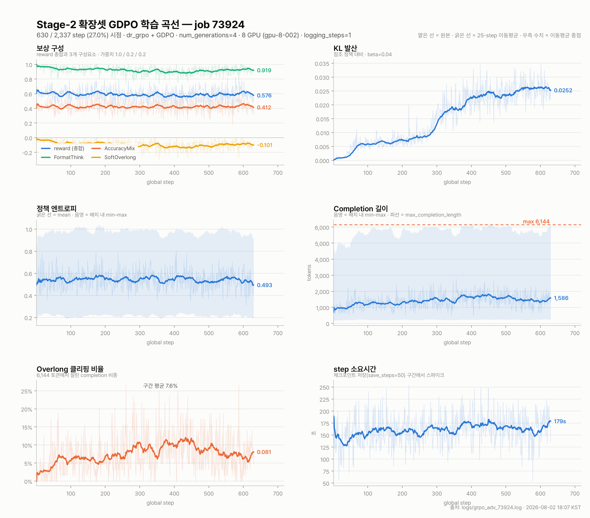

# Stage-2 확장셋 GDPO 본실행 — job 73924 중간 점검

**작성 2026-08-02 18:07 KST · 대상 job 73924(`gpu-8-002`) · 로그 `logs/grpo_adv_73924.log` · step 630 시점**

체인 job **73924~73927** 중 첫 잡이 진행 중이다. 이 문서는 ① 학습이 건강하게 도는지, ② 실제로 무엇이 학습되고 있는지,
③ 자원이 계획대로 쓰이는지 세 가지를 실측으로 점검한다.
**결론부터: 인프라는 무결하나 정확도 보상이 630 step 동안 정지해 있고, 계획의 "1 epoch" 전제가 4배 틀렸다.**

---

## 1. 요약

| 항목 | 실측 | 판정 |
|---|---|---|
| 진행 | 630 / 2,337 step (27.0%) | 정상 |
| 안정성 | OOM · CUDA error · Traceback **0건**, mem 90.9 GiB | ✅ 무결 |
| **정확도 보상** | AccuracyMix 0.425 → 0.428 (**+0.7%**) | 🚨 **정지** |
| 형식 보상 | FormatThink 0.946 → 0.926 (−2.1%) | 이미 포화(천장) |
| 길이 | mean_length 1,127 → 1,463 tokens (**+29.8%**) | ⚠️ 팽창 |
| 클리핑 | clipped_ratio 4.9% → 7.3% (**+47.5%**) | ⚠️ 증가 |
| KL | 0.0036 → 0.0258 (**+612%**) | 정책 이탈 진행(절대값은 아직 작음) |
| **epoch 커버리지** | 2,337 step = **0.25 epoch** (1 epoch = 9,348) | 🚨 **계획 오류** |
| 오버헤드 | step_time 합 28.1h vs 실경과 56.1h → **50%가 step 밖** | ⚠️ 개선 여지 |

---

## 2. 학습 곡선



*옅은 선 = step별 원본(logging_steps=1) · 굵은 선 = 25-step 이동평균 · 우측 수치 = 이동평균 종점.*

### 구간 대조 (1~100 step 평균 vs 531~630 step 평균)

| 지표 | 1~100 | 531~630 | 변화 |
|---|---:|---:|---:|
| reward (총합) | 0.6019 | 0.5946 | −1.2% |
| rewards/AccuracyMix/mean | 0.4248 | 0.4278 | **+0.7%** |
| rewards/FormatThink/mean | 0.9461 | 0.9258 | −2.1% |
| rewards/SoftOverlong/mean | −0.0606 | −0.0919 | −51.6% (페널티 증가) |
| kl | 0.0036 | 0.0258 | +612.5% |
| entropy/mean | 0.5377 | 0.5335 | −0.8% |
| completions/mean_length | 1,127 | 1,463 | +29.8% |
| completions/clipped_ratio | 0.0494 | 0.0728 | +47.5% |
| reward_std | 0.4951 | 0.4832 | −2.4% |
| frac_reward_zero_std | 0.0044 | 0.0131 | +200% |
| step_time | 146.1s | 163.8s | +12.1% |

### 읽기

- **정확도가 학습되지 않고 있다.** 630 step 동안 AccuracyMix 는 0.425 → 0.428 로, 노이즈 폭(step별 표준편차 ≈ 0.50) 안에서 사실상 정지다.
  총 reward 가 −1.2% 인 것은 형식 보상 소폭 하락과 SoftOverlong 페널티 증가가 겹친 결과이며, **정확도 기여분은 0** 이다.
- **대신 길이가 팽창하고 있다.** 평균 completion 이 +29.8%, 6,144 토큰 클리핑이 +47.5%, SoftOverlong 페널티가 −51.6%.
  정확도 이득 없이 출력만 길어지는 이 조합은 RLVR 의 전형적인 **길이 인플레이션** 패턴이다.
- **엔트로피는 붕괴하지 않았다** (0.538 → 0.534). 다양성 붕괴(diversity collapse) 징후는 아직 없다 — `docs/rlvr_hparams_external.md` 의 경고 구간에는 미도달.
- **KL 은 612% 늘었지만 절대값 0.026 으로 작다.** β=0.04 제약이 살아 있고 clip_ratio 도 0.0009 수준이라 정책이 폭주하는 상태는 아니다.
  다만 250~400 step 구간에서 가파르게 상승했고 이 구간이 길이 팽창 시작점과 겹친다.
- `All completions are overlong and truncated` 경고 **197회**(630 step 대비 31%). 해당 step 은 KL 이 NaN 으로 빠진다. 학습은 계속되지만 그 구간의 KL 제약이 사실상 무효다.

---

## 3. epoch 커버리지 — 계획 전제가 4배 틀렸다

`scripts/launch_stage2_expanded_epoch.sh` 는 1 epoch 을 이렇게 산정했다.

```
1 epoch = 74,787 / 32(step당 프롬프트: 1 × accum4 × 8gpu) ≈ 2,337 step
```

**이 32 는 프롬프트 수가 아니라 completion 수다.** GRPO 에서 `per_device_train_batch_size` 는 completion 을 세며,
`generation_batch_size` 가 `None` 이므로 TRL/ms-swift 기본식이 적용된다.

```
generation_batch_size = pdtbs(1) × world_size(8) × steps_per_generation(=grad_accum 4) = 32 completions
프롬프트/step        = 32 ÷ num_generations(4)                                        =  8 prompts
1 epoch              = 74,787 ÷ 8                                                     = 9,348 step
```

**로그가 이를 확증한다**: step 627 × 8 = 5,016 행, 5,016 / 74,787 = **0.06706** — 로그의 `epoch: 0.06707` 과 일치.
(공식이 맞다면 `epoch` 이 0.268 로 찍혀야 한다.)

### 결과

| | 계획이 믿은 값 | 실제 |
|---|---|---|
| MAX_STEPS=2,337 의 의미 | 1 epoch (100%) | **0.25 epoch** |
| 현재 630 step | 0.27 epoch | **0.067 epoch** |
| 확장셋 74,787건 중 노출 | 전량 | **약 25%** |
| 진짜 1 epoch(9,348 step) 비용 | — | ≈ 837h · **6,694 노드시간 = 예산 5,000의 134%** |

**예산은 안전하다.** `max_steps=2337` 이 상한이라 `num_train_epochs=3.0` 설정과 무관하게 2,337 에서 멈추며,
2,337 step × 322 s/it × 8 GPU ≈ **1,674 노드시간**으로 계획서의 1,719(34%) 와 사실상 같다. 지금 도는 job 과 비용은 계획대로다.

**틀린 것은 라벨과 그로부터 나온 판단 근거다.**

1. 확장셋의 **75%는 한 번도 학습에 노출되지 않는다.** 이번 확장의 핵심이던 MMK12(math 20%)·PMC-VQA(의료 26%) 추가분 상당량이 미사용으로 남는다.
2. 따라서 중간 평가에서 홀드아웃이 포화로 보여도 **방법의 한계인지 데이터 미노출 탓인지 구분되지 않는다.** "포화 시 조기중단" 정책의 전제가 흔들린다.
3. "2 epoch 은 69% 라 미채택" 이라는 서술은 실제로는 "0.5 epoch" 이야기다. 진짜 1 epoch 은 예산의 134% 로 **애초에 실행 불가능한 계획**이었다.

> 다만 §2 의 실측을 보면 데이터 미노출이 정체의 주원인이라고 단정할 수 없다. 630 step 동안 본 5,016 개 프롬프트만으로도
> 정확도 보상이 전혀 안 오르는 상태라, **데이터 양보다 보상 신호·길이 예산 쪽 문제일 가능성이 높다.**

---

## 4. 자원 — 오버헤드 50%

| | 값 |
|---|---|
| step_time 합계 (630 step) | 28.1h |
| 실제 경과 | 56.1h |
| **step 밖 오버헤드** | **28.0h (49.9%)** |
| 실효 속도 | 322 s/it (step_time 161s 의 2.0배) |

`--use_vllm true --vllm_mode colocate --sleep_level 1` 구성에서 롤아웃 생성·sleep/wake 전환,
`--dynamic_sample true --max_resample_times 3` 재샘플링, `save_steps 50` 체크포인트가 여기에 들어간다.
GRPO colocate 의 구조적 비용이라 전부 제거할 수는 없으나, **절반이 학습 밖에 쓰이고 있다는 사실은 기록해 둔다.**

---

## 5. 체인 소진 예측

- 73924 는 TimeLimit `2-22:00:00`(종료 2026-08-03 07:39)에서 **~778 step** 도달 후 resume 인계
- 잔여 3잡이 각 70h ≈ 782 step 담당 → **73926 중 2,337 step 도달**, 완주 ≈ **2026-08-09** (잡 간 큐 대기 별도)
- 73927 은 여유분 (MAX_STEPS 도달 시 자동 no-op)

---

## 6. 권고

| # | 조치 | 근거 | 우선도 |
|---|---|---|---|
| 1 | **중간 체크포인트 홀드아웃 평가를 지금 실행** (`scripts/eval_midtrain.slurm`, ckpt-600) | 학습 reward 가 정지 상태라 홀드아웃이 오르는지가 계속/중단의 유일한 근거 | **높음** |
| 2 | **길이 예산 재검토** — `max_completion_length` 6,144 대비 클리핑 7.3%·경고 197회 | 길이만 늘고 정확도는 정지. SoftOverlong 가중치(0.2) 또는 `soft_cache_length` 재조정 후보 | **높음** |
| 3 | 문서의 "1 epoch = 2,337 step" 서술 전면 정정 | §3 — 6개 문서에 동일 오류 전파 | 높음 (본 커밋에서 처리) |
| 4 | 홀드아웃이 안 오르면 **데이터 양보다 보상 설계 재검토** | §3 말미 — 5,016 프롬프트에서도 신호가 안 잡힘 | 중 |
| 5 | 오버헤드 50% 프로파일링 (생성 vs 재샘플 vs 체크포인트 분해) | §4 — 절반을 회수하면 동일 예산으로 2배 학습 | 중 |

**계속/중단 판단은 ①의 홀드아웃 결과가 나온 뒤에 한다.** 현 시점에서는 인프라가 무결하고 예산도 계획 내이므로 중단할 이유는 없다.

---

## 관련 문서

- [`README.md`](../README.md) — 현황 요약
- [`stage2_experiments.md`](stage2_experiments.md) — Stage-2 실험 이력·A/B
- [`stage2_expansion_runbook.md`](stage2_expansion_runbook.md) — 재현 절차
- [`rlvr_hparams_external.md`](rlvr_hparams_external.md) — 하이퍼파라미터 외부 관행 대조
- [`ops_data.md`](ops_data.md) — 자원·예산

*플롯 생성: `logs/grpo_adv_73924.log` 파싱 → 6패널 small multiples. 재생성 절차는 본 문서 커밋 메시지 참조.*
